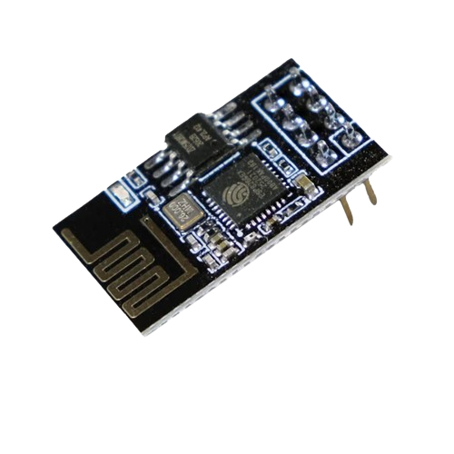
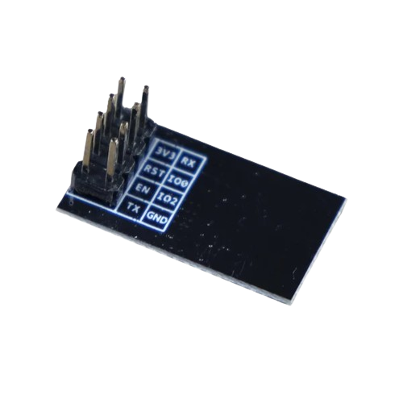
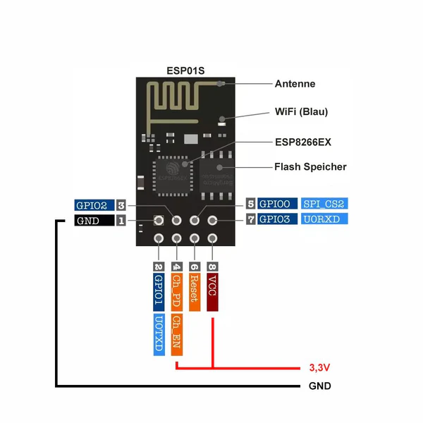
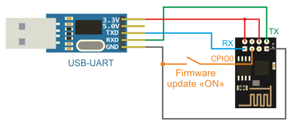
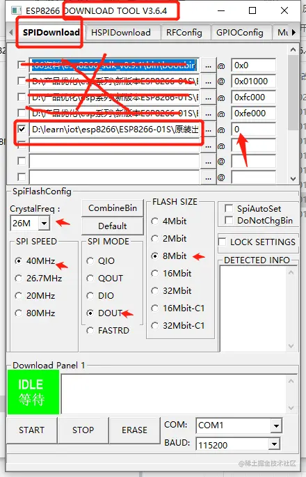
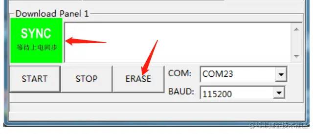

# ESP8266 TEST

## THE MODULE - ESP_01S

Ai-Thinker ESP_01S

 

 

 

!!! note
    ESP_01S actually can be taken as a stand alone MCU, but in our case, we will use it as a WiFi module. Therefore, before we integrate it with our STM32, we need to flash it with the AT firmware and fully test its functions that will be used in our project. ESP_01S should be flashed with AT firmware first, and then it can be controlled by AT commands through UART. In this chapter, for simplicity, the AT command will be sent from a PC to the ESP_01S through a USB to UART adapter. For next step, the ESP_01S will be connected to the STM32 through UART, and the STM32 will send AT commands to the ESP_01S to control it.

## STEP1: FIRMWARE FLASHING

Before flashing, we need to setup the hardware and software environment.

### Hardware Setup

Prepare your ESP_01S module, USB to TTL adapter, and connect them as shown below:



| ESP_01S | USB to TTL | NOTES       |
|:-------:|:----------:| ----------- |
|   VCC   |    3.3V    | if not working, don't use VCC from the USB-TTL adapter, use external power supply |
|   GND   |    GND     |             |
|   TX    |    RX      |             |
|   RX    |    TX      |             |
|   CH_PD （EN） |    3.3V    |             |
|   RST   |    3.3V    |             |
|   GPIO0 |    GND     | ensure this is connected to GND when flashing       |
|   GPIO2 |    3.3V    |             |

!!! tip
    For VCC, I use external power supply, because the VCC from the USB-TTL adapter is not stable and the ESP_01S may not work properly.

### Software Setup

1. Download the AT firmware from the [official website](https://www.espressif.com/en/support/download/at).
2. Download the [Flash Download Tools](https://www.espressif.com/en/support/download/other-tools) from the official website.

### FLASHING

Pick a row in the flash tool, and select the corresponding bin file. Before flashing, we need to erase the flash first. After erasing, we can start flashing.

 

!!! tip
    Carefully check the COM port number and the baud rate before you start erasing and flashing. Ensure the configuration is consistent with the picture above.

 

!!! tip
    If your flash tool is stuck at the "SYNC" stage, it means it needs a trigger. Two ways to do so: 

    1. Swiftly connect the RST to the GND then disconnect it; 

    2. Swiftly disconnect VCC and reconnect it.

After erasing the flash, click the "STOP" button, then we can start flashing the AT firmware by clicking the "START" button. If you have issues like in the erasing stage, you can try the trigger methods mentioned above.

So far, we have finished the firmware flashing for the ESP_01S module. Before we proceed to the next step, you need to remove the wire on IO0 and reconnect the USB-TTL adapter to the computer.

## STEP2: TEST

### HARDWARE - ESP_01S - USB to TTL - PC

Connect the ESP_01S to the USB to TTL adapter, and then connect the USB to TTL adapter to the PC.

For ESP_01S and USB-TTL wiring, refer to the table below:

| ESP_01S | USB to TTL | NOTES       |
|:-------:|:----------:| ----------- |
|   VCC   |    3.3V    |if the VCC on USB-TTL adapter is not working, use external power supply|
|   GND   |    GND     |             |
|   TX    |    RX      |             |
|   RX    |    TX      |             |

### SOFTWARE - Ai-Thinker Serial Tool

Download the Ai-Thinker Serial Tool from the [official website](https://docs.ai-thinker.com/_media/tools/aithinker_serial_tool_v1.2.3.7z).

### TEST AT COMMANDS

```shell
AT         // Module test
AT+CWMODE=1 // 1. Station mode 2. AP (Access Point) mode 3. Both modes
AT+CWLAP    // List available Wi-Fi networks
AT+CWJAP="mywifiname","mypassword" // Connect to Wi-Fi
AT+CIFSR    // Query IP address
AT+CIPSTA?  // Display network status, including IP, gateway, and subnet mask
AT+CIPSTART="TCP","9.214.19.225",8000 // Connect to TCP server, ensure the server is working, replace the IP address with your server IP address
AT+CIPSEND=4 // Send 4 bytes to the server
```

TEST RESULTS:

```shell
AT


OK

AT+CWMODE=1


OK

AT+CWLAP


+CWLAP:(5,"eduroam",-68,"a8:9d:2
1:3c:12:b2",1,32767,0)
+CWLAP:(
5,"NTUSECURE",-70,"a8:9d:21:3c:12:b1",1,32767,0)
+CWLAP:(0,"NTU
GUEST",-68,"a8:9d:21:3c:12:b3",1,32767,0)
+CWLAP:(4,"CSW@CEE",-
26,"28:6c:07:d1:ca:db",1,18,0)

+CWLAP:(4,"miwifi-csw@cee",-26,"2a:6c:07:d1:ca:db",1,18,0)
+CWL
AP:(0,"NTUGUEST",-77,"a8:9d:21:25:fc:f3",6,32767,0)
+CWLAP:(5,"
eduroam",-77,"74:a2:e6:a7:ce:32",6,32767,0)
+CWLAP:(5,"NTUSECURE",-77,"74:a2:e6:a7:ce:31",6,327
67,0)
+CWLAP:(4,"BiliBili School",-62,"c0:c9:e3:e4:c3:83",6,13,
0)
+CWLAP:(5,"NTUSECURE",-77,"a8:9d:21:25:fc:f1",6,32767,0)
+C
WLAP:(4,"360WiFi-YM",-50,"70:af:6a:bb:48:81",6,-6,0)
+CWLAP:(5,"eduroam",-71,"a8:9d:21:1d:fc:42",11,32767,0)
+CWLAP:(5,"NTUSEC
URE",-70,"a8:9d:21:1d:fc:41",11,32767,0)
+CWLAP:(0,"NTUGUEST",-
69,"a8:9d:21:1d:fc:43",11,32767,0)

OK

AT+CWJAP_DEF="CSW@CEE","********"


WIFI CONNECTED

WIFI GOT IP


OK

AT+CIFSR

+CIFSR:STAIP,"192.168
.31.193"
+CIFSR:STAMAC,"48:3f:da:68:3d:22"

OK

AT+CIPSTA?

+CIPSTA:ip:"192.168
.31.193"
+CIPSTA:gateway:"192.168.31.1"
+CIPSTA:netmask:"255.255.255.0"

OK

AT+CIPSTART="TCP","9.214.19.225"
,8000


CONNECT

OK

AT+CIPSEND=4


OK
> 
o

busy s...

Recv 4 bytes


SEND OK

+IPD,327:HTTP/1.1 400 Bad Requ
est
Server: nginx/1.18.0 (Ubuntu)
Date: Sat, 24 Aug 2024 09:56:18 GMT
Content-Type: text/html
Content-Length: 166
Connection: close

<html>
<head><title
>400 Bad Request</title></head>
<body>
<center><h1>400 Bad Request</h1></center>
<hr><center>nginx/1.18.0 (Ubuntu)</center>

</body>
</html>
CLOSED

AT


OK
```


!!! info
    Actually, there are MQTT version firmwares for ESP8266, which can be used for MQTT communication. But in this project, we will use the basic AT firmware for ESP_01S, and the MQTT communication will be implemented on the STM32 side.