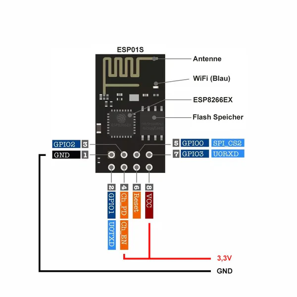
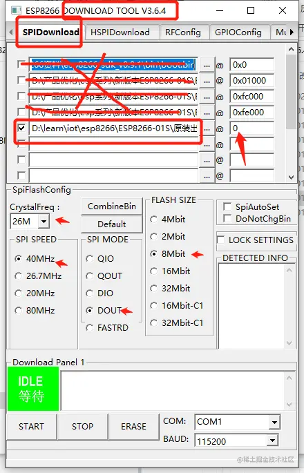

# ESP8266 测试

## ESP_01S 模块

安信可ESP_01S

 

 

 

!!! note
    ESP_01S 实际上可以被视为一个独立的MCU，但在我们的案例中，我们将其用作WiFi模块。因此，在我们将其与STM32集成之前，我们需要使用AT固件对其进行烧录，并完全测试我们项目中将要使用的功能。ESP_01S应首先烧录AT固件，然后可以通过UART通过AT命令进行控制。在本章中，为简单起见，AT命令将从PC通过USB到UART适配器发送到ESP_01S。在下一步中，ESP_01S将通过UART连接到STM32，STM32将发送AT命令以控制ESP_01S。

## 步骤1：固件烧录

在烧录之前，我们需要设置硬件和软件环境。

### 硬件设置

准备您的ESP_01S模块，USB到TTL适配器，并按照下图连接：


| ESP_01S | USB to TTL | 备注       |
|:-------:|:----------:| ----------- |
|   VCC   |    3.3V    | 如果不工作，请不要使用USB-TTL适配器上的VCC电源，请使用外部电源 |
|   GND   |    GND     |             |
|   TX    |    RX      |             |
|   RX    |    TX      |             |
|   CH_PD (EN) |    3.3V    |    可不接         |
|   RST   |    3.3V    |      可不接       |
|   GPIO0 |    GND     |      烧录时，确保此引脚接地       |
|   GPIO2 |    3.3V    |       可不接      |

!!! tip
    对于VCC，我使用外部电源，因为USB-TTL适配器上的VCC不稳定，ESP_01S可能无法正常工作。

### 软件设置

1. 从[官方网站](https://www.espressif.com/en/support/download/at)下载AT固件。
2. 从官方网站下载[Flash Download Tools](https://www.espressif.com/en/support/download/other-tools)。

### 烧录

在烧录工具中选择一行，并选择相应的bin文件。在烧录之前，我们需要先擦除flash。擦除后，我们可以开始烧录。

 

!!! tip
    在开始擦除和烧录之前，请仔细检查COM端口号和波特率。确保配置与上图一致。

 

!!! tip
    如果您的烧录工具卡在“SYNC”阶段，这意味着它需要一个触发。两种方法：

    1. 快速将RST连接到GND，然后断开连接；

    2. 快速断开VCC并重新连接。

在擦除FLASH之后，点击“STOP”按钮，然后可以点击"START"按钮开始烧录。如果你碰到与擦除阶段类似的问题，可以尝试上面提到的触发方法。

目前为止，我们已经完成了ESP_01S的固件烧录。在进行下一步之前，我们需要断开IO0和GND的连接，然后将USB到TTL适配器断开并重新连接至电脑。

## 步骤2： 测试

### 硬件 - ESP_01S - USB到TTL - PC

将ESP_01S连接到USB到TTL适配器，然后将USB到TTL适配器连接到PC。

对于ESP_01S和USB-TTL的接线，请参考下表：

| ESP_01S | USB to TTL | 备注       |
|:-------:|:----------:| ----------- |
|   VCC   |    3.3V    | 如果USB-TTL适配器上的VCC不工作，请使用外部电源 |
|   GND   |    GND     |             |
|   TX    |    RX      |             |
|   RX    |    TX      |             |

### 软件 - 串口助手

从[安信可官网-资料下载](https://docs.ai-thinker.com/_media/tools/aithinker_serial_tool_v1.2.3.7z)下载安信可串口助手。

```shell
AT		//模块测试
AT+CWMODE=1 //1. 是station（设备）模式 2.是AP（路由）模式 3.是双模
AT+CWLAP	//列出可用wifi列表
AT+CWJAP="mywifiname","mypassword"  //连接wifi
AT+CIFSR	//查询ip
AT+CIPSTA?	//显示网络状态，ip、网关、子网掩码
AT+CIPSTART="TCP","9.214.19.225",8000	//连接TCP服务器，确保服务器正常工作, 替换IP地址为你的服务器IP地址
AT+CIPSEND=4	//向服务器发送4个字节  
```

测试结果：

```shell
AT


OK

AT+CWMODE=1


OK

AT+CWLAP


+CWLAP:(5,"eduroam",-68,"a8:9d:2
1:3c:12:b2",1,32767,0)
+CWLAP:(
5,"NTUSECURE",-70,"a8:9d:21:3c:12:b1",1,32767,0)
+CWLAP:(0,"NTU
GUEST",-68,"a8:9d:21:3c:12:b3",1,32767,0)
+CWLAP:(4,"CSW@CEE",-
26,"28:6c:07:d1:ca:db",1,18,0)

+CWLAP:(4,"miwifi-csw@cee",-26,"2a:6c:07:d1:ca:db",1,18,0)
+CWL
AP:(0,"NTUGUEST",-77,"a8:9d:21:25:fc:f3",6,32767,0)
+CWLAP:(5,"
eduroam",-77,"74:a2:e6:a7:ce:32",6,32767,0)
+CWLAP:(5,"NTUSECURE",-77,"74:a2:e6:a7:ce:31",6,327
67,0)
+CWLAP:(4,"BiliBili School",-62,"c0:c9:e3:e4:c3:83",6,13,
0)
+CWLAP:(5,"NTUSECURE",-77,"a8:9d:21:25:fc:f1",6,32767,0)
+C
WLAP:(4,"360WiFi-YM",-50,"70:af:6a:bb:48:81",6,-6,0)
+CWLAP:(5,"eduroam",-71,"a8:9d:21:1d:fc:42",11,32767,0)
+CWLAP:(5,"NTUSEC
URE",-70,"a8:9d:21:1d:fc:41",11,32767,0)
+CWLAP:(0,"NTUGUEST",-
69,"a8:9d:21:1d:fc:43",11,32767,0)

OK

AT+CWJAP_DEF="CSW@CEE","********"


WIFI CONNECTED

WIFI GOT IP


OK

AT+CIFSR

+CIFSR:STAIP,"192.168
.31.193"
+CIFSR:STAMAC,"48:3f:da:68:3d:22"

OK

AT+CIPSTA?

+CIPSTA:ip:"192.168
.31.193"
+CIPSTA:gateway:"192.168.31.1"
+CIPSTA:netmask:"255.255.255.0"

OK

AT+CIPSTART="TCP","9.214.19.225"
,8000


CONNECT

OK

AT+CIPSEND=4


OK
> 
o

busy s...

Recv 4 bytes


SEND OK

+IPD,327:HTTP/1.1 400 Bad Requ
est
Server: nginx/1.18.0 (Ubuntu)
Date: Sat, 24 Aug 2024 09:56:18 GMT
Content-Type: text/html
Content-Length: 166
Connection: close

<html>
<head><title
>400 Bad Request</title></head>
<body>
<center><h1>400 Bad Request</h1></center>
<hr><center>nginx/1.18.0 (Ubuntu)</center>

</body>
</html>
CLOSED

AT


OK
```


!!! info
    实际上，ESP8266有MQTT版本，用于MQTT通讯。但是在本项目中，我们使用最基本的AT命令固件版本，MQTT将在STM32上实现。


## 参考连接

**烧录 ESP8266**

- https://blog.51cto.com/u_16213696/10540416

- https://www.cnblogs.com/xiangyangerxing/p/14914939.html

- https://juejin.cn/post/7029893167260368910

**测试**

- https://www.cnblogs.com/qianxiaohan/p/17134926.html

- https://blog.csdn.net/qq_51566076/article/details/129777058

**安信可**

- https://docs.ai-thinker.com/tools

- https://www.bilibili.com/video/BV1jP4y1E7TJ?p=24
- https://www.bilibili.com/video/BV1jP4y1E7TJ?p=25&vd_source=5a427660f0337fedc22d4803661d493f
- https://www.bilibili.com/video/BV1jP4y1E7TJ?p=26