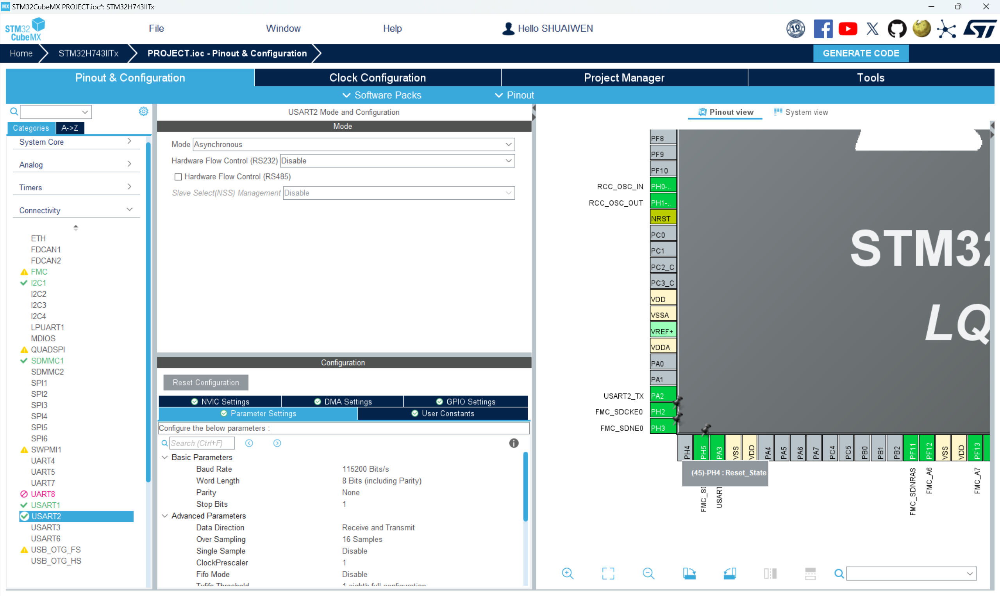
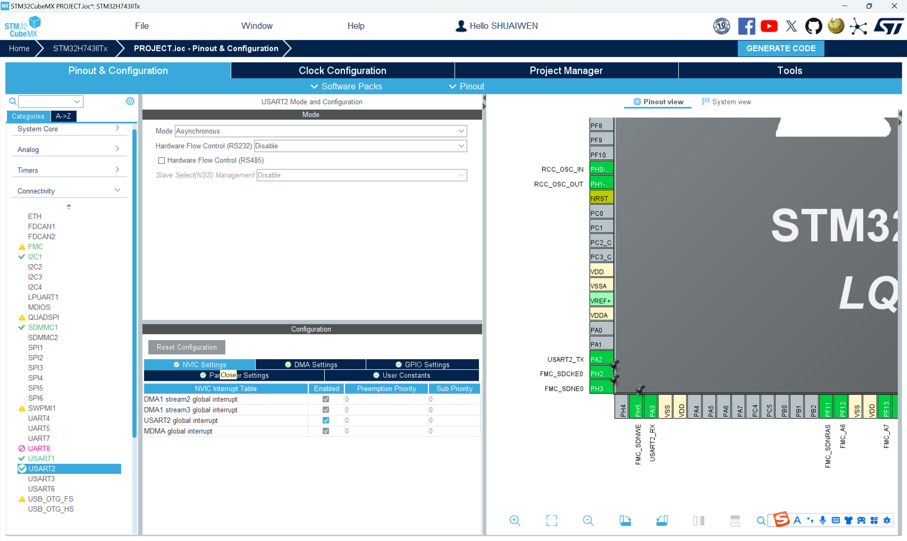
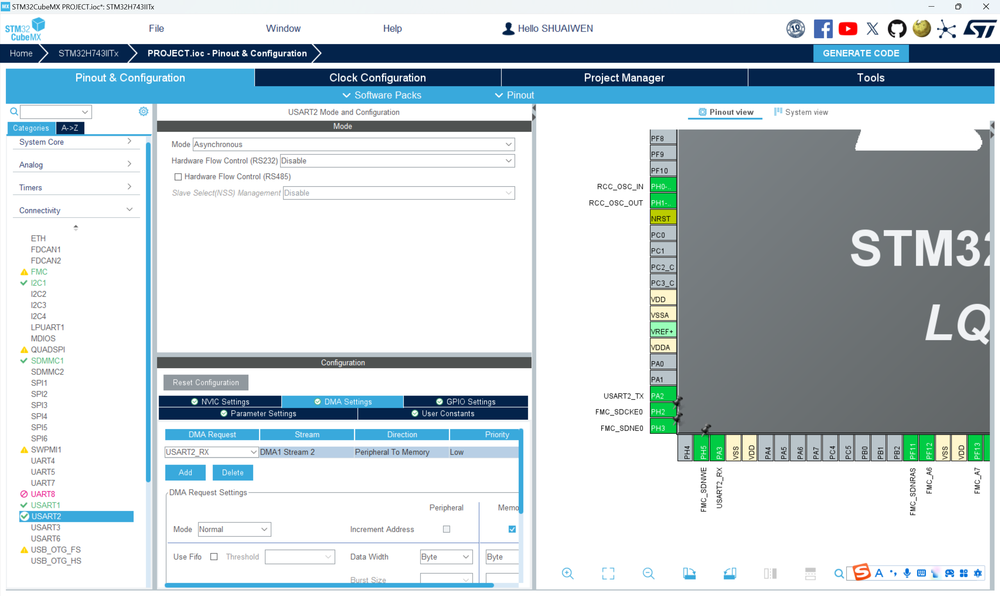

# STM32-ESP8266

In the previous section, we directly used the serial port to communicate with the ESP8266 module and tested the AT command. In this section, we will use STM32 to control the ESP8266 module to achieve more functions.

## Driver Reference

-   :fontawesome-brands-bilibili:{ .lg .middle } __STM32 + ESP8266__

    ---

    [:octicons-arrow-right-24: <a href="https://www.bilibili.com/video/BV1J44y1z7WP/?vd_source=5a427660f0337fedc22d4803661d493f" target="_blank"> Portal </a>](#)

-   :simple-github:{ .lg .middle } __STM32-ESP8266-MQTT__

    ---

    [:octicons-arrow-right-24: <a href="https://github.com/zjc12/STM32-ESP8266-MQTT.git" target="_blank"> Portal </a>](#)

## HANDS-ON

### HARDWARE SETUP

Follow the table below to connect the ESP8266 module to the MCU.

| ESP8266 PIN | MCU PIN |
|-------------|---------|
| VCC         | 3.3V (or external VCC)   |
| GND         | GND (or external GND)    |
| RX          | PA2    |
| TX          | PA3    |

### SOFTWARE SETUP

CUBEMX configuration:

1. Enable the USART2 peripheral， keep default settings.

2. Enable NVIC configuration for USART2.

3. Enable DMA for USART2 RX.

### DRIVER TRANSPLANTATION

Refer to the links above for driver transplantation.