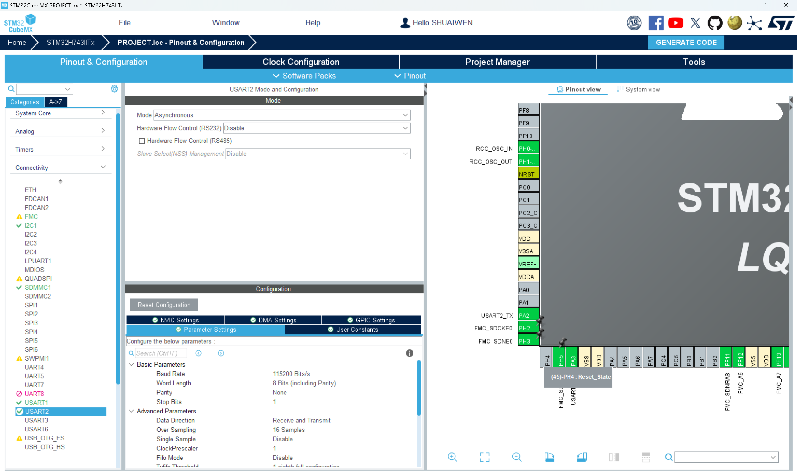
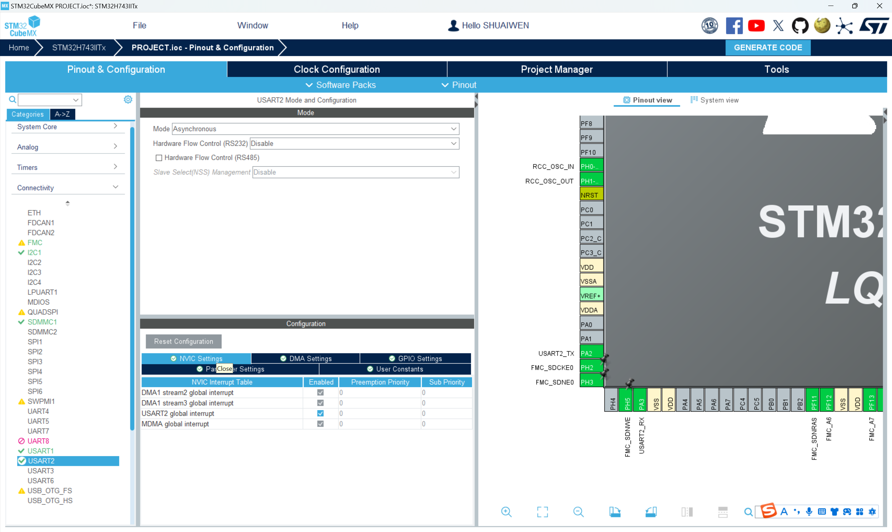

# STM32-ESP8266

前一小节我们已经直接使用串口和ESP8266模块进行通信并测试了AT指令。在这一节中，我们将使用STM32来控制ESP8266模块，实现更多功能。

## 驱动参考

-   :fontawesome-brands-bilibili:{ .lg .middle } __STM32 + ESP8266__

    ---

    [:octicons-arrow-right-24: <a href="https://www.bilibili.com/video/BV1J44y1z7WP/?vd_source=5a427660f0337fedc22d4803661d493f" target="_blank"> 传送门 </a>](#)

-   :simple-github:{ .lg .middle } __STM32-ESP8266-MQTT__
  

    ---

    [:octicons-arrow-right-24: <a href="https://github.com/zjc12/STM32-ESP8266-MQTT.git" target="_blank"> 传送门 </a>](#)

## 实践

### 硬件连接

按照下表连接ESP8266模块到MCU。

| ESP8266引脚 | MCU引脚 |
|-------------|---------|
| VCC         | 3.3V (或外部VCC)   |
| GND         | GND (或外部GND)    |
| RX          | PA2    |
| TX          | PA3    |

### 软件配置

CUBEMX配置：

1. 使能USART2外设，保持默认设置。

2. 使能USART2的NVIC配置。

3. 使能USART2 RX的DMA。

### 驱动移植

参考上面的链接进行驱动移植。

