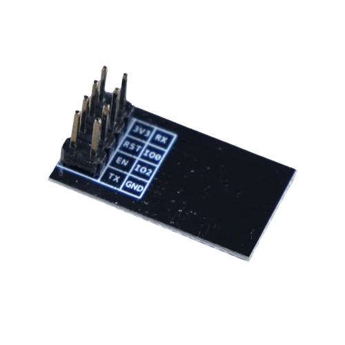

# WIFI

## WIFI 简介

## WIFI 模块 - ESP8266 和 ESP_01S

### ESP8266 介绍

ESP8266是由Espressif生产的为新的连接世界的需求而设计的高度集成的芯片。它提供了一个完整的、独立的Wi-Fi网络解决方案，允许它承载应用程序或从另一个应用处理器卸载所有Wi-Fi网络功能。

### ESP_01S 介绍

Ai-Thinker ESP_01S是一款低功耗、成本效益高的嵌入式Wi-Fi模块，基于Espressif的ESP8266芯片。它是为新的连接世界的需求而设计的。它提供了一个完整的、独立的Wi-Fi网络解决方案，允许它承载应用程序或从另一个应用处理器卸载所有Wi-Fi网络功能。

{: width="80%"}

{: width="80%"}

{: width="80%"}

WIFI是一种使用无线电频率信号传输数据的无线通信技术，广泛应用于智能家居、工业控制、物联网等各个领域。

## 集成框架

1. ESP8266 测试
2. STM32 - UART - ESP8266 连接
3. STM32 + MQTT - UART - ESP8266 - 云连接

