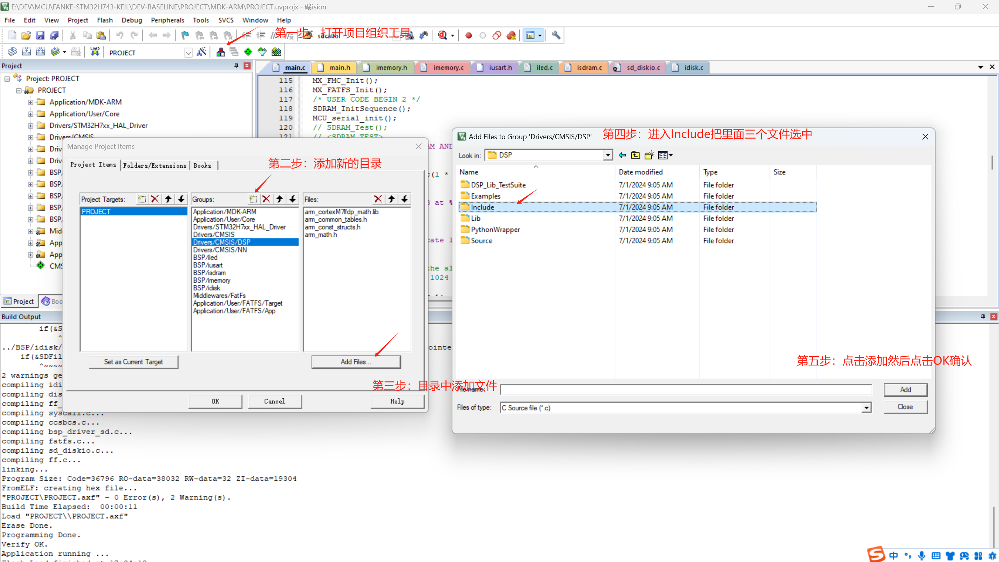

# CMSIS-DSP FOR DIGITAL SIGNAL PROCESSING

In this section, let's talk about how to incorporate the CMSIS-DSP library to facilitate onboard digital signal processing. Note that, though it is named as "DSP", it is not limited to digital signal processing. It also includes functions for matrix operations, statistics, and so on.

## PREPARATION

As our project is generated by STM32CubeMX, the CMSIS-DSP library is already included in the project. If you are not using STM32CubeMX, you can download the library from the official website of ARM.

## INCORPORATE THE LIBRARY
There are two forms for the library, source codes and compiled libraries. You can choose either one according to your preference. Here we will use the compiled library for simplicity.

In Keil, open 'Manage Project Items', add a branch with a customized name, and then click add file and navigate to the library folder. Select the library file and click 'Add'. (Refer to the picture below)

## INCLUDE THE HEADER FILE
Similar to the above procedures, the header files are located in the 'Include' folder. Add the folder to the project and include the header file in the source code.

## UPDATE THE INCLUDE PATH
Open the 'Options for Target' and add the path of the 'Include' folder to the 'Include Paths' in 'C/C++' tab.

## END
Now, the CMSIS-DSP library is successfully incorporated into the project. You can use the functions provided by the library in your project.

