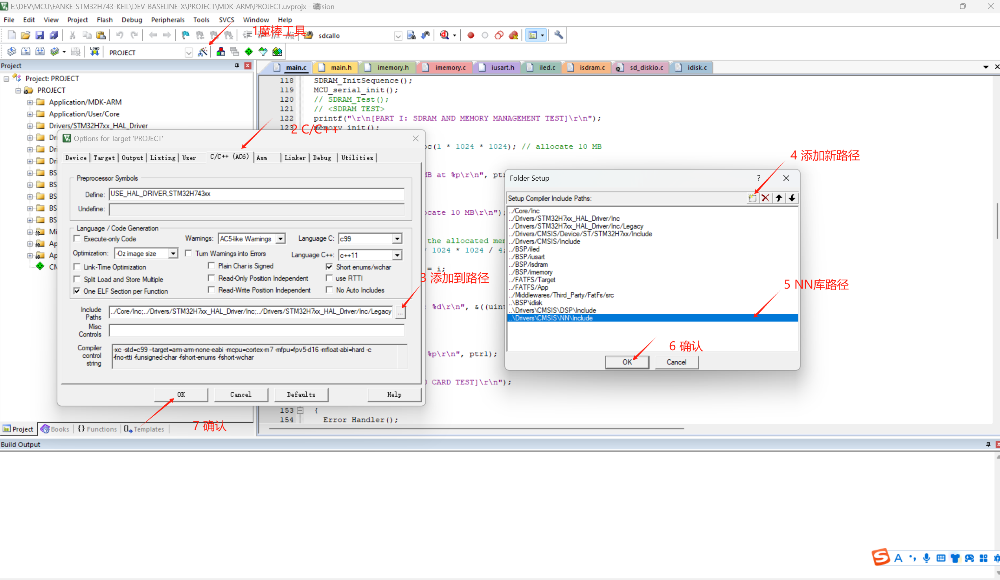

# CMSIS-NN FOR NEURAL NETWORKS

This section we introduce the CMSIS-NN library for onboard NN.

!!! tip
    Personally, I think X-CUBE-AI is more user-friendly than CMSIS-NN. You can simply import your model and generate the code.

## PREPARATION
As we are using STM32CubeMX to generate the project, the CMSIS-NN library is already included in the project. If you are not using STM32CubeMX, you can download the library from the official website of ARM. Note that the CMSIS-NN library comes along with CUBEMX is a bit behind the latest version. You can download the latest version from the official website. But there may be compatibility issues.

## INCORPORATE THE SOURCE CODE

There is no compiled library for CMSIS-NN. You need to incorporate the source code into your project.

In Keil, open 'Manage Project Items', add a branch with a customized name, and then click add file and navigate to the NN source code folder. Select the source files and click 'Add'. (Refer to the picture below)

## INCLUDE THE HEADER FILE

Similar to the above procedures, the header files are located in the 'Include' folder. Add the folder to the project and include the header file in the source code.

## UPDATE THE INCLUDE PATH

Open the 'Options for Target' and add the path of the 'Include' folder to the 'Include Paths' in 'C/C++' tab.

## END

Now, the CMSIS-NN library is successfully incorporated into the project. You can use the functions provided by the library in your project.