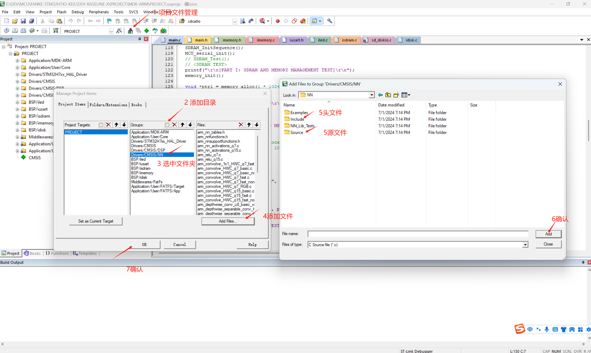
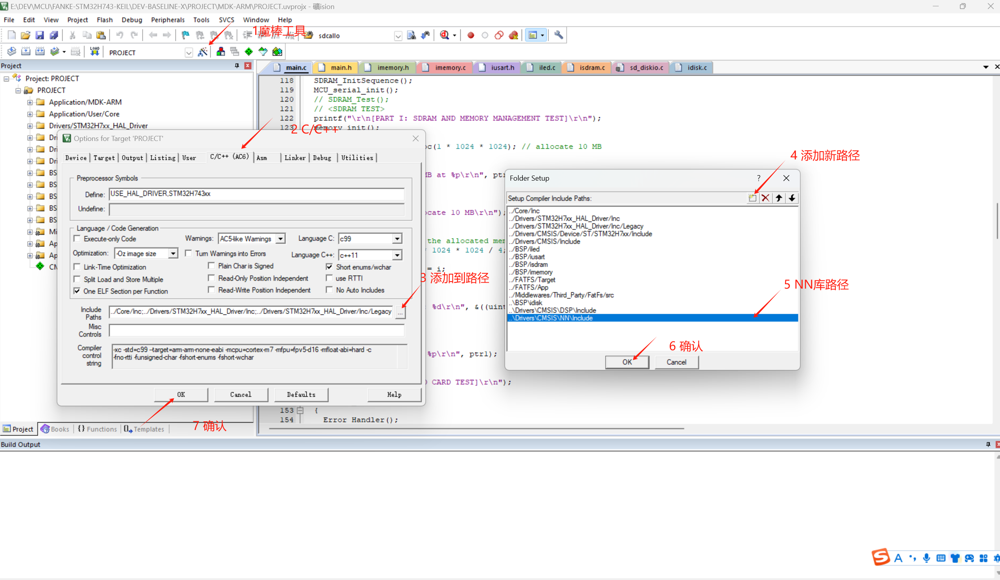

# CMSIS-NN 神经网络库

## 介绍CMSIS-NN库以用于嵌入式神经网络

!!! 提示
    个人认为，X-CUBE-AI比CMSIS-NN更易于使用。你可以简单地导入模型并生成代码。

## 准备工作

由于我们使用STM32CubeMX生成项目，CMSIS-NN库已经包含在项目中。如果你没有使用STM32CubeMX，你可以从ARM的官方网站下载该库。需要注意的是，CUBEMX附带的CMSIS-NN库可能比最新版本稍有滞后。你可以从官网下载最新版本，但可能会遇到兼容性问题。

## 集成源码

CMSIS-NN没有编译好的库，你需要将源码集成到你的项目中。

在Keil中，打开“Manage Project Items”，添加一个自定义名称的分支，然后点击“Add file”并导航到NN源码文件夹。选择源文件并点击“Add”。（参见下图）

## 包含头文件

与上述步骤类似，头文件位于“Include”文件夹中。将该文件夹添加到项目中，并在源代码中包含头文件。

## 更新包含路径

打开“Options for Target”，并在“C/C++”选项卡中的“Include Paths”中添加“Include”文件夹的路径。

## 结束

现在，CMSIS-NN库已经成功集成到项目中。你可以在项目中使用该库提供的函数。
