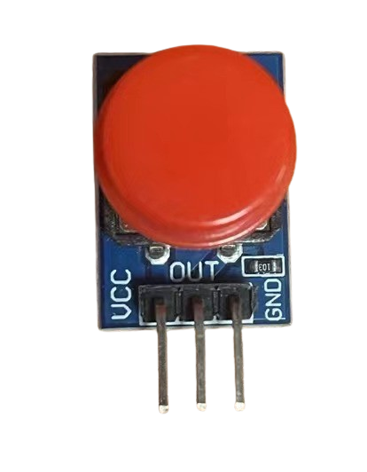
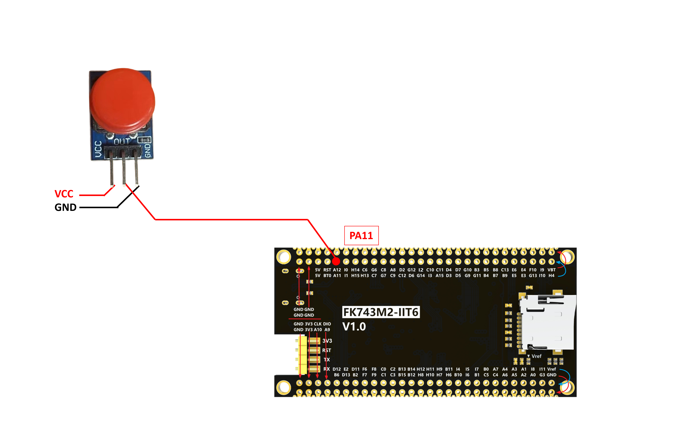
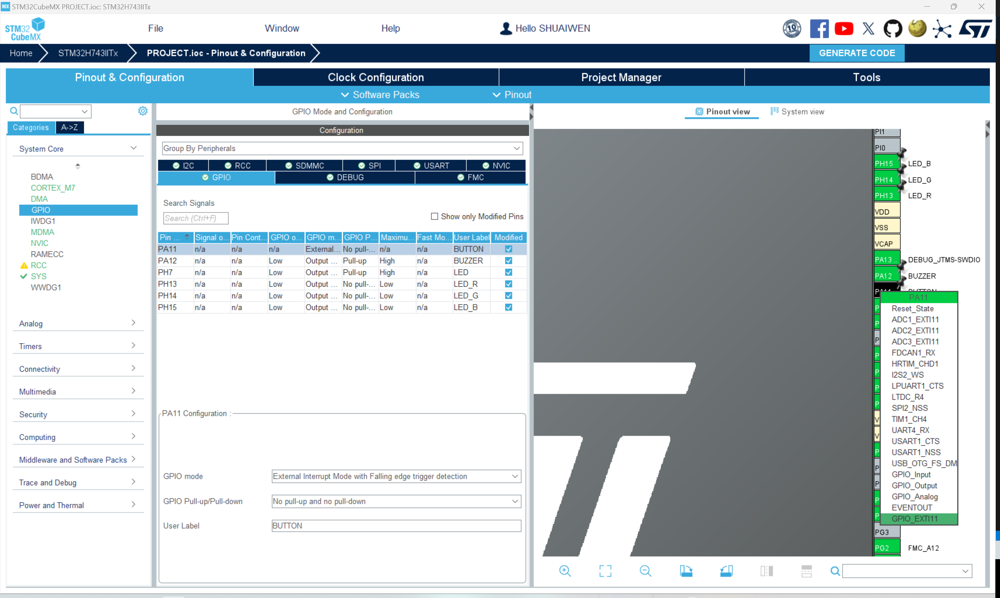
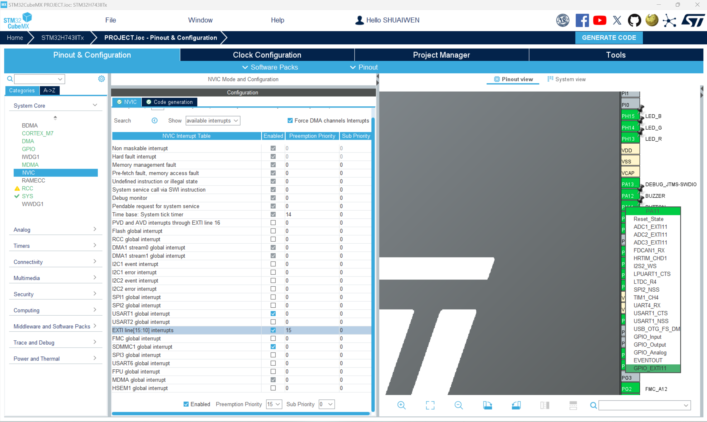

# BUTTON

## INTRODUCTION TO BUTTON

Button is a simple component that is used to control the flow of the program. It is used to start, stop, or reset the program. It is a simple switch that is pressed to make or break the connection. The button is a simple component that is used to control the flow of the program. It is used to start, stop, or reset the program. It is a simple switch that is pressed to make or break the connection.

## KEY & INTERRUPT CONTROL

<div class="grid cards" markdown>

-   :fontawesome-brands-bilibili:{ .lg .middle } __KEY & INTERRUPT CONTROL__

    ---

    keysking


    [:octicons-arrow-right-24: <a href="https://www.bilibili.com/video/BV1Fj411V7aq/?spm_id_from=333.788&vd_source=5a427660f0337fedc22d4803661d493f" target="_blank"> Portal </a>](#)

</div>

## BUTTON HARDWARE AND WIRING





| BUTTON PIN | MCU PIN |
|----------|---------|
| VCC      | 3.3V (or external VCC)   |
| GND      | GND (or external GND)    |
| IO      | PA11    |

## SOFTWARE



falling edge interrupt - button pressed



In case HAL_Delay is included in the handling function, the priority of the interrupt should be set to a lower value than the priority of the SysTick interrupt. This is because the SysTick interrupt is used to generate the delay in the HAL_Delay function. If the priority of the button interrupt is higher than the SysTick interrupt, the button interrupt will preempt the SysTick interrupt, causing the delay to be inaccurate.

## SOURCE CODE

### button.h

```c
/**
 * @file button.h
 * @author SHUAIWEN CUI (SHUAIWEN001 AT e DOT ntu DOT edu DOT sg)
 * @brief This file is for button control.
 * @version 1.0
 * @date 2024-09-24
 *
 * @copyright Copyright (c) 2024
 *
 */

#ifndef _BUTTON_H_
#define _BUTTON_H_

#include "setup.h" // Include the setup file to get the configuration parameters
#include "stm32h7xx_hal.h" // HAL library file declaration, replace it with the corresponding file according to the actual situation
#include "main.h" // IO definition and initialization function are in the main.c file, must be referenced

/**
  * @brief  EXTI line detection callback.
  * @param  GPIO_Pin: Specifies the port pin connected to corresponding EXTI line.
  * @retval None
  */
void HAL_GPIO_EXTI_Callback(uint16_t GPIO_Pin);

#endif /* _BUTTON_H_ */

```

### button.c

```c
/**
 * @file button.c
 * @author SHUAIWEN CUI (SHUAIWEN001 AT e DOT ntu DOT edu DOT sg)
 * @brief This file is for button control.
 * @version 1.0
 * @date 2024-09-24
 *
 * @copyright Copyright (c) 2024
 *
 */

#include "button.h"

/**
 * @brief  EXTI line detection callback.
 * @param  GPIO_Pin: Specifies the port pin connected to corresponding EXTI line.
 * @retval None
 */
void HAL_GPIO_EXTI_Callback(uint16_t GPIO_Pin)
{
    HAL_Delay(10); // Debounce time
    if (HAL_GPIO_ReadPin(BUTTON_GPIO_Port, BUTTON_Pin) == GPIO_PIN_RESET)
    {
        if (GPIO_Pin == BUTTON_Pin)
        {
            /* app code */
            LED_RGB(1, 0, 1);
            Buzzer_Beep(200);
            LED_RGB(0, 0, 0);
        }
    }
}
```

## SUMMARY

Here, we use the button for user input, and the button is used in an interruption mode. Instead of using interruption handling function, we use the callback function to allow for longer processing time. As can be seen, the button trigger the interruption handling function and then the callback function, which overwrite the weak function defined in the HAL library.