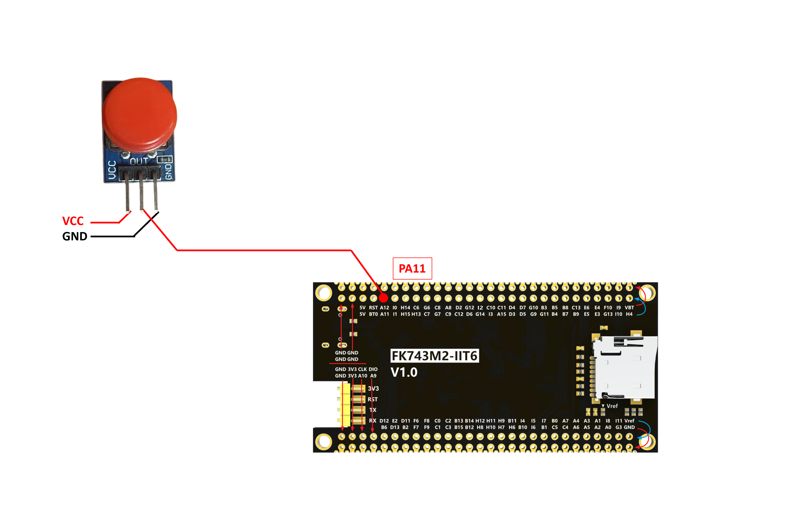
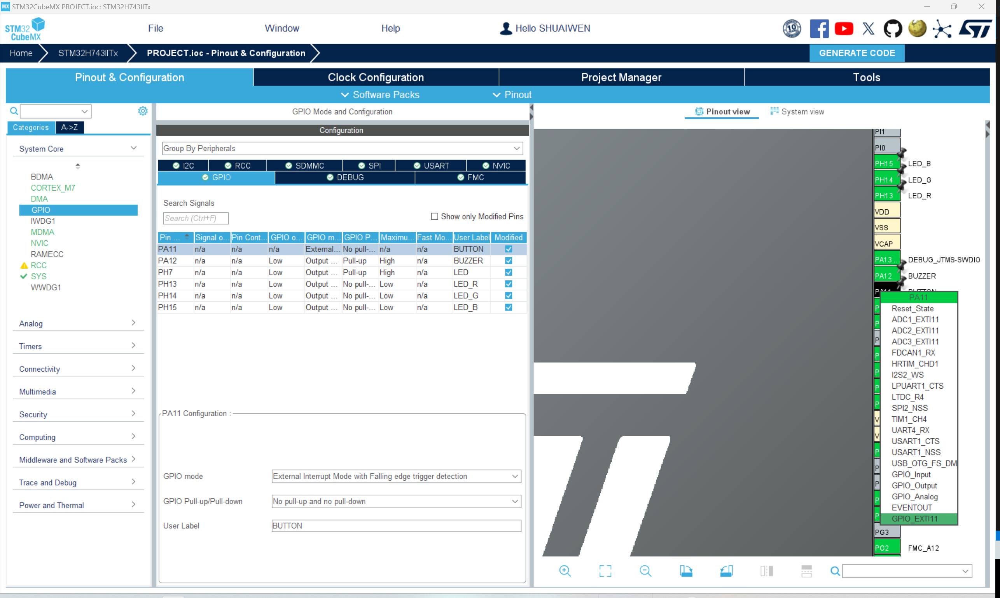
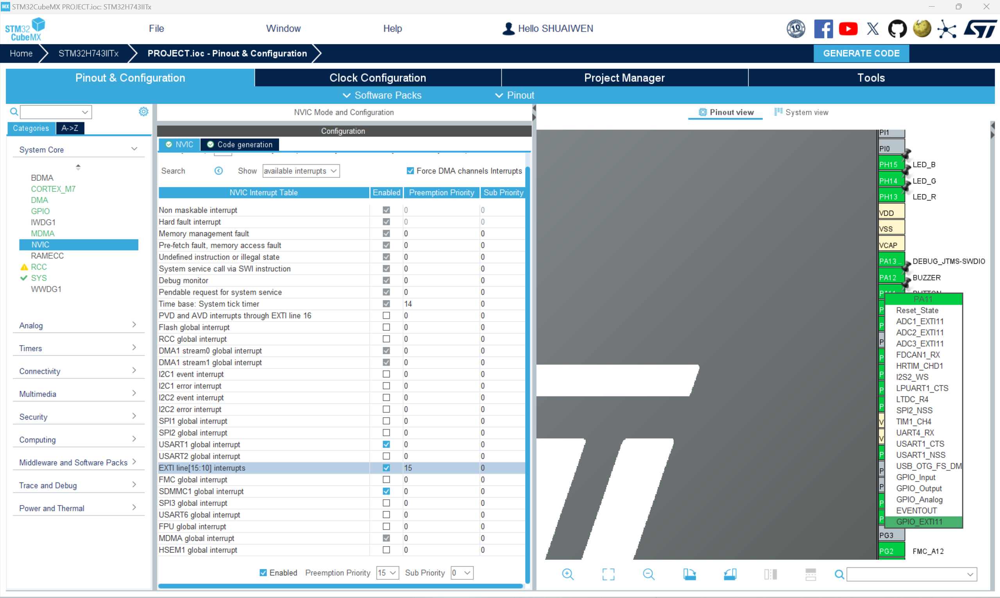

# 按键

## 简介

按钮是一个简单的组件，用于控制程序的流程。它用于启动、停止或重置程序。按钮是一个简单的开关，通过按下来连接或断开电路。按钮是一个简单的组件，用于控制程序的流程。它用于启动、停止或重置程序。按钮是一个简单的开关，通过按下来连接或断开电路。

## 中断形式按键控制

<div class="grid cards" markdown>

-   :fontawesome-brands-bilibili:{ .lg .middle } __中断按键控制__

    ---

    keysking


    [:octicons-arrow-right-24: <a href="https://www.bilibili.com/video/BV1Fj411V7aq/?spm_id_from=333.788&vd_source=5a427660f0337fedc22d4803661d493f" target="_blank"> 传送门 </a>](#)

</div>

## 按钮硬件与连线




| 按钮 PIN | MCU PIN |
|----------|---------|
| VCC      | 3.3V (or external VCC)   |
| GND      | GND (or external GND)    |
| IO      | PA11    |

## 软件设置



下降沿中断 - 按键按下



如果在处理函数中包含了HAL_Delay，那么中断的优先级应该设置为低于SysTick中断的优先级。这是因为SysTick中断用于在HAL_Delay函数中生成延时。如果按键中断的优先级高于SysTick中断，那么按键中断将抢占SysTick中断，导致延时不准确。

## 源代码

### button.h

```c
/**
 * @file button.h
 * @author SHUAIWEN CUI (SHUAIWEN001 AT e DOT ntu DOT edu DOT sg)
 * @brief This file is for button control.
 * @version 1.0
 * @date 2024-09-24
 *
 * @copyright Copyright (c) 2024
 *
 */

#ifndef _BUTTON_H_
#define _BUTTON_H_

#include "setup.h" // Include the setup file to get the configuration parameters
#include "stm32h7xx_hal.h" // HAL library file declaration, replace it with the corresponding file according to the actual situation
#include "main.h" // IO definition and initialization function are in the main.c file, must be referenced

/**
  * @brief  EXTI line detection callback.
  * @param  GPIO_Pin: Specifies the port pin connected to corresponding EXTI line.
  * @retval None
  */
void HAL_GPIO_EXTI_Callback(uint16_t GPIO_Pin);

#endif /* _BUTTON_H_ */

```

### button.c

```c
/**
 * @file button.c
 * @author SHUAIWEN CUI (SHUAIWEN001 AT e DOT ntu DOT edu DOT sg)
 * @brief This file is for button control.
 * @version 1.0
 * @date 2024-09-24
 *
 * @copyright Copyright (c) 2024
 *
 */

#include "button.h"

/**
 * @brief  EXTI line detection callback.
 * @param  GPIO_Pin: Specifies the port pin connected to corresponding EXTI line.
 * @retval None
 */
void HAL_GPIO_EXTI_Callback(uint16_t GPIO_Pin)
{
    HAL_Delay(10); // Debounce time
    if (HAL_GPIO_ReadPin(BUTTON_GPIO_Port, BUTTON_Pin) == GPIO_PIN_RESET)
    {
        if (GPIO_Pin == BUTTON_Pin)
        {
            /* app code */
            LED_RGB(1, 0, 1);
            Buzzer_Beep(200);
            LED_RGB(0, 0, 0);
        }
    }
}
```

## 总结

在这里，我们使用按钮进行用户输入，并且按钮是在中断模式下使用的。我们并没有使用中断处理函数，而是使用回调函数来允许较长的处理时间。可以看到，按钮触发了中断处理函数，随后调用了回调函数，回调函数覆盖了HAL库中定义的弱函数。