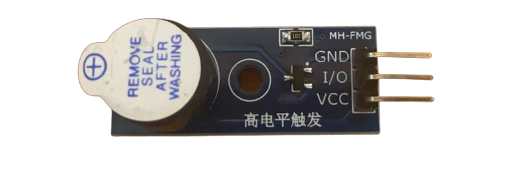
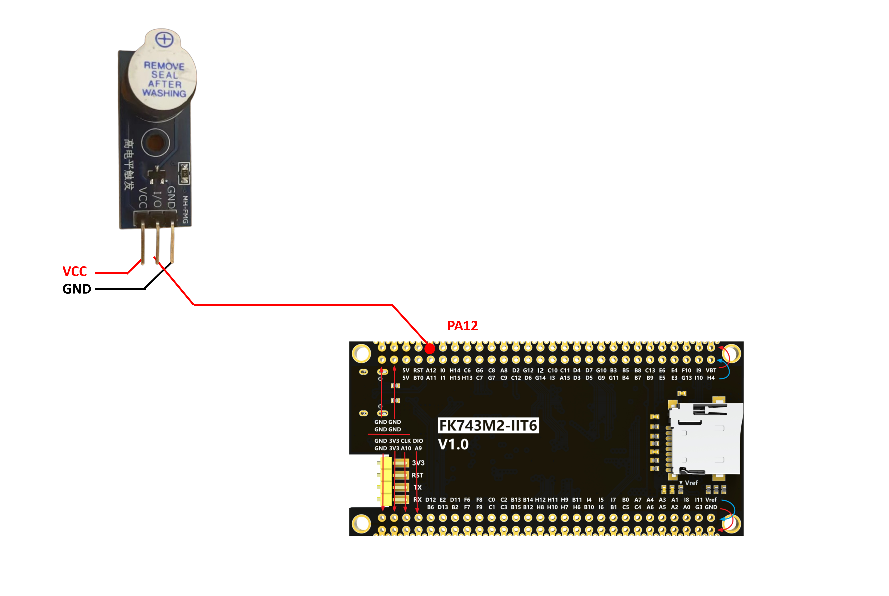

# 蜂鸣器

## 蜂鸣器介绍

蜂鸣器是一种能够发出声音的电子元件，它的工作原理是通过电流的作用使得蜂鸣器内部的振膜振动，从而发出声音。 本项目中使用有源蜂鸣器，高电平触发，接电拉高中间引脚即响。

## 硬件与接线





| 蜂鸣器 PIN | MCU PIN |
|----------|---------|
| VCC      | 3.3V (or external VCC)   |
| GND      | GND (or external GND)    |
| IO      | PA12    |

## 源代码


### buzzer.h

```c
/**
 * @file buzzer.h
 * @author SHUAIWEN CUI (SHUAIWEN001 AT e DOT ntu DOT edu DOT sg)
 * @brief This file is for buzzer control function declaration.
 * @version 1.0
 * @date 2024-09-22
 *
 * @copyright Copyright (c) 2024
 *
 */

#ifndef _BUZZER_H_
#define _BUZZER_H_

#include "stm32h7xx_hal.h" // HAL library file declaration, replace it with the corresponding file according to the actual situation
#include "main.h" // IO definition and initialization function are in the main.c file, must be referenced

/**
 * @name Buzzer_On
 * @brief Turn on the buzzer
 */
void Buzzer_On(void);

/**
 * @name Buzzer_Off
 * @brief Turn off the buzzer
 */
void Buzzer_Off(void);

/**
 * @name Buzzer_Toggle
 * @brief Toggle the buzzer
 */
void Buzzer_Toggle(void);

/**
 * @name Buzzer_Beep
 * @brief Make the buzzer beep for a specified duration
 */
void Buzzer_Beep(uint32_t duration_ms);

#endif /* _BUZZER_H_ */
```

### buzzer.c

```c
/**
 * @file buzzer.h
 * @author SHUAIWEN CUI (SHUAIWEN001 AT e DOT ntu DOT edu DOT sg)
 * @brief This file is for buzzer control function declaration.
 * @version 1.0
 * @date 2024-09-22
 *
 * @copyright Copyright (c) 2024
 *
 */

#include "buzzer.h"

/**
 * @name Buzzer_On
 * @brief Turn on the buzzer
 */
void Buzzer_On(void)
{
    HAL_GPIO_WritePin(BUZZER_GPIO_Port, BUZZER_Pin, GPIO_PIN_SET);
}

/**
 * @name Buzzer_Off
 * @brief Turn off the buzzer
 */
void Buzzer_Off(void)
{
    HAL_GPIO_WritePin(BUZZER_GPIO_Port, BUZZER_Pin, GPIO_PIN_RESET);
}

/**
 * @name Buzzer_Toggle
 * @brief Toggle the buzzer
 */
void Buzzer_Toggle(void)
{
    HAL_GPIO_TogglePin(BUZZER_GPIO_Port, BUZZER_Pin);
}

/**
 * @name Buzzer_Beep
 * @brief Make the buzzer beep for a specified duration
 */
void Buzzer_Beep(uint32_t duration_ms)
{
    Buzzer_On();
    HAL_Delay(duration_ms); // Delay for the specified duration
    Buzzer_Off();
}

```