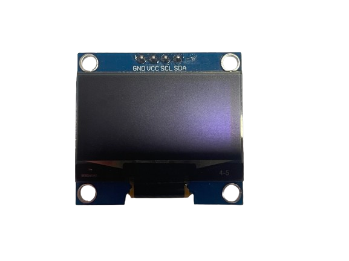
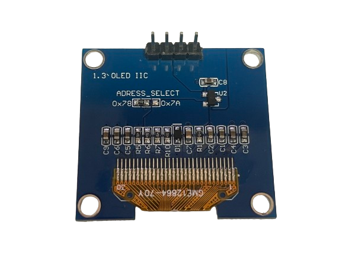

# OLED

## OLED INTRODUCTION

OLED (Organic Light Emitting Diode) is a type of display technology that uses organic compounds to produce light. It is a self-emissive display, which means that it does not require a backlight to function. OLED displays are known for their high contrast ratio, wide viewing angles, and fast response times. They are commonly used in smartphones, tablets, and other portable devices.

## OLED MODULE

 

- OLED CONTROL - CH1116
- OLED SIZE - 1.3 INCH
- OLED RESOLUTION - 128x64

-   :shopping_cart:{ .lg .middle } __product link on Taobao__

    ---

    Product link on Taobao

    [:octicons-arrow-right-24: <a href="https://m.tb.cn/h.gNJD403ubrW3ZYi?tk=tceA3fHTq8c" target="_blank"> Purchase Link </a>](#)

## DRIVER REFERENCE
- KEYSKING DRIVER

-   :material-file:{ .lg .middle } __BAUD DANCE__

    ---

    BAUD DANCE

    [:octicons-arrow-right-24: <a href="https://led.baud-dance.com/" target="_blank"> Portal </a>](#)

