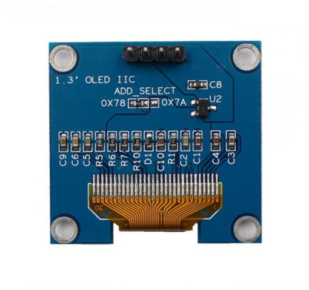

# OLED

## OLED INTRODUCTION

OLED (Organic Light Emitting Diode) is a type of display technology that uses organic compounds to produce light. It is a self-emissive display, which means that it does not require a backlight to function. OLED displays are known for their high contrast ratio, wide viewing angles, and fast response times. They are commonly used in smartphones, tablets, and other portable devices.

## OLED MODULE

- OLED CONTROL - CH1116
- OLED SIZE - 1.3 INCH
- OLED RESOLUTION - 128x64

-   :shopping_cart:{ .lg .middle } __product link on Taobao__

    ---

    Product link on Taobao

    [:octicons-arrow-right-24: <a href="https://m.tb.cn/h.gNJD403ubrW3ZYi?tk=tceA3fHTq8c" target="_blank"> Purchase Link </a>](#)

## DRIVER REFERENCE
- KEYSKING DRIVER

-   :material-file:{ .lg .middle } __BAUD DANCE__

    ---

    BAUD DANCE

    [:octicons-arrow-right-24: <a href="https://led.baud-dance.com/" target="_blank"> Portal </a>](#)

!!! info
    The drivers from KEYSKING and BAUD DANCE are recommended for this OLED module, tested OK.

## HANDS-ON

### HARDWARE SETUP

Follow the table below to connect the OLED module to the MCU.

| OLED PIN | MCU PIN |
|----------|---------|
| VCC      | 3.3V (or external VCC)   |
| GND      | GND (or external GND)    |
| SCL      | PB6     |
| SDA      | PB7     |

{: width="800px" height="800px" }

### SOFTWARE SETUP

STM32CUBEMX： enbable I2C1 and set the SCL and SDA pins to PB6 and PB7 respectively.

### TRANSPLANT THE DRIVER FROM KEYSKING AND CALL IN THE MAIN FUNCTION

Refer to the link above.