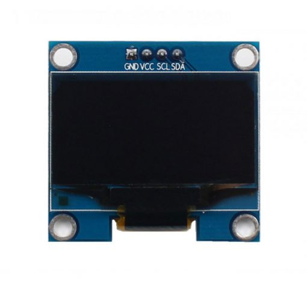
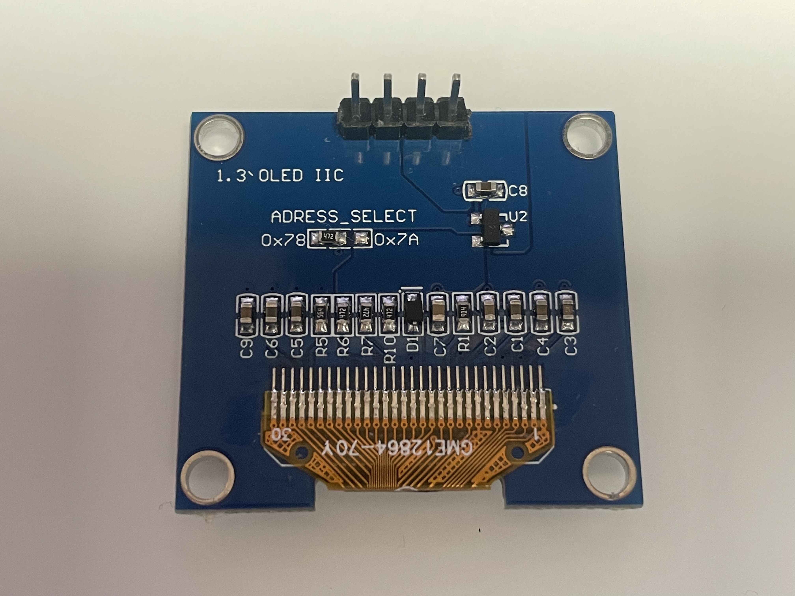
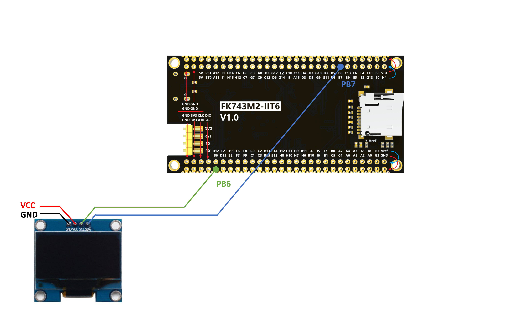

# OLED

## OLED介绍

OLED（有机发光二极管）是一种使用有机化合物产生光的显示技术。它是一种自发光显示器，这意味着它不需要背光灯来工作。OLED显示器以高对比度、广视角和快响应时间而闻名。它们通常用于智能手机、平板电脑和其他便携设备。

## OLED模块

- OLED控制 - CH1116
- OLED尺寸 - 1.3英寸
- OLED分辨率 - 128x64

-   :shopping_cart:{ .lg .middle } __淘宝购买链接__

    ---

    淘宝购买链接

    [:octicons-arrow-right-24: <a href="https://m.tb.cn/h.gNJD403ubrW3ZYi?tk=tceA3fHTq8c" target="_blank"> 商品链接 </a>](#)

## 驱动器参考
- KEYSKING驱动器

-   :material-file:{ .lg .middle } __波特律动__

    ---

    波特律动

    [:octicons-arrow-right-24: <a href="https://led.baud-dance.com/" target="_blank"> 传送门 </a>](#)

!!! info
    KEYSKING和BAUD DANCE的驱动器适用于此OLED模块，测试可行。

## 实战

### 硬件设置

按照下表连接OLED模块到MCU。

| OLED引脚 | MCU引脚 |
|----------|---------|
| VCC      | 3.3V（或外部VCC）   |
| GND      | GND（或外部GND）    |
| SCL      | PB6     |
| SDA      | PB7     |

{: width="800px" height="800px" }

### 软件设置

STM32CUBEMX: 启用I2C1，配置PB6和PB7引脚分别为SCL和SDA。

### 移植KEYSKING驱动并在主程序中调用相关函数

参考上面keysking的连接。