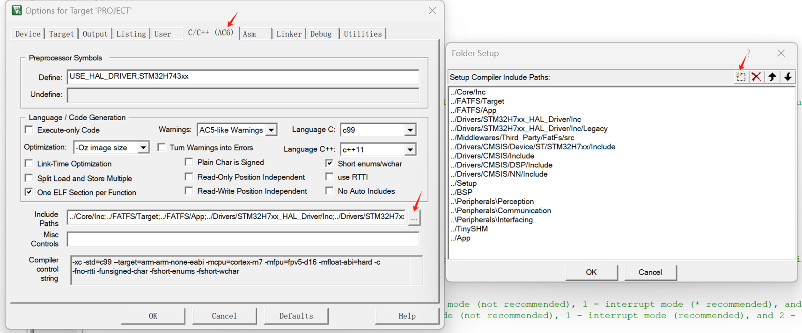
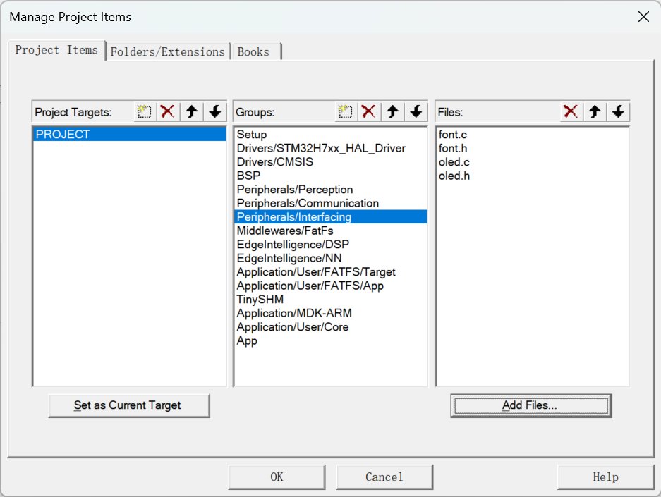

# OLED

## OLED介绍

OLED（有机发光二极管）是一种使用有机化合物产生光的显示技术。它是一种自发光显示器，这意味着它不需要背光灯来工作。OLED显示器以高对比度、广视角和快响应时间而闻名。它们通常用于智能手机、平板电脑和其他便携设备。

## OLED模块


- OLED控制 - CH1116
- OLED尺寸 - 1.3英寸
- OLED分辨率 - 128x64

<div class="grid cards" markdown>

-   :shopping_cart:{ .lg .middle } __淘宝购买链接__

    ---

    淘宝购买链接

    [:octicons-arrow-right-24: <a href="https://m.tb.cn/h.gNJD403ubrW3ZYi?tk=tceA3fHTq8c" target="_blank"> 商品链接 </a>](#)

</div>

## 驱动器参考
- KEYSKING驱动器

<div class="grid cards" markdown>

-   :material-file:{ .lg .middle } __波特律动__

    ---

    波特律动

    [:octicons-arrow-right-24: <a href="https://led.baud-dance.com/" target="_blank"> 传送门 </a>](#)

</div>

!!! info
    KEYSKING和BAUD DANCE的驱动器适用于此OLED模块，测试可行。


## 实战

### 硬件设置

按照下表连接OLED模块到MCU。

| OLED引脚 | MCU引脚 |
|----------|---------|
| VCC      | 3.3V（或外部VCC）   |
| GND      | GND（或外部GND）    |
| SCL      | PB6     |
| SDA      | PB7     |

{: width="800px" height="800px" }

### 软件设置

STM32CUBEMX: 启用I2C1，配置PB6和PB7引脚分别为SCL和SDA。

### 移植KEYSKING驱动并在主程序中调用相关函数

参考上面keysking的连接。

#### 把源文件添加到包含路径和项目结构中

**包含路径：**



**项目结构：**



!!! tip
    一个比较好的使用OLED的方式是在显存上绘图，然后将显存绘制在屏幕上。

## 源代码

### "font.h"

```c
/**
 * @file font.h
 * @brief font library
 *
 * @attention
 * please use this fond library with Baud Dance OLED driver
 * English font is included
 * Chinese font can be generated using Baud Dance LED Font Assistant (https://led.baud-dance.com)
 * Image data can be generated using the Baud Dance LED Font Assistant (https://led.baud-dance.com)
 */
#ifndef _FONT_H_
#define _FONT_H_
#include "stdint.h"
#include "string.h"

typedef struct ASCIIFont {
  uint8_t h;
  uint8_t w;
  uint8_t *chars;
} ASCIIFont;

extern const ASCIIFont afont8x6;
extern const ASCIIFont afont12x6;
extern const ASCIIFont afont16x8;
extern const ASCIIFont afont24x12;

/**
 * @brief Font structure
 * @note  The first 4 bytes of the font library store the UTF-8 encoding, the remaining bytes store the font data
 * @note  Font data can be generated using the Baud Dance LED Font Assistant (https://led.baud-dance.com)
 */
typedef struct Font {
  uint8_t h;              // Font height
  uint8_t w;              // Font width
  const uint8_t *chars;   // Font library: the first 4 bytes store the UTF-8 encoding, the remaining bytes store the font data
  uint8_t len;            // Length of the font library, change to uint16_t if it exceeds 256
  const ASCIIFont *ascii; // Default ASCII font, used when the corresponding character is not found in the font library and ASCII characters need to be displayed
} Font;

extern const Font font16x16;

/**
 * @brief Image structure
 * @note  Image data can be generated using the Baud Dance LED Font Assistant (https://led.baud-dance.com)
 */
typedef struct Image {
  uint8_t w;           // Image width
  uint8_t h;           // Image height
  const uint8_t *data; // Image data
} Image;

extern const Image bilibiliImg;

extern const Image copilotImg;


#endif /* _FONT_H_ */

```

### "font.c"

```c
/**
 * @file font.c
 * @brief font library
 *
 * @attention
 * please use this fond library with Baud Dance OLED driver
 * English font is included
 * Chinese font can be generated using Baud Dance LED Font Assistant (https://led.baud-dance.com)
 * Image data can be generated using the Baud Dance LED Font Assistant (https://led.baud-dance.com)
 */
// clang-format off
#include "font.h"

// 8*6 ASCII
const unsigned char ascii_8x6[][6] = {
    {0x00, 0x00, 0x00, 0x00, 0x00, 0x00}, // space
    {0x00, 0x00, 0x00, 0x2f, 0x00, 0x00}, // !
    {0x00, 0x00, 0x07, 0x00, 0x07, 0x00}, // "
    {0x00, 0x14, 0x7f, 0x14, 0x7f, 0x14}, // #
    {0x00, 0x24, 0x2a, 0x7f, 0x2a, 0x12}, // $
    {0x00, 0x62, 0x64, 0x08, 0x13, 0x23}, // %
    {0x00, 0x36, 0x49, 0x55, 0x22, 0x50}, // &
    {0x00, 0x00, 0x05, 0x03, 0x00, 0x00}, // '
    {0x00, 0x00, 0x1c, 0x22, 0x41, 0x00}, // (
    {0x00, 0x00, 0x41, 0x22, 0x1c, 0x00}, // )
    {0x00, 0x14, 0x08, 0x3E, 0x08, 0x14}, // *
    {0x00, 0x08, 0x08, 0x3E, 0x08, 0x08}, // +
    {0x00, 0x00, 0x00, 0xA0, 0x60, 0x00}, // ,
    {0x00, 0x08, 0x08, 0x08, 0x08, 0x08}, // -
    {0x00, 0x00, 0x60, 0x60, 0x00, 0x00}, // .
    {0x00, 0x20, 0x10, 0x08, 0x04, 0x02}, // /
    {0x00, 0x3E, 0x51, 0x49, 0x45, 0x3E}, // 0
    {0x00, 0x00, 0x42, 0x7F, 0x40, 0x00}, // 1
    {0x00, 0x42, 0x61, 0x51, 0x49, 0x46}, // 2
    {0x00, 0x21, 0x41, 0x45, 0x4B, 0x31}, // 3
    {0x00, 0x18, 0x14, 0x12, 0x7F, 0x10}, // 4
    {0x00, 0x27, 0x45, 0x45, 0x45, 0x39}, // 5
    {0x00, 0x3C, 0x4A, 0x49, 0x49, 0x30}, // 6
    {0x00, 0x01, 0x71, 0x09, 0x05, 0x03}, // 7
    {0x00, 0x36, 0x49, 0x49, 0x49, 0x36}, // 8
    {0x00, 0x06, 0x49, 0x49, 0x29, 0x1E}, // 9
    {0x00, 0x00, 0x36, 0x36, 0x00, 0x00}, // :
    {0x00, 0x00, 0x56, 0x36, 0x00, 0x00}, // ;
    {0x00, 0x08, 0x14, 0x22, 0x41, 0x00}, // <
    {0x00, 0x14, 0x14, 0x14, 0x14, 0x14}, // =
    {0x00, 0x00, 0x41, 0x22, 0x14, 0x08}, // >
    {0x00, 0x02, 0x01, 0x51, 0x09, 0x06}, // ?
    {0x00, 0x32, 0x49, 0x59, 0x51, 0x3E}, // @
    {0x00, 0x7C, 0x12, 0x11, 0x12, 0x7C}, // A
    {0x00, 0x7F, 0x49, 0x49, 0x49, 0x36}, // B
    {0x00, 0x3E, 0x41, 0x41, 0x41, 0x22}, // C
    {0x00, 0x7F, 0x41, 0x41, 0x22, 0x1C}, // D
    {0x00, 0x7F, 0x49, 0x49, 0x49, 0x41}, // E
    {0x00, 0x7F, 0x09, 0x09, 0x09, 0x01}, // F
    {0x00, 0x3E, 0x41, 0x49, 0x49, 0x7A}, // G
    {0x00, 0x7F, 0x08, 0x08, 0x08, 0x7F}, // H
    {0x00, 0x00, 0x41, 0x7F, 0x41, 0x00}, // I
    {0x00, 0x20, 0x40, 0x41, 0x3F, 0x01}, // J
    {0x00, 0x7F, 0x08, 0x14, 0x22, 0x41}, // K
    {0x00, 0x7F, 0x40, 0x40, 0x40, 0x40}, // L
    {0x00, 0x7F, 0x02, 0x0C, 0x02, 0x7F}, // M
    {0x00, 0x7F, 0x04, 0x08, 0x10, 0x7F}, // N
    {0x00, 0x3E, 0x41, 0x41, 0x41, 0x3E}, // O
    {0x00, 0x7F, 0x09, 0x09, 0x09, 0x06}, // P
    {0x00, 0x3E, 0x41, 0x51, 0x21, 0x5E}, // Q
    {0x00, 0x7F, 0x09, 0x19, 0x29, 0x46}, // R
    {0x00, 0x46, 0x49, 0x49, 0x49, 0x31}, // S
    {0x00, 0x01, 0x01, 0x7F, 0x01, 0x01}, // T
    {0x00, 0x3F, 0x40, 0x40, 0x40, 0x3F}, // U
    {0x00, 0x1F, 0x20, 0x40, 0x20, 0x1F}, // V
    {0x00, 0x3F, 0x40, 0x38, 0x40, 0x3F}, // W
    {0x00, 0x63, 0x14, 0x08, 0x14, 0x63}, // X
    {0x00, 0x07, 0x08, 0x70, 0x08, 0x07}, // Y
    {0x00, 0x61, 0x51, 0x49, 0x45, 0x43}, // Z
    {0x00, 0x00, 0x7F, 0x41, 0x41, 0x00}, // [
    {0x00, 0x55, 0x2A, 0x55, 0x2A, 0x55}, // 55
    {0x00, 0x00, 0x41, 0x41, 0x7F, 0x00}, // ]
    {0x00, 0x04, 0x02, 0x01, 0x02, 0x04}, // ^
    {0x00, 0x40, 0x40, 0x40, 0x40, 0x40}, // _
    {0x00, 0x00, 0x01, 0x02, 0x04, 0x00}, // '
    {0x00, 0x20, 0x54, 0x54, 0x54, 0x78}, // a
    {0x00, 0x7F, 0x48, 0x44, 0x44, 0x38}, // b
    {0x00, 0x38, 0x44, 0x44, 0x44, 0x20}, // c
    {0x00, 0x38, 0x44, 0x44, 0x48, 0x7F}, // d
    {0x00, 0x38, 0x54, 0x54, 0x54, 0x18}, // e
    {0x00, 0x08, 0x7E, 0x09, 0x01, 0x02}, // f
    {0x00, 0x18, 0xA4, 0xA4, 0xA4, 0x7C}, // g
    {0x00, 0x7F, 0x08, 0x04, 0x04, 0x78}, // h
    {0x00, 0x00, 0x44, 0x7D, 0x40, 0x00}, // i
    {0x00, 0x40, 0x80, 0x84, 0x7D, 0x00}, // j
    {0x00, 0x7F, 0x10, 0x28, 0x44, 0x00}, // k
    {0x00, 0x00, 0x41, 0x7F, 0x40, 0x00}, // l
    {0x00, 0x7C, 0x04, 0x18, 0x04, 0x78}, // m
    {0x00, 0x7C, 0x08, 0x04, 0x04, 0x78}, // n
    {0x00, 0x38, 0x44, 0x44, 0x44, 0x38}, // o
    {0x00, 0xFC, 0x24, 0x24, 0x24, 0x18}, // p
    {0x00, 0x18, 0x24, 0x24, 0x18, 0xFC}, // q
    {0x00, 0x7C, 0x08, 0x04, 0x04, 0x08}, // r
    {0x00, 0x48, 0x54, 0x54, 0x54, 0x20}, // s
    {0x00, 0x04, 0x3F, 0x44, 0x40, 0x20}, // t
    {0x00, 0x3C, 0x40, 0x40, 0x20, 0x7C}, // u
    {0x00, 0x1C, 0x20, 0x40, 0x20, 0x1C}, // v
    {0x00, 0x3C, 0x40, 0x30, 0x40, 0x3C}, // w
    {0x00, 0x44, 0x28, 0x10, 0x28, 0x44}, // x
    {0x00, 0x1C, 0xA0, 0xA0, 0xA0, 0x7C}, // y
    {0x00, 0x44, 0x64, 0x54, 0x4C, 0x44}, // z
    {0x14, 0x14, 0x14, 0x14, 0x14, 0x14}, // horiz lines
};

const ASCIIFont afont8x6 = {
    .h = 8,
    .w = 6,
    .chars = (unsigned char *)ascii_8x6,
};

const unsigned char ascii_12x6[][12] = {
    {0x00, 0x00, 0x00, 0x00, 0x00, 0x00, 0x00, 0x00, 0x00, 0x00, 0x00, 0x00}, /*" ",0*/
    {0x00, 0x00, 0xFC, 0x00, 0x00, 0x00, 0x00, 0x00, 0x02, 0x00, 0x00, 0x00}, /*"!",1*/
    {0x00, 0x0C, 0x02, 0x0C, 0x02, 0x00, 0x00, 0x00, 0x00, 0x00, 0x00, 0x00}, /*""",2*/
    {0x90, 0xD0, 0xBC, 0xD0, 0xBC, 0x90, 0x00, 0x03, 0x00, 0x03, 0x00, 0x00}, /*"#",3*/
    {0x18, 0x24, 0xFE, 0x44, 0x8C, 0x00, 0x03, 0x02, 0x07, 0x02, 0x01, 0x00}, /*"$",4*/
    {0x18, 0x24, 0xD8, 0xB0, 0x4C, 0x80, 0x00, 0x03, 0x00, 0x01, 0x02, 0x01}, /*"%",5*/
    {0xC0, 0x38, 0xE4, 0x38, 0xE0, 0x00, 0x01, 0x02, 0x02, 0x01, 0x02, 0x02}, /*"&",6*/
    {0x08, 0x06, 0x00, 0x00, 0x00, 0x00, 0x00, 0x00, 0x00, 0x00, 0x00, 0x00}, /*"'",7*/
    {0x00, 0x00, 0x00, 0xF8, 0x04, 0x02, 0x00, 0x00, 0x00, 0x01, 0x02, 0x04}, /*"(",8*/
    {0x00, 0x02, 0x04, 0xF8, 0x00, 0x00, 0x00, 0x04, 0x02, 0x01, 0x00, 0x00}, /*")",9*/
    {0x90, 0x60, 0xF8, 0x60, 0x90, 0x00, 0x00, 0x00, 0x01, 0x00, 0x00, 0x00}, /*"*",10*/
    {0x20, 0x20, 0xFC, 0x20, 0x20, 0x00, 0x00, 0x00, 0x01, 0x00, 0x00, 0x00}, /*"+",11*/
    {0x00, 0x00, 0x00, 0x00, 0x00, 0x00, 0x08, 0x06, 0x00, 0x00, 0x00, 0x00}, /*",",12*/
    {0x20, 0x20, 0x20, 0x20, 0x20, 0x00, 0x00, 0x00, 0x00, 0x00, 0x00, 0x00}, /*"-",13*/
    {0x00, 0x00, 0x00, 0x00, 0x00, 0x00, 0x00, 0x02, 0x00, 0x00, 0x00, 0x00}, /*".",14*/
    {0x00, 0x80, 0x60, 0x1C, 0x02, 0x00, 0x04, 0x03, 0x00, 0x00, 0x00, 0x00}, /*"/",15*/
    {0xF8, 0x04, 0x04, 0x04, 0xF8, 0x00, 0x01, 0x02, 0x02, 0x02, 0x01, 0x00}, /*"0",16*/
    {0x00, 0x08, 0xFC, 0x00, 0x00, 0x00, 0x00, 0x02, 0x03, 0x02, 0x00, 0x00}, /*"1",17*/
    {0x18, 0x84, 0x44, 0x24, 0x18, 0x00, 0x03, 0x02, 0x02, 0x02, 0x02, 0x00}, /*"2",18*/
    {0x08, 0x04, 0x24, 0x24, 0xD8, 0x00, 0x01, 0x02, 0x02, 0x02, 0x01, 0x00}, /*"3",19*/
    {0x40, 0xB0, 0x88, 0xFC, 0x80, 0x00, 0x00, 0x00, 0x00, 0x03, 0x02, 0x00}, /*"4",20*/
    {0x3C, 0x24, 0x24, 0x24, 0xC4, 0x00, 0x01, 0x02, 0x02, 0x02, 0x01, 0x00}, /*"5",21*/
    {0xF8, 0x24, 0x24, 0x2C, 0xC0, 0x00, 0x01, 0x02, 0x02, 0x02, 0x01, 0x00}, /*"6",22*/
    {0x0C, 0x04, 0xE4, 0x1C, 0x04, 0x00, 0x00, 0x00, 0x03, 0x00, 0x00, 0x00}, /*"7",23*/
    {0xD8, 0x24, 0x24, 0x24, 0xD8, 0x00, 0x01, 0x02, 0x02, 0x02, 0x01, 0x00}, /*"8",24*/
    {0x38, 0x44, 0x44, 0x44, 0xF8, 0x00, 0x00, 0x03, 0x02, 0x02, 0x01, 0x00}, /*"9",25*/
    {0x00, 0x00, 0x10, 0x00, 0x00, 0x00, 0x00, 0x00, 0x02, 0x00, 0x00, 0x00}, /*":",26*/
    {0x00, 0x00, 0x20, 0x00, 0x00, 0x00, 0x00, 0x00, 0x06, 0x00, 0x00, 0x00}, /*";",27*/
    {0x00, 0x20, 0x50, 0x88, 0x04, 0x02, 0x00, 0x00, 0x00, 0x00, 0x01, 0x02}, /*"<",28*/
    {0x90, 0x90, 0x90, 0x90, 0x90, 0x00, 0x00, 0x00, 0x00, 0x00, 0x00, 0x00}, /*"=",29*/
    {0x00, 0x02, 0x04, 0x88, 0x50, 0x20, 0x00, 0x02, 0x01, 0x00, 0x00, 0x00}, /*">",30*/
    {0x18, 0x04, 0xC4, 0x24, 0x18, 0x00, 0x00, 0x00, 0x02, 0x00, 0x00, 0x00}, /*"?",31*/
    {0xF8, 0x04, 0xE4, 0x94, 0xF8, 0x00, 0x01, 0x02, 0x02, 0x02, 0x02, 0x00}, /*"@",32*/
    {0x00, 0xE0, 0x9C, 0xF0, 0x80, 0x00, 0x02, 0x03, 0x00, 0x00, 0x03, 0x02}, /*"A",33*/
    {0x04, 0xFC, 0x24, 0x24, 0xD8, 0x00, 0x02, 0x03, 0x02, 0x02, 0x01, 0x00}, /*"B",34*/
    {0xF8, 0x04, 0x04, 0x04, 0x0C, 0x00, 0x01, 0x02, 0x02, 0x02, 0x01, 0x00}, /*"C",35*/
    {0x04, 0xFC, 0x04, 0x04, 0xF8, 0x00, 0x02, 0x03, 0x02, 0x02, 0x01, 0x00}, /*"D",36*/
    {0x04, 0xFC, 0x24, 0x74, 0x0C, 0x00, 0x02, 0x03, 0x02, 0x02, 0x03, 0x00}, /*"E",37*/
    {0x04, 0xFC, 0x24, 0x74, 0x0C, 0x00, 0x02, 0x03, 0x02, 0x00, 0x00, 0x00}, /*"F",38*/
    {0xF0, 0x08, 0x04, 0x44, 0xCC, 0x40, 0x00, 0x01, 0x02, 0x02, 0x01, 0x00}, /*"G",39*/
    {0x04, 0xFC, 0x20, 0x20, 0xFC, 0x04, 0x02, 0x03, 0x00, 0x00, 0x03, 0x02}, /*"H",40*/
    {0x04, 0x04, 0xFC, 0x04, 0x04, 0x00, 0x02, 0x02, 0x03, 0x02, 0x02, 0x00}, /*"I",41*/
    {0x00, 0x04, 0x04, 0xFC, 0x04, 0x04, 0x06, 0x04, 0x04, 0x03, 0x00, 0x00}, /*"J",42*/
    {0x04, 0xFC, 0x24, 0xD0, 0x0C, 0x04, 0x02, 0x03, 0x02, 0x00, 0x03, 0x02}, /*"K",43*/
    {0x04, 0xFC, 0x04, 0x00, 0x00, 0x00, 0x02, 0x03, 0x02, 0x02, 0x02, 0x03}, /*"L",44*/
    {0xFC, 0x3C, 0xC0, 0x3C, 0xFC, 0x00, 0x03, 0x00, 0x03, 0x00, 0x03, 0x00}, /*"M",45*/
    {0x04, 0xFC, 0x30, 0xC4, 0xFC, 0x04, 0x02, 0x03, 0x02, 0x00, 0x03, 0x00}, /*"N",46*/
    {0xF8, 0x04, 0x04, 0x04, 0xF8, 0x00, 0x01, 0x02, 0x02, 0x02, 0x01, 0x00}, /*"O",47*/
    {0x04, 0xFC, 0x24, 0x24, 0x18, 0x00, 0x02, 0x03, 0x02, 0x00, 0x00, 0x00}, /*"P",48*/
    {0xF8, 0x84, 0x84, 0x04, 0xF8, 0x00, 0x01, 0x02, 0x02, 0x07, 0x05, 0x00}, /*"Q",49*/
    {0x04, 0xFC, 0x24, 0x64, 0x98, 0x00, 0x02, 0x03, 0x02, 0x00, 0x03, 0x02}, /*"R",50*/
    {0x18, 0x24, 0x24, 0x44, 0x8C, 0x00, 0x03, 0x02, 0x02, 0x02, 0x01, 0x00}, /*"S",51*/
    {0x0C, 0x04, 0xFC, 0x04, 0x0C, 0x00, 0x00, 0x02, 0x03, 0x02, 0x00, 0x00}, /*"T",52*/
    {0x04, 0xFC, 0x00, 0x00, 0xFC, 0x04, 0x00, 0x01, 0x02, 0x02, 0x01, 0x00}, /*"U",53*/
    {0x04, 0x7C, 0x80, 0xE0, 0x1C, 0x04, 0x00, 0x00, 0x03, 0x00, 0x00, 0x00}, /*"V",54*/
    {0x1C, 0xE0, 0x3C, 0xE0, 0x1C, 0x00, 0x00, 0x03, 0x00, 0x03, 0x00, 0x00}, /*"W",55*/
    {0x04, 0x9C, 0x60, 0x9C, 0x04, 0x00, 0x02, 0x03, 0x00, 0x03, 0x02, 0x00}, /*"X",56*/
    {0x04, 0x1C, 0xE0, 0x1C, 0x04, 0x00, 0x00, 0x02, 0x03, 0x02, 0x00, 0x00}, /*"Y",57*/
    {0x0C, 0x84, 0x64, 0x1C, 0x04, 0x00, 0x02, 0x03, 0x02, 0x02, 0x03, 0x00}, /*"Z",58*/
    {0x00, 0x00, 0xFE, 0x02, 0x02, 0x00, 0x00, 0x00, 0x07, 0x04, 0x04, 0x00}, /*"[",59*/
    {0x00, 0x0E, 0x30, 0xC0, 0x00, 0x00, 0x00, 0x00, 0x00, 0x01, 0x02, 0x00}, /*"\",60*/
    {0x00, 0x02, 0x02, 0xFE, 0x00, 0x00, 0x00, 0x04, 0x04, 0x07, 0x00, 0x00}, /*"]",61*/
    {0x00, 0x04, 0x02, 0x04, 0x00, 0x00, 0x00, 0x00, 0x00, 0x00, 0x00, 0x00}, /*"^",62*/
    {0x00, 0x00, 0x00, 0x00, 0x00, 0x00, 0x08, 0x08, 0x08, 0x08, 0x08, 0x08}, /*"_",63*/
    {0x00, 0x00, 0x02, 0x00, 0x00, 0x00, 0x00, 0x00, 0x00, 0x00, 0x00, 0x00}, /*"`",64*/
    {0x00, 0x40, 0xA0, 0xA0, 0xC0, 0x00, 0x00, 0x01, 0x02, 0x02, 0x03, 0x02}, /*"a",65*/
    {0x04, 0xFC, 0x20, 0x20, 0xC0, 0x00, 0x00, 0x03, 0x02, 0x02, 0x01, 0x00}, /*"b",66*/
    {0x00, 0xC0, 0x20, 0x20, 0x60, 0x00, 0x00, 0x01, 0x02, 0x02, 0x02, 0x00}, /*"c",67*/
    {0x00, 0xC0, 0x20, 0x24, 0xFC, 0x00, 0x00, 0x01, 0x02, 0x02, 0x03, 0x02}, /*"d",68*/
    {0x00, 0xC0, 0xA0, 0xA0, 0xC0, 0x00, 0x00, 0x01, 0x02, 0x02, 0x02, 0x00}, /*"e",69*/
    {0x00, 0x20, 0xF8, 0x24, 0x24, 0x04, 0x00, 0x02, 0x03, 0x02, 0x02, 0x00}, /*"f",70*/
    {0x00, 0x40, 0xA0, 0xA0, 0x60, 0x20, 0x00, 0x07, 0x0A, 0x0A, 0x0A, 0x04}, /*"g",71*/
    {0x04, 0xFC, 0x20, 0x20, 0xC0, 0x00, 0x02, 0x03, 0x02, 0x00, 0x03, 0x02}, /*"h",72*/
    {0x00, 0x20, 0xE4, 0x00, 0x00, 0x00, 0x00, 0x02, 0x03, 0x02, 0x00, 0x00}, /*"i",73*/
    {0x00, 0x00, 0x20, 0xE4, 0x00, 0x00, 0x08, 0x08, 0x08, 0x07, 0x00, 0x00}, /*"j",74*/
    {0x04, 0xFC, 0x80, 0xE0, 0x20, 0x20, 0x02, 0x03, 0x02, 0x00, 0x03, 0x02}, /*"k",75*/
    {0x04, 0x04, 0xFC, 0x00, 0x00, 0x00, 0x02, 0x02, 0x03, 0x02, 0x02, 0x00}, /*"l",76*/
    {0xE0, 0x20, 0xE0, 0x20, 0xC0, 0x00, 0x03, 0x00, 0x03, 0x00, 0x03, 0x00}, /*"m",77*/
    {0x20, 0xE0, 0x20, 0x20, 0xC0, 0x00, 0x02, 0x03, 0x02, 0x00, 0x03, 0x02}, /*"n",78*/
    {0x00, 0xC0, 0x20, 0x20, 0xC0, 0x00, 0x00, 0x01, 0x02, 0x02, 0x01, 0x00}, /*"o",79*/
    {0x20, 0xE0, 0x20, 0x20, 0xC0, 0x00, 0x08, 0x0F, 0x0A, 0x02, 0x01, 0x00}, /*"p",80*/
    {0x00, 0xC0, 0x20, 0x20, 0xE0, 0x00, 0x00, 0x01, 0x02, 0x0A, 0x0F, 0x08}, /*"q",81*/
    {0x20, 0xE0, 0x40, 0x20, 0x20, 0x00, 0x02, 0x03, 0x02, 0x00, 0x00, 0x00}, /*"r",82*/
    {0x00, 0x60, 0xA0, 0xA0, 0x20, 0x00, 0x00, 0x02, 0x02, 0x02, 0x03, 0x00}, /*"s",83*/
    {0x00, 0x20, 0xF8, 0x20, 0x00, 0x00, 0x00, 0x00, 0x01, 0x02, 0x02, 0x00}, /*"t",84*/
    {0x20, 0xE0, 0x00, 0x20, 0xE0, 0x00, 0x00, 0x01, 0x02, 0x02, 0x03, 0x02}, /*"u",85*/
    {0x20, 0xE0, 0x20, 0x80, 0x60, 0x20, 0x00, 0x00, 0x03, 0x01, 0x00, 0x00}, /*"v",86*/
    {0x60, 0x80, 0xE0, 0x80, 0x60, 0x00, 0x00, 0x03, 0x00, 0x03, 0x00, 0x00}, /*"w",87*/
    {0x20, 0x60, 0x80, 0x60, 0x20, 0x00, 0x02, 0x03, 0x00, 0x03, 0x02, 0x00}, /*"x",88*/
    {0x20, 0xE0, 0x20, 0x80, 0x60, 0x20, 0x08, 0x08, 0x07, 0x01, 0x00, 0x00}, /*"y",89*/
    {0x00, 0x20, 0xA0, 0x60, 0x20, 0x00, 0x00, 0x02, 0x03, 0x02, 0x02, 0x00}, /*"z",90*/
    {0x00, 0x00, 0x20, 0xDE, 0x02, 0x00, 0x00, 0x00, 0x00, 0x07, 0x04, 0x00}, /*"{",91*/
    {0x00, 0x00, 0x00, 0xFF, 0x00, 0x00, 0x00, 0x00, 0x00, 0x0F, 0x00, 0x00}, /*"|",92*/
    {0x00, 0x02, 0xDE, 0x20, 0x00, 0x00, 0x00, 0x04, 0x07, 0x00, 0x00, 0x00}, /*"}",93*/
    {0x02, 0x01, 0x02, 0x04, 0x04, 0x02, 0x00, 0x00, 0x00, 0x00, 0x00, 0x00}, /*"~",94*/
};

const ASCIIFont afont12x6 = {
    .h = 12,
    .w = 6,
    .chars = (unsigned char *)ascii_12x6,
};

const unsigned char ascii_16x8[][16] = {
    {0x00, 0x00, 0x00, 0x00, 0x00, 0x00, 0x00, 0x00, 0x00, 0x00, 0x00, 0x00, 0x00, 0x00, 0x00, 0x00}, /*" ",0*/
    {0x00, 0x00, 0x00, 0xF8, 0x00, 0x00, 0x00, 0x00, 0x00, 0x00, 0x00, 0x33, 0x30, 0x00, 0x00, 0x00}, /*"!",1*/
    {0x00, 0x10, 0x0C, 0x06, 0x10, 0x0C, 0x06, 0x00, 0x00, 0x00, 0x00, 0x00, 0x00, 0x00, 0x00, 0x00}, /*""",2*/
    {0x40, 0xC0, 0x78, 0x40, 0xC0, 0x78, 0x40, 0x00, 0x04, 0x3F, 0x04, 0x04, 0x3F, 0x04, 0x04, 0x00}, /*"#",3*/
    {0x00, 0x70, 0x88, 0xFC, 0x08, 0x30, 0x00, 0x00, 0x00, 0x18, 0x20, 0xFF, 0x21, 0x1E, 0x00, 0x00}, /*"$",4*/
    {0xF0, 0x08, 0xF0, 0x00, 0xE0, 0x18, 0x00, 0x00, 0x00, 0x21, 0x1C, 0x03, 0x1E, 0x21, 0x1E, 0x00}, /*"%",5*/
    {0x00, 0xF0, 0x08, 0x88, 0x70, 0x00, 0x00, 0x00, 0x1E, 0x21, 0x23, 0x24, 0x19, 0x27, 0x21, 0x10}, /*"&",6*/
    {0x10, 0x16, 0x0E, 0x00, 0x00, 0x00, 0x00, 0x00, 0x00, 0x00, 0x00, 0x00, 0x00, 0x00, 0x00, 0x00}, /*"'",7*/
    {0x00, 0x00, 0x00, 0xE0, 0x18, 0x04, 0x02, 0x00, 0x00, 0x00, 0x00, 0x07, 0x18, 0x20, 0x40, 0x00}, /*"(",8*/
    {0x00, 0x02, 0x04, 0x18, 0xE0, 0x00, 0x00, 0x00, 0x00, 0x40, 0x20, 0x18, 0x07, 0x00, 0x00, 0x00}, /*")",9*/
    {0x40, 0x40, 0x80, 0xF0, 0x80, 0x40, 0x40, 0x00, 0x02, 0x02, 0x01, 0x0F, 0x01, 0x02, 0x02, 0x00}, /*"*",10*/
    {0x00, 0x00, 0x00, 0xF0, 0x00, 0x00, 0x00, 0x00, 0x01, 0x01, 0x01, 0x1F, 0x01, 0x01, 0x01, 0x00}, /*"+",11*/
    {0x00, 0x00, 0x00, 0x00, 0x00, 0x00, 0x00, 0x00, 0x80, 0xB0, 0x70, 0x00, 0x00, 0x00, 0x00, 0x00}, /*",",12*/
    {0x00, 0x00, 0x00, 0x00, 0x00, 0x00, 0x00, 0x00, 0x00, 0x01, 0x01, 0x01, 0x01, 0x01, 0x01, 0x01}, /*"-",13*/
    {0x00, 0x00, 0x00, 0x00, 0x00, 0x00, 0x00, 0x00, 0x00, 0x30, 0x30, 0x00, 0x00, 0x00, 0x00, 0x00}, /*".",14*/
    {0x00, 0x00, 0x00, 0x00, 0x80, 0x60, 0x18, 0x04, 0x00, 0x60, 0x18, 0x06, 0x01, 0x00, 0x00, 0x00}, /*"/",15*/
    {0x00, 0xE0, 0x10, 0x08, 0x08, 0x10, 0xE0, 0x00, 0x00, 0x0F, 0x10, 0x20, 0x20, 0x10, 0x0F, 0x00}, /*"0",16*/
    {0x00, 0x10, 0x10, 0xF8, 0x00, 0x00, 0x00, 0x00, 0x00, 0x20, 0x20, 0x3F, 0x20, 0x20, 0x00, 0x00}, /*"1",17*/
    {0x00, 0x70, 0x08, 0x08, 0x08, 0x88, 0x70, 0x00, 0x00, 0x30, 0x28, 0x24, 0x22, 0x21, 0x30, 0x00}, /*"2",18*/
    {0x00, 0x30, 0x08, 0x88, 0x88, 0x48, 0x30, 0x00, 0x00, 0x18, 0x20, 0x20, 0x20, 0x11, 0x0E, 0x00}, /*"3",19*/
    {0x00, 0x00, 0xC0, 0x20, 0x10, 0xF8, 0x00, 0x00, 0x00, 0x07, 0x04, 0x24, 0x24, 0x3F, 0x24, 0x00}, /*"4",20*/
    {0x00, 0xF8, 0x08, 0x88, 0x88, 0x08, 0x08, 0x00, 0x00, 0x19, 0x21, 0x20, 0x20, 0x11, 0x0E, 0x00}, /*"5",21*/
    {0x00, 0xE0, 0x10, 0x88, 0x88, 0x18, 0x00, 0x00, 0x00, 0x0F, 0x11, 0x20, 0x20, 0x11, 0x0E, 0x00}, /*"6",22*/
    {0x00, 0x38, 0x08, 0x08, 0xC8, 0x38, 0x08, 0x00, 0x00, 0x00, 0x00, 0x3F, 0x00, 0x00, 0x00, 0x00}, /*"7",23*/
    {0x00, 0x70, 0x88, 0x08, 0x08, 0x88, 0x70, 0x00, 0x00, 0x1C, 0x22, 0x21, 0x21, 0x22, 0x1C, 0x00}, /*"8",24*/
    {0x00, 0xE0, 0x10, 0x08, 0x08, 0x10, 0xE0, 0x00, 0x00, 0x00, 0x31, 0x22, 0x22, 0x11, 0x0F, 0x00}, /*"9",25*/
    {0x00, 0x00, 0x00, 0xC0, 0xC0, 0x00, 0x00, 0x00, 0x00, 0x00, 0x00, 0x30, 0x30, 0x00, 0x00, 0x00}, /*":",26*/
    {0x00, 0x00, 0x00, 0x80, 0x00, 0x00, 0x00, 0x00, 0x00, 0x00, 0x80, 0x60, 0x00, 0x00, 0x00, 0x00}, /*";",27*/
    {0x00, 0x00, 0x80, 0x40, 0x20, 0x10, 0x08, 0x00, 0x00, 0x01, 0x02, 0x04, 0x08, 0x10, 0x20, 0x00}, /*"<",28*/
    {0x40, 0x40, 0x40, 0x40, 0x40, 0x40, 0x40, 0x00, 0x04, 0x04, 0x04, 0x04, 0x04, 0x04, 0x04, 0x00}, /*"=",29*/
    {0x00, 0x08, 0x10, 0x20, 0x40, 0x80, 0x00, 0x00, 0x00, 0x20, 0x10, 0x08, 0x04, 0x02, 0x01, 0x00}, /*">",30*/
    {0x00, 0x70, 0x48, 0x08, 0x08, 0x08, 0xF0, 0x00, 0x00, 0x00, 0x00, 0x30, 0x36, 0x01, 0x00, 0x00}, /*"?",31*/
    {0xC0, 0x30, 0xC8, 0x28, 0xE8, 0x10, 0xE0, 0x00, 0x07, 0x18, 0x27, 0x24, 0x23, 0x14, 0x0B, 0x00}, /*"@",32*/
    {0x00, 0x00, 0xC0, 0x38, 0xE0, 0x00, 0x00, 0x00, 0x20, 0x3C, 0x23, 0x02, 0x02, 0x27, 0x38, 0x20}, /*"A",33*/
    {0x08, 0xF8, 0x88, 0x88, 0x88, 0x70, 0x00, 0x00, 0x20, 0x3F, 0x20, 0x20, 0x20, 0x11, 0x0E, 0x00}, /*"B",34*/
    {0xC0, 0x30, 0x08, 0x08, 0x08, 0x08, 0x38, 0x00, 0x07, 0x18, 0x20, 0x20, 0x20, 0x10, 0x08, 0x00}, /*"C",35*/
    {0x08, 0xF8, 0x08, 0x08, 0x08, 0x10, 0xE0, 0x00, 0x20, 0x3F, 0x20, 0x20, 0x20, 0x10, 0x0F, 0x00}, /*"D",36*/
    {0x08, 0xF8, 0x88, 0x88, 0xE8, 0x08, 0x10, 0x00, 0x20, 0x3F, 0x20, 0x20, 0x23, 0x20, 0x18, 0x00}, /*"E",37*/
    {0x08, 0xF8, 0x88, 0x88, 0xE8, 0x08, 0x10, 0x00, 0x20, 0x3F, 0x20, 0x00, 0x03, 0x00, 0x00, 0x00}, /*"F",38*/
    {0xC0, 0x30, 0x08, 0x08, 0x08, 0x38, 0x00, 0x00, 0x07, 0x18, 0x20, 0x20, 0x22, 0x1E, 0x02, 0x00}, /*"G",39*/
    {0x08, 0xF8, 0x08, 0x00, 0x00, 0x08, 0xF8, 0x08, 0x20, 0x3F, 0x21, 0x01, 0x01, 0x21, 0x3F, 0x20}, /*"H",40*/
    {0x00, 0x08, 0x08, 0xF8, 0x08, 0x08, 0x00, 0x00, 0x00, 0x20, 0x20, 0x3F, 0x20, 0x20, 0x00, 0x00}, /*"I",41*/
    {0x00, 0x00, 0x08, 0x08, 0xF8, 0x08, 0x08, 0x00, 0xC0, 0x80, 0x80, 0x80, 0x7F, 0x00, 0x00, 0x00}, /*"J",42*/
    {0x08, 0xF8, 0x88, 0xC0, 0x28, 0x18, 0x08, 0x00, 0x20, 0x3F, 0x20, 0x01, 0x26, 0x38, 0x20, 0x00}, /*"K",43*/
    {0x08, 0xF8, 0x08, 0x00, 0x00, 0x00, 0x00, 0x00, 0x20, 0x3F, 0x20, 0x20, 0x20, 0x20, 0x30, 0x00}, /*"L",44*/
    {0x08, 0xF8, 0xF8, 0x00, 0xF8, 0xF8, 0x08, 0x00, 0x20, 0x3F, 0x00, 0x3F, 0x00, 0x3F, 0x20, 0x00}, /*"M",45*/
    {0x08, 0xF8, 0x30, 0xC0, 0x00, 0x08, 0xF8, 0x08, 0x20, 0x3F, 0x20, 0x00, 0x07, 0x18, 0x3F, 0x00}, /*"N",46*/
    {0xE0, 0x10, 0x08, 0x08, 0x08, 0x10, 0xE0, 0x00, 0x0F, 0x10, 0x20, 0x20, 0x20, 0x10, 0x0F, 0x00}, /*"O",47*/
    {0x08, 0xF8, 0x08, 0x08, 0x08, 0x08, 0xF0, 0x00, 0x20, 0x3F, 0x21, 0x01, 0x01, 0x01, 0x00, 0x00}, /*"P",48*/
    {0xE0, 0x10, 0x08, 0x08, 0x08, 0x10, 0xE0, 0x00, 0x0F, 0x18, 0x24, 0x24, 0x38, 0x50, 0x4F, 0x00}, /*"Q",49*/
    {0x08, 0xF8, 0x88, 0x88, 0x88, 0x88, 0x70, 0x00, 0x20, 0x3F, 0x20, 0x00, 0x03, 0x0C, 0x30, 0x20}, /*"R",50*/
    {0x00, 0x70, 0x88, 0x08, 0x08, 0x08, 0x38, 0x00, 0x00, 0x38, 0x20, 0x21, 0x21, 0x22, 0x1C, 0x00}, /*"S",51*/
    {0x18, 0x08, 0x08, 0xF8, 0x08, 0x08, 0x18, 0x00, 0x00, 0x00, 0x20, 0x3F, 0x20, 0x00, 0x00, 0x00}, /*"T",52*/
    {0x08, 0xF8, 0x08, 0x00, 0x00, 0x08, 0xF8, 0x08, 0x00, 0x1F, 0x20, 0x20, 0x20, 0x20, 0x1F, 0x00}, /*"U",53*/
    {0x08, 0x78, 0x88, 0x00, 0x00, 0xC8, 0x38, 0x08, 0x00, 0x00, 0x07, 0x38, 0x0E, 0x01, 0x00, 0x00}, /*"V",54*/
    {0xF8, 0x08, 0x00, 0xF8, 0x00, 0x08, 0xF8, 0x00, 0x03, 0x3C, 0x07, 0x00, 0x07, 0x3C, 0x03, 0x00}, /*"W",55*/
    {0x08, 0x18, 0x68, 0x80, 0x80, 0x68, 0x18, 0x08, 0x20, 0x30, 0x2C, 0x03, 0x03, 0x2C, 0x30, 0x20}, /*"X",56*/
    {0x08, 0x38, 0xC8, 0x00, 0xC8, 0x38, 0x08, 0x00, 0x00, 0x00, 0x20, 0x3F, 0x20, 0x00, 0x00, 0x00}, /*"Y",57*/
    {0x10, 0x08, 0x08, 0x08, 0xC8, 0x38, 0x08, 0x00, 0x20, 0x38, 0x26, 0x21, 0x20, 0x20, 0x18, 0x00}, /*"Z",58*/
    {0x00, 0x00, 0x00, 0xFE, 0x02, 0x02, 0x02, 0x00, 0x00, 0x00, 0x00, 0x7F, 0x40, 0x40, 0x40, 0x00}, /*"[",59*/
    {0x00, 0x0C, 0x30, 0xC0, 0x00, 0x00, 0x00, 0x00, 0x00, 0x00, 0x00, 0x01, 0x06, 0x38, 0xC0, 0x00}, /*"\",60*/
    {0x00, 0x02, 0x02, 0x02, 0xFE, 0x00, 0x00, 0x00, 0x00, 0x40, 0x40, 0x40, 0x7F, 0x00, 0x00, 0x00}, /*"]",61*/
    {0x00, 0x00, 0x04, 0x02, 0x02, 0x02, 0x04, 0x00, 0x00, 0x00, 0x00, 0x00, 0x00, 0x00, 0x00, 0x00}, /*"^",62*/
    {0x00, 0x00, 0x00, 0x00, 0x00, 0x00, 0x00, 0x00, 0x80, 0x80, 0x80, 0x80, 0x80, 0x80, 0x80, 0x80}, /*"_",63*/
    {0x00, 0x02, 0x02, 0x04, 0x00, 0x00, 0x00, 0x00, 0x00, 0x00, 0x00, 0x00, 0x00, 0x00, 0x00, 0x00}, /*"`",64*/
    {0x00, 0x00, 0x80, 0x80, 0x80, 0x80, 0x00, 0x00, 0x00, 0x19, 0x24, 0x22, 0x22, 0x22, 0x3F, 0x20}, /*"a",65*/
    {0x08, 0xF8, 0x00, 0x80, 0x80, 0x00, 0x00, 0x00, 0x00, 0x3F, 0x11, 0x20, 0x20, 0x11, 0x0E, 0x00}, /*"b",66*/
    {0x00, 0x00, 0x00, 0x80, 0x80, 0x80, 0x00, 0x00, 0x00, 0x0E, 0x11, 0x20, 0x20, 0x20, 0x11, 0x00}, /*"c",67*/
    {0x00, 0x00, 0x00, 0x80, 0x80, 0x88, 0xF8, 0x00, 0x00, 0x0E, 0x11, 0x20, 0x20, 0x10, 0x3F, 0x20}, /*"d",68*/
    {0x00, 0x00, 0x80, 0x80, 0x80, 0x80, 0x00, 0x00, 0x00, 0x1F, 0x22, 0x22, 0x22, 0x22, 0x13, 0x00}, /*"e",69*/
    {0x00, 0x80, 0x80, 0xF0, 0x88, 0x88, 0x88, 0x18, 0x00, 0x20, 0x20, 0x3F, 0x20, 0x20, 0x00, 0x00}, /*"f",70*/
    {0x00, 0x00, 0x80, 0x80, 0x80, 0x80, 0x80, 0x00, 0x00, 0x6B, 0x94, 0x94, 0x94, 0x93, 0x60, 0x00}, /*"g",71*/
    {0x08, 0xF8, 0x00, 0x80, 0x80, 0x80, 0x00, 0x00, 0x20, 0x3F, 0x21, 0x00, 0x00, 0x20, 0x3F, 0x20}, /*"h",72*/
    {0x00, 0x80, 0x98, 0x98, 0x00, 0x00, 0x00, 0x00, 0x00, 0x20, 0x20, 0x3F, 0x20, 0x20, 0x00, 0x00}, /*"i",73*/
    {0x00, 0x00, 0x00, 0x80, 0x98, 0x98, 0x00, 0x00, 0x00, 0xC0, 0x80, 0x80, 0x80, 0x7F, 0x00, 0x00}, /*"j",74*/
    {0x08, 0xF8, 0x00, 0x00, 0x80, 0x80, 0x80, 0x00, 0x20, 0x3F, 0x24, 0x02, 0x2D, 0x30, 0x20, 0x00}, /*"k",75*/
    {0x00, 0x08, 0x08, 0xF8, 0x00, 0x00, 0x00, 0x00, 0x00, 0x20, 0x20, 0x3F, 0x20, 0x20, 0x00, 0x00}, /*"l",76*/
    {0x80, 0x80, 0x80, 0x80, 0x80, 0x80, 0x80, 0x00, 0x20, 0x3F, 0x20, 0x00, 0x3F, 0x20, 0x00, 0x3F}, /*"m",77*/
    {0x80, 0x80, 0x00, 0x80, 0x80, 0x80, 0x00, 0x00, 0x20, 0x3F, 0x21, 0x00, 0x00, 0x20, 0x3F, 0x20}, /*"n",78*/
    {0x00, 0x00, 0x80, 0x80, 0x80, 0x80, 0x00, 0x00, 0x00, 0x1F, 0x20, 0x20, 0x20, 0x20, 0x1F, 0x00}, /*"o",79*/
    {0x80, 0x80, 0x00, 0x80, 0x80, 0x00, 0x00, 0x00, 0x80, 0xFF, 0xA1, 0x20, 0x20, 0x11, 0x0E, 0x00}, /*"p",80*/
    {0x00, 0x00, 0x00, 0x80, 0x80, 0x80, 0x80, 0x00, 0x00, 0x0E, 0x11, 0x20, 0x20, 0xA0, 0xFF, 0x80}, /*"q",81*/
    {0x80, 0x80, 0x80, 0x00, 0x80, 0x80, 0x80, 0x00, 0x20, 0x20, 0x3F, 0x21, 0x20, 0x00, 0x01, 0x00}, /*"r",82*/
    {0x00, 0x00, 0x80, 0x80, 0x80, 0x80, 0x80, 0x00, 0x00, 0x33, 0x24, 0x24, 0x24, 0x24, 0x19, 0x00}, /*"s",83*/
    {0x00, 0x80, 0x80, 0xE0, 0x80, 0x80, 0x00, 0x00, 0x00, 0x00, 0x00, 0x1F, 0x20, 0x20, 0x00, 0x00}, /*"t",84*/
    {0x80, 0x80, 0x00, 0x00, 0x00, 0x80, 0x80, 0x00, 0x00, 0x1F, 0x20, 0x20, 0x20, 0x10, 0x3F, 0x20}, /*"u",85*/
    {0x80, 0x80, 0x80, 0x00, 0x00, 0x80, 0x80, 0x80, 0x00, 0x01, 0x0E, 0x30, 0x08, 0x06, 0x01, 0x00}, /*"v",86*/
    {0x80, 0x80, 0x00, 0x80, 0x00, 0x80, 0x80, 0x80, 0x0F, 0x30, 0x0C, 0x03, 0x0C, 0x30, 0x0F, 0x00}, /*"w",87*/
    {0x00, 0x80, 0x80, 0x00, 0x80, 0x80, 0x80, 0x00, 0x00, 0x20, 0x31, 0x2E, 0x0E, 0x31, 0x20, 0x00}, /*"x",88*/
    {0x80, 0x80, 0x80, 0x00, 0x00, 0x80, 0x80, 0x80, 0x80, 0x81, 0x8E, 0x70, 0x18, 0x06, 0x01, 0x00}, /*"y",89*/
    {0x00, 0x80, 0x80, 0x80, 0x80, 0x80, 0x80, 0x00, 0x00, 0x21, 0x30, 0x2C, 0x22, 0x21, 0x30, 0x00}, /*"z",90*/
    {0x00, 0x00, 0x00, 0x00, 0x80, 0x7C, 0x02, 0x02, 0x00, 0x00, 0x00, 0x00, 0x00, 0x3F, 0x40, 0x40}, /*"{",91*/
    {0x00, 0x00, 0x00, 0x00, 0xFF, 0x00, 0x00, 0x00, 0x00, 0x00, 0x00, 0x00, 0xFF, 0x00, 0x00, 0x00}, /*"|",92*/
    {0x00, 0x02, 0x02, 0x7C, 0x80, 0x00, 0x00, 0x00, 0x00, 0x40, 0x40, 0x3F, 0x00, 0x00, 0x00, 0x00}, /*"}",93*/
    {0x00, 0x06, 0x01, 0x01, 0x02, 0x02, 0x04, 0x04, 0x00, 0x00, 0x00, 0x00, 0x00, 0x00, 0x00, 0x00}, /*"~",94*/
};

const ASCIIFont afont16x8 = {
    .h = 16,
    .w = 8,
    .chars = (unsigned char *)ascii_16x8,
};

const unsigned char ascii_24x12[][36] = {
    {0x00, 0x00, 0x00, 0x00, 0x00, 0x00, 0x00, 0x00, 0x00, 0x00, 0x00, 0x00, 0x00, 0x00, 0x00, 0x00, 0x00, 0x00, 0x00, 0x00, 0x00, 0x00, 0x00, 0x00, 0x00, 0x00, 0x00, 0x00, 0x00, 0x00, 0x00, 0x00, 0x00, 0x00, 0x00, 0x00}, /*" ",0*/
    {0x00, 0x00, 0x00, 0x00, 0x00, 0xF0, 0xF0, 0xF0, 0x00, 0x00, 0x00, 0x00, 0x00, 0x00, 0x00, 0x00, 0x00, 0x01, 0x7F, 0x01, 0x00, 0x00, 0x00, 0x00, 0x00, 0x00, 0x00, 0x00, 0x00, 0x1C, 0x1C, 0x1C, 0x00, 0x00, 0x00, 0x00}, /*"!",1*/
    {0x00, 0x00, 0x80, 0x60, 0x30, 0x1C, 0x8C, 0x60, 0x30, 0x1C, 0x0C, 0x00, 0x00, 0x00, 0x00, 0x00, 0x00, 0x00, 0x00, 0x00, 0x00, 0x00, 0x00, 0x00, 0x00, 0x00, 0x00, 0x00, 0x00, 0x00, 0x00, 0x00, 0x00, 0x00, 0x00, 0x00}, /*""",2*/
    {0x00, 0x00, 0x00, 0xE0, 0x00, 0x00, 0x00, 0x00, 0x00, 0xE0, 0x00, 0x00, 0x00, 0x86, 0xE6, 0x9F, 0x86, 0x86, 0x86, 0x86, 0xE6, 0x9F, 0x86, 0x00, 0x00, 0x01, 0x1F, 0x01, 0x01, 0x01, 0x01, 0x01, 0x1F, 0x01, 0x01, 0x00}, /*"#",3*/
    {0x00, 0x00, 0x80, 0xC0, 0x60, 0x20, 0xF8, 0x20, 0xE0, 0xC0, 0x00, 0x00, 0x00, 0x00, 0x03, 0x07, 0x0C, 0x18, 0xFF, 0x70, 0xE1, 0x81, 0x00, 0x00, 0x00, 0x00, 0x07, 0x0F, 0x10, 0x10, 0x7F, 0x10, 0x0F, 0x07, 0x00, 0x00}, /*"$",4*/
    {0x80, 0x60, 0x20, 0x60, 0x80, 0x00, 0x00, 0x00, 0xE0, 0x20, 0x00, 0x00, 0x0F, 0x30, 0x20, 0x30, 0x9F, 0x70, 0xDC, 0x37, 0x10, 0x30, 0xC0, 0x00, 0x00, 0x00, 0x10, 0x0E, 0x03, 0x00, 0x07, 0x18, 0x10, 0x18, 0x07, 0x00}, /*"%",5*/
    {0x00, 0x00, 0xC0, 0x20, 0x20, 0xE0, 0xC0, 0x00, 0x00, 0x00, 0x00, 0x00, 0x80, 0xE0, 0x1F, 0x38, 0xE8, 0x87, 0x03, 0xC4, 0x3C, 0x04, 0x00, 0x00, 0x07, 0x0F, 0x18, 0x10, 0x10, 0x0B, 0x07, 0x0D, 0x10, 0x10, 0x08, 0x00}, /*"&",6*/
    {0x00, 0x80, 0x8C, 0x4C, 0x38, 0x00, 0x00, 0x00, 0x00, 0x00, 0x00, 0x00, 0x00, 0x00, 0x00, 0x00, 0x00, 0x00, 0x00, 0x00, 0x00, 0x00, 0x00, 0x00, 0x00, 0x00, 0x00, 0x00, 0x00, 0x00, 0x00, 0x00, 0x00, 0x00, 0x00, 0x00}, /*"'",7*/
    {0x00, 0x00, 0x00, 0x00, 0x00, 0x00, 0x80, 0xE0, 0x30, 0x08, 0x04, 0x00, 0x00, 0x00, 0x00, 0x00, 0x00, 0xFE, 0xFF, 0x01, 0x00, 0x00, 0x00, 0x00, 0x00, 0x00, 0x00, 0x00, 0x00, 0x00, 0x03, 0x0F, 0x18, 0x20, 0x40, 0x00}, /*"(",8*/
    {0x00, 0x04, 0x08, 0x30, 0xE0, 0x80, 0x00, 0x00, 0x00, 0x00, 0x00, 0x00, 0x00, 0x00, 0x00, 0x00, 0x01, 0xFF, 0xFE, 0x00, 0x00, 0x00, 0x00, 0x00, 0x00, 0x40, 0x20, 0x18, 0x0F, 0x03, 0x00, 0x00, 0x00, 0x00, 0x00, 0x00}, /*")",9*/
    {0x00, 0x00, 0x00, 0x00, 0x00, 0x00, 0xC0, 0x00, 0x00, 0x00, 0x00, 0x00, 0x00, 0x42, 0x66, 0x66, 0x3C, 0x18, 0xFF, 0x18, 0x3C, 0x66, 0x66, 0x42, 0x00, 0x00, 0x00, 0x00, 0x00, 0x00, 0x03, 0x00, 0x00, 0x00, 0x00, 0x00}, /*"*",10*/
    {0x00, 0x00, 0x00, 0x00, 0x00, 0x00, 0x80, 0x00, 0x00, 0x00, 0x00, 0x00, 0x00, 0x10, 0x10, 0x10, 0x10, 0x10, 0xFF, 0x10, 0x10, 0x10, 0x10, 0x10, 0x00, 0x00, 0x00, 0x00, 0x00, 0x00, 0x03, 0x00, 0x00, 0x00, 0x00, 0x00}, /*"+",11*/
    {0x00, 0x00, 0x00, 0x00, 0x00, 0x00, 0x00, 0x00, 0x00, 0x00, 0x00, 0x00, 0x00, 0x00, 0x00, 0x00, 0x00, 0x00, 0x00, 0x00, 0x00, 0x00, 0x00, 0x00, 0x00, 0x80, 0x8C, 0x4C, 0x38, 0x00, 0x00, 0x00, 0x00, 0x00, 0x00, 0x00}, /*",",12*/
    {0x00, 0x00, 0x00, 0x00, 0x00, 0x00, 0x00, 0x00, 0x00, 0x00, 0x00, 0x00, 0x00, 0x10, 0x10, 0x10, 0x10, 0x10, 0x10, 0x10, 0x10, 0x10, 0x10, 0x00, 0x00, 0x00, 0x00, 0x00, 0x00, 0x00, 0x00, 0x00, 0x00, 0x00, 0x00, 0x00}, /*"-",13*/
    {0x00, 0x00, 0x00, 0x00, 0x00, 0x00, 0x00, 0x00, 0x00, 0x00, 0x00, 0x00, 0x00, 0x00, 0x00, 0x00, 0x00, 0x00, 0x00, 0x00, 0x00, 0x00, 0x00, 0x00, 0x00, 0x00, 0x1C, 0x1C, 0x1C, 0x00, 0x00, 0x00, 0x00, 0x00, 0x00, 0x00}, /*".",14*/
    {0x00, 0x00, 0x00, 0x00, 0x00, 0x00, 0x00, 0x00, 0xE0, 0x38, 0x0C, 0x00, 0x00, 0x00, 0x00, 0x00, 0x80, 0x70, 0x1C, 0x03, 0x00, 0x00, 0x00, 0x00, 0x00, 0x60, 0x38, 0x0E, 0x01, 0x00, 0x00, 0x00, 0x00, 0x00, 0x00, 0x00}, /*"/",15*/
    {0x00, 0x00, 0x80, 0xC0, 0x60, 0x20, 0x20, 0x60, 0xC0, 0x80, 0x00, 0x00, 0x00, 0xFE, 0xFF, 0x01, 0x00, 0x00, 0x00, 0x00, 0x01, 0xFF, 0xFE, 0x00, 0x00, 0x01, 0x07, 0x0E, 0x18, 0x10, 0x10, 0x18, 0x0E, 0x07, 0x01, 0x00}, /*"0",16*/
    {0x00, 0x00, 0x80, 0x80, 0x80, 0xC0, 0xE0, 0x00, 0x00, 0x00, 0x00, 0x00, 0x00, 0x00, 0x00, 0x00, 0x00, 0xFF, 0xFF, 0x00, 0x00, 0x00, 0x00, 0x00, 0x00, 0x00, 0x10, 0x10, 0x10, 0x1F, 0x1F, 0x10, 0x10, 0x10, 0x00, 0x00}, /*"1",17*/
    {0x00, 0x80, 0x40, 0x20, 0x20, 0x20, 0x20, 0x60, 0xC0, 0x80, 0x00, 0x00, 0x00, 0x03, 0x03, 0x00, 0x80, 0x40, 0x20, 0x38, 0x1F, 0x07, 0x00, 0x00, 0x00, 0x1C, 0x1A, 0x19, 0x18, 0x18, 0x18, 0x18, 0x18, 0x1F, 0x00, 0x00}, /*"2",18*/
    {0x00, 0x80, 0xC0, 0x20, 0x20, 0x20, 0x60, 0xC0, 0x80, 0x00, 0x00, 0x00, 0x00, 0x03, 0x03, 0x00, 0x10, 0x10, 0x18, 0x2F, 0xE7, 0x80, 0x00, 0x00, 0x00, 0x07, 0x0F, 0x10, 0x10, 0x10, 0x10, 0x18, 0x0F, 0x07, 0x00, 0x00}, /*"3",19*/
    {0x00, 0x00, 0x00, 0x00, 0x00, 0x00, 0xC0, 0xE0, 0xF0, 0x00, 0x00, 0x00, 0x00, 0xC0, 0xB0, 0x88, 0x86, 0x81, 0x80, 0xFF, 0xFF, 0x80, 0x80, 0x00, 0x00, 0x00, 0x00, 0x00, 0x00, 0x10, 0x10, 0x1F, 0x1F, 0x10, 0x10, 0x00}, /*"4",20*/
    {0x00, 0x00, 0xE0, 0x60, 0x60, 0x60, 0x60, 0x60, 0x60, 0x60, 0x00, 0x00, 0x00, 0x00, 0x3F, 0x10, 0x08, 0x08, 0x08, 0x18, 0xF0, 0xE0, 0x00, 0x00, 0x00, 0x07, 0x0B, 0x10, 0x10, 0x10, 0x10, 0x1C, 0x0F, 0x03, 0x00, 0x00}, /*"5",21*/
    {0x00, 0x00, 0x80, 0xC0, 0x40, 0x20, 0x20, 0x20, 0xE0, 0xC0, 0x00, 0x00, 0x00, 0xFC, 0xFF, 0x21, 0x10, 0x08, 0x08, 0x08, 0x18, 0xF0, 0xE0, 0x00, 0x00, 0x01, 0x07, 0x0C, 0x18, 0x10, 0x10, 0x10, 0x08, 0x0F, 0x03, 0x00}, /*"6",22*/
    {0x00, 0x00, 0xC0, 0xE0, 0x60, 0x60, 0x60, 0x60, 0x60, 0xE0, 0x60, 0x00, 0x00, 0x00, 0x03, 0x00, 0x00, 0x00, 0xE0, 0x18, 0x07, 0x00, 0x00, 0x00, 0x00, 0x00, 0x00, 0x00, 0x00, 0x1F, 0x1F, 0x00, 0x00, 0x00, 0x00, 0x00}, /*"7",23*/
    {0x00, 0x80, 0xC0, 0x60, 0x20, 0x20, 0x20, 0x20, 0x60, 0xC0, 0x80, 0x00, 0x00, 0x87, 0xEF, 0x2C, 0x18, 0x18, 0x30, 0x30, 0x68, 0xCF, 0x83, 0x00, 0x00, 0x07, 0x0F, 0x08, 0x10, 0x10, 0x10, 0x10, 0x18, 0x0F, 0x07, 0x00}, /*"8",24*/
    {0x00, 0x00, 0xC0, 0xC0, 0x20, 0x20, 0x20, 0x20, 0xC0, 0x80, 0x00, 0x00, 0x00, 0x1F, 0x3F, 0x60, 0x40, 0x40, 0x40, 0x20, 0x10, 0xFF, 0xFE, 0x00, 0x00, 0x00, 0x0C, 0x1C, 0x10, 0x10, 0x10, 0x08, 0x0F, 0x03, 0x00, 0x00}, /*"9",25*/
    {0x00, 0x00, 0x00, 0x00, 0x00, 0x00, 0x00, 0x00, 0x00, 0x00, 0x00, 0x00, 0x00, 0x00, 0x00, 0x00, 0x00, 0x0E, 0x0E, 0x0E, 0x00, 0x00, 0x00, 0x00, 0x00, 0x00, 0x00, 0x00, 0x00, 0x1C, 0x1C, 0x1C, 0x00, 0x00, 0x00, 0x00}, /*":",26*/
    {0x00, 0x00, 0x00, 0x00, 0x00, 0x00, 0x00, 0x00, 0x00, 0x00, 0x00, 0x00, 0x00, 0x00, 0x00, 0x00, 0x00, 0x0C, 0x0C, 0x00, 0x00, 0x00, 0x00, 0x00, 0x00, 0x00, 0x00, 0x00, 0x00, 0x58, 0x38, 0x00, 0x00, 0x00, 0x00, 0x00}, /*";",27*/
    {0x00, 0x00, 0x00, 0x00, 0x00, 0x00, 0x00, 0x80, 0x40, 0x20, 0x10, 0x00, 0x00, 0x00, 0x10, 0x28, 0x44, 0x82, 0x01, 0x00, 0x00, 0x00, 0x00, 0x00, 0x00, 0x00, 0x00, 0x00, 0x00, 0x00, 0x01, 0x02, 0x04, 0x08, 0x10, 0x00}, /*"<",28*/
    {0x00, 0x00, 0x00, 0x00, 0x00, 0x00, 0x00, 0x00, 0x00, 0x00, 0x00, 0x00, 0x00, 0x84, 0x84, 0x84, 0x84, 0x84, 0x84, 0x84, 0x84, 0x84, 0x84, 0x00, 0x00, 0x00, 0x00, 0x00, 0x00, 0x00, 0x00, 0x00, 0x00, 0x00, 0x00, 0x00}, /*"=",29*/
    {0x00, 0x00, 0x10, 0x20, 0x40, 0x80, 0x00, 0x00, 0x00, 0x00, 0x00, 0x00, 0x00, 0x00, 0x00, 0x00, 0x00, 0x00, 0x01, 0x82, 0x44, 0x28, 0x10, 0x00, 0x00, 0x00, 0x10, 0x08, 0x04, 0x02, 0x01, 0x00, 0x00, 0x00, 0x00, 0x00}, /*">",30*/
    {0x00, 0xC0, 0x20, 0x20, 0x10, 0x10, 0x10, 0x10, 0x30, 0xE0, 0xC0, 0x00, 0x00, 0x03, 0x03, 0x00, 0x00, 0xF0, 0x10, 0x08, 0x0C, 0x07, 0x03, 0x00, 0x00, 0x00, 0x00, 0x00, 0x1C, 0x1C, 0x1C, 0x00, 0x00, 0x00, 0x00, 0x00}, /*"?",31*/
    {0x00, 0x00, 0x00, 0xC0, 0x40, 0x60, 0x20, 0x20, 0x20, 0x40, 0xC0, 0x00, 0x00, 0xFC, 0xFF, 0x01, 0xF0, 0x0E, 0x03, 0xC1, 0xFE, 0x03, 0x80, 0x7F, 0x00, 0x01, 0x07, 0x0E, 0x08, 0x11, 0x11, 0x10, 0x11, 0x09, 0x04, 0x02}, /*"@",32*/
    {0x00, 0x00, 0x00, 0x00, 0x80, 0xE0, 0xE0, 0x00, 0x00, 0x00, 0x00, 0x00, 0x00, 0x00, 0x80, 0x7C, 0x43, 0x40, 0x47, 0x7F, 0xF8, 0x80, 0x00, 0x00, 0x10, 0x18, 0x1F, 0x10, 0x00, 0x00, 0x00, 0x00, 0x13, 0x1F, 0x1C, 0x10}, /*"A",33*/
    {0x20, 0xE0, 0xE0, 0x20, 0x20, 0x20, 0x20, 0x60, 0xC0, 0x80, 0x00, 0x00, 0x00, 0xFF, 0xFF, 0x10, 0x10, 0x10, 0x10, 0x18, 0x2F, 0xE7, 0x80, 0x00, 0x10, 0x1F, 0x1F, 0x10, 0x10, 0x10, 0x10, 0x10, 0x18, 0x0F, 0x07, 0x00}, /*"B",34*/
    {0x00, 0x00, 0x80, 0xC0, 0x40, 0x20, 0x20, 0x20, 0x20, 0x60, 0xE0, 0x00, 0x00, 0xFC, 0xFF, 0x01, 0x00, 0x00, 0x00, 0x00, 0x00, 0x00, 0x01, 0x00, 0x00, 0x01, 0x07, 0x0E, 0x18, 0x10, 0x10, 0x10, 0x08, 0x04, 0x03, 0x00}, /*"C",35*/
    {0x20, 0xE0, 0xE0, 0x20, 0x20, 0x20, 0x20, 0x40, 0xC0, 0x80, 0x00, 0x00, 0x00, 0xFF, 0xFF, 0x00, 0x00, 0x00, 0x00, 0x00, 0x01, 0xFF, 0xFE, 0x00, 0x10, 0x1F, 0x1F, 0x10, 0x10, 0x10, 0x18, 0x08, 0x0E, 0x07, 0x01, 0x00}, /*"D",36*/
    {0x20, 0xE0, 0xE0, 0x20, 0x20, 0x20, 0x20, 0x20, 0x20, 0x60, 0x80, 0x00, 0x00, 0xFF, 0xFF, 0x10, 0x10, 0x10, 0x10, 0x7C, 0x00, 0x00, 0x00, 0x00, 0x10, 0x1F, 0x1F, 0x10, 0x10, 0x10, 0x10, 0x10, 0x10, 0x18, 0x06, 0x00}, /*"E",37*/
    {0x20, 0xE0, 0xE0, 0x20, 0x20, 0x20, 0x20, 0x20, 0x60, 0x60, 0x80, 0x00, 0x00, 0xFF, 0xFF, 0x10, 0x10, 0x10, 0x10, 0x7C, 0x00, 0x00, 0x01, 0x00, 0x10, 0x1F, 0x1F, 0x10, 0x00, 0x00, 0x00, 0x00, 0x00, 0x00, 0x00, 0x00}, /*"F",38*/
    {0x00, 0x00, 0x80, 0xC0, 0x60, 0x20, 0x20, 0x20, 0x40, 0xE0, 0x00, 0x00, 0x00, 0xFC, 0xFF, 0x01, 0x00, 0x00, 0x40, 0x40, 0xC0, 0xC1, 0x40, 0x40, 0x00, 0x01, 0x07, 0x0E, 0x18, 0x10, 0x10, 0x10, 0x0F, 0x0F, 0x00, 0x00}, /*"G",39*/
    {0x20, 0xE0, 0xE0, 0x20, 0x00, 0x00, 0x00, 0x00, 0x20, 0xE0, 0xE0, 0x20, 0x00, 0xFF, 0xFF, 0x10, 0x10, 0x10, 0x10, 0x10, 0x10, 0xFF, 0xFF, 0x00, 0x10, 0x1F, 0x1F, 0x10, 0x00, 0x00, 0x00, 0x00, 0x10, 0x1F, 0x1F, 0x10}, /*"H",40*/
    {0x00, 0x00, 0x20, 0x20, 0x20, 0xE0, 0xE0, 0x20, 0x20, 0x20, 0x00, 0x00, 0x00, 0x00, 0x00, 0x00, 0x00, 0xFF, 0xFF, 0x00, 0x00, 0x00, 0x00, 0x00, 0x00, 0x00, 0x10, 0x10, 0x10, 0x1F, 0x1F, 0x10, 0x10, 0x10, 0x00, 0x00}, /*"I",41*/
    {0x00, 0x00, 0x00, 0x00, 0x20, 0x20, 0x20, 0xE0, 0xE0, 0x20, 0x20, 0x20, 0x00, 0x00, 0x00, 0x00, 0x00, 0x00, 0x00, 0xFF, 0xFF, 0x00, 0x00, 0x00, 0x00, 0x60, 0xE0, 0x80, 0x80, 0x80, 0xC0, 0x7F, 0x3F, 0x00, 0x00, 0x00}, /*"J",42*/
    {0x20, 0xE0, 0xE0, 0x20, 0x00, 0x00, 0x20, 0xA0, 0x60, 0x20, 0x20, 0x00, 0x00, 0xFF, 0xFF, 0x30, 0x18, 0x7C, 0xE3, 0xC0, 0x00, 0x00, 0x00, 0x00, 0x10, 0x1F, 0x1F, 0x10, 0x00, 0x00, 0x01, 0x13, 0x1F, 0x1C, 0x18, 0x10}, /*"K",43*/
    {0x20, 0xE0, 0xE0, 0x20, 0x00, 0x00, 0x00, 0x00, 0x00, 0x00, 0x00, 0x00, 0x00, 0xFF, 0xFF, 0x00, 0x00, 0x00, 0x00, 0x00, 0x00, 0x00, 0x00, 0x00, 0x10, 0x1F, 0x1F, 0x10, 0x10, 0x10, 0x10, 0x10, 0x10, 0x18, 0x06, 0x00}, /*"L",44*/
    {0x20, 0xE0, 0xE0, 0xE0, 0x00, 0x00, 0x00, 0x00, 0xE0, 0xE0, 0xE0, 0x20, 0x00, 0xFF, 0x01, 0x3F, 0xFE, 0xC0, 0xE0, 0x1E, 0x01, 0xFF, 0xFF, 0x00, 0x10, 0x1F, 0x10, 0x00, 0x03, 0x1F, 0x03, 0x00, 0x10, 0x1F, 0x1F, 0x10}, /*"M",45*/
    {0x20, 0xE0, 0xE0, 0xC0, 0x00, 0x00, 0x00, 0x00, 0x00, 0x20, 0xE0, 0x20, 0x00, 0xFF, 0x00, 0x03, 0x07, 0x1C, 0x78, 0xE0, 0x80, 0x00, 0xFF, 0x00, 0x10, 0x1F, 0x10, 0x00, 0x00, 0x00, 0x00, 0x00, 0x03, 0x0F, 0x1F, 0x00}, /*"N",46*/
    {0x00, 0x00, 0x80, 0xC0, 0x60, 0x20, 0x20, 0x60, 0xC0, 0x80, 0x00, 0x00, 0x00, 0xFE, 0xFF, 0x01, 0x00, 0x00, 0x00, 0x00, 0x00, 0xFF, 0xFE, 0x00, 0x00, 0x01, 0x07, 0x0E, 0x18, 0x10, 0x10, 0x18, 0x0C, 0x07, 0x01, 0x00}, /*"O",47*/
    {0x20, 0xE0, 0xE0, 0x20, 0x20, 0x20, 0x20, 0x20, 0x60, 0xC0, 0x80, 0x00, 0x00, 0xFF, 0xFF, 0x20, 0x20, 0x20, 0x20, 0x20, 0x30, 0x1F, 0x0F, 0x00, 0x10, 0x1F, 0x1F, 0x10, 0x00, 0x00, 0x00, 0x00, 0x00, 0x00, 0x00, 0x00}, /*"P",48*/
    {0x00, 0x00, 0x80, 0xC0, 0x60, 0x20, 0x20, 0x60, 0xC0, 0x80, 0x00, 0x00, 0x00, 0xFE, 0xFF, 0x01, 0x00, 0x00, 0x00, 0x00, 0x00, 0xFF, 0xFE, 0x00, 0x00, 0x01, 0x07, 0x0E, 0x11, 0x11, 0x13, 0x3C, 0x7C, 0x67, 0x21, 0x00}, /*"Q",49*/
    {0x20, 0xE0, 0xE0, 0x20, 0x20, 0x20, 0x20, 0x20, 0x60, 0xC0, 0x80, 0x00, 0x00, 0xFF, 0xFF, 0x10, 0x10, 0x30, 0xF0, 0xD0, 0x08, 0x0F, 0x07, 0x00, 0x10, 0x1F, 0x1F, 0x10, 0x00, 0x00, 0x00, 0x03, 0x0F, 0x1C, 0x10, 0x10}, /*"R",50*/
    {0x00, 0x80, 0xC0, 0x60, 0x20, 0x20, 0x20, 0x20, 0x40, 0x40, 0xE0, 0x00, 0x00, 0x07, 0x0F, 0x0C, 0x18, 0x18, 0x30, 0x30, 0x60, 0xE0, 0x81, 0x00, 0x00, 0x1F, 0x0C, 0x08, 0x10, 0x10, 0x10, 0x10, 0x18, 0x0F, 0x07, 0x00}, /*"S",51*/
    {0x80, 0x60, 0x20, 0x20, 0x20, 0xE0, 0xE0, 0x20, 0x20, 0x20, 0x60, 0x80, 0x01, 0x00, 0x00, 0x00, 0x00, 0xFF, 0xFF, 0x00, 0x00, 0x00, 0x00, 0x01, 0x00, 0x00, 0x00, 0x00, 0x10, 0x1F, 0x1F, 0x10, 0x00, 0x00, 0x00, 0x00}, /*"T",52*/
    {0x20, 0xE0, 0xE0, 0x20, 0x00, 0x00, 0x00, 0x00, 0x00, 0x20, 0xE0, 0x20, 0x00, 0xFF, 0xFF, 0x00, 0x00, 0x00, 0x00, 0x00, 0x00, 0x00, 0xFF, 0x00, 0x00, 0x07, 0x0F, 0x18, 0x10, 0x10, 0x10, 0x10, 0x10, 0x08, 0x07, 0x00}, /*"U",53*/
    {0x20, 0x60, 0xE0, 0xE0, 0x20, 0x00, 0x00, 0x00, 0x20, 0xE0, 0x60, 0x20, 0x00, 0x00, 0x07, 0x7F, 0xF8, 0x80, 0x00, 0x80, 0x7C, 0x03, 0x00, 0x00, 0x00, 0x00, 0x00, 0x00, 0x07, 0x1F, 0x1C, 0x07, 0x00, 0x00, 0x00, 0x00}, /*"V",54*/
    {0x20, 0xE0, 0xE0, 0x20, 0x00, 0xE0, 0xE0, 0x20, 0x00, 0x20, 0xE0, 0x20, 0x00, 0x07, 0xFF, 0xF8, 0xE0, 0x1F, 0xFF, 0xFC, 0xE0, 0x1F, 0x00, 0x00, 0x00, 0x00, 0x03, 0x1F, 0x03, 0x00, 0x01, 0x1F, 0x03, 0x00, 0x00, 0x00}, /*"W",55*/
    {0x00, 0x20, 0x60, 0xE0, 0xA0, 0x00, 0x00, 0x20, 0xE0, 0x60, 0x20, 0x00, 0x00, 0x00, 0x00, 0x03, 0x8F, 0x7C, 0xF8, 0xC6, 0x01, 0x00, 0x00, 0x00, 0x00, 0x10, 0x18, 0x1E, 0x13, 0x00, 0x01, 0x17, 0x1F, 0x18, 0x10, 0x00}, /*"X",56*/
    {0x20, 0x60, 0xE0, 0xE0, 0x20, 0x00, 0x00, 0x00, 0x20, 0xE0, 0x60, 0x20, 0x00, 0x00, 0x01, 0x07, 0x3E, 0xF8, 0xE0, 0x18, 0x07, 0x00, 0x00, 0x00, 0x00, 0x00, 0x00, 0x10, 0x10, 0x1F, 0x1F, 0x10, 0x10, 0x00, 0x00, 0x00}, /*"Y",57*/
    {0x00, 0x80, 0x60, 0x20, 0x20, 0x20, 0x20, 0xA0, 0xE0, 0xE0, 0x20, 0x00, 0x00, 0x00, 0x00, 0x00, 0xC0, 0xF0, 0x3E, 0x0F, 0x03, 0x00, 0x00, 0x00, 0x00, 0x10, 0x1C, 0x1F, 0x17, 0x10, 0x10, 0x10, 0x10, 0x18, 0x06, 0x00}, /*"Z",58*/
    {0x00, 0x00, 0x00, 0x00, 0x00, 0xFC, 0x04, 0x04, 0x04, 0x04, 0x04, 0x00, 0x00, 0x00, 0x00, 0x00, 0x00, 0xFF, 0x00, 0x00, 0x00, 0x00, 0x00, 0x00, 0x00, 0x00, 0x00, 0x00, 0x00, 0x7F, 0x40, 0x40, 0x40, 0x40, 0x40, 0x00}, /*"[",59*/
    {0x00, 0x00, 0x10, 0xE0, 0x00, 0x00, 0x00, 0x00, 0x00, 0x00, 0x00, 0x00, 0x00, 0x00, 0x00, 0x00, 0x03, 0x1C, 0x60, 0x80, 0x00, 0x00, 0x00, 0x00, 0x00, 0x00, 0x00, 0x00, 0x00, 0x00, 0x00, 0x03, 0x0C, 0x70, 0x80, 0x00}, /*"\",60*/
    {0x00, 0x00, 0x04, 0x04, 0x04, 0x04, 0x04, 0xFC, 0x00, 0x00, 0x00, 0x00, 0x00, 0x00, 0x00, 0x00, 0x00, 0x00, 0x00, 0xFF, 0x00, 0x00, 0x00, 0x00, 0x00, 0x00, 0x40, 0x40, 0x40, 0x40, 0x40, 0x7F, 0x00, 0x00, 0x00, 0x00}, /*"]",61*/
    {0x00, 0x00, 0x00, 0x10, 0x08, 0x0C, 0x04, 0x0C, 0x08, 0x10, 0x00, 0x00, 0x00, 0x00, 0x00, 0x00, 0x00, 0x00, 0x00, 0x00, 0x00, 0x00, 0x00, 0x00, 0x00, 0x00, 0x00, 0x00, 0x00, 0x00, 0x00, 0x00, 0x00, 0x00, 0x00, 0x00}, /*"^",62*/
    {0x00, 0x00, 0x00, 0x00, 0x00, 0x00, 0x00, 0x00, 0x00, 0x00, 0x00, 0x00, 0x00, 0x00, 0x00, 0x00, 0x00, 0x00, 0x00, 0x00, 0x00, 0x00, 0x00, 0x00, 0x80, 0x80, 0x80, 0x80, 0x80, 0x80, 0x80, 0x80, 0x80, 0x80, 0x80, 0x80}, /*"_",63*/
    {0x00, 0x00, 0x00, 0x04, 0x04, 0x08, 0x08, 0x00, 0x00, 0x00, 0x00, 0x00, 0x00, 0x00, 0x00, 0x00, 0x00, 0x00, 0x00, 0x00, 0x00, 0x00, 0x00, 0x00, 0x00, 0x00, 0x00, 0x00, 0x00, 0x00, 0x00, 0x00, 0x00, 0x00, 0x00, 0x00}, /*"`",64*/
    {0x00, 0x00, 0x00, 0x00, 0x00, 0x00, 0x00, 0x00, 0x00, 0x00, 0x00, 0x00, 0x00, 0x00, 0x98, 0xD8, 0x44, 0x64, 0x24, 0x24, 0xFC, 0xF8, 0x00, 0x00, 0x00, 0x0F, 0x1F, 0x18, 0x10, 0x10, 0x10, 0x08, 0x1F, 0x1F, 0x10, 0x18}, /*"a",65*/
    {0x00, 0x20, 0xE0, 0xF0, 0x00, 0x00, 0x00, 0x00, 0x00, 0x00, 0x00, 0x00, 0x00, 0x00, 0xFF, 0xFF, 0x18, 0x08, 0x04, 0x04, 0x0C, 0xF8, 0xF0, 0x00, 0x00, 0x00, 0x1F, 0x0F, 0x18, 0x10, 0x10, 0x10, 0x18, 0x0F, 0x03, 0x00}, /*"b",66*/
    {0x00, 0x00, 0x00, 0x00, 0x00, 0x00, 0x00, 0x00, 0x00, 0x00, 0x00, 0x00, 0x00, 0xE0, 0xF8, 0x18, 0x04, 0x04, 0x04, 0x3C, 0x38, 0x00, 0x00, 0x00, 0x00, 0x03, 0x0F, 0x0C, 0x10, 0x10, 0x10, 0x10, 0x08, 0x06, 0x00, 0x00}, /*"c",67*/
    {0x00, 0x00, 0x00, 0x00, 0x00, 0x00, 0x00, 0x20, 0xE0, 0xF0, 0x00, 0x00, 0x00, 0xE0, 0xF8, 0x1C, 0x04, 0x04, 0x04, 0x08, 0xFF, 0xFF, 0x00, 0x00, 0x00, 0x03, 0x0F, 0x18, 0x10, 0x10, 0x10, 0x08, 0x1F, 0x0F, 0x08, 0x00}, /*"d",68*/
    {0x00, 0x00, 0x00, 0x00, 0x00, 0x00, 0x00, 0x00, 0x00, 0x00, 0x00, 0x00, 0x00, 0x00, 0xE0, 0xF8, 0x48, 0x44, 0x44, 0x44, 0x4C, 0x78, 0x70, 0x00, 0x00, 0x00, 0x03, 0x0F, 0x0C, 0x18, 0x10, 0x10, 0x10, 0x08, 0x04, 0x00}, /*"e",69*/
    {0x00, 0x00, 0x00, 0x00, 0x80, 0xC0, 0x60, 0x20, 0x20, 0xE0, 0xC0, 0x00, 0x00, 0x04, 0x04, 0x04, 0xFF, 0xFF, 0x04, 0x04, 0x04, 0x04, 0x00, 0x00, 0x00, 0x00, 0x10, 0x10, 0x1F, 0x1F, 0x10, 0x10, 0x10, 0x00, 0x00, 0x00}, /*"f",70*/
    {0x00, 0x00, 0x00, 0x00, 0x00, 0x00, 0x00, 0x00, 0x00, 0x00, 0x00, 0x00, 0x00, 0x00, 0x70, 0xF8, 0x8C, 0x04, 0x04, 0x8C, 0xF8, 0x74, 0x04, 0x0C, 0x00, 0x70, 0x76, 0xCF, 0x8D, 0x8D, 0x8D, 0x89, 0xC8, 0x78, 0x70, 0x00}, /*"g",71*/
    {0x00, 0x20, 0xE0, 0xF0, 0x00, 0x00, 0x00, 0x00, 0x00, 0x00, 0x00, 0x00, 0x00, 0x00, 0xFF, 0xFF, 0x08, 0x04, 0x04, 0x04, 0xFC, 0xF8, 0x00, 0x00, 0x00, 0x10, 0x1F, 0x1F, 0x10, 0x00, 0x00, 0x10, 0x1F, 0x1F, 0x10, 0x00}, /*"h",72*/
    {0x00, 0x00, 0x00, 0x00, 0x00, 0x60, 0x60, 0x00, 0x00, 0x00, 0x00, 0x00, 0x00, 0x00, 0x04, 0x04, 0x04, 0xFC, 0xFC, 0x00, 0x00, 0x00, 0x00, 0x00, 0x00, 0x00, 0x10, 0x10, 0x10, 0x1F, 0x1F, 0x10, 0x10, 0x10, 0x00, 0x00}, /*"i",73*/
    {0x00, 0x00, 0x00, 0x00, 0x00, 0x00, 0x00, 0x60, 0x60, 0x00, 0x00, 0x00, 0x00, 0x00, 0x00, 0x00, 0x04, 0x04, 0x04, 0xFC, 0xFC, 0x00, 0x00, 0x00, 0x00, 0x00, 0xC0, 0xC0, 0x80, 0x80, 0xC0, 0x7F, 0x3F, 0x00, 0x00, 0x00}, /*"j",74*/
    {0x00, 0x20, 0xE0, 0xF0, 0x00, 0x00, 0x00, 0x00, 0x00, 0x00, 0x00, 0x00, 0x00, 0x00, 0xFF, 0xFF, 0x80, 0xC0, 0xF4, 0x1C, 0x04, 0x04, 0x00, 0x00, 0x00, 0x10, 0x1F, 0x1F, 0x11, 0x00, 0x03, 0x1F, 0x1C, 0x10, 0x10, 0x00}, /*"k",75*/
    {0x00, 0x00, 0x20, 0x20, 0x20, 0xE0, 0xF0, 0x00, 0x00, 0x00, 0x00, 0x00, 0x00, 0x00, 0x00, 0x00, 0x00, 0xFF, 0xFF, 0x00, 0x00, 0x00, 0x00, 0x00, 0x00, 0x00, 0x10, 0x10, 0x10, 0x1F, 0x1F, 0x10, 0x10, 0x10, 0x00, 0x00}, /*"l",76*/
    {0x00, 0x00, 0x00, 0x00, 0x00, 0x00, 0x00, 0x00, 0x00, 0x00, 0x00, 0x00, 0x04, 0xFC, 0xFC, 0x08, 0x04, 0xFC, 0xFC, 0x08, 0x04, 0xFC, 0xFC, 0x00, 0x10, 0x1F, 0x1F, 0x10, 0x00, 0x1F, 0x1F, 0x10, 0x00, 0x1F, 0x1F, 0x10}, /*"m",77*/
    {0x00, 0x00, 0x00, 0x00, 0x00, 0x00, 0x00, 0x00, 0x00, 0x00, 0x00, 0x00, 0x00, 0x04, 0xFC, 0xFC, 0x08, 0x08, 0x04, 0x04, 0xFC, 0xF8, 0x00, 0x00, 0x00, 0x10, 0x1F, 0x1F, 0x10, 0x00, 0x00, 0x10, 0x1F, 0x1F, 0x10, 0x00}, /*"n",78*/
    {0x00, 0x00, 0x00, 0x00, 0x00, 0x00, 0x00, 0x00, 0x00, 0x00, 0x00, 0x00, 0x00, 0xE0, 0xF0, 0x18, 0x0C, 0x04, 0x04, 0x0C, 0x18, 0xF0, 0xE0, 0x00, 0x00, 0x03, 0x0F, 0x0C, 0x10, 0x10, 0x10, 0x10, 0x0C, 0x0F, 0x03, 0x00}, /*"o",79*/
    {0x00, 0x00, 0x00, 0x00, 0x00, 0x00, 0x00, 0x00, 0x00, 0x00, 0x00, 0x00, 0x00, 0x04, 0xFC, 0xFC, 0x08, 0x04, 0x04, 0x04, 0x0C, 0xF8, 0xF0, 0x00, 0x00, 0x80, 0xFF, 0xFF, 0x88, 0x90, 0x10, 0x10, 0x1C, 0x0F, 0x03, 0x00}, /*"p",80*/
    {0x00, 0x00, 0x00, 0x00, 0x00, 0x00, 0x00, 0x00, 0x00, 0x00, 0x00, 0x00, 0x00, 0xE0, 0xF8, 0x1C, 0x04, 0x04, 0x04, 0x08, 0xF8, 0xFC, 0x00, 0x00, 0x00, 0x03, 0x0F, 0x18, 0x10, 0x10, 0x90, 0x88, 0xFF, 0xFF, 0x80, 0x00}, /*"q",81*/
    {0x00, 0x00, 0x00, 0x00, 0x00, 0x00, 0x00, 0x00, 0x00, 0x00, 0x00, 0x00, 0x04, 0x04, 0x04, 0xFC, 0xFC, 0x10, 0x08, 0x04, 0x04, 0x0C, 0x0C, 0x00, 0x10, 0x10, 0x10, 0x1F, 0x1F, 0x10, 0x10, 0x10, 0x00, 0x00, 0x00, 0x00}, /*"r",82*/
    {0x00, 0x00, 0x00, 0x00, 0x00, 0x00, 0x00, 0x00, 0x00, 0x00, 0x00, 0x00, 0x00, 0x00, 0x30, 0x78, 0xCC, 0xC4, 0x84, 0x84, 0x84, 0x0C, 0x1C, 0x00, 0x00, 0x00, 0x1E, 0x18, 0x10, 0x10, 0x10, 0x11, 0x19, 0x0F, 0x06, 0x00}, /*"s",83*/
    {0x00, 0x00, 0x00, 0x00, 0x00, 0xC0, 0x00, 0x00, 0x00, 0x00, 0x00, 0x00, 0x00, 0x04, 0x04, 0x04, 0xFF, 0xFF, 0x04, 0x04, 0x04, 0x00, 0x00, 0x00, 0x00, 0x00, 0x00, 0x00, 0x0F, 0x1F, 0x10, 0x10, 0x10, 0x0C, 0x00, 0x00}, /*"t",84*/
    {0x00, 0x00, 0x00, 0x00, 0x00, 0x00, 0x00, 0x00, 0x00, 0x00, 0x00, 0x00, 0x00, 0x04, 0xFC, 0xFE, 0x00, 0x00, 0x00, 0x04, 0xFC, 0xFE, 0x00, 0x00, 0x00, 0x00, 0x0F, 0x1F, 0x18, 0x10, 0x10, 0x08, 0x1F, 0x0F, 0x08, 0x00}, /*"u",85*/
    {0x00, 0x00, 0x00, 0x00, 0x00, 0x00, 0x00, 0x00, 0x00, 0x00, 0x00, 0x00, 0x00, 0x04, 0x0C, 0x3C, 0xFC, 0xC4, 0x00, 0x00, 0xC4, 0x3C, 0x0C, 0x04, 0x00, 0x00, 0x00, 0x00, 0x01, 0x0F, 0x1E, 0x0E, 0x01, 0x00, 0x00, 0x00}, /*"v",86*/
    {0x00, 0x00, 0x00, 0x00, 0x00, 0x00, 0x00, 0x00, 0x00, 0x00, 0x00, 0x00, 0x04, 0x3C, 0xFC, 0xC4, 0x00, 0xE4, 0x7C, 0xFC, 0x84, 0x80, 0x7C, 0x04, 0x00, 0x00, 0x07, 0x1F, 0x07, 0x00, 0x00, 0x07, 0x1F, 0x07, 0x00, 0x00}, /*"w",87*/
    {0x00, 0x00, 0x00, 0x00, 0x00, 0x00, 0x00, 0x00, 0x00, 0x00, 0x00, 0x00, 0x00, 0x04, 0x04, 0x1C, 0x7C, 0xE4, 0xC0, 0x34, 0x1C, 0x04, 0x04, 0x00, 0x00, 0x10, 0x10, 0x1C, 0x16, 0x01, 0x13, 0x1F, 0x1C, 0x18, 0x10, 0x00}, /*"x",88*/
    {0x00, 0x00, 0x00, 0x00, 0x00, 0x00, 0x00, 0x00, 0x00, 0x00, 0x00, 0x00, 0x00, 0x04, 0x0C, 0x3C, 0xFC, 0xC4, 0x00, 0xC4, 0x3C, 0x04, 0x04, 0x00, 0x00, 0x00, 0xC0, 0x80, 0xC1, 0x37, 0x0E, 0x01, 0x00, 0x00, 0x00, 0x00}, /*"y",89*/
    {0x00, 0x00, 0x00, 0x00, 0x00, 0x00, 0x00, 0x00, 0x00, 0x00, 0x00, 0x00, 0x00, 0x00, 0x1C, 0x04, 0x04, 0xC4, 0xF4, 0x7C, 0x1C, 0x04, 0x00, 0x00, 0x00, 0x00, 0x10, 0x1C, 0x1F, 0x17, 0x11, 0x10, 0x10, 0x18, 0x0E, 0x00}, /*"z",90*/
    {0x00, 0x00, 0x00, 0x00, 0x00, 0x00, 0x00, 0xF8, 0x0C, 0x04, 0x00, 0x00, 0x00, 0x00, 0x00, 0x00, 0x00, 0x10, 0x28, 0xEF, 0x00, 0x00, 0x00, 0x00, 0x00, 0x00, 0x00, 0x00, 0x00, 0x00, 0x00, 0x3F, 0x60, 0x40, 0x00, 0x00}, /*"{",91*/
    {0x00, 0x00, 0x00, 0x00, 0x00, 0x00, 0xFF, 0x00, 0x00, 0x00, 0x00, 0x00, 0x00, 0x00, 0x00, 0x00, 0x00, 0x00, 0xFF, 0x00, 0x00, 0x00, 0x00, 0x00, 0x00, 0x00, 0x00, 0x00, 0x00, 0x00, 0xFF, 0x00, 0x00, 0x00, 0x00, 0x00}, /*"|",92*/
    {0x00, 0x00, 0x04, 0x0C, 0xF8, 0x00, 0x00, 0x00, 0x00, 0x00, 0x00, 0x00, 0x00, 0x00, 0x00, 0x00, 0xEF, 0x28, 0x10, 0x00, 0x00, 0x00, 0x00, 0x00, 0x00, 0x00, 0x40, 0x60, 0x3F, 0x00, 0x00, 0x00, 0x00, 0x00, 0x00, 0x00}, /*"}",93*/
    {0x00, 0x18, 0x06, 0x02, 0x02, 0x04, 0x08, 0x10, 0x20, 0x20, 0x30, 0x08, 0x00, 0x00, 0x00, 0x00, 0x00, 0x00, 0x00, 0x00, 0x00, 0x00, 0x00, 0x00, 0x00, 0x00, 0x00, 0x00, 0x00, 0x00, 0x00, 0x00, 0x00, 0x00, 0x00, 0x00},
    /*"~",94*/                                                                                                                                                                                                                /*"~",94*/
};

const ASCIIFont afont24x12 = {
    .h=24,
    .w=12,
    .chars=(unsigned char *)ascii_24x12,
};

const uint8_t zh16x16[][36] = {
/* 0 波 */ {0xe6,0xb3,0xa2,0x00,0x10,0x60,0x02,0x0c,0xc0,0x00,0xf8,0x88,0x88,0x88,0xff,0x88,0x88,0xa8,0x18,0x00,0x04,0x04,0x7c,0x03,0x80,0x60,0x1f,0x80,0x43,0x2c,0x10,0x28,0x46,0x81,0x80,0x00,},
/* 1 特 */ {0xe7,0x89,0xb9,0x00,0x40,0x3c,0x10,0xff,0x10,0x10,0x40,0x48,0x48,0x48,0x7f,0x48,0xc8,0x48,0x40,0x00,0x02,0x06,0x02,0xff,0x01,0x01,0x00,0x02,0x0a,0x12,0x42,0x82,0x7f,0x02,0x02,0x00,},
/* 2 律 */ {0xe5,0xbe,0x8b,0x00,0x00,0x10,0x88,0xc4,0x33,0x10,0x54,0x54,0x54,0xff,0x54,0x54,0x7c,0x10,0x10,0x00,0x02,0x01,0x00,0xff,0x00,0x10,0x12,0x12,0x12,0xff,0x12,0x12,0x12,0x10,0x00,0x00,},
/* 3 动 */ {0xe5,0x8a,0xa8,0x00,0x40,0x44,0xc4,0x44,0x44,0x44,0x40,0x10,0x10,0xff,0x10,0x10,0x10,0xf0,0x00,0x00,0x10,0x3c,0x13,0x10,0x14,0xb8,0x40,0x30,0x0e,0x01,0x40,0x80,0x40,0x3f,0x00,0x00,}
};

const Font font16x16 = {
    .h = 16,
    .w = 16,
    .chars= (const uint8_t *)zh16x16,
    .len = sizeof(zh16x16)/36,
    .ascii = &afont16x8,
};

const uint8_t bilibiliData[] = {
0x00, 0x00, 0x00, 0x00, 0x80, 0x80, 0x80, 0x80, 0x80, 0x80, 0x80, 0x80, 0x86, 0x8f, 0x9f, 0xbf, 0xff, 0xfc, 0xf8, 0xf8, 0xe0, 0xe0, 0xc0, 0x80,
0x80, 0x80, 0x80, 0x80, 0xc0, 0xe0, 0xe0, 0xf8, 0xf8, 0xfc, 0xfe, 0xbf, 0x9f, 0x8f, 0x86, 0x80, 0x80, 0x80, 0x80, 0x80, 0x80, 0x80, 0x00, 0x00,
0x00, 0x00, 0x00, 0xf8, 0xfe, 0xff, 0xff, 0xff, 0xff, 0x1f, 0x1f, 0x1f, 0x1f, 0x1f, 0x1f, 0x1f, 0x1f, 0x1f, 0x1f, 0x1f, 0x1f, 0x1f, 0x1f, 0x1f,
0x1f, 0x1f, 0x1f, 0x1f, 0x1f, 0x1f, 0x1f, 0x1f, 0x1f, 0x1f, 0x1f, 0x1f, 0x1f, 0x1f, 0x1f, 0x1f, 0x1f, 0x1f, 0x1f, 0x1f, 0x1f, 0x1f, 0x1f, 0x1f,
0xff, 0xff, 0xff, 0xfe, 0xfc, 0xf8, 0xff, 0xff, 0xff, 0xff, 0xff, 0xff, 0x00, 0x00, 0x00, 0xe0, 0xe0, 0xf0, 0xf0, 0xf0, 0xf0, 0xf8, 0xf8, 0xf8,
0xf8, 0xf8, 0xf8, 0x00, 0x00, 0x00, 0x00, 0x00, 0x00, 0x00, 0x00, 0x00, 0x00, 0xf8, 0xf8, 0xf8, 0xf8, 0xf8, 0xf8, 0xf0, 0xf0, 0xf0, 0xf0, 0xe0,
0x20, 0x00, 0x00, 0xff, 0xff, 0xff, 0xff, 0xff, 0xff, 0xff, 0xff, 0xff, 0xff, 0xff, 0xff, 0x00, 0x00, 0x00, 0x00, 0x03, 0x01, 0x01, 0x01, 0x01,
0x00, 0x00, 0x00, 0x00, 0x00, 0x80, 0x80, 0x00, 0x00, 0x80, 0xc0, 0xc0, 0x80, 0x00, 0x00, 0x80, 0x80, 0x00, 0x00, 0x00, 0x00, 0x00, 0x01, 0x01,
0x01, 0x03, 0x03, 0x00, 0x00, 0x00, 0xff, 0xff, 0xff, 0xff, 0xff, 0xff, 0xff, 0xff, 0xff, 0xff, 0xff, 0xff, 0x00, 0x00, 0x00, 0x00, 0x00, 0x00,
0x00, 0x00, 0x00, 0x00, 0x00, 0x00, 0x00, 0x01, 0x07, 0x07, 0x07, 0x07, 0x07, 0x03, 0x07, 0x07, 0x07, 0x07, 0x07, 0x03, 0x01, 0x00, 0x00, 0x00,
0x00, 0x00, 0x00, 0x00, 0x00, 0x00, 0x00, 0x00, 0x00, 0xff, 0xff, 0xff, 0xff, 0xff, 0xff, 0x01, 0x07, 0x07, 0x1f, 0x1f, 0x1f, 0x1f, 0x1f, 0x1f,
0x1f, 0xff, 0xff, 0xff, 0xff, 0xff, 0xff, 0x1f, 0x1f, 0x1f, 0x1f, 0x1f, 0x1f, 0x1f, 0x1f, 0x1f, 0x1f, 0x1f, 0x1f, 0x1f, 0x1f, 0x1f, 0x1f, 0x1f,
0x1f, 0x1f, 0x7f, 0xff, 0xff, 0xff, 0xff, 0xff, 0x7f, 0x1f, 0x1f, 0x1f, 0x1f, 0x1f, 0x1f, 0x07, 0x07, 0x03,
};

const Image bilibiliImg = {
    .w = 51,
    .h = 48,
    .data = bilibiliData,
};

const uint8_t copilotData[] = {
0xff, 0xff, 0xff, 0xff, 0xff, 0xff, 0xff, 0xff, 0xff, 0xff, 0xff, 0xff, 0xff, 0xff, 0xff, 0xff, 0xff, 0x7f, 0x7f, 0x7f, 0x3f, 0x3f, 0x3f, 0x3f, 
0x3f, 0x3f, 0x3f, 0x3f, 0x3f, 0x7f, 0x7f, 0x7f, 0x7f, 0xff, 0xff, 0xff, 0xff, 0xff, 0xff, 0xff, 0xff, 0xff, 0xff, 0xff, 0xff, 0xff, 0xff, 0xff, 
0xff, 0xff, 0xff, 0xff, 0xff, 0xff, 0xff, 0xff, 0xff, 0xff, 0xff, 0x7f, 0x1f, 0x0f, 0xe7, 0xf3, 0xf9, 0xf9, 0xf8, 0xf8, 0xf8, 0xf8, 0xf8, 0xf0, 
0x00, 0x00, 0x80, 0x80, 0x00, 0x00, 0xf0, 0xf8, 0xf8, 0xf8, 0xf8, 0xf8, 0xf9, 0xf9, 0xf3, 0xe7, 0x0f, 0x3f, 0xff, 0xff, 0xff, 0xff, 0xff, 0xff, 
0xff, 0xff, 0xff, 0xff, 0xff, 0xff, 0xff, 0xff, 0xff, 0x7f, 0x3f, 0x3f, 0x1f, 0x00, 0x00, 0x00, 0x8f, 0x8f, 0x9f, 0x9f, 0x9f, 0x9f, 0x9f, 0x8f, 
0xcf, 0xc7, 0xe0, 0xf8, 0xf9, 0xf9, 0xf8, 0xe0, 0xc7, 0xcf, 0x8f, 0x9f, 0x9f, 0x9f, 0x9f, 0x9f, 0x8f, 0x8f, 0x00, 0x00, 0x00, 0x3f, 0x3f, 0x3f, 
0x7f, 0xff, 0xff, 0xff, 0xff, 0xff, 0xff, 0xff, 0xff, 0xff, 0x00, 0x00, 0x00, 0x00, 0x00, 0x00, 0x00, 0x00, 0xff, 0xff, 0xff, 0xff, 0xff, 0xff, 
0xff, 0x07, 0x03, 0x07, 0xff, 0xff, 0xff, 0xff, 0xff, 0xff, 0x03, 0x03, 0x07, 0xff, 0xff, 0xff, 0xff, 0xff, 0xff, 0xff, 0x00, 0x00, 0x00, 0x00, 
0x00, 0x00, 0x00, 0x00, 0xff, 0xff, 0xff, 0xff, 0xff, 0xff, 0xff, 0xff, 0xfe, 0xfe, 0xfc, 0xf8, 0xf8, 0xf0, 0xf0, 0xe0, 0xe7, 0xc7, 0xcf, 0x8f, 
0x8f, 0x8f, 0x9f, 0x1f, 0x1e, 0x1e, 0x3f, 0x3f, 0x3f, 0x3f, 0x3f, 0x3f, 0x1e, 0x1e, 0x1f, 0x9f, 0x8f, 0x8f, 0x8f, 0xc7, 0xc7, 0xe7, 0xe0, 0xf0, 
0xf0, 0xf8, 0xfc, 0xfc, 0xfe, 0xfe, 0xff, 0xff, 0xff, 0xff, 0xff, 0xff, 0xff, 0xff, 0xff, 0xff, 0xff, 0xff, 0xff, 0xff, 0xff, 0xff, 0xff, 0xff, 
0xff, 0xff, 0xff, 0xff, 0xff, 0xff, 0xff, 0xff, 0xff, 0xff, 0xff, 0xff, 0xff, 0xff, 0xff, 0xff, 0xff, 0xff, 0xff, 0xff, 0xff, 0xff, 0xff, 0xff, 
0xff, 0xff, 0xff, 0xff, 0xff, 0xff, 0xff, 0xff, 0xff, 0xff, 0xff, 0xff, 
};

const Image copilotImg = {
    50, 
    48, 
    copilotData
};
```

### "oled.h"

```c
/**
 * @file oled.c
 * @brief 波特律动OLED驱动(CH1116)
 * @anchor 波特律动(keysking 博哥在学习)
 * @version 1.0
 * @date 2023-08-04
 * @license MIT License
 *
 * @attention
 * 本驱动库针对波特律动·keysking的STM32教程学习套件进行开发
 * 在其他平台或驱动芯片上使用可能需要进行移植
 *
 * @note
 * 使用流程:
 * 1. STM32初始化IIC完成后调用OLED_Init()初始化OLED. 注意STM32启动比OLED上电快, 可等待20ms再初始化OLED
 * 2. 调用OLED_NewFrame()开始绘制新的一帧
 * 3. 调用OLED_DrawXXX()系列函数绘制图形到显存 调用OLED_Printxxx()系列函数绘制文本到显存
 * 4. 调用OLED_ShowFrame()将显存内容显示到OLED
 *
 * @note
 * 为保证中文显示正常 请将编译器的字符集设置为UTF-8
 *
 */
/**
 * @file oled.c
 * @brief BaudDance OLED Driver (CH1116)
 * @anchor BaudDance (keysking learning)
 * @version 1.0
 * @date 2023-08-04
 * @license MIT License
 *
 * @attention
 * This driver library is developed for the BoteLvdong · keysking STM32 tutorial kit.
 * Porting may be required for other platforms or driver chips.
 *
 * @note
 * Usage Flow:
 * 1. After initializing IIC on STM32, call OLED_Init() to initialize the OLED. Note that STM32 boots faster than OLED power-on; wait for 20ms before initializing OLED.
 * 2. Call OLED_NewFrame() to start drawing a new frame.
 * 3. Call OLED_DrawXXX() series functions to draw graphics to the framebuffer and OLED_PrintXXX() series functions to draw text to the framebuffer.
 * 4. Call OLED_ShowFrame() to display the framebuffer content on the OLED.
 *
 * @note
 * To ensure proper Chinese display, set the compiler's character set to UTF-8.
 *
 */
#ifndef _OLED_H_
#define _OLED_H_

#include "font.h"
#include "main.h"
#include "string.h"

typedef enum
{
  OLED_COLOR_NORMAL = 0, // 正常模式 黑底白字 normal mode black background white font
  OLED_COLOR_REVERSED    // 反色模式 白底黑字 reversed mode white background black font
} OLED_ColorMode;

void OLED_Init();
void OLED_DisPlay_On();
void OLED_DisPlay_Off();

void OLED_NewFrame();
void OLED_ShowFrame();
void OLED_SetPixel(uint8_t x, uint8_t y, OLED_ColorMode color);

void OLED_DrawLine(uint8_t x1, uint8_t y1, uint8_t x2, uint8_t y2, OLED_ColorMode color);
void OLED_DrawRectangle(uint8_t x, uint8_t y, uint8_t w, uint8_t h, OLED_ColorMode color);
void OLED_DrawFilledRectangle(uint8_t x, uint8_t y, uint8_t w, uint8_t h, OLED_ColorMode color);
void OLED_DrawTriangle(uint8_t x1, uint8_t y1, uint8_t x2, uint8_t y2, uint8_t x3, uint8_t y3, OLED_ColorMode color);
void OLED_DrawFilledTriangle(uint8_t x1, uint8_t y1, uint8_t x2, uint8_t y2, uint8_t x3, uint8_t y3, OLED_ColorMode color);
void OLED_DrawCircle(uint8_t x, uint8_t y, uint8_t r, OLED_ColorMode color);
void OLED_DrawFilledCircle(uint8_t x, uint8_t y, uint8_t r, OLED_ColorMode color);
void OLED_DrawEllipse(uint8_t x, uint8_t y, uint8_t a, uint8_t b, OLED_ColorMode color);
void OLED_DrawImage(uint8_t x, uint8_t y, const Image *img, OLED_ColorMode color);

void OLED_PrintASCIIChar(uint8_t x, uint8_t y, char ch, const ASCIIFont *font, OLED_ColorMode color);
void OLED_PrintASCIIString(uint8_t x, uint8_t y, char *str, const ASCIIFont *font, OLED_ColorMode color);
void OLED_PrintString(uint8_t x, uint8_t y, char *str, const Font *font, OLED_ColorMode color);

#endif // _OLED_H_
```

### "oled.c"

```c
/**
 * @file oled.c
 * @brief 波特律动OLED驱动(CH1116)
 * @anchor 波特律动(keysking 博哥在学习)
 * @version 1.0
 * @date 2023-08-04
 * @license MIT License
 *
 * @attention
 * 本驱动库针对波特律动·keysking的STM32教程学习套件进行开发
 * 在其他平台或驱动芯片上使用可能需要进行移植
 *
 * @note
 * 使用流程:
 * 1. STM32初始化IIC完成后调用OLED_Init()初始化OLED. 注意STM32启动比OLED上电快, 可等待20ms再初始化OLED
 * 2. 调用OLED_NewFrame()开始绘制新的一帧
 * 3. 调用OLED_DrawXXX()系列函数绘制图形到显存 调用OLED_Printxxx()系列函数绘制文本到显存
 * 4. 调用OLED_ShowFrame()将显存内容显示到OLED
 *
 * @note
 * 为保证中文显示正常 请将编译器的字符集设置为UTF-8
 *
 */
/**
 * @file oled.c
 * @brief BaudDance OLED Driver (CH1116)
 * @anchor BaudDance (keysking learning)
 * @version 1.0
 * @date 2023-08-04
 * @license MIT License
 *
 * @attention
 * This driver library is developed for the BoteLvdong · keysking STM32 tutorial kit.
 * Porting may be required for other platforms or driver chips.
 *
 * @note
 * Usage Flow:
 * 1. After initializing IIC on STM32, call OLED_Init() to initialize the OLED. Note that STM32 boots faster than OLED power-on; wait for 20ms before initializing OLED.
 * 2. Call OLED_NewFrame() to start drawing a new frame.
 * 3. Call OLED_DrawXXX() series functions to draw graphics to the framebuffer and OLED_PrintXXX() series functions to draw text to the framebuffer.
 * 4. Call OLED_ShowFrame() to display the framebuffer content on the OLED.
 *
 * @note
 * To ensure proper Chinese display, set the compiler's character set to UTF-8.
 *
 */
#include "oled.h"
#include "i2c.h"
#include <math.h>
#include <stdlib.h>

// OLED器件地址
#define OLED_ADDRESS 0x78

// OLED参数
#define OLED_PAGE 8            // OLED页数
#define OLED_ROW 8 * OLED_PAGE // OLED行数
#define OLED_COLUMN 128        // OLED列数

// 显存
uint8_t OLED_GRAM[OLED_PAGE][OLED_COLUMN];

// ========================== 底层通信函数 ==========================

/**
 * @brief 向OLED发送数据的函数
 * @param data 要发送的数据
 * @param len 要发送的数据长度
 * @return None
 * @note 此函数是移植本驱动时的重要函数 将本驱动库移植到其他平台时应根据实际情况修改此函数
 */
void OLED_Send(uint8_t *data, uint8_t len)
{
  HAL_I2C_Master_Transmit(&hi2c1, OLED_ADDRESS, data, len, HAL_MAX_DELAY);
}

/**
 * @brief 向OLED发送指令
 */
void OLED_SendCmd(uint8_t cmd)
{
  static uint8_t sendBuffer[2] = {0};
  sendBuffer[1] = cmd;
  OLED_Send(sendBuffer, 2);
}

// ========================== OLED驱动函数 ==========================

/**
 * @brief 初始化OLED
 * @note 此函数是移植本驱动时的重要函数 将本驱动库移植到其他驱动芯片时应根据实际情况修改此函数
 */
void OLED_Init()
{

  OLED_SendCmd(0xAE); /*关闭显示 display off*/

  OLED_SendCmd(0x02); /*设置列起始地址 set lower column address*/
  OLED_SendCmd(0x10); /*设置列结束地址 set higher column address*/

  OLED_SendCmd(0x40); /*设置起始行 set display start line*/

  OLED_SendCmd(0xB0); /*设置页地址 set page address*/

  OLED_SendCmd(0x81); /*设置对比度 contract control*/
  OLED_SendCmd(0xCF); /*128*/

  OLED_SendCmd(0xA1); /*设置分段重映射 从右到左 set segment remap*/

  OLED_SendCmd(0xA6); /*正向显示 normal / reverse*/

  OLED_SendCmd(0xA8); /*多路复用率 multiplex ratio*/
  OLED_SendCmd(0x3F); /*duty = 1/64*/

  OLED_SendCmd(0xAD); /*设置启动电荷泵 set charge pump enable*/
  OLED_SendCmd(0x8B); /*启动DC-DC */

  OLED_SendCmd(0x33); /*设置泵电压 set VPP 10V */

  OLED_SendCmd(0xC8); /*设置输出扫描方向 COM[N-1]到COM[0] Com scan direction*/

  OLED_SendCmd(0xD3); /*设置显示偏移 set display offset*/
  OLED_SendCmd(0x00); /* 0x00 */

  OLED_SendCmd(0xD5); /*设置内部时钟频率 set osc frequency*/
  OLED_SendCmd(0xC0);

  OLED_SendCmd(0xD9); /*设置放电/预充电时间 set pre-charge period*/
  OLED_SendCmd(0x1F); /*0x22*/

  OLED_SendCmd(0xDA); /*设置引脚布局 set COM pins*/
  OLED_SendCmd(0x12);

  OLED_SendCmd(0xDB); /*设置电平 set vcomh*/
  OLED_SendCmd(0x40);

  OLED_NewFrame();
  OLED_ShowFrame();

  OLED_SendCmd(0xAF); /*开启显示 display ON*/
}

/**
 * @brief 开启OLED显示
 */
void OLED_DisPlay_On()
{
  OLED_SendCmd(0x8D); // 电荷泵使能
  OLED_SendCmd(0x14); // 开启电荷泵
  OLED_SendCmd(0xAF); // 点亮屏幕
}

/**
 * @brief 关闭OLED显示
 */
void OLED_DisPlay_Off()
{
  OLED_SendCmd(0x8D); // 电荷泵使能
  OLED_SendCmd(0x10); // 关闭电荷泵
  OLED_SendCmd(0xAE); // 关闭屏幕
}

/**
 * @brief 设置颜色模式 黑底白字或白底黑字
 * @param ColorMode 颜色模式COLOR_NORMAL/COLOR_REVERSED
 * @note 此函数直接设置屏幕的颜色模式
 */
void OLED_SetColorMode(OLED_ColorMode mode)
{
  if (mode == OLED_COLOR_NORMAL)
  {
    OLED_SendCmd(0xA6); // 正常显示
  }
  if (mode == OLED_COLOR_REVERSED)
  {
    OLED_SendCmd(0xA7); // 反色显示
  }
}

// ========================== 显存操作函数 ==========================

/**
 * @brief 清空显存 绘制新的一帧
 */
void OLED_NewFrame()
{
  memset(OLED_GRAM, 0, sizeof(OLED_GRAM));
}

/**
 * @brief 将当前显存显示到屏幕上
 * @note 此函数是移植本驱动时的重要函数 将本驱动库移植到其他驱动芯片时应根据实际情况修改此函数
 */
void OLED_ShowFrame()
{
  static uint8_t sendBuffer[OLED_COLUMN + 1];
  sendBuffer[0] = 0x40;
  for (uint8_t i = 0; i < OLED_PAGE; i++)
  {
    OLED_SendCmd(0xB0 + i); // 设置页地址
    OLED_SendCmd(0x02);     // 设置列地址低4位
    OLED_SendCmd(0x10);     // 设置列地址高4位
    memcpy(sendBuffer + 1, OLED_GRAM[i], OLED_COLUMN);
    OLED_Send(sendBuffer, OLED_COLUMN + 1);
  }
}

/**
 * @brief 设置一个像素点
 * @param x 横坐标
 * @param y 纵坐标
 * @param color 颜色
 */
void OLED_SetPixel(uint8_t x, uint8_t y, OLED_ColorMode color)
{
  if (x >= OLED_COLUMN || y >= OLED_ROW)
    return;
  if (!color)
  {
    OLED_GRAM[y / 8][x] |= 1 << (y % 8);
  }
  else
  {
    OLED_GRAM[y / 8][x] &= ~(1 << (y % 8));
  }
}

/**
 * @brief 设置显存中一字节数据的某几位
 * @param page 页地址
 * @param column 列地址
 * @param data 数据
 * @param start 起始位
 * @param end 结束位
 * @param color 颜色
 * @note 此函数将显存中的某一字节的第start位到第end位设置为与data相同
 * @note start和end的范围为0-7, start必须小于等于end
 * @note 此函数与OLED_SetByte_Fine的区别在于此函数只能设置显存中的某一真实字节
 */
void OLED_SetByte_Fine(uint8_t page, uint8_t column, uint8_t data, uint8_t start, uint8_t end, OLED_ColorMode color)
{
  static uint8_t temp;
  if (page >= OLED_PAGE || column >= OLED_COLUMN)
    return;
  if (color)
    data = ~data;

  temp = data | (0xff << (end + 1)) | (0xff >> (8 - start));
  OLED_GRAM[page][column] &= temp;
  temp = data & ~(0xff << (end + 1)) & ~(0xff >> (8 - start));
  OLED_GRAM[page][column] |= temp;
  // 使用OLED_SetPixel实现
  // for (uint8_t i = start; i <= end; i++) {
  //   OLED_SetPixel(column, page * 8 + i, !((data >> i) & 0x01));
  // }
}

/**
 * @brief 设置显存中的一字节数据
 * @param page 页地址
 * @param column 列地址
 * @param data 数据
 * @param color 颜色
 * @note 此函数将显存中的某一字节设置为data的值
 */
void OLED_SetByte(uint8_t page, uint8_t column, uint8_t data, OLED_ColorMode color)
{
  if (page >= OLED_PAGE || column >= OLED_COLUMN)
    return;
  if (color)
    data = ~data;
  OLED_GRAM[page][column] = data;
}

/**
 * @brief 设置显存中的一字节数据的某几位
 * @param x 横坐标
 * @param y 纵坐标
 * @param data 数据
 * @param len 位数
 * @param color 颜色
 * @note 此函数将显存中从(x,y)开始向下数len位设置为与data相同
 * @note len的范围为1-8
 * @note 此函数与OLED_SetByte_Fine的区别在于此函数的横坐标和纵坐标是以像素为单位的, 可能出现跨两个真实字节的情况(跨页)
 */
void OLED_SetBits_Fine(uint8_t x, uint8_t y, uint8_t data, uint8_t len, OLED_ColorMode color)
{
  uint8_t page = y / 8;
  uint8_t bit = y % 8;
  if (bit + len > 8)
  {
    OLED_SetByte_Fine(page, x, data << bit, bit, 7, color);
    OLED_SetByte_Fine(page + 1, x, data >> (8 - bit), 0, len + bit - 1 - 8, color);
  }
  else
  {
    OLED_SetByte_Fine(page, x, data << bit, bit, bit + len - 1, color);
  }
  // 使用OLED_SetPixel实现
  // for (uint8_t i = 0; i < len; i++) {
  //   OLED_SetPixel(x, y + i, !((data >> i) & 0x01));
  // }
}

/**
 * @brief 设置显存中一字节长度的数据
 * @param x 横坐标
 * @param y 纵坐标
 * @param data 数据
 * @param color 颜色
 * @note 此函数将显存中从(x,y)开始向下数8位设置为与data相同
 * @note 此函数与OLED_SetByte的区别在于此函数的横坐标和纵坐标是以像素为单位的, 可能出现跨两个真实字节的情况(跨页)
 */
void OLED_SetBits(uint8_t x, uint8_t y, uint8_t data, OLED_ColorMode color)
{
  uint8_t page = y / 8;
  uint8_t bit = y % 8;
  OLED_SetByte_Fine(page, x, data << bit, bit, 7, color);
  if (bit)
  {
    OLED_SetByte_Fine(page + 1, x, data >> (8 - bit), 0, bit - 1, color);
  }
}

/**
 * @brief 设置一块显存区域
 * @param x 起始横坐标
 * @param y 起始纵坐标
 * @param data 数据的起始地址
 * @param w 宽度
 * @param h 高度
 * @param color 颜色
 * @note 此函数将显存中从(x,y)开始的w*h个像素设置为data中的数据
 * @note data的数据应该采用列行式排列
 */
void OLED_SetBlock(uint8_t x, uint8_t y, const uint8_t *data, uint8_t w, uint8_t h, OLED_ColorMode color)
{
  uint8_t fullRow = h / 8; // 完整的行数
  uint8_t partBit = h % 8; // 不完整的字节中的有效位数
  for (uint8_t i = 0; i < w; i++)
  {
    for (uint8_t j = 0; j < fullRow; j++)
    {
      OLED_SetBits(x + i, y + j * 8, data[i + j * w], color);
    }
  }
  if (partBit)
  {
    uint16_t fullNum = w * fullRow; // 完整的字节数
    for (uint8_t i = 0; i < w; i++)
    {
      OLED_SetBits_Fine(x + i, y + (fullRow * 8), data[fullNum + i], partBit, color);
    }
  }
  // 使用OLED_SetPixel实现
  // for (uint8_t i = 0; i < w; i++) {
  //   for (uint8_t j = 0; j < h; j++) {
  //     for (uint8_t k = 0; k < 8; k++) {
  //       if (j * 8 + k >= h) break; // 防止越界(不完整的字节
  //       OLED_SetPixel(x + i, y + j * 8 + k, !((data[i + j * w] >> k) & 0x01));
  //     }
  //   }
  // }
}

// ========================== 图形绘制函数 ==========================
/**
 * @brief 绘制一条线段
 * @param x1 起始点横坐标
 * @param y1 起始点纵坐标
 * @param x2 终止点横坐标
 * @param y2 终止点纵坐标
 * @param color 颜色
 * @note 此函数使用Bresenham算法绘制线段
 */
void OLED_DrawLine(uint8_t x1, uint8_t y1, uint8_t x2, uint8_t y2, OLED_ColorMode color)
{
  static uint8_t temp = 0;
  if (x1 == x2)
  {
    if (y1 > y2)
    {
      temp = y1;
      y1 = y2;
      y2 = temp;
    }
    for (uint8_t y = y1; y <= y2; y++)
    {
      OLED_SetPixel(x1, y, color);
    }
  }
  else if (y1 == y2)
  {
    if (x1 > x2)
    {
      temp = x1;
      x1 = x2;
      x2 = temp;
    }
    for (uint8_t x = x1; x <= x2; x++)
    {
      OLED_SetPixel(x, y1, color);
    }
  }
  else
  {
    // Bresenham直线算法
    int16_t dx = x2 - x1;
    int16_t dy = y2 - y1;
    int16_t ux = ((dx > 0) << 1) - 1;
    int16_t uy = ((dy > 0) << 1) - 1;
    int16_t x = x1, y = y1, eps = 0;
    dx = abs(dx);
    dy = abs(dy);
    if (dx > dy)
    {
      for (x = x1; x != x2; x += ux)
      {
        OLED_SetPixel(x, y, color);
        eps += dy;
        if ((eps << 1) >= dx)
        {
          y += uy;
          eps -= dx;
        }
      }
    }
    else
    {
      for (y = y1; y != y2; y += uy)
      {
        OLED_SetPixel(x, y, color);
        eps += dx;
        if ((eps << 1) >= dy)
        {
          x += ux;
          eps -= dy;
        }
      }
    }
  }
}

/**
 * @brief 绘制一个矩形
 * @param x 起始点横坐标
 * @param y 起始点纵坐标
 * @param w 矩形宽度
 * @param h 矩形高度
 * @param color 颜色
 */
void OLED_DrawRectangle(uint8_t x, uint8_t y, uint8_t w, uint8_t h, OLED_ColorMode color)
{
  OLED_DrawLine(x, y, x + w, y, color);
  OLED_DrawLine(x, y + h, x + w, y + h, color);
  OLED_DrawLine(x, y, x, y + h, color);
  OLED_DrawLine(x + w, y, x + w, y + h, color);
}

/**
 * @brief 绘制一个填充矩形
 * @param x 起始点横坐标
 * @param y 起始点纵坐标
 * @param w 矩形宽度
 * @param h 矩形高度
 * @param color 颜色
 */
void OLED_DrawFilledRectangle(uint8_t x, uint8_t y, uint8_t w, uint8_t h, OLED_ColorMode color)
{
  for (uint8_t i = 0; i < h; i++)
  {
    OLED_DrawLine(x, y + i, x + w - 1, y + i, color);
  }
}

/**
 * @brief 绘制一个三角形
 * @param x1 第一个点横坐标
 * @param y1 第一个点纵坐标
 * @param x2 第二个点横坐标
 * @param y2 第二个点纵坐标
 * @param x3 第三个点横坐标
 * @param y3 第三个点纵坐标
 * @param color 颜色
 */
void OLED_DrawTriangle(uint8_t x1, uint8_t y1, uint8_t x2, uint8_t y2, uint8_t x3, uint8_t y3, OLED_ColorMode color)
{
  OLED_DrawLine(x1, y1, x2, y2, color);
  OLED_DrawLine(x2, y2, x3, y3, color);
  OLED_DrawLine(x3, y3, x1, y1, color);
}

/**
 * @brief 绘制一个填充三角形
 * @param x1 第一个点横坐标
 * @param y1 第一个点纵坐标
 * @param x2 第二个点横坐标
 * @param y2 第二个点纵坐标
 * @param x3 第三个点横坐标
 * @param y3 第三个点纵坐标
 * @param color 颜色
 */
void OLED_DrawFilledTriangle(uint8_t x1, uint8_t y1, uint8_t x2, uint8_t y2, uint8_t x3, uint8_t y3, OLED_ColorMode color)
{
  uint8_t a = 0, b = 0, y = 0, last = 0;
  if (y1 > y2)
  {
    a = y2;
    b = y1;
  }
  else
  {
    a = y1;
    b = y2;
  }
  y = a;
  for (; y <= b; y++)
  {
    if (y <= y3)
    {
      OLED_DrawLine(x1 + (y - y1) * (x2 - x1) / (y2 - y1), y, x1 + (y - y1) * (x3 - x1) / (y3 - y1), y, color);
    }
    else
    {
      last = y - 1;
      break;
    }
  }
  for (; y <= b; y++)
  {
    OLED_DrawLine(x2 + (y - y2) * (x3 - x2) / (y3 - y2), y, x1 + (y - last) * (x3 - x1) / (y3 - last), y, color);
  }
}

/**
 * @brief 绘制一个圆
 * @param x 圆心横坐标
 * @param y 圆心纵坐标
 * @param r 圆半径
 * @param color 颜色
 * @note 此函数使用Bresenham算法绘制圆
 */
void OLED_DrawCircle(uint8_t x, uint8_t y, uint8_t r, OLED_ColorMode color)
{
  int16_t a = 0, b = r, di = 3 - (r << 1);
  while (a <= b)
  {
    OLED_SetPixel(x - b, y - a, color);
    OLED_SetPixel(x + b, y - a, color);
    OLED_SetPixel(x - a, y + b, color);
    OLED_SetPixel(x - b, y - a, color);
    OLED_SetPixel(x - a, y - b, color);
    OLED_SetPixel(x + b, y + a, color);
    OLED_SetPixel(x + a, y - b, color);
    OLED_SetPixel(x + a, y + b, color);
    OLED_SetPixel(x - b, y + a, color);
    a++;
    if (di < 0)
    {
      di += 4 * a + 6;
    }
    else
    {
      di += 10 + 4 * (a - b);
      b--;
    }
    OLED_SetPixel(x + a, y + b, color);
  }
}

/**
 * @brief 绘制一个填充圆
 * @param x 圆心横坐标
 * @param y 圆心纵坐标
 * @param r 圆半径
 * @param color 颜色
 * @note 此函数使用Bresenham算法绘制圆
 */
void OLED_DrawFilledCircle(uint8_t x, uint8_t y, uint8_t r, OLED_ColorMode color)
{
  int16_t a = 0, b = r, di = 3 - (r << 1);
  while (a <= b)
  {
    for (int16_t i = x - b; i <= x + b; i++)
    {
      OLED_SetPixel(i, y + a, color);
      OLED_SetPixel(i, y - a, color);
    }
    for (int16_t i = x - a; i <= x + a; i++)
    {
      OLED_SetPixel(i, y + b, color);
      OLED_SetPixel(i, y - b, color);
    }
    a++;
    if (di < 0)
    {
      di += 4 * a + 6;
    }
    else
    {
      di += 10 + 4 * (a - b);
      b--;
    }
  }
}

/**
 * @brief 绘制一个椭圆
 * @param x 椭圆中心横坐标
 * @param y 椭圆中心纵坐标
 * @param a 椭圆长轴
 * @param b 椭圆短轴
 */
void OLED_DrawEllipse(uint8_t x, uint8_t y, uint8_t a, uint8_t b, OLED_ColorMode color)
{
  int xpos = 0, ypos = b;
  int a2 = a * a, b2 = b * b;
  int d = b2 + a2 * (0.25 - b);
  while (a2 * ypos > b2 * xpos)
  {
    OLED_SetPixel(x + xpos, y + ypos, color);
    OLED_SetPixel(x - xpos, y + ypos, color);
    OLED_SetPixel(x + xpos, y - ypos, color);
    OLED_SetPixel(x - xpos, y - ypos, color);
    if (d < 0)
    {
      d = d + b2 * ((xpos << 1) + 3);
      xpos += 1;
    }
    else
    {
      d = d + b2 * ((xpos << 1) + 3) + a2 * (-(ypos << 1) + 2);
      xpos += 1, ypos -= 1;
    }
  }
  d = b2 * (xpos + 0.5) * (xpos + 0.5) + a2 * (ypos - 1) * (ypos - 1) - a2 * b2;
  while (ypos > 0)
  {
    OLED_SetPixel(x + xpos, y + ypos, color);
    OLED_SetPixel(x - xpos, y + ypos, color);
    OLED_SetPixel(x + xpos, y - ypos, color);
    OLED_SetPixel(x - xpos, y - ypos, color);
    if (d < 0)
    {
      d = d + b2 * ((xpos << 1) + 2) + a2 * (-(ypos << 1) + 3);
      xpos += 1, ypos -= 1;
    }
    else
    {
      d = d + a2 * (-(ypos << 1) + 3);
      ypos -= 1;
    }
  }
}

/**
 * @brief 绘制一张图片
 * @param x 起始点横坐标
 * @param y 起始点纵坐标
 * @param img 图片
 * @param color 颜色
 */
void OLED_DrawImage(uint8_t x, uint8_t y, const Image *img, OLED_ColorMode color)
{
  OLED_SetBlock(x, y, img->data, img->w, img->h, color);
}

// ================================ 文字绘制 ================================

/**
 * @brief 绘制一个ASCII字符
 * @param x 起始点横坐标
 * @param y 起始点纵坐标
 * @param ch 字符
 * @param font 字体
 * @param color 颜色
 */
void OLED_PrintASCIIChar(uint8_t x, uint8_t y, char ch, const ASCIIFont *font, OLED_ColorMode color)
{
  OLED_SetBlock(x, y, font->chars + (ch - ' ') * (((font->h + 7) / 8) * font->w), font->w, font->h, color);
}

/**
 * @brief 绘制一个ASCII字符串
 * @param x 起始点横坐标
 * @param y 起始点纵坐标
 * @param str 字符串
 * @param font 字体
 * @param color 颜色
 */
void OLED_PrintASCIIString(uint8_t x, uint8_t y, char *str, const ASCIIFont *font, OLED_ColorMode color)
{
  uint8_t x0 = x;
  while (*str)
  {
    OLED_PrintASCIIChar(x0, y, *str, font, color);
    x0 += font->w;
    str++;
  }
}

/**
 * @brief 获取UTF-8编码的字符长度
 */
uint8_t _OLED_GetUTF8Len(char *string)
{
  if ((string[0] & 0x80) == 0x00)
  {
    return 1;
  }
  else if ((string[0] & 0xE0) == 0xC0)
  {
    return 2;
  }
  else if ((string[0] & 0xF0) == 0xE0)
  {
    return 3;
  }
  else if ((string[0] & 0xF8) == 0xF0)
  {
    return 4;
  }
  return 0;
}

/**
 * @brief 绘制字符串
 * @param x 起始点横坐标
 * @param y 起始点纵坐标
 * @param str 字符串
 * @param font 字体
 * @param color 颜色
 *
 * @note 为保证字符串中的中文会被自动识别并绘制, 需:
 * 1. 编译器字符集设置为UTF-8
 * 2. 使用波特律动LED取模工具生成字模(https://led.baud-dance.com)
 */
/**
 * @brief 绘制字符串
 * @param x 起始点横坐标
 * @param y 起始点纵坐标
 * @param str 字符串
 * @param font 字体
 * @param color 颜色
 *
 * @note 为保证字符串中的中文会被自动识别并绘制, 需:
 * 1. 编译器字符集设置为UTF-8
 * 2. 使用波特律动LED取模工具生成字模(https://led.baud-dance.com)
 */
void OLED_PrintString(uint8_t x, uint8_t y, char *str, const Font *font, OLED_ColorMode color)
{
  uint16_t i = 0;                                       // 字符串索引
  uint8_t oneLen = (((font->h + 7) / 8) * font->w) + 4; // 一个字模占多少字节
  uint8_t found;                                        // 是否找到字模
  uint8_t utf8Len;                                      // UTF-8编码长度
  uint8_t *head;                                        // 字模头指针
  while (str[i])
  {
    found = 0;
    utf8Len = _OLED_GetUTF8Len(str + i);
    if (utf8Len == 0)
      break; // 有问题的UTF-8编码

    // 寻找字符  TODO 优化查找算法, 二分查找或者hash
    for (uint8_t j = 0; j < font->len; j++)
    {
      head = (uint8_t *)(font->chars) + (j * oneLen);
      if (memcmp(str + i, head, utf8Len) == 0)
      {
        OLED_SetBlock(x, y, head + 4, font->w, font->h, color);
        // 移动光标
        x += font->w;
        i += utf8Len;
        found = 1;
        break;
      }
    }

    // 若未找到字模,且为ASCII字符, 则缺省显示ASCII字符
    if (found == 0)
    {
      if (utf8Len == 1)
      {
        OLED_PrintASCIIChar(x, y, str[i], font->ascii, color);
        // 移动光标
        x += font->ascii->w;
        i += utf8Len;
      }
      else
      {
        OLED_PrintASCIIChar(x, y, ' ', font->ascii, color);
        x += font->ascii->w;
        i += utf8Len;
      }
    }
  }
}

```

