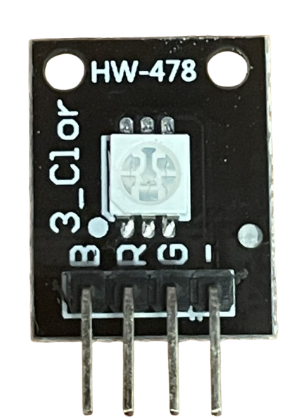

# RGB LED


## RGB LED Introduction

To better indicate the MCU status, an external RGB LED is added to the Node, which is handy for MCU status indication. The RGB LED is connected to the GPIO pins of the MCU, and the color of the LED can be controlled by the MCU.

## RGB LED Work Principle

The RGB LED is a combination of three LEDs, each of which can emit red, green, or blue light. By adjusting the brightness of each LED, the RGB LED can emit various colors. The RGB LED is connected to the GPIO pins of the MCU, and the color of the LED can be controlled by the MCU.

## RGB LED Hardware and Connection




| RGB LED PIN | MCU PIN |
|----------|---------|
| GND      | GND (or external GND)    |
| R      | PH13     |
| G     | PH14     |
| B     | PH15     |

## Source Code

### led_rgb.h

```c
/**
 * @file led_rgb.h
 * @author SHUAIWEN CUI (SHUAIWEN001 AT e DOT ntu DOT edu DOT sg)
 * @brief This file is for RGB LED control function declaration.
 * @version 1.0
 * @date 2024-09-22
 *
 * @copyright Copyright (c) 2024
 *
 */
#ifndef _LED_RGB_H_
#define _LED_RGB_H_

#include "stm32h7xx_hal.h" // HAL library file declaration, replace it with the corresponding file according to the actual situation
#include "main.h" // IO definition and initialization function are in the main.c file, must be referenced

void LED_RGB(int LED_R, int LED_G, int LED_B);
void LED_RGB_Toggle(void); 

#endif /* _LED_RGB_H_ */

```

### led_rgb.c

```c
/**
 * @file led_rgb.c
 * @author SHUAIWEN CUI (SHUAIWEN001 AT e DOT ntu DOT edu DOT sg)
 * @brief This file is for RGB LED control function declaration.
 * @version 1.0
 * @date 2024-09-22
 *
 * @copyright Copyright (c) 2024
 *
 */

#include "led_rgb.h"

void LED_RGB(int LED_R, int LED_G, int LED_B) // LED RGB independent control function (0 is off, other values are on)
{
    if (LED_R)
    {
        HAL_GPIO_WritePin(LED_R_GPIO_Port, LED_R_Pin, GPIO_PIN_SET);
    }
    else
    {
        HAL_GPIO_WritePin(LED_R_GPIO_Port, LED_R_Pin, GPIO_PIN_RESET);
    }

    if (LED_G)
    {
        HAL_GPIO_WritePin(LED_G_GPIO_Port, LED_G_Pin, GPIO_PIN_SET);
    }
    else
    {
        HAL_GPIO_WritePin(LED_G_GPIO_Port, LED_G_Pin, GPIO_PIN_RESET);
    }

    if (LED_B)
    {
        HAL_GPIO_WritePin(LED_B_GPIO_Port, LED_B_Pin, GPIO_PIN_SET);
    }
    else
    {
        HAL_GPIO_WritePin(LED_B_GPIO_Port, LED_B_Pin, GPIO_PIN_RESET);
    }
}

void LED_RGB_Toggle(void)
{
    int state_R = HAL_GPIO_ReadPin(LED_R_GPIO_Port, LED_R_Pin);
    HAL_GPIO_WritePin(LED_R_GPIO_Port, LED_R_Pin, 1 - state_R);

    int state_G = HAL_GPIO_ReadPin(LED_G_GPIO_Port, LED_G_Pin);
    HAL_GPIO_WritePin(LED_G_GPIO_Port, LED_G_Pin, 1 - state_G);

    int state_B = HAL_GPIO_ReadPin(LED_B_GPIO_Port, LED_B_Pin);
    HAL_GPIO_WritePin(LED_B_GPIO_Port, LED_B_Pin, 1 - state_B);
}
```