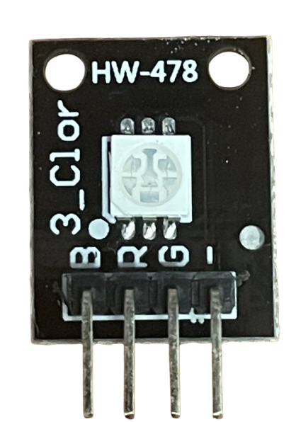
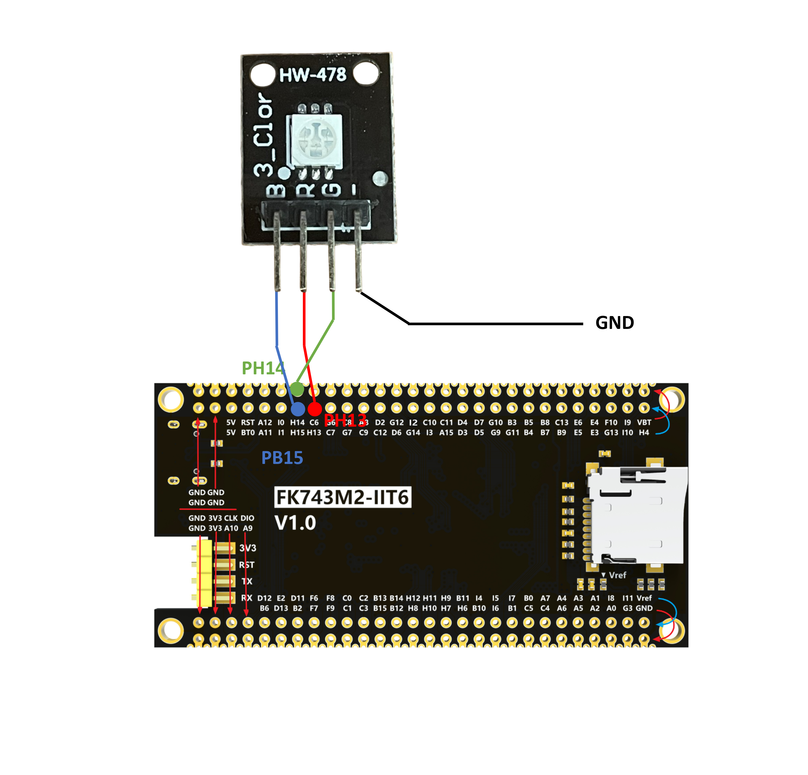

# RGB LED


## RGB LED 简介

为了更好地指示 MCU 状态，Node 上添加了一个外部 RGB LED，这对于 MCU 状态指示非常方便。RGB LED 连接到 MCU 的 GPIO 引脚，LED 的颜色可以由 MCU 控制。

## RGB LED 工作原理

RGB LED 是三个 LED 的组合，每个 LED 都可以发出红、绿或蓝光。通过调整每个 LED 的亮度，RGB LED 可以发出各种颜色。RGB LED 连接到 MCU 的 GPIO 引脚，LED 的颜色可以由 MCU 控制。

## RGB LED 硬件和连接





| RGB LED PIN | MCU PIN |
|----------|---------|
| GND      | GND (or external GND)    |
| R      | PH13     |
| G     | PH14     |
| B     | PH15     |

## 源代码

### led_rgb.h

```c
/**
 * @file led_rgb.h
 * @author SHUAIWEN CUI (SHUAIWEN001 AT e DOT ntu DOT edu DOT sg)
 * @brief This file is for RGB LED control function declaration.
 * @version 1.0
 * @date 2024-09-22
 *
 * @copyright Copyright (c) 2024
 *
 */
#ifndef _LED_RGB_H_
#define _LED_RGB_H_

#include "stm32h7xx_hal.h" // HAL library file declaration, replace it with the corresponding file according to the actual situation
#include "main.h" // IO definition and initialization function are in the main.c file, must be referenced

void LED_RGB(int LED_R, int LED_G, int LED_B);
void LED_RGB_Toggle(void); 

#endif /* _LED_RGB_H_ */

```

### led_rgb.c

```c
/**
 * @file led_rgb.c
 * @author SHUAIWEN CUI (SHUAIWEN001 AT e DOT ntu DOT edu DOT sg)
 * @brief This file is for RGB LED control function declaration.
 * @version 1.0
 * @date 2024-09-22
 *
 * @copyright Copyright (c) 2024
 *
 */

#include "led_rgb.h"

void LED_RGB(int LED_R, int LED_G, int LED_B) // LED RGB independent control function (0 is off, other values are on)
{
    if (LED_R)
    {
        HAL_GPIO_WritePin(LED_R_GPIO_Port, LED_R_Pin, GPIO_PIN_SET);
    }
    else
    {
        HAL_GPIO_WritePin(LED_R_GPIO_Port, LED_R_Pin, GPIO_PIN_RESET);
    }

    if (LED_G)
    {
        HAL_GPIO_WritePin(LED_G_GPIO_Port, LED_G_Pin, GPIO_PIN_SET);
    }
    else
    {
        HAL_GPIO_WritePin(LED_G_GPIO_Port, LED_G_Pin, GPIO_PIN_RESET);
    }

    if (LED_B)
    {
        HAL_GPIO_WritePin(LED_B_GPIO_Port, LED_B_Pin, GPIO_PIN_SET);
    }
    else
    {
        HAL_GPIO_WritePin(LED_B_GPIO_Port, LED_B_Pin, GPIO_PIN_RESET);
    }
}

void LED_RGB_Toggle(void)
{
    int state_R = HAL_GPIO_ReadPin(LED_R_GPIO_Port, LED_R_Pin);
    HAL_GPIO_WritePin(LED_R_GPIO_Port, LED_R_Pin, 1 - state_R);

    int state_G = HAL_GPIO_ReadPin(LED_G_GPIO_Port, LED_G_Pin);
    HAL_GPIO_WritePin(LED_G_GPIO_Port, LED_G_Pin, 1 - state_G);

    int state_B = HAL_GPIO_ReadPin(LED_B_GPIO_Port, LED_B_Pin);
    HAL_GPIO_WritePin(LED_B_GPIO_Port, LED_B_Pin, 1 - state_B);
}
```