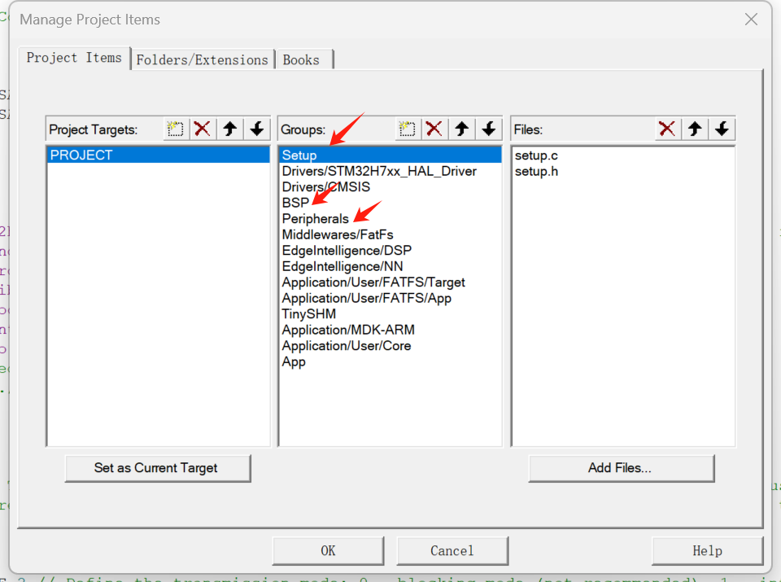

# BOARD SUPPORT PACKAGE (BSP)

## INTRODUCTION OF THE BSP
To facilitate the development and transplantation of the main control board, I have prepared a BSP consisting a series of useful drivers and libraries. The STM32 related BSP is based on the STM32Cube HAL library and is compatible with STM32H7 series microcontrollers, if you want you can modify it to fit other series. The BSP includes the following modules:

- bsp_led: The driver for the LED.
- bsp_usart: The driver for the USART, mainly for serial communication.
- bsp_sdram: The low-level driver for the SDRAM.
- bsp_memory: The memory management module.
- bsp_sdcard: The driver for the SD card.
- bsp_file: The file system module.
- ...

!!! tip
    The tutorial is written in a section-by-section manner, but in practice, the users can set up all required configuration in STM32CUBEMX in one go and then move forward to Keil or VSCode programming. Users can transplant the BSP from the library (link attached below) and incorporate it into their projects accordingly.

<div class="grid cards" markdown>

-   :simple-github:{ .lg .middle } __MCU_BSP__

    ---

    MCU BSP BASED ON STM32


    [:octicons-arrow-right-24: <a href="https://github.com/Shuaiwen-Cui/MCU_BSP.git" target="_blank"> Github Repo </a>](#)

</div>

## SETUP YOUR KEIL FOR BETTER EXPERIENCE

Open 'Options for Target' and conduct the following settings:

### USE AC6 COMPILER
{: width="800px" }

Since this is a new project, every thing is started with the AC6 compiler. We can use AC6 for compiling and debugging, which is much faster than the AC5 compiler.

### RESET AND RUN
{: width="800px" }

Select the 'Debug' tab, and at the right upper corner, select 'Settings'. In the 'Flash and Download' tab, select 'Reset and Run' to automatically reset and run the program after downloading the program to the board. This is very handy for programming and debugging.

## How to Integrate BSP into Your Project

### Step 1: Download BSP

Clone the BSP git repository to your local workspace.

```bash
git clone https://github.com/Shuaiwen-Cui/MCU_BSP.git
```

### Step 2: Move BSP into Your Project

Select only the 'STM32-HAL-CUBEMX' folder and move it to your project directory.

### Step 3: Include BSP in Your Project
{: width="800px" }

Open Keil, select 'Options for Target' -> 'C/C++' -> 'Include Paths', and add the respective paths of the BSP modules to your project include paths.

### Step 4: Add BSP Modules to Your Project
{: width="800px" }

Open 'Manage Project Items', and add the respective modules to your project.

!!! Tip
    When adding files, change the file type to 'All Types' so that both '*.h' and '*.c' files are merged into the project for convenient use.

### Step 5: Include Header Files and Call the Node_Init() Function to Initialize Nodes

In your main function, include the 'setup.h' header file, and call 'Node_Init()' to initialize nodes. The corresponding hardware is initialized during this process.

!!! Tip
    When modifying code, make changes between 'USER CODE BEGIN' and 'USER CODE END' to avoid losing your modifications when regenerating code.

## Configuration with the SETUP Module

!!! Note
    As previously mentioned, SETUP is used for configuration and initialization. For each driver in the BSP, there is a SETUP module for management. For detailed management processes, refer to the SETUP section.

## Recommended BSP Module Configuration
There is a part of the configuration related to BSP within SETUP. You can follow these recommendations for configuration:

| Module Name | Configuration |
| --- | --- |
| MODULE_ENABLE_LED | ✅ Enable |
| MODULE_ENABLE_KEY | ❌ Disable |
| MODULE_ENABLE_USART1 | ✅ Enable |
| MODULE_ENABLE_SDRAM | ✅ Enable |
| MODULE_ENABLE_MEMORY | ✅ Enable |
| MODULE_ENABLE_SDCARD | ❌ Disable |
| MODULE_ENABLE_FILE | ✅ Enable |


