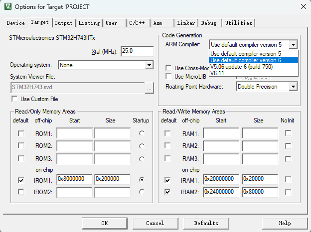
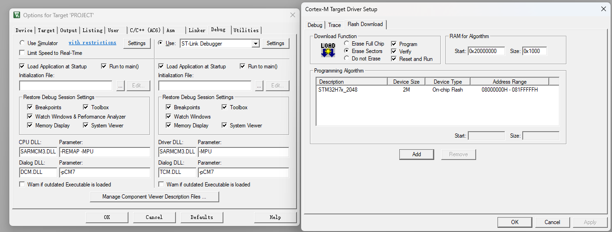

# BOARD SUPPORT PACKAGE (BSP)

## INTRODUCTION OF THE BSP
To facilitate the development and transplantation of the main control board, I have prepared a BSP consisting a series of useful drivers and libraries. The BSP is based on the STM32Cube HAL library and is compatible with STM32H7 series microcontrollers, if you want you can modify it to fit other series. The BSP includes the following modules:

- bsp_init: The controlling module for all BSP modules.
- iled: The driver for the LED.
- iusart: The driver for the USART, mainly for serial communication.
- isdram: The low-level driver for the SDRAM.
- imemory: The memory management module.
- isdcard: The driver for the SD card.
- ifile: The file system module.
- ...

!!! tip
    The tutorial is written in a section-by-section manner, but in practice, the users can set up all required configuration in STM32CUBEMX in one go and then move forward to Keil or VSCode programming. Users can transplant the BSP from the library (link attached below) and incorporate it into their projects accordingly.

<div class="grid cards" markdown>

-   :simple-github:{ .lg .middle } __MCU_BSP__

    ---

    MCU BSP BASED ON STM32


    [:octicons-arrow-right-24: <a href="https://github.com/Shuaiwen-Cui/MCU_BSP.git" target="_blank"> Github Repo </a>](#)

</div>


## SETUP YOUR KEIL FOR BETTER EXPERIENCE

Open 'Options for Target' and conduct the following settings:

### USE AC6 COMPILER
{: width="800px" }

Since this is a new project, every thing is started with the AC6 compiler. We can use AC6 for compiling and debugging, which is much faster than the AC5 compiler.

### RESET AND RUN
{: width="800px" }

Select the 'Debug' tab, and at the right upper corner, select 'Settings'. In the 'Flash and Download' tab, select 'Reset and Run' to automatically reset and run the program after downloading the program to the board. This is very handy for programming and debugging.

## HOW TO INTEGRATE THE BSP INTO YOUR PROJECT

### SETP1: DOWNLOAD THE BSP

Clone the BSP git repository to your local workspace.

```bash
git clone https://github.com/Shuaiwen-Cui/MCU_BSP.git
```

### STEP2: MOVE THE BSP TO YOUR PROJECT
Only pick the ''STM32-HAL-CUBEMX' folder and move it to your project directory.

### STEP3: INCLUDE THE BSP IN YOUR PROJECT
{: width="800px" }

Open Keil, select 'Options for Target' -> 'C/C++' -> 'Include Paths', add each respective path of the BSP modules into your project include paths.


### STEP4: ADD THE BSP MODULES TO YOUR PROJECT
{: width="800px" }

Open 'Manage Project Items', add respective modules into your project. 

!!! tip
    When you add them files, change the file type to 'All Types' to incorporate both the '*.h' and '*.c' files into the project for convenience.

### SETP5: INCLUDE THE HEADER FILES AND CALL THE BSP_INIT FUNCTION

In the main function, include the 'bsp_init.h' file and call the 'BSP_Init()' function in the main function to initialize all the BSP modules. 

!!! tip
    When modifying the code, do remember to place your codes between the 'USER CODE BEGIN' and 'USER CODE END' tags to avoid being overwritten by the STM32CubeMX.


## INTRODUCTION FOR BSP_INIT

!!! note
    To efficiently manage the BSP modules, I have created a controlling module called 'bsp_init'. The 'bsp_init' module is responsible for initializing all the BSP modules and setting up the necessary configurations. The 'bsp_init' module is the first user module to be called in the main function. 

Let's take a look at the 'bsp_init' module:

### **bsp_init.h**

```c
/**
 * @file bsp_init.h
 * @author SHUAIWEN CUI (SHUAIWEN001 AT e DOT ntu DOT edu DOT sg)
 * @brief This file contains the headers of the BSP initialization functions.
 * @version 1.0
 * @date 2024-07-12
 *
 * @copyright Copyright (c) 2024
 *
 */
#ifndef BSP_INIT_H
#define BSP_INIT_H

#define BSP_INIT_SUCCESS 0
#define BSP_INIT_FAIL 1

#define BSP_INIT_TEST // test required for the BSP initialization, comment this out to disable the test

/**
 * @name Modules To Be Enabled
 * @brief This section is to determine the modules to be included in the project
 * ! This is where you configure the modules to be included in the project
 * @param MODULE_ENABLE_LED //! Enable LED module
 * @param MODULE_ENABLE_KEY //! Enable Key module (No use in this project, do not enable it)
 * @param MODULE_ENABLE_USART1 //! Enable USART1 module for serial communication
 * @param MODULE_ENABLE_SDRAM //! Enable SDRAM module to use external RAM for computation
 * @param MODULE_ENABLE_MEMORY //! Enable Memory module - for memory management on SDRAM
 * @param MODULE_ENABLE_SDCARD //! Enable SD Card module test - for SD Card basic io. !!! This module can not be used together with MODULE_ENABLE_FILE
 * @param MODULE_ENABLE_FILE //! Enable File module test - for file operations on SD Card !!! This module can not be used together with MODULE_ENABLE_SDCARD
 */

#define MODULE_ENABLE_LED // Enable LED module
// #define MODULE_ENABLE_KEY  // Enable Key module
#define MODULE_ENABLE_USART1 // Enable USART1 module
#define MODULE_ENABLE_SDRAM  // Enable SDRAM module
#define MODULE_ENABLE_MEMORY // Enable Memory module - for memory management on SDRAM
// #define MODULE_ENABLE_SDCARD // Enable SD Card module
#define MODULE_ENABLE_FILE   // Enable File module - for file operations on SD Card

/**
 * @name Include Files
 *
 */
#include <stdio.h>
#ifdef MODULE_ENABLE_LED

#include "iled.h"

#endif

#ifdef MODULE_ENABLE_KEY

#include "ikey.h"

#endif

#ifdef MODULE_ENABLE_USART1 //! Note - Do rember to check the MicroLib option in the project settings

#include <stdio.h>
#include "iusart.h"

#endif

#ifdef MODULE_ENABLE_SDRAM

#include "isdram.h"

#endif

#ifdef MODULE_ENABLE_MEMORY

#include "imemory.h"

#endif

#ifdef MODULE_ENABLE_SDCARD

#include "isdcard.h"

#endif

#ifdef MODULE_ENABLE_FILE

#include "ifile.h"

#endif

/**
 * @name Function Prototypes
 *
 */

// The BSP initialization function - including all the initialization functions
int BSP_Init();

#ifdef MODULE_ENABLE_USART1
// IO retargetting
int fputc(int ch, FILE *f);
int fgetc(FILE *f);
#endif

#endif /* BSP_INIT_H */
```
### **bsp_init.c**

```c
/**
 * @file bsp_init.c
 * @author SHUAIWEN CUI (SHUAIWEN001 AT e DOT ntu DOT edu DOT sg)
 * @brief
 * @version 1.0
 * @date 2024-07-12
 *
 * @copyright Copyright (c) 2024
 *
 */
#include "bsp_init.h"

/**
 * @name VARIABLES
 * 
 */
// The gap between the initialization of each module, in ms.
int Init_Gap = 500;

/**
 * @name BSP_Init
 * @brief board support package initialization
 * @param None
 * @retval 0
 *
 */
int BSP_Init(void)
{
    // Variables
    int i;
#ifdef MODULE_ENABLE_LED
    // BSP Initialization - LED - flash once to indicate OK
    LED(0); // for deployment, switch off the LED to save power
#ifdef BSP_INIT_TEST // for debugging, flash the LED to indicate status
    LED(1);
    HAL_Delay(200);
    LED(0);
    HAL_Delay(200);
    LED(1);
#endif
#endif

#ifdef MODULE_ENABLE_KEY
    // BSP Initialization - Key
    // nothing required
#endif

    HAL_Delay(2*Init_Gap); // to give the user enough time to connect to the serial terminal

#ifdef MODULE_ENABLE_USART1
#ifdef BSP_INIT_TEST
    // Initialization - Count Down
    for (i = 0; i < 5; i++)
    {
        printf("[INITIALIZATION] Count Down for Upcoming Testing: %d \n\r", 5 - i);
        HAL_Delay(1000);
    }
    printf("\n\r");
#endif
    // BSP Initialization - Serial Communication
    MCU_serial_init();
    printf("[INITIALIZATION] Serial Communication - SUCCESS\n\r\n\r");
    // MCU_printf("Serial Communication - SUCCESS\n\r"); // not working
#endif

    HAL_Delay(Init_Gap);

#ifdef MODULE_ENABLE_SDRAM
    // BSP Initialization - SDRAM
    printf("[INITIALIZATION] SDRAM Initialization - START\n\r");
    SDRAM_InitSequence();
    printf("[INITIALIZATION] SDRAM Initialization - FINISHED\r\n\n\r");
#ifdef BSP_INIT_TEST
    if (SDRAM_Test() == 0)
    {
        printf("[INITIALIZATION] SDRAM TEST - SUCCESS\r\n\n\r");
    }
    else
    {
        printf("[INITIALIZATION] SDRAM TEST - FAIL\r\n\n\r");
    }
#endif
#endif

    HAL_Delay(Init_Gap);

#ifdef MODULE_ENABLE_MEMORY
    // BSP Initialization - Memory Management
    printf("[INITIALIZATION] Memory Management Initialization - START\n\r");
    memory_init();
    printf("[INITIALIZATION] Memory Management Initialization - FINISHED\n\r\n\r");
#ifdef BSP_INIT_TEST
    printf("[INITIALIZATION] Memory Management Test - START\n\r");
    if (memory_management_test() == 0)
    {
        printf("[INITIALIZATION] Memory Management Test - SUCCESS\n\r\n\r");
    }
    else
    {
        printf("[INITIALIZATION] Memory Management Test - FAIL\n\r\n\r");
    }
#endif
#endif

    HAL_Delay(Init_Gap);

#ifdef MODULE_ENABLE_SDCARD

    // BSP Initialization - SD Card
    printf("[INITIALIZATION] SD Card Initialization - START.\n\r");
    SD_Init();
#ifdef BSP_INIT_TEST
    // SD Card Test
    printf("[INITIALIZATION] SD Card Test - START.\n\r");
    SD_Test();
    printf("[INITIALIZATION] SD Card Test - FINISHED.\n\r");
#endif
    printf("[INITIALIZATION] SD CARD Initialization - FINISHED.\n\r");
#endif

    HAL_Delay(Init_Gap);

#ifdef MODULE_ENABLE_FILE // the test is kept outside the test zone, as sd card hard conenction is not quite stable, and we need the test to ensure the connection is okay

    printf("[INITIALIZATION] SD Card File IO Initialization and Test - START.\n\r");
    printf("\n\r");

    // mount the file system
    printf("[INITIALIZATION] Mounting the file system.\n\r");
    Mount_FatFs();
    printf("\n\r");

    // get disk information
    printf("[INITIALIZATION] Getting disk information.\n\r");
    FatFs_GetDiskInfo();
    printf("\n\r");

    // scan the directory
    printf("[INITIALIZATION] Scanning the directory.\n\r");
    FatFs_ScanDir("0:/");
    printf("\n\r");

    // write a text file
    printf("[INITIALIZATION] Writing a text file.\n\r");
    FatFs_WriteTXTFile("test.txt", 2016, 11, 15);
    printf("\n\r");

    // read a text file
    printf("[INITIALIZATION] Reading a text file.\n\r");
    FatFs_ReadTXTFile("test.txt");
    printf("\n\r");

    // get file information
    printf("[INITIALIZATION] Getting file information.\n\r");
    FatFs_GetFileInfo("test.txt");
    printf("\n\r");

    // delete a file
    printf("[INITIALIZATION] Deleting a file.\n\r");
    FatFs_DeleteFile("test.txt");
    printf("\n\r");

#ifdef BSP_INIT_TEST

#endif
    printf("[INITIALIZATION] SD Card File IO Initialization and Test - FINISHED.\n\r\n\r");
    HAL_Delay(Init_Gap);

#endif


#ifdef MODULE_ENABLE_USART1
    printf("[INITIALIZATION] BSP Initialization - FINISHED\n\r");
    printf("\n\r");
#endif

    return BSP_INIT_SUCCESS;
}

#ifdef MODULE_ENABLE_USART1

// MicroLib needed for retargetting
// retarget fputc for printf
int fputc(int ch, FILE *f)
{
    uint8_t temp = (uint8_t)ch;
    HAL_UART_Transmit(&huart1, &temp, 1, HAL_MAX_DELAY);
    return ch;
}

// retarget fgetc for scanf
int fgetc(FILE *f)
{
    while (__HAL_UART_GET_FLAG(&huart1, UART_FLAG_RXNE) == RESET)
        ;                                      // Wait until the data is received
    return (int)(huart1.Instance->RDR & 0xFF); // Read the received data
}
#endif
```

### EXPLANATION OF THE BSP_INIT MODULE

As can be seen, almost all bsp modules are configured in this module.  You can determine which module to activate or deactivate by commenting out the respective module:

- MODULE_ENABLE_LED: Enable the LED module.
- MODULE_ENABLE_KEY: Enable the Key module. Note that this module is not used in this project as there is no programmable key on this board. Do not enable it.
- MODULE_ENABLE_USART1: Enable the USART1 module for serial communication. If you enable this, the retargetting functions for printf and scanf will be activated automatically as defined in the module.
- MODULE_ENABLE_SDRAM: Enable the SDRAM module to use external RAM for computation.
- MODULE_ENABLE_MEMORY: Enable the Memory module for memory management on SDRAM.
- MODULE_ENABLE_SDCARD: Enable the SD Card module test for SD Card basic IO. Note that this module cannot be used together with MODULE_ENABLE_FILE. 
- MODULE_ENABLE_FILE: Enable the File module test for file operations on the SD Card. Note that this module cannot be used together with MODULE_ENABLE_SDCARD.

### RECOMMENDED CONFIGURATION FOR BSP_INIT MODULE
The following table is the recommended configuration for the BSP_INIT module:

| Module Name | Configuration |
| --- | --- |
| MODULE_ENABLE_LED | ✅Enable |
| MODULE_ENABLE_KEY | ❌Disable |
| MODULE_ENABLE_USART1 | ✅Enable |
| MODULE_ENABLE_SDRAM | ✅Enable |
| MODULE_ENABLE_MEMORY | ✅Enable |
| MODULE_ENABLE_SDCARD | ❌Disable |
| MODULE_ENABLE_FILE | ✅Enable |

### MODULE TEST
To facilitate the assessment of the configured modules, there is a MICRO 'BSP_INIT_TEST' defined in the .h file. This test is used to test the initialization of each module. If you want to disable the test to save time, you can comment out the 'BSP_INIT_TEST' in the .h file.
