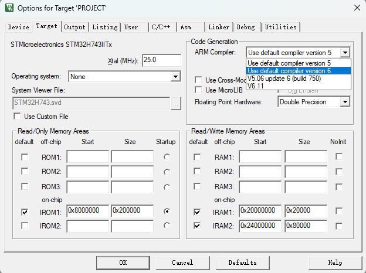
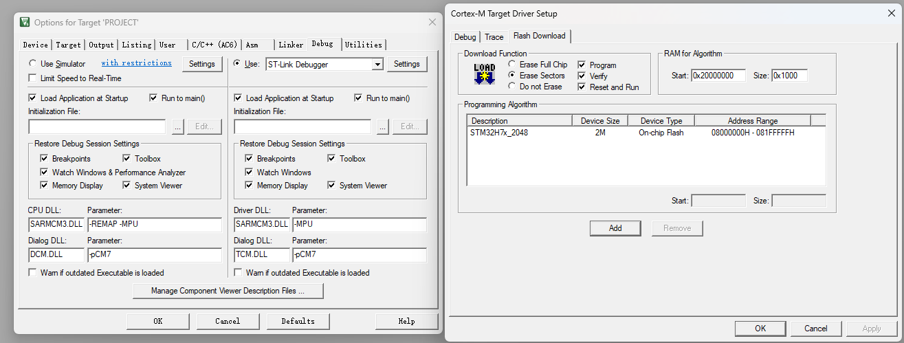
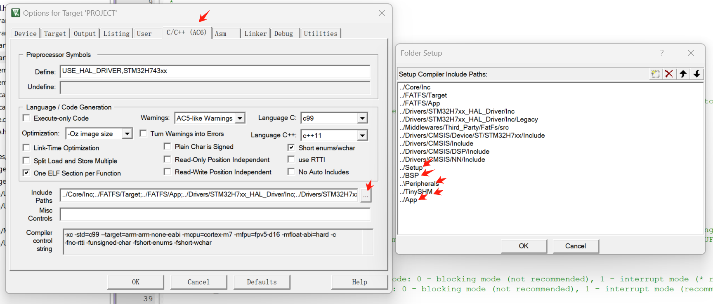
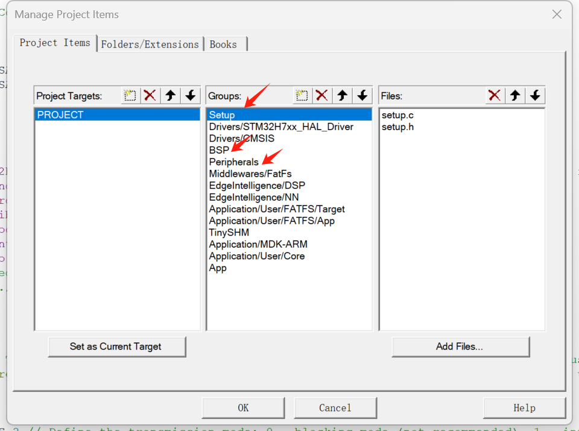

# 板级支持包（BSP）

## BSP 简介
为了方便主控板的开发和移植，我准备了一个 BSP，其中包含一系列有用的驱动程序和库。其中STM32相关的 BSP 基于 STM32Cube HAL 库，兼容 STM32H7 系列微控制器，如果你愿意，你可以修改它以适应其他系列。BSP 包括以下模块：

- bsp_led：LED 驱动程序。
- bsp_key：按键驱动程序。
- bsp_usart：USART 驱动程序，主要用于串行通信。
- bsp_sdram：SDRAM 低级驱动程序。
- bsp_memory：内存管理模块。
- bsp_sdcard：SD 卡驱动程序。
- bsp_file：文件系统模块。
- ...

!!! 提示
    教程是按照逐节方式编写的，但在实践中，用户可以在 STM32CUBEMX 中一次性设置所有所需的配置，然后继续进行 Keil 或 VSCode 编程。用户可以从库中移植 BSP（下方附有链接），并相应地将其合并到其项目中。

<div class="grid cards" markdown>

-   :simple-github:{ .lg .middle } __MCU_BSP__

    ---

    基于 STM32 的 MCU BSP


    [:octicons-arrow-right-24: <a href="https://github.com/Shuaiwen-Cui/MCU_BSP.git" target="_blank"> Github Repo </a>](#)

</div>

## 设置 Keil 以获得更好的体验

打开 'Options for Target' 并进行以下设置：

### 使用 AC6 编译器
{: width="800px" }

由于这是一个新项目，一切都是从 AC6 编译器开始的。我们可以使用 AC6 进行编译和调试，这比 AC5 编译器快得多。

### 重置并运行
{: width="800px" }

选择 'Debug' 选项卡，在右上角选择 'Settings'。在 'Flash and Download' 选项卡中，选择 'Reset and Run'，以在将程序下载到板上后自动重置并运行程序。这对编程和调试非常方便。

## 如何将 BSP 集成到您的项目中

### 步骤 1：下载 BSP

将 BSP git 仓库克隆到本地工作空间。

```bash
git clone https://github.com/Shuaiwen-Cui/MCU_BSP.git
```

### 步骤 2：将 BSP 移动到您的项目中

只选择 ''STM32-HAL-CUBEMX' 文件夹并将其移动到您的项目目录中。

### 步骤 3：将 BSP 包含到您的项目中
{: width="800px" }

打开 Keil，选择 'Options for Target' -> 'C/C++' -> 'Include Paths'，将 BSP 模块的各自路径添加到您的项目包含路径中。

### 步骤 4：将 BSP 模块添加到您的项目中
{: width="800px" }

打开 'Manage Project Items'，将各自模块添加到您的项目中。

!!! 提示
    当您添加文件时，将文件类型更改为 'All Types'，以便将 '*.h' 和 '*.c' 文件一起合并到项目中，以方便使用。

### 步骤 5：包含头文件并调用 Node_Init() 函数以初始化节点

在您的主函数中包含 'setup.h' 头文件，并在主函数中调用 'Node_Init()' 初始化节点，BSP相对应的硬件在该过程中实现初始化。

!!! tip
    当修改代码的时候，请在'USER CODE BEGIN'和'USER CODE END'之间进行修改，以避免在重新生成代码时丢失您的修改。

## SETUP 模块进行配置

!!! note
    之前提到过SETUP用来配置和初始化，对于BSP中的各驱动，也是有SETUP模块进行管理，详细管理过程请参考SETUP部分。

## BSP 模块配置推荐
在SETUP 中有关于BSP的配置部分，可以参考以下推荐进行配置

| 模块名称 | 配置 |
| --- | --- |
| MODULE_ENABLE_LED | ✅启用 |
| MODULE_ENABLE_KEY | ❌禁用 |
| MODULE_ENABLE_USART1 | ✅启用 |
| MODULE_ENABLE_SDRAM | ✅启用 |
| MODULE_ENABLE_MEMORY | ✅启用 |
| MODULE_ENABLE_SDCARD | ❌禁用 |
| MODULE_ENABLE_FILE | ✅启用 |
