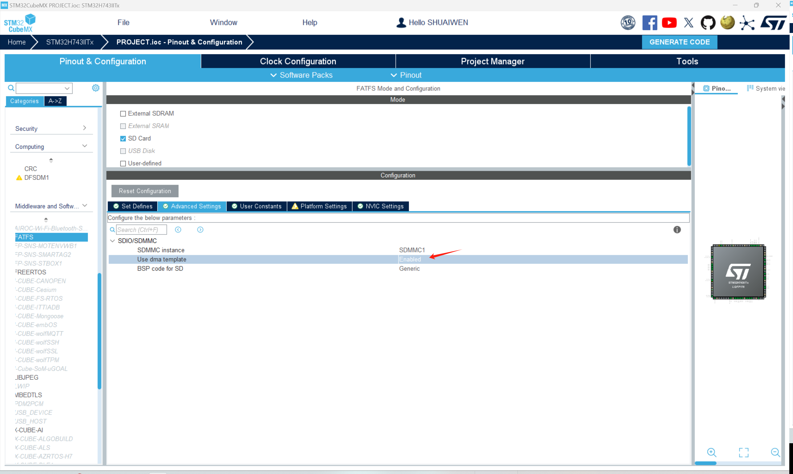

# FILE SYSTEM

!!! info
    File system is a method of storing and organizing computer files and their data. Here, we will use the FatFs library to interface with the SD card.

## FILE SYSTEM AS A MIDDLEWARE
In STM32CUBEMX, FATFS is already incorporated into the software as a middleware. To enable FATFS, go to the 'Middleware' tab and enable the 'FATFS' middleware.

## FILE SYSTEM CONFIGURATION

As shown, select FATFS for SD card, and enable the long file name support. 

Then, under the Advanced Settings, select the DMA template for the SD card.

## GENERATE AND UPDATE CODE
Finally, let's generate the code to save the current progress and to make it ready for following programming steps. Click the 'Generate Code' button at the top right corner of the screen.