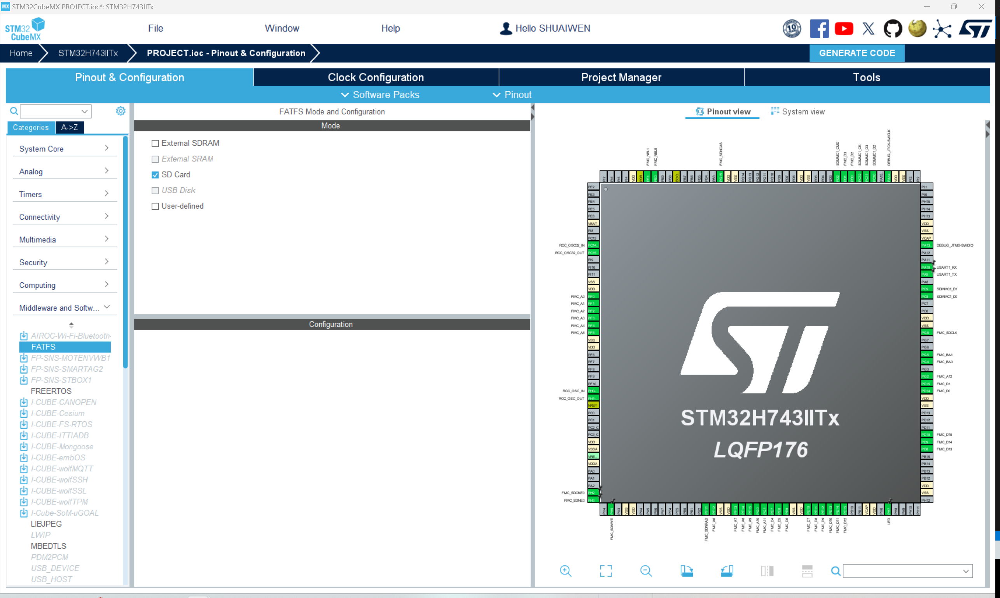

# FILE SYSTEM

!!! info
    File system is a method of storing and organizing computer files and their data. Here, we will use the FatFs library to interface with the SD card.

## FILE SYSTEM AS A MIDDLEWARE
In STM32CUBEMX, FATFS is already incorporated into the software as a middleware. To enable FATFS, go to the 'Middleware' tab and enable the 'FATFS' middleware and nothing more to configure in the CUBE-MX.、

