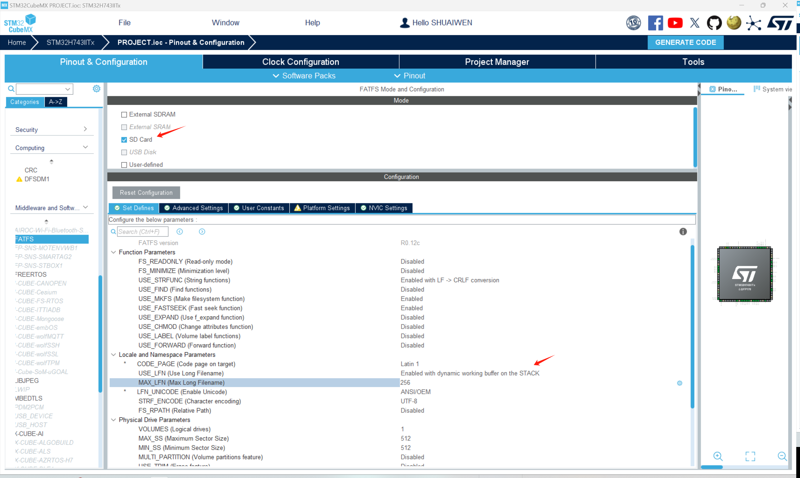

# 文件系统 (FILE SYSTEM)

!!! info
    文件系统是一种存储和组织计算机文件及其数据的方法。在这里，我们将使用 FatFs 库与 SD 卡进行接口。

## 文件系统作为中间件
在 STM32CUBEMX中，FATFS已经作为中间件集成到软件中。要启用FATFS，请转到“中间件”选项卡，并启用“FATFS”中间件.



如图所示，选择SD卡的FATFS，并启用长文件名支持。


然后，在高级设置下，为SD卡选择DMA模板。

## 生成与更新代码
接下来，我们生成代码以保存当前进度，并使其准备好进行后续的编程步骤。点击屏幕右上角的“生成代码”按钮。

## 在Keil中编程 

### 修改SD_DISKIO.C中的配置


如上图所示，在sd_diskio.c中修改代码以配置SD卡和FATFS。

### 整合模块代码 - IFILE

我们已经介绍了如何将BSP代码移植并整合到项目中，这适用于每个相应的模块。对于移植：

1. 从BSP项目中复制模块代码到用户项目中。
2. 将模块代码添加到用户项目的包含路径中。
3. 将模块代码添加到项目项中。
4. 在用户项目中包含模块代码的头文件。
5. 在用户项目中调用模块函数。

!!! warning
    因为我们这里使用了FATFS，而FATFS内置了SDCARD的驱动方式，会跟我们自己引入的驱动isdcard冲突，所以在bsp_init中，如果我们要使用文件系统FATFS，那么我们就不能引入isdcard驱动，否则会导致冲突。

### 代码审查 - FILE-SYS

#### **ifile.h**

```c
/**
 * @file ifile.h
 * @author SHUAIWEN CUI (shuaiwencui AT gmail DOT com)
 * @brief This is the header file for the ifile.c file
 * @version 1.0
 * @date 2024-07-17
 * @ref https://blog.csdn.net/Mculover666/article/details/102688285；https://blog.csdn.net/qq_36561846/article/details/133808890
 * @copyright Copyright (c) 2024
 *
 */
#ifndef __IFILE_H
#define __IFILE_H

/**
 * @name INCLUDES
 */

#include "stm32h7xx.h"
#include "main.h"
#include "ff.h"         // FATFS main header file
#include "diskio.h"     // Disk I/O header file
#include "fatfs.h"      // FATFS configuration header file (if using STM32CubeMX)
#include "ff_gen_drv.h" // Generic driver header file
#include "ffconf.h"
#include "stdio.h"

/* Define custom storage device */
/* Number of bytes per sector for user storage device */
#define User_Sector 512
/* FatFs object for user storage device */
#define User_FatFs SDFatFS
/* Volume path for user storage device */
#define User_SDPath SDPath
 
/*functions*/
void Mount_FatFs(void);
void FatFs_GetDiskInfo(void);
void FatFs_ScanDir(const TCHAR* PathName);
void FatFs_ReadTXTFile(TCHAR *filename);
void FatFs_WriteTXTFile(TCHAR *filename,uint16_t year, uint8_t month, uint8_t day);
void FatFs_GetFileInfo(TCHAR *filename);
void FatFs_DeleteFile(TCHAR *filename);
void FatFs_PrintfFileDate(WORD date, WORD time);

uint8_t BSP_SD_ReadBlocks_DMA(uint32_t *pData, uint32_t ReadAddr, uint32_t NumOfBlocks);
uint8_t BSP_SD_WriteBlocks_DMA(uint32_t *pData, uint32_t WriteAddr, uint32_t NumOfBlocks);
#endif /* __IFILE_H */

```

#### **ifile.c**

```c
/**
 * @file ifile.c
 * @author SHUAIWEN CUI (shuaiwencui AT gmail DOT com)
 * @brief This is the source file for the ifile.c file
 * @version 1.0
 * @date 2024-07-17
 * @ref https://blog.csdn.net/Mculover666/article/details/102688285；https://blog.csdn.net/qq_36561846/article/details/133808890
 * @copyright Copyright (c) 2024
 *
 */

#include "ifile.h"
#include "iusart.h"
#include "sdmmc.h"

// Define a work buffer for formatting
BYTE workBuffer[4 * User_Sector];

/**
 * @name Mount_FatFs
 * @brief Mount FatFs file system
 * @param None
 * @retval None
 * @note Working
 */
/* Mount FatFs file system */
void Mount_FatFs(void)
{
    // Mount file system
    FRESULT retUSER = f_mount(&User_FatFs, User_SDPath, 1);
    // Error occurred
    if (retUSER != FR_OK)
    {
        // No file system, need to format
        if (retUSER == FR_NO_FILESYSTEM)
        {
            printf("\r\nNo file system, start formatting\r\n");
            // Create file system
            retUSER = f_mkfs(User_SDPath, FM_FAT32, 0, workBuffer, 4 * User_Sector);
            // Formatting failed
            if (retUSER != FR_OK)
            {
                printf("Formatting failed, error code = %d\r\n", retUSER);
            }
            // Formatting succeeded
            else
            {
                printf("Formatting succeeded, remounting\r\n");
                // Remount after creating file system
                retUSER = f_mount(&User_FatFs, User_SDPath, 1);
                // Mounting failed
                if (retUSER != FR_OK)
                {
                    printf("Error occurred, error code = %d\r\n", retUSER);
                }
                // Mounting succeeded
                else
                {
                    printf("*** File system mounted successfully ***\r\n");
                }
            }
        }
        // Other error occurred
        else
        {
            printf("Other error occurred, error code = %d\r\n", retUSER);
        }
    }
    // File system already exists, mounted successfully
    else
    {
        printf("File system mounted successfully\r\n");
    }
}

/**
 * @name FatFs_GetDiskInfo
 * @brief Get disk information and display on LCD
 * @param None
 * @retval None
 * @note Working
 */
/* Get disk information and display on LCD */
void FatFs_GetDiskInfo(void)
{
    FATFS *fs;

    // Define variable for remaining clusters
    DWORD fre_clust;

    // Get remaining clusters
    FRESULT res = f_getfree("0:", &fre_clust, &fs);

    // Getting failed
    if (res != FR_OK)
    {
        printf("f_getfree() error\r\n");
        return;
    }
    printf("\r\n*** FAT disk info ***\r\n");

    // Total number of sectors
    DWORD tot_sect = (fs->n_fatent - 2) * fs->csize;

    // Remaining number of sectors = remaining clusters * sectors per cluster
    DWORD fre_sect = fre_clust * fs->csize;

    // For SD card and USB flash drive, _MIN_SS=512 bytes
#if _MAX_SS == _MIN_SS
    // SD card's _MIN_SS is fixed at 512, right shift 11 bits equals dividing by 2048
    // Remaining space size, unit: MB, for SD card and USB flash drive
    DWORD freespace = (fre_sect >> 11);
    // Total space size, unit: MB, for SD card and USB flash drive
    DWORD totalSpace = (tot_sect >> 11);
#else
    // Flash storage, small capacity
    // Remaining space size, unit: KB
    DWORD freespace = (fre_sect * fs->ssize) >> 10;
    // Total space size, unit: KB
    DWORD totalSpace = (tot_sect * fs->ssize) >> 10;
#endif

    // FAT type
    printf("FAT type = %d ", fs->fs_type);
    printf("[1=FAT12, 2=FAT16, 3=FAT32, 4=exFAT]\r\n");

    // Sector size in bytes
    printf("Sector size(bytes) = ");
    // SD card fixed 512 bytes
#if _MAX_SS == _MIN_SS
    printf("%d\r\n", _MIN_SS);
#else
    // Flash storage
    printf("%d\r\n", fs->ssize);
#endif

    printf("Cluster size(sectors) = %d\r\n", fs->csize);
    printf("Total cluster count = %ld\r\n", fs->n_fatent - 2);
    printf("Total sector count = %ld\r\n", tot_sect);

    // Total space
#if _MAX_SS == _MIN_SS
    printf("Total space = %ld(MB) = %ld(GB)\r\n", totalSpace, totalSpace >> 10);
#else
    printf("Total space = %ld(KB) = %ld(MB)\r\n", totalSpace, totalSpace >> 10);
#endif

    // Free cluster count
    printf("Free cluster count = %ld\r\n", fre_clust);
    // Free sector count
    printf("Free sector count = %ld\r\n", fre_sect);

    // Free space
#if _MAX_SS == _MIN_SS
    printf("Free space = %ld(MB) = %ld(GB)\r\n", freespace, freespace >> 10);
#else
    printf("Free space = %ld(KB) = %ld(MB)\r\n", freespace, freespace >> 10);
#endif

    printf("Get FAT disk info OK\r\n");
}

/* Create a text file */
void FatFs_WriteTXTFile(TCHAR *filename, uint16_t year, uint8_t month, uint8_t day)
{
    FIL file;
    printf("\r\n*** Creating TXT file: %s ***\r\n", filename);

    FRESULT res = f_open(&file, filename, FA_CREATE_ALWAYS | FA_WRITE);
    // File opened/created successfully
    if (res == FR_OK)
    {
        // String must have a newline character "\n"
        TCHAR str[] = "Line1: Hello, FatFs***\n";
        // Does not write the end character "\0"
        f_puts(str, &file);

        printf("Write file OK: %s\r\n", filename);
    }
    else
    {
        printf("Open file error, error code: %d\r\n", res);
    }
    // Close the file after use
    f_close(&file);
}

/* Read the content of a text file */
void FatFs_ReadTXTFile(TCHAR *filename)
{
    printf("\r\n*** Reading TXT file: %s ***\r\n", filename);

    FIL file;
    // Open file in read-only mode
    FRESULT res = f_open(&file, filename, FA_READ);
    // Opened successfully
    if (res == FR_OK)
    {
        // Read buffer
        TCHAR str[100];
        // Not reached the end of file
        while (!f_eof(&file))
        {
            // Read 1 string, automatically add end character "\0"
            f_gets(str, 100, &file);
            printf("%s", str);
        }
        printf("\r\n");
    }
    // File does not exist
    else if (res == FR_NO_FILE)
        printf("File does not exist\r\n");
    // Opening failed
    else
        printf("f_open() error, error code: %d\r\n", res);
    // Close the file
    f_close(&file);
}

/* Scan and display files and directories in the specified directory */
void FatFs_ScanDir(const TCHAR *PathName)
{
    DIR dir;     // Directory object
    FILINFO fno; // File information
    // Open directory
    FRESULT res = f_opendir(&dir, PathName);
    // Opening failed
    if (res != FR_OK)
    {
        // Close directory and exit function
        f_closedir(&dir);
        printf("\r\nf_opendir() error, error code: %d\r\n", res);
        return;
    }

    printf("\r\n*** All entries in dir: %s ***\r\n", PathName);
    // Read files in the directory sequentially
    while (1)
    {
        // Read one item in the directory
        res = f_readdir(&dir, &fno);
        // If file name is empty, no more items to read
        if (res != FR_OK || fno.fname[0] == 0)
            break;
        // If it is a directory
        if (fno.fattrib & AM_DIR)
        {
            printf("DIR: %s\r\n", fno.fname);
        }
        // If it is a file
        else
        {
            printf("FILE: %s\r\n", fno.fname);
        }
    }
    // Scanning finished, close directory
    printf("Scan dir OK\r\n");
    f_closedir(&dir);
}

/* Get information of a file */
void FatFs_GetFileInfo(TCHAR *filename)
{
    printf("\r\n*** File info of: %s ***\r\n", filename);

    FILINFO fno;
    // Check if file or subdirectory exists
    FRESULT fr = f_stat(filename, &fno);
    // If exists, read file information from fno
    if (fr == FR_OK)
    {
        printf("File size(bytes) = %ld\r\n", fno.fsize);
        printf("File attribute = 0x%x\r\n", fno.fattrib);
        printf("File Name = %s\r\n", fno.fname);
        // Output the timestamp of file creation/modification
        FatFs_PrintfFileDate(fno.fdate, fno.ftime);
    }
    // If file does not exist
    else if (fr == FR_NO_FILE)
        printf("File does not exist\r\n");
    // Other error occurred
    else
        printf("f_stat() error, error code: %d\r\n", fr);
}

/* Delete a file */
void FatFs_DeleteFile(TCHAR *filename)
{
    printf("\r\n*** Delete File: %s***\r\n", filename);
    FIL file;
    // Open file
    FRESULT res = f_open(&file, filename, FA_OPEN_EXISTING);
    if (res == FR_OK)
    {
        // Close file
        f_close(&file);
        printf("Open successfully!\r\n");
    }
    // Delete file
    res = f_unlink(filename);
    // Delete successfully
    if (res == FR_OK)
    {
        printf("The file was deleted successfully!\r\n");
    }
    // Delete failed
    else
    {
        printf("File deletion failed, error code: %d\r\n", res);
    }
}

/* Print file date */
void FatFs_PrintfFileDate(WORD date, WORD time)
{
    printf("File date = %d/%d/%d\r\n", ((date >> 9) & 0x7F) + 1980, (date >> 5) & 0xF, date & 0x1F);
    printf("File time = %d:%d:%d\r\n", (time >> 11) & 0x1F, (time >> 5) & 0x3F, time & 0x1F);
}


// to over write BSP_SD_ReadBlocks_DMA & BSP_SD_WriteBlocks_DMA in bsp_driver_sd.c
uint8_t BSP_SD_ReadBlocks_DMA(uint32_t *pData, uint32_t ReadAddr, uint32_t NumOfBlocks)
{
  uint8_t sd_state = MSD_OK;
	
  SCB_CleanDCache();

  /* Read block(s) in DMA transfer mode */
  if (HAL_SD_ReadBlocks_DMA(&hsd1, (uint8_t *)pData, ReadAddr, NumOfBlocks) != HAL_OK)
  {
    sd_state = MSD_ERROR;
  }

  return sd_state;
}

uint8_t BSP_SD_WriteBlocks_DMA(uint32_t *pData, uint32_t WriteAddr, uint32_t NumOfBlocks)
{
  uint8_t sd_state = MSD_OK;

  SCB_CleanDCache();
	
  /* Write block(s) in DMA transfer mode */
  if (HAL_SD_WriteBlocks_DMA(&hsd1, (uint8_t *)pData, WriteAddr, NumOfBlocks) != HAL_OK)
  {
    sd_state = MSD_ERROR;
  }

  return sd_state;
}
```