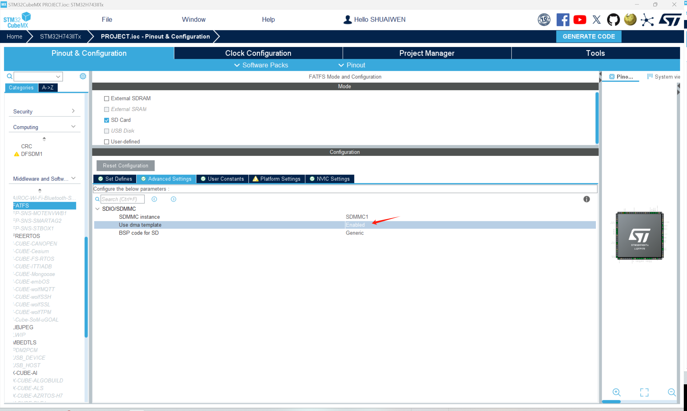

# 文件系统 (FILE SYSTEM)

!!! info
    文件系统是一种存储和组织计算机文件及其数据的方法。在这里，我们将使用 FatFs 库与 SD 卡进行接口。

## 文件系统作为中间件
在 STM32CUBEMX中，FATFS已经作为中间件集成到软件中。要启用FATFS，请转到“中间件”选项卡，并启用“FATFS”中间件.

如图所示，选择SD卡的FATFS，并启用长文件名支持。

然后，在高级设置下，为SD卡选择DMA模板。

## 生成与更新代码
接下来，我们生成代码以保存当前进度，并使其准备好进行后续的编程步骤。点击屏幕右上角的“生成代码”按钮。