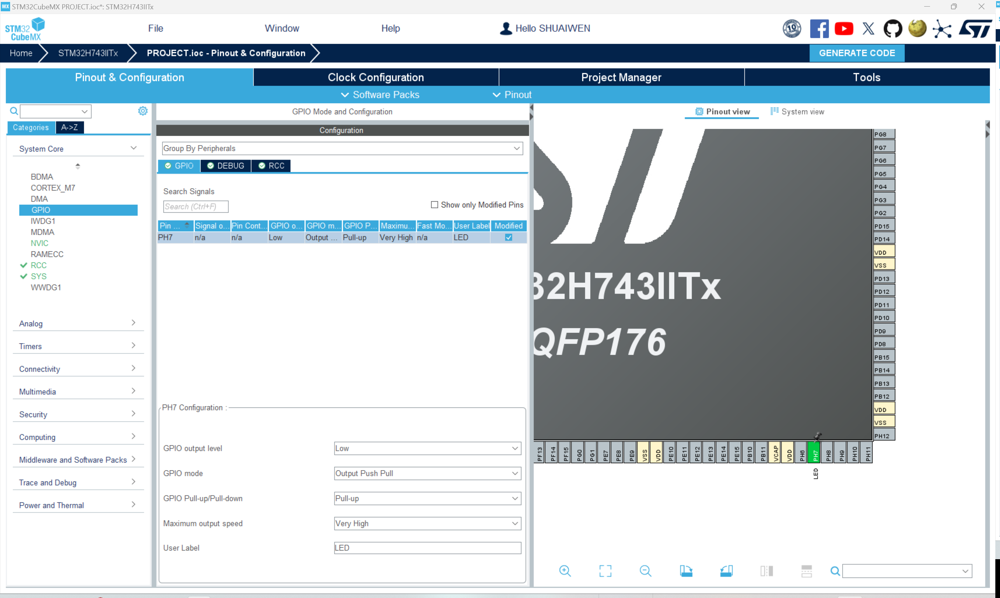

# LED

## LED CIRCUIT DESIGN

## CONFIGURE THE PIN

### SELECT AND SET PIN MODE
According to the circuit design, select the corresponding pin PH7 and set the mode to "GPIO Output".

### GPIO SETTING
In the leftmost pane, select the "GPIO" tab and set the parameters for PH7 as shown in the figure below.

- GPIO OUTPUT LEVEL: LOW

!!! info
    As can be seen from the circuit design, low level output can light up the LED and high level output can turn off the LED.

- GPIO MODE: Output

Here, we set the pin mode to "Output" as we use it as a control for LED.

- GPIO PULL-UP/PULL-DOWN: PULL-UP

!!! info
    The pull-up resistor is used to ensure that the pin is in a high state when it is not connected to the ground.

- GPIO SPEED: Very High

!!! info
    The speed of the GPIO pin means the speed at which the pin changes from one state to another. Here, we set it to "Very High" to ensure that the LED can be turned on and off quickly. This is no strict requirement for the speed setting of the LED pin, but it is recommended to set it to "Very High" for better performance.

- USER LABEL: LED

!!! info
    The user label is used to mark the pin for easy identification. Here, we set it to "LED" to indicate that this pin is used to control the LED.

## GENERATE AND UPDATE CODE
Finally, let's generate the code to save the current progress and to make it ready for following programming steps. Click the 'Generate Code' button at the top right corner of the screen.