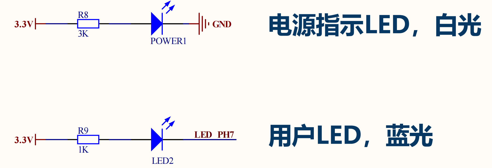
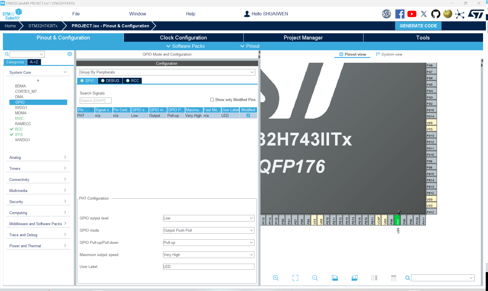

# 发光二极管 (LED)

## LED电路设计


## 配置引脚


### 选择并设置引脚模式
根据电路设计，选择对应的引脚PH7，并将模式设置为“GPIO输出”。

### GPIO设置
在最左侧的面板中，选择“GPIO”选项卡，并按下图所示为PH7设置参数。

- GPIO输出电平：低

!!! info
    从电路设计可以看出，低电平输出可以点亮LED，而高电平输出可以关闭LED。

- GPIO模式：输出

在这里，我们将引脚模式设置为“输出”，因为我们使用它来控制LED。

- GPIO上拉/下拉：上拉

!!! info
    上拉电阻用于确保引脚在未连接到地时处于高电平状态。

- GPIO速度：非常高

!!! info
    GPIO引脚的速度是指引脚从一种状态转换到另一种状态的速度。在这里，我们将其设置为“非常高”，以确保LED能够快速打开和关闭。LED引脚的速度设置没有严格要求，但建议设置为“非常高”以获得更好的性能。

- 用户标签：LED

!!! info
    用户标签用于标记引脚，以便于识别。这里，我们将其设置为“LED”，以指示该引脚用于控制LED。

## 生成与更新代码
接下来，我们生成代码以保存当前进度，并使其准备好进行后续的编程步骤。点击屏幕右上角的“生成代码”按钮。

## 在Keil中编程

### 整合模块代码

我们已经介绍了如何将BSP代码移植并整合到项目中，这适用于每个相应的模块。对于移植：

1. 从BSP项目中复制模块代码到用户项目中。
2. 将模块代码添加到用户项目的包含路径中。
3. 将模块代码添加到项目项中。
4. 在用户项目中包含模块代码的头文件。
5. 在用户项目中调用模块函数。

### 代码审查 - LED

让我们审查LED模块的代码。这个模块实际上非常简单，读者可以参考下面的代码了解详情。

#### **bsp_led.h**

```c
/*
 * bsp_led.h
 *
 *  Created on: June 07, 2024
 *      Author: SHUAIWEN CUI
 */

#ifndef _BSP_LED_H_
#define _BSP_LED_H_

#include "stm32h7xx_hal.h" // HAL library file declaration, replace it with the corresponding file according to the actual situation
#include "main.h" // IO definition and initialization function are in the main.c file, must be referenced

void LED(uint8_t state);// LED independent control function (0 is off, other values are on)
void LED_Toggle(void);// LED Toggle

#endif /* _BSP_LED_H_ */


```

#### **bsp_led.c**

```c
/*
 * bsp_led.c
 *
 *  Created on: June 07, 2024
 *      Author: SHUAIWEN CUI
 */

#include "bsp_led.h"

void LED(uint8_t state) // LED R independent control function (0 is off, other values are on)
{

	if (state)
	{
		HAL_GPIO_WritePin(LED_GPIO_Port, LED_Pin, GPIO_PIN_RESET);
	}
	else
	{
		HAL_GPIO_WritePin(LED_GPIO_Port, LED_Pin, GPIO_PIN_SET);
	}
}

void LED_Toggle(void)
{
	int state = HAL_GPIO_ReadPin(LED_GPIO_Port, LED_Pin);
	HAL_GPIO_WritePin(LED_GPIO_Port, LED_Pin, 1 - state);
}

```