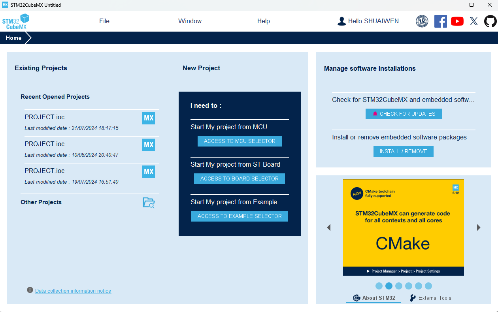
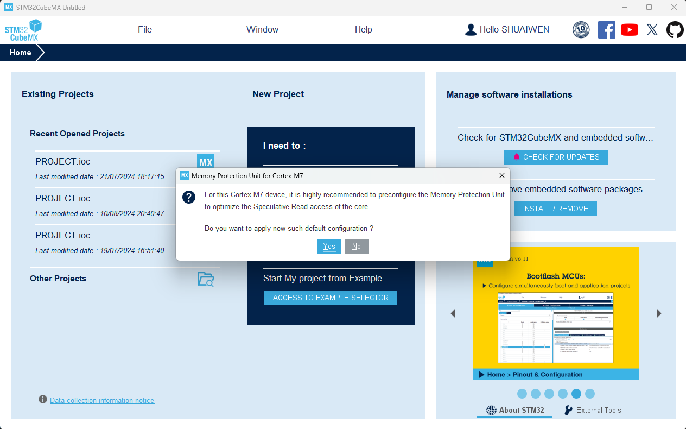
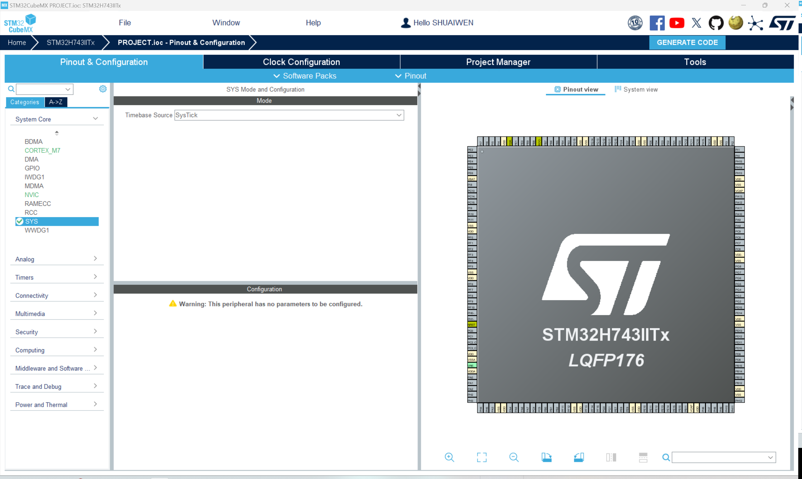

# PREPARATION WORK

!!! note
    "Initialization settings" is the first step in setting up the main control system, enabling the system to operate its basic functions. This section focuses on the basic configuration of the main control board. Note that for ease of reference and portability, this section only covers the configuration of the core board, while peripheral configurations are addressed in corresponding chapters. When adding peripheral hardware and software, you only need to enable the relevant pins and functions in CUBEMX, without affecting the existing functions.

## HARDWARE PREPARATION

To program the main control board, we need three components:

- **The main control board** -  the development board that embeds the MCU
- **A USB-TTL adapter** - to connect the main control board to the computer
- **A DEBUGGER** (ST-LINK V2, J-LINK, etc.) - to program the main control board

### COMPONENT 1 - The Main Control Board - FANKE743

{: width="500px" height="500px" }

-   :shopping_cart:{ .lg .middle } __product link__

    ---

    Product link

    [:octicons-arrow-right-24: <a href="https://m.tb.cn/h.glFZRKv3mP2cLID?tk=G3YX3VNEVf9" target="_blank"> Purchase Link </a>](#)

### COMPONENT 2 - USB-TTL Adapter

-   :shopping_cart:{ .lg .middle } __product link__

    ---

    Product link

    [:octicons-arrow-right-24: <a href="[https://m.tb.cn/h.glFZRKv3mP2cLID?tk=G3YX3VNEVf9 ](https://www.waveshare.com/usb-to-ttl.htm)" target="_blank"> Purchase Link </a>](#)

### COMPONENT 3 - Debugger

-   :shopping_cart:{ .lg .middle } __product link__

    ---

    Product link

    [:octicons-arrow-right-24: <a href="https://www.aliexpress.com/item/1005005273159580.html?spm=a2g0o.productlist.main.1.4cb12067ieXeqH&algo_pvid=22385ace-f6bf-43ed-a7b0-693d70dfbe53&algo_exp_id=22385ace-f6bf-43ed-a7b0-693d70dfbe53-0&pdp_npi=4%40dis%21SGD%212.73%212.73%21%21%212.01%212.01%21%40213bd97f17239667324781421ec645%2112000032440955298%21sea%21SG%210%21ABX&curPageLogUid=TbhcGoAFyvod&utparam-url=scene%3Asearch%7Cquery_from%3A" target="_blank"> Purchase Link </a>](#)

!!! info
    CMSIS-DAP, ST-LINK, and J-LINK are the most commonly used debuggers. Any of these debuggers can be used to program the main control board.

## HARDWARE CONNECTION

Connect the three components as shown in the figure above. Then connect the USB-TTL adapter and the debugger to the computer.

## SOFTWARE PREPARATION

### STM32CUBEMX
STM32CUBEMX is a graphical tool that allows configuring the STM32 microcontroller very easily and generating the corresponding initialization C code through a step-by-step process. Download and install STM32CubeMX from the [official website](https://www.st.com/en/development-tools/stm32cubemx.html).

### KEIL MDK
KEIL MDK is a complete software development environment for a wide range of ARM Cortex-M based microcontroller devices. Download and install KEIL MDK from the [official website](https://www.keil.com/demo/eval/arm.htm).

## SOFTWARE SETUP

### CREATE A NEW PROJECT IN STM32CUBEMX

#### New Project

Open STM32CubeMX and click the 'File' tab and then click the option 'New Project'.

#### Select MCU Series and Model

Select the MCU series and the MCU model. Then click 'Start Project'.

### Enable Memory Protection Unit (MPU)

Enable the 'Memory Protection Unit' and click 'YES'.

### Configure Project Information and Code Generation

Setup the project information and code generation configuration first as shown in the above figures.Then click 'Generate Code'.

### SYSTEM CONFIGURATION

Let's go back to the Pinout & Configuration tab and configure the system as shown below.

#### System Core - SYS: Timebase Source

Select the 'SYS' tab and then select the 'Timebase Source' as 'SysTick'.

#### System Core - RCC: High Speed Clock (HSE) & Low Speed Clock (LSE)

Select the 'RCC' tab and configure the 'High Speed Clock (HSE)' and 'Low Speed Clock (LSE)' as shown in the above figure. Both of them are set to 'Crystal/Ceramic Resonator'. Generally speaking, the external crystal oscillators are more accurate than the internal RC oscillators.

#### System Core - CORETEX_M7: Enable I-Cache & D-Cache & MPU

Select the 'CORETEX_M7' tab and enable the 'I-Cache', 'D-Cache', and 'MPU' as shown in the above figure. Some advanced features require the I-Cache, D-Cache, and MPU to be enabled, e.g., X-CUBE-AI. 

#### Timer - RTC: Enable RTC

Select the 'RTC' tab and enable the 'RTC' as shown in the above figure. The RTC is a real-time clock that can be used to keep track of the current time and date. Here, we enable RTC for future potential applications.

#### Trace and Debug - DEBUG: Enable Serial Wire

Select the 'DEBUG' tab and enable the 'Serial Wire' as shown in the above figure. The Serial Wire is a debug interface that allows the debugger to communicate with the MCU.

#### Clock Configuration

Configure the clock as shown in the above figure. The clock configuration is crucial for the MCU to operate correctly.

!!! note
    So far, we have finished the basic setup up for MCU. You can have check of all configuration again and then click 'Generate Code' to generate the initialization code for the MCU. We will continue to set up the software environment in the next section.

!!! tip
    For simplicity, I did not include all the CubeMX configuration steps in this section. In stead, the configuration is divided into several sections according to the function of the configuration. In practice, one can configure all the settings in one go. 

## GENERATE AND UPDATE CODE
Finally, let's generate the code to save the current progress and to make it ready for following programming steps. Click the 'Generate Code' button at the top right corner of the screen.

## PROJECT STRUCTURE

The project files in the system explorer looks like this:

The project structure in Keil looks like this:

The include path is set up as shown in the figure below:

