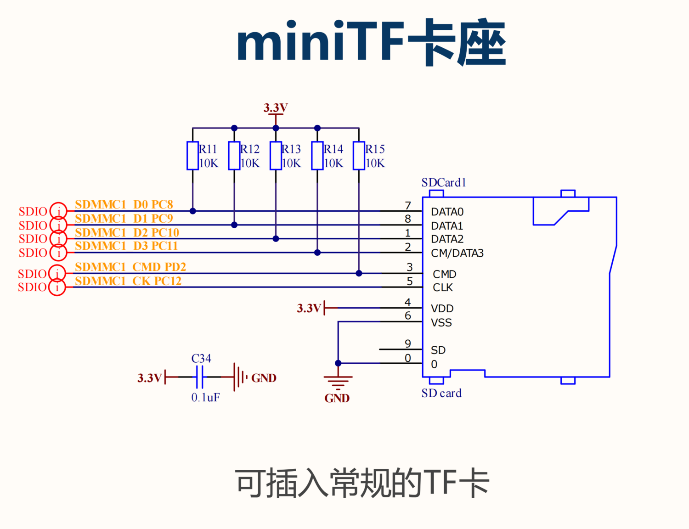
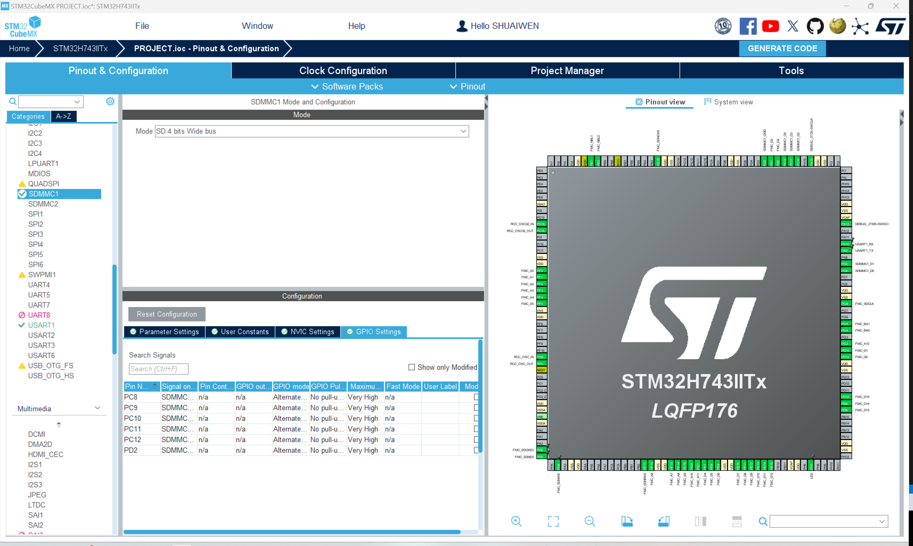

# SDCARD

!!! info
    SDCARD is the abbreviation of Secure Digital Memory Card. It is a type of non-volatile memory card used in computers and other electronic devices. Here, we will use the SDMMC peripheral to interface with the SD card.

## SDCARD CIRCUIT


## SDCARD CONFIGURATION

To enable SDCARD, we need to enable SDMMC for this development board. For some other development boards, you may need to enable the SDMMC peripheral.

For SDMMC configuration, refer to SDMMC tab.

## SDCARD GPIO


For SD card, we can use the default GPIO pins. However, you can change the GPIO pins according to your requirements.

## GENERATE AND UPDATE CODE
Finally, let's generate the code to save the current progress and to make it ready for following programming steps. Click the 'Generate Code' button at the top right corner of the screen.

## PROGRAMMING IN KEIL

### INCORPORATE THE MODULE CODE

We have introduced how to transplant and incorporate the BSP code into the project, and that applies to each respective module. For transplantation:

1. Copy the module codes from the BSP project to the user project.
2. Add the module codes to the user project include path.
3. Add the module codes to the project items.
4. Include the header file of the module code in the user project.
5. Call the module function in the user project.


### CODE REVIEW - SDCARD

#### **isdcard.h**

```c
/**
 * @file isdcard.h
 * @author SHUAIWEN CUI (shuaiwencui AT gmail DOT com)
 * @brief This is the header file for the isdcard.c file
 * @version 1.0
 * @date 2024-07-16
 * @ref https://blog.csdn.net/mculover666/article/details/100555620
 * @copyright Copyright (c) 2024
 *
 */
#ifndef __ISDCARD_H
#define __ISDCARD_H

/**
 * @name INCLUDES
 */

#include "stm32h7xx.h"

/**
 * @name MACROS
 */


/**
 * @name VARIABLES
 *
 */
extern uint8_t read_buf[512];
extern uint8_t write_buf[512];

/**
 * @name FUNCTION PROTOTYPES
 */
/**
 * @name SD_Init
 * @brief SD card initialization, this function handles the part that not processed by CUBEMX.
 */
int SD_Init(void);

/**
 * @name SD_Test
 * @brief Display the SD card information for SD card testing
 * 
 */
int SD_Test(void);

#endif /* __ISDCARD_H */


```

#### **isdcard.c**

```c
/**
 * @file isdcard.c
 * @author SHUAIWEN CUI (shuaiwencui AT gmail DOT com)
 * @brief This is the source file for the isdcard.c file
 * @version 1.0
 * @date 2024-07-16
 * @ref https://blog.csdn.net/mculover666/article/details/100555620
 * @copyright Copyright (c) 2024
 *
 */

/**
 * @name INCLUDES
 *
 */
#include "sdmmc.h"
#include "iusart.h"

/**
 * @name MACROS
 *
 */

/**
 * @name VARIABLES
 *
 */
uint8_t read_buf[512];
uint8_t write_buf[512];
/**
 * @name FUNCTIONS
 * @brief SD card info struct
 * @param None
 * @retval int 0: success, -1: error
 */

/**
 * @name SD_Init
 * @brief SD card initialization, this function handles the part that not processed by CUBEMX.
 */
int SD_Init(void)
{
    HAL_SD_MspInit(&hsd1);
    if (HAL_SD_Init(&hsd1) != HAL_OK)
    {
        printf("[Initialization] SD card initialization failed - HAL_SD_Init().\n\r");
        return -1;
    }
    if (HAL_SD_ConfigWideBusOperation(&hsd1, SDMMC_BUS_WIDE_4B) != HAL_OK)
    {
        printf("[Initialization] SD card initialization failed - HAL_SD_ConfigWideBusOperation().\n\r");
        return -1;
    }
    return 0;
}

/**
 * @name SD_Test
 * @brief Display the SD card information for SD card testing
 *
 */
int SD_Test(void)
{
    int i;

    int sdcard_status = 0;
    HAL_SD_CardCIDTypeDef sdcard_cid;

    printf("[INITIALIZATION] Micro SD Card Test...\r\n");

    /* Check if the SD card is operating correctly (in transfer mode) */
    sdcard_status = HAL_SD_GetCardState(&hsd1);
    if (sdcard_status == HAL_SD_CARD_TRANSFER)
    {
        printf("[INITIALIZATION] SD card init ok!\r\n\r\n");

        // Print basic SD card information
        printf("[INITIALIZATION] SD card information:\r\n");
        printf("[INITIALIZATION] Card Capacity: %llu MB\r\n", ((unsigned long long)hsd1.SdCard.BlockSize * hsd1.SdCard.BlockNbr/1024/1024));
        printf("[INITIALIZATION] Card BlockSize: %d \r\n", hsd1.SdCard.BlockSize);
        printf("[INITIALIZATION] Relative Card Address: %d \r\n", hsd1.SdCard.RelCardAdd);
        printf("[INITIALIZATION] Card Type: %d \r\n", hsd1.SdCard.CardType);

        // Read and print the SD card CID information
        HAL_SD_GetCardCID(&hsd1, &sdcard_cid);
        printf("[INITIALIZATION] ManufacturerID: %d \r\n", sdcard_cid.ManufacturerID);
    }
    else
    {
        printf("[INITIALIZATION] SD card init fail!\r\n");
        return 0;
    }

    /* Erase SD card block */
    printf("[INITIALIZATION] ------------------- Block Erase ------------------------------\r\n");
    sdcard_status = HAL_SD_Erase(&hsd1, 0, 512);
    if (sdcard_status == 0)
    {
        printf("[INITIALIZATION] Erase block ok!\r\n");
    }
    else
    {
        printf("[INITIALIZATION] Erase block fail!\r\n");
    }

    /* Read data before any operation */
    printf("[INITIALIZATION] ------------------- Read SD card block data Test -------------\r\n");
    sdcard_status = HAL_SD_ReadBlocks(&hsd1, (uint8_t *)read_buf, 0, 1, 0xffff);
    if (sdcard_status == 0)
    {
        printf("[INITIALIZATION] Read block data ok!\r\n");
        for (i = 0; i < 512; i++)
        {
            printf("0x%02x ", read_buf[i]);
            if ((i + 1) % 16 == 0)
            {
                printf("\r\n");
            }
        }
    }
    else
    {
        printf("[INITIALIZATION] Read block data fail!\r\n ");
    }

    /* Fill buffer with data */
    for (i = 0; i < 512; i++)
    {
        write_buf[i] = i % 256;
    }

    /* Write data to SD card block */
    printf("[INITIALIZATION] ------------------- Write SD card block data Test ------------\r\n");
    sdcard_status = HAL_SD_WriteBlocks(&hsd1, (uint8_t *)write_buf, 0, 1, 0xffff);
    if (sdcard_status == 0)
    {
        printf("[INITIALIZATION] Write block data ok!\r\n");
    }
    else
    {
        printf("[INITIALIZATION] Write block data fail!\r\n ");
    }

    /* Read data after write operation */
    printf("[INITIALIZATION] ------------------- Read SD card block data after Write ------\r\n");
    sdcard_status = HAL_SD_ReadBlocks(&hsd1, (uint8_t *)read_buf, 0, 1, 0xffff);
    if (sdcard_status == 0)
    {
        printf("[INITIALIZATION] Read block data ok!\r\n");
        for (i = 0; i < 512; i++)
        {
            printf("0x%02x ", read_buf[i]);
            if ((i + 1) % 16 == 0)
            {
                printf("\r\n");
            }
        }
    }

    return 0;
}


```

