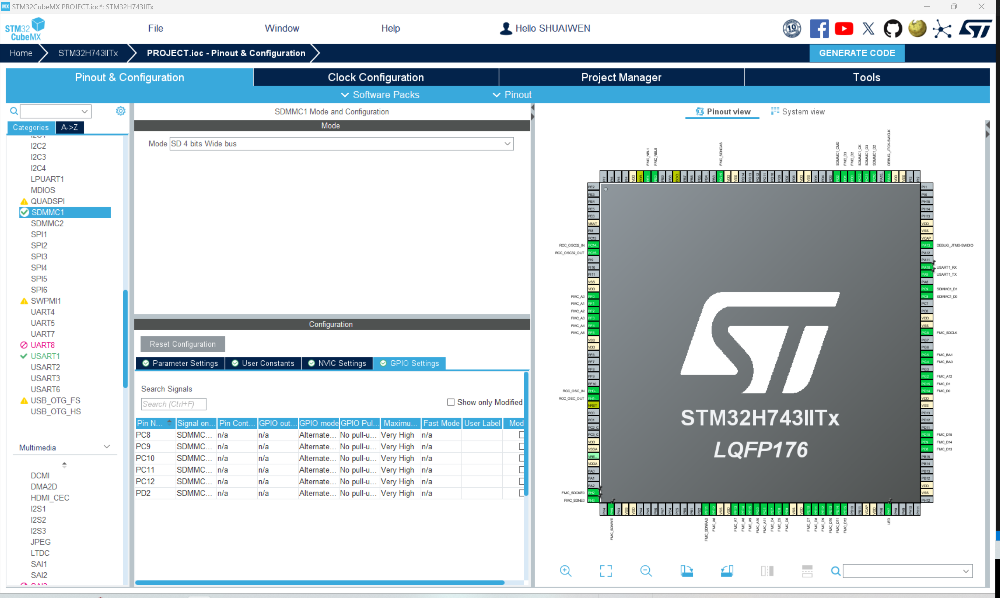

# 安全数字存储卡(SDCARD)

!!! info
    SDCARD是Secure Digital Memory Card的缩写。它是一种用于计算机和其他电子设备的非易失性存储卡。在这里，我们将使用SDMMC外设与SD卡进行接口。

## SDCARD电路


## SDCARD配置

要启用SDCARD，我们需要为此开发板启用SDMMC。对于其他一些开发板，您可能需要启用SDMMC外设。

对于SDMMC配置，请参考SDMMC选项卡。

## SDCARD GPIO


对于SD卡，我们可以使用默认的GPIO引脚。但是，您可以根据自己的需求更改GPIO引脚。

## 生成与更新代码
接下来，我们生成代码以保存当前进度，并使其准备好进行后续的编程步骤。点击屏幕右上角的“生成代码”按钮。

## 在Keil中编程

### 整合模块代码

我们已经介绍了如何将BSP代码移植并整合到项目中，这适用于每个相应的模块。对于移植：

1. 从BSP项目中复制模块代码到用户项目中。
2. 将模块代码添加到用户项目的包含路径中。
3. 将模块代码添加到项目项中。
4. 在用户项目中包含模块代码的头文件。
5. 在用户项目中调用模块函数。

### 代码审查 - SDCARD

#### **bsp_sdcard.h**

```c
/**
 * @file bsp_sdcard.h
 * @author SHUAIWEN CUI (shuaiwencui AT gmail DOT com)
 * @brief This is the header file for the bsp_sdcard.c file
 * @version 1.0
 * @date 2024-07-16
 * @ref https://blog.csdn.net/mculover666/article/details/100555620
 * @copyright Copyright (c) 2024
 *
 */
#ifndef _BSP_SDCARD_H_
#define _BSP_SDCARD_H_

/**
 * @name INCLUDES
 */

#include "stm32h7xx.h"

/**
 * @name MACROS
 */


/**
 * @name VARIABLES
 *
 */
extern uint8_t read_buf[512];
extern uint8_t write_buf[512];

/**
 * @name FUNCTION PROTOTYPES
 */
/**
 * @name SD_Init
 * @brief SD card initialization, this function handles the part that not processed by CUBEMX.
 */
int SD_Init(void);

/**
 * @name SD_Test
 * @brief Display the SD card information for SD card testing
 * 
 */
int SD_Test(void);

#endif /* _BSP_SDCARD_H_ */


```

#### **bsp_sdcard.c**

```c
/**
 * @file bsp_sdcard.c
 * @author SHUAIWEN CUI (shuaiwencui AT gmail DOT com)
 * @brief This is the source file for the bsp_sdcard.c file
 * @version 1.0
 * @date 2024-07-16
 * @ref https://blog.csdn.net/mculover666/article/details/100555620
 * @copyright Copyright (c) 2024
 *
 */

/**
 * @name INCLUDES
 *
 */
#include "sdmmc.h"
#include "bsp_usart.h"

/**
 * @name MACROS
 *
 */

/**
 * @name VARIABLES
 *
 */
uint8_t read_buf[512];
uint8_t write_buf[512];
/**
 * @name FUNCTIONS
 * @brief SD card info struct
 * @param None
 * @retval int 0: success, -1: error
 */

/**
 * @name SD_Init
 * @brief SD card initialization, this function handles the part that not processed by CUBEMX.
 */
int SD_Init(void)
{
    HAL_SD_MspInit(&hsd1);
    if (HAL_SD_Init(&hsd1) != HAL_OK)
    {
        printf("[Initialization] SD card initialization failed - HAL_SD_Init().\n\r");
        return -1;
    }
    if (HAL_SD_ConfigWideBusOperation(&hsd1, SDMMC_BUS_WIDE_4B) != HAL_OK)
    {
        printf("[Initialization] SD card initialization failed - HAL_SD_ConfigWideBusOperation().\n\r");
        return -1;
    }
    return 0;
}

/**
 * @name SD_Test
 * @brief Display the SD card information for SD card testing
 *
 */
int SD_Test(void)
{
    int i;

    int sdcard_status = 0;
    HAL_SD_CardCIDTypeDef sdcard_cid;

    printf("[INITIALIZATION] Micro SD Card Test...\r\n");

    /* Check if the SD card is operating correctly (in transfer mode) */
    sdcard_status = HAL_SD_GetCardState(&hsd1);
    if (sdcard_status == HAL_SD_CARD_TRANSFER)
    {
        printf("[INITIALIZATION] SD card init ok!\r\n\r\n");

        // Print basic SD card information
        printf("[INITIALIZATION] SD card information:\r\n");
        printf("[INITIALIZATION] Card Capacity: %llu MB\r\n", ((unsigned long long)hsd1.SdCard.BlockSize * hsd1.SdCard.BlockNbr/1024/1024));
        printf("[INITIALIZATION] Card BlockSize: %d \r\n", hsd1.SdCard.BlockSize);
        printf("[INITIALIZATION] Relative Card Address: %d \r\n", hsd1.SdCard.RelCardAdd);
        printf("[INITIALIZATION] Card Type: %d \r\n", hsd1.SdCard.CardType);

        // Read and print the SD card CID information
        HAL_SD_GetCardCID(&hsd1, &sdcard_cid);
        printf("[INITIALIZATION] ManufacturerID: %d \r\n", sdcard_cid.ManufacturerID);
    }
    else
    {
        printf("[INITIALIZATION] SD card init fail!\r\n");
        return 0;
    }

    /* Erase SD card block */
    printf("[INITIALIZATION] ------------------- Block Erase ------------------------------\r\n");
    sdcard_status = HAL_SD_Erase(&hsd1, 0, 512);
    if (sdcard_status == 0)
    {
        printf("[INITIALIZATION] Erase block ok!\r\n");
    }
    else
    {
        printf("[INITIALIZATION] Erase block fail!\r\n");
    }

    /* Read data before any operation */
    printf("[INITIALIZATION] ------------------- Read SD card block data Test -------------\r\n");
    sdcard_status = HAL_SD_ReadBlocks(&hsd1, (uint8_t *)read_buf, 0, 1, 0xffff);
    if (sdcard_status == 0)
    {
        printf("[INITIALIZATION] Read block data ok!\r\n");
        for (i = 0; i < 512; i++)
        {
            printf("0x%02x ", read_buf[i]);
            if ((i + 1) % 16 == 0)
            {
                printf("\r\n");
            }
        }
    }
    else
    {
        printf("[INITIALIZATION] Read block data fail!\r\n ");
    }

    /* Fill buffer with data */
    for (i = 0; i < 512; i++)
    {
        write_buf[i] = i % 256;
    }

    /* Write data to SD card block */
    printf("[INITIALIZATION] ------------------- Write SD card block data Test ------------\r\n");
    sdcard_status = HAL_SD_WriteBlocks(&hsd1, (uint8_t *)write_buf, 0, 1, 0xffff);
    if (sdcard_status == 0)
    {
        printf("[INITIALIZATION] Write block data ok!\r\n");
    }
    else
    {
        printf("[INITIALIZATION] Write block data fail!\r\n ");
    }

    /* Read data after write operation */
    printf("[INITIALIZATION] ------------------- Read SD card block data after Write ------\r\n");
    sdcard_status = HAL_SD_ReadBlocks(&hsd1, (uint8_t *)read_buf, 0, 1, 0xffff);
    if (sdcard_status == 0)
    {
        printf("[INITIALIZATION] Read block data ok!\r\n");
        for (i = 0; i < 512; i++)
        {
            printf("0x%02x ", read_buf[i]);
            if ((i + 1) % 16 == 0)
            {
                printf("\r\n");
            }
        }
    }

    return 0;
}


```


