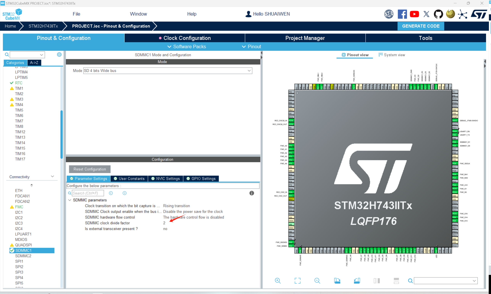
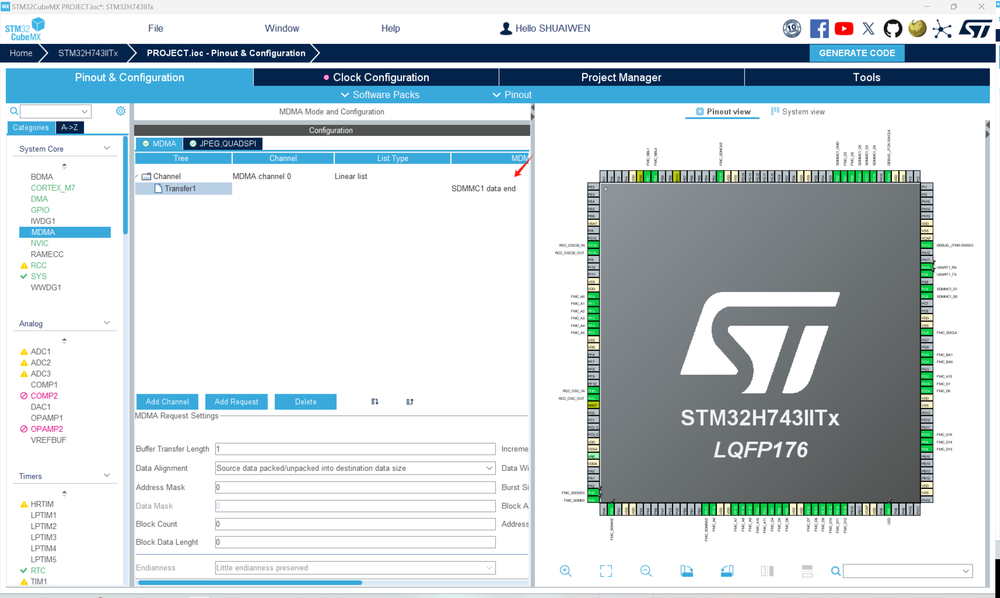
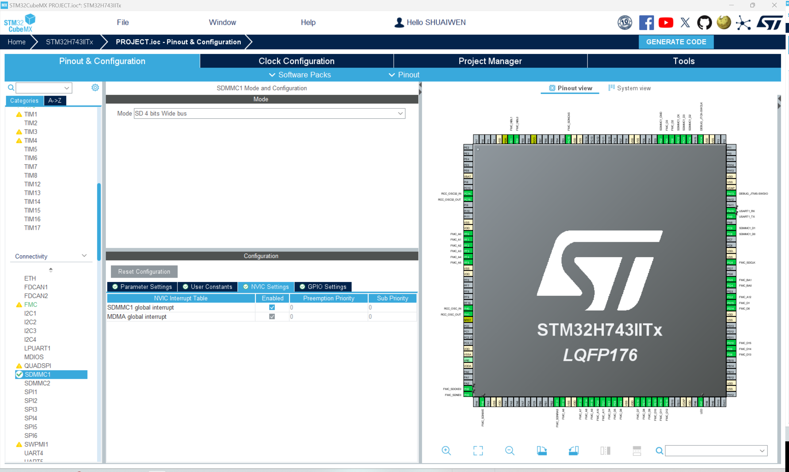
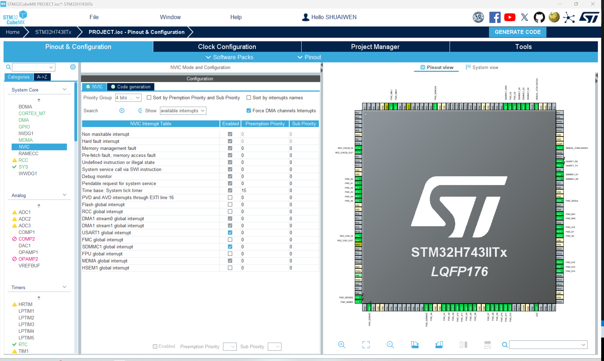

# SDMMC
!!! info
    SDMMC stands for Secure Digital Memory Card. It is a type of non-volatile memory card that is used in computers and other electronic devices. Here, we will use the SDMMC peripheral to interface with an SD card.

## ENABLE SDMMC

As shown, in the 'Connectivity' tab, enable the SDMMC peripheral. Note that, the divider is set to 2. Note that, at this time, you may need to reconfigure the clock settings in the 'Clock Configuration' tab.

## ENABLE MDMA

!!! info
    MDMA stands for Memory Direct Memory Access. It is a type of DMA that is used to transfer data between memory and memory. Here, we will use MDMA to transfer data between the SD card and the SDRAM.

## ENABLE NVIC

As shown, in the 'NVIC Settings' tab, enable the SDMMC interrupt.

## NVIC CONFIGURATION

So far, the NVIC settings are as shown. 

## GENERATE AND UPDATE CODE
Finally, let's generate the code to save the current progress and to make it ready for following programming steps. Click the 'Generate Code' button at the top right corner of the screen.