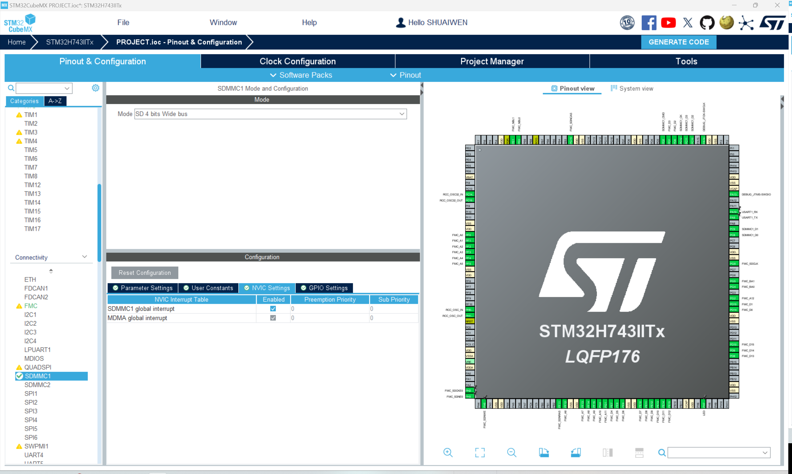
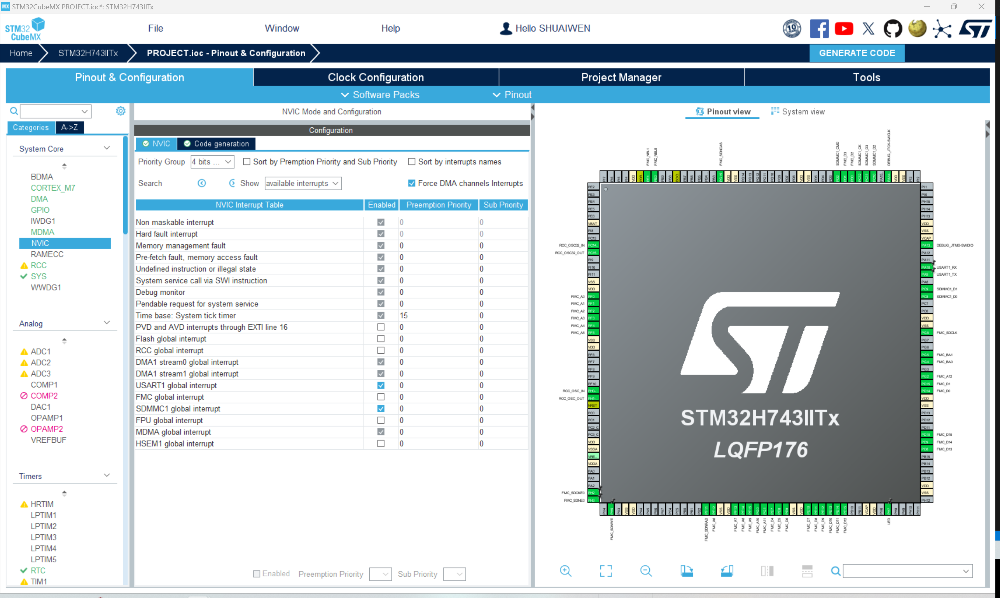

# 安全数字存储卡控制器(SDMMC)

!!! info
    SDMMC是Secure Digital Memory Card的缩写。它是一种用于计算机和其他电子设备的非易失性存储卡。在这里，我们将使用SDMMC外设与SD卡进行接口。

## 启用SDMMC

如图所示，在“连接”选项卡中，启用SDMMC外设。请注意，分频器设置为2。请注意，此时您可能需要在“时钟配置”选项卡中重新配置时钟设置。

## 启用MDMA

!!! info
    MDMA是Memory Direct Memory Access的缩写。它是一种用于在存储器和存储器之间传输数据的DMA。在这里，我们将使用MDMA在SD卡和SDRAM之间传输数据。

## 启用NVIC

如图所示，在“NVIC设置”选项卡中，启用SDMMC中断。

## NVIC配置

到目前为止，NVIC设置如图所示。
