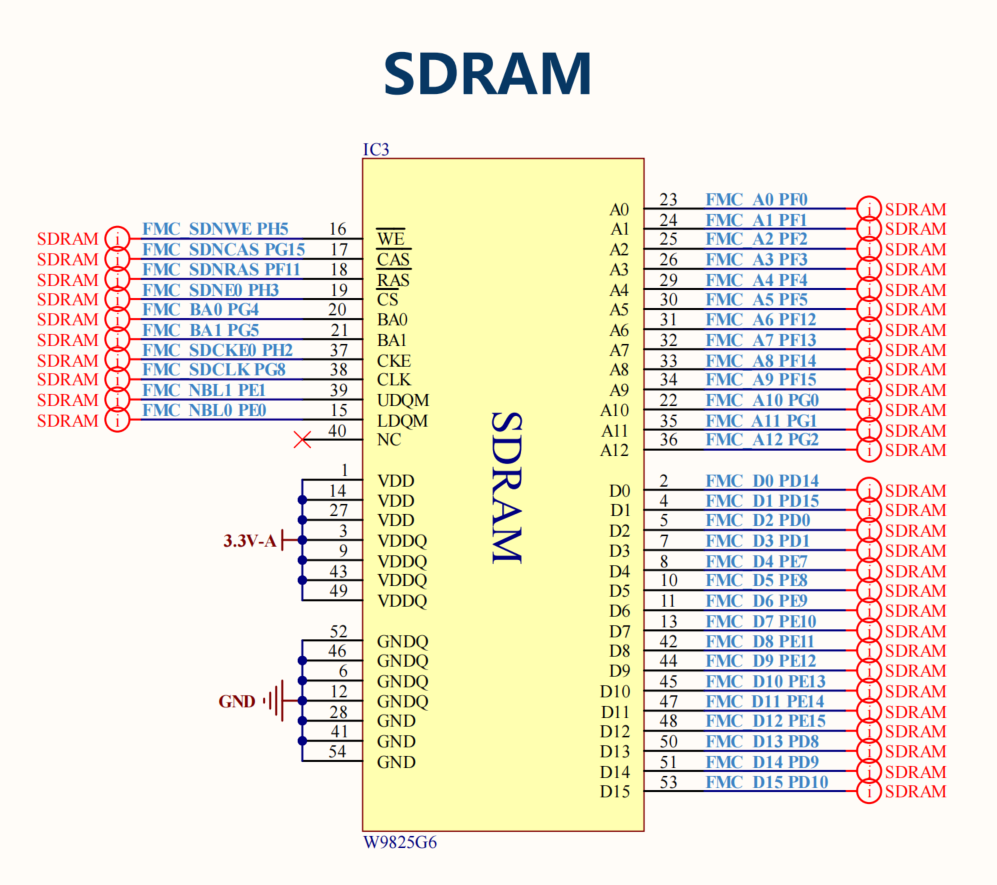
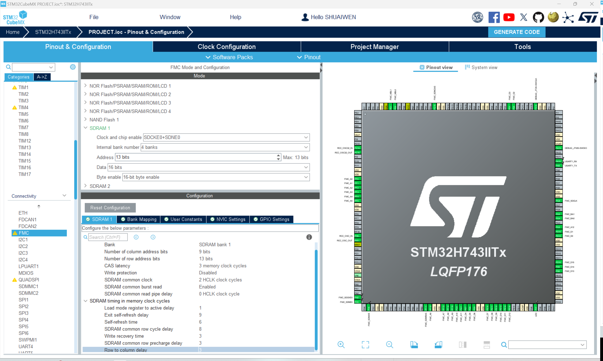
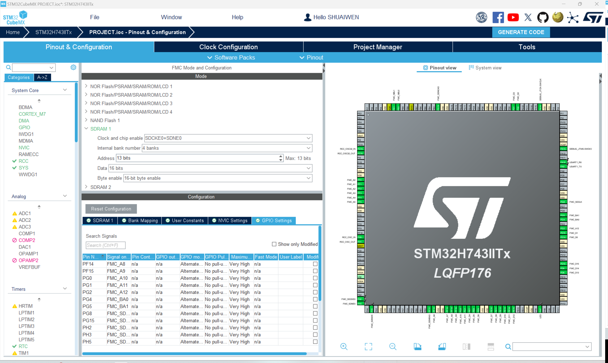

# SDRAM
!!! info
    SDRAM stands for Synchronous Dynamic Random Access Memory. It is a type of volatile memory that is used in computers and other electronic devices. Here, since the built-in RAM is only 1MB, and not enough for some applications, we need to use external SDRAM to expand the memory capacity.

## SDRAM CIRCUIT

Please carefully compare the pin design with the pin setup in CUBEMX, ensure that the pin configuration is consistent with the hardware connection. In our case, only PH2, PH3, and PH5 are not consistent, so we can manually set up them in the chip view on the right hand side and set them to their respective functions as designed.

## SDRAM PARAMETERS

The SDRAM Module we are using is WINBOND W9825G6KH-6I. You can find the datasheet [here](http://www.cuishuaiwen.com:7500/DEV/FK-STM32H743/w9825g6kh.pdf). The parameters are calculated according to the datasheet.

## GPIO CONFIGURATION

Check the pin configuration. Compare the setup in CUBEMX with the pin design.