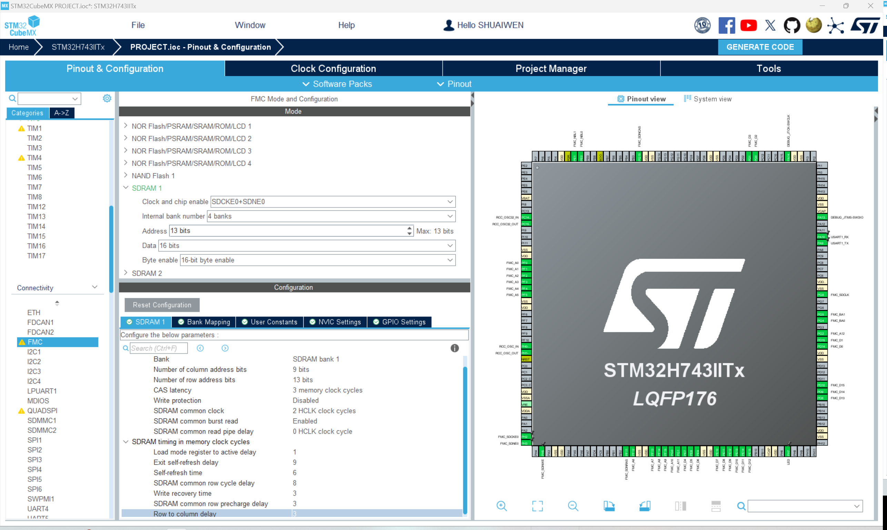
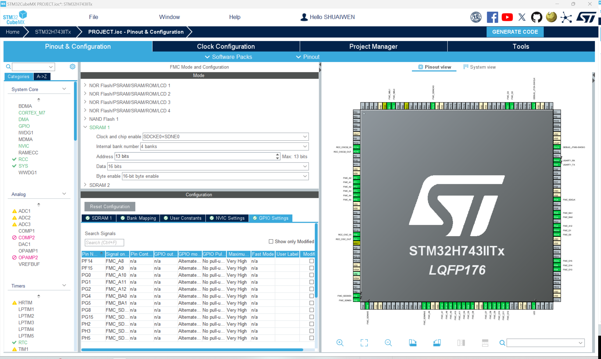

# 同步动态随机存储器(SDRAM)
!!! info
    SDRAM 是同步动态随机存储器的缩写。它是一种用于计算机和其他电子设备的易失性存储器。在这里，由于内置 RAM 仅为 1MB，对于某些应用程序来说不够，我们需要使用外部 SDRAM 来扩展内存容量。

## SDRAM 电路


请仔细将引脚设计与CUBEMX中的引脚设置进行比较，确保引脚配置与硬件连接一致。在我们的案例中，只有PH2, PH3, PH5不一致，所以我们可以在右侧的芯片视图中手动设置，并按照设计将其设置为各自的功能。

## SDRAM 参数


我们使用的 SDRAM 模块是 WINBOND W9825G6KH-6I。您可以在[这里](http://www.cuishuaiwen.com:7500/DEV/FK-STM32H743/w9825g6kh.pdf)找到数据表。参数是根据数据表计算的。

## GPIO 配置


检查引脚配置。将 CUBEMX 中的设置与引脚设计进行比较。

## 生成与更新代码
接下来，我们生成代码以保存当前进度，并使其准备好进行后续的编程步骤。点击屏幕右上角的“生成代码”按钮。

## 在Keil中编程

### 整合模块代码

我们已经介绍了如何将BSP代码移植并整合到项目中，这适用于每个相应的模块。对于移植：

1. 从BSP项目中复制模块代码到用户项目中。
2. 将模块代码添加到用户项目的包含路径中。
3. 将模块代码添加到项目项中。
4. 在用户项目中包含模块代码的头文件。
5. 在用户项目中调用模块函数。

### 代码审查 - SDRAM
### CODE REVIEW - SDRAM

让我们审查 SDRAM 模块的代码。

#### **bsp_sdram.h**

```c
/**
 * @file bsp_sdram.h
 * @author SHUAIWEN CUI (shuaiwencui AT gmail DOT com)
 * @brief This file is the header file for the bsp_sdram.c file
 * @version 1.0
 * @date 2024-07-16
 * @ref https://blog.csdn.net/Believeziwo/article/details/131372421
 */
#ifndef _BSP_SDRAM_H_
#define _BSP_SDRAM_H_

/**
 * @name INCLUDES
 *
 */
#include "stm32h7xx.h"
#include <stdio.h>

/**
 * @name MACROS
 *
 */
#define W9825G6KH_SIZE (32 * 1024 * 1024) // 32M Bytes W9825G6
#define FMC_BANK_SDRAM FMC_Bank1_SDRAM
#define FMC_COMMAND_TARGET_BANK FMC_SDRAM_CMD_TARGET_BANK1
#define SDRAM_BANK_ADDR ((uint32_t)0xC0000000)
#define SDRAM_TIMEOUT ((uint32_t)0xFFFF)
#define SDRAM_MODEREG_BURST_LENGTH_1 ((uint16_t)0x0000)
#define SDRAM_MODEREG_BURST_LENGTH_2 ((uint16_t)0x0001)
#define SDRAM_MODEREG_BURST_LENGTH_4 ((uint16_t)0x0002)
#define SDRAM_MODEREG_BURST_LENGTH_8 ((uint16_t)0x0004)
#define SDRAM_MODEREG_BURST_TYPE_SEQUENTIAL ((uint16_t)0x0000)
#define SDRAM_MODEREG_BURST_TYPE_INTERLEAVED ((uint16_t)0x0008)
#define SDRAM_MODEREG_CAS_LATENCY_2 ((uint16_t)0x0020)
#define SDRAM_MODEREG_CAS_LATENCY_3 ((uint16_t)0x0030)
#define SDRAM_MODEREG_OPERATING_MODE_STANDARD ((uint16_t)0x0000)
#define SDRAM_MODEREG_WRITEBURST_MODE_PROGRAMMED ((uint16_t)0x0000)
#define SDRAM_MODEREG_WRITEBURST_MODE_SINGLE ((uint16_t)0x0200)

#define SDRAM_DEBUG_ON 1
#define SDRAM_INFO(fmt, arg...) printf("[NODE INITIALIZATION] " fmt "\n", ##arg)
#define SDRAM_ERROR(fmt, arg...) printf("[NODE INITIALIZATION] " fmt "\n", ##arg)
#define SDRAM_DEBUG(fmt, arg...)                                       \
    do                                                                 \
    {                                                                  \
        if (SDRAM_DEBUG_ON)                                            \
            printf("[NODE INITIALIZATION] [%d]" fmt "\n", __LINE__, ##arg); \
    } while (0)

/**
 * @name FUNCTION PROTOTYPES
 *
 */
void SDRAM_InitSequence(void);
void SDRAM_WriteBuffer(uint32_t *pBuffer, uint32_t uwWriteAddress, uint32_t uwBufferSize);
void SDRAM_ReadBuffer(uint32_t *pBuffer, uint32_t uwReadAddress, uint32_t uwBufferSize);
uint8_t SDRAM_Test(void);

#endif /* _BSP_SDRAM_H_ */


```

#### **bsp_sdram.c**

```c
/**
 * @file bsp_sdram.c
 * @author SHUAIWEN CUI (shuaiwencui AT gmail DOT com)
 * @brief This file is the source file for the bsp_sdram.c file
 * @version 1.0
 * @date 2024-07-16
 * @ref https://blog.csdn.net/Believeziwo/article/details/131372421
 */

/**
 * @name INCLUDES
 *
 */
#include "bsp_sdram.h"
#include "fmc.h"

/**
 * @name VARIABLES
 *
 */
static FMC_SDRAM_CommandTypeDef Command;
#define sdramHandle hsdram1 // defined in fmc.c

/**
 * @name FUNCTIONS
 *
 */

/**
  * @brief  initialize SDRAM in 6 steps
  * @param  None. 
  * @retval None.
  * ! This is the core for SDRAM initialization. CubeMX will do FMC initialization, then we need this function to do SDRAM initialization. After that, we can use SDRAM in the application layer.
  */
void SDRAM_InitSequence(void)
{
	uint32_t temp = 0;

	/* Step 1 ----------------------------------------------------------------*/
	/* CONFIGURE COMMAND: enable the clock for sdram */
	Command.CommandMode = FMC_SDRAM_CMD_CLK_ENABLE;
	Command.CommandTarget = FMC_COMMAND_TARGET_BANK;
	Command.AutoRefreshNumber = 1;
	Command.ModeRegisterDefinition = 0;
	/* send command */
	HAL_SDRAM_SendCommand(&sdramHandle, &Command, SDRAM_TIMEOUT);

	/* delay for a while at least 200us */
	HAL_Delay(1); // 1ms>200us

	/* Step 3 ----------------------------------------------------------------*/
	/* CONFIGURE COMMAND: precharge all bank */
	Command.CommandMode = FMC_SDRAM_CMD_PALL;
	Command.CommandTarget = FMC_COMMAND_TARGET_BANK;
	Command.AutoRefreshNumber = 1;
	Command.ModeRegisterDefinition = 0;
	/* send command */
	HAL_SDRAM_SendCommand(&sdramHandle, &Command, SDRAM_TIMEOUT);   

	/* Step 4 ----------------------------------------------------------------*/
	/* CONFIGURE COMMAND: auto refresh */   
	Command.CommandMode = FMC_SDRAM_CMD_AUTOREFRESH_MODE;
	Command.CommandTarget = FMC_COMMAND_TARGET_BANK;
	Command.AutoRefreshNumber = 8;
	Command.ModeRegisterDefinition = 0;
	/* send command */
	HAL_SDRAM_SendCommand(&sdramHandle, &Command, SDRAM_TIMEOUT);

	/* Step 5 ----------------------------------------------------------------*/
	/* CONFIGURE SDRAM LOAD MODE register */
	temp = (uint32_t)SDRAM_MODEREG_BURST_LENGTH_1          |
				   SDRAM_MODEREG_BURST_TYPE_SEQUENTIAL   |
				   SDRAM_MODEREG_CAS_LATENCY_3           |
				   SDRAM_MODEREG_OPERATING_MODE_STANDARD |
				   SDRAM_MODEREG_WRITEBURST_MODE_SINGLE;

	/* CONFIGURE COMMAND: set SDRAM register */
	Command.CommandMode = FMC_SDRAM_CMD_LOAD_MODE;
	Command.CommandTarget = FMC_COMMAND_TARGET_BANK;
	Command.AutoRefreshNumber = 1;
	Command.ModeRegisterDefinition = temp;
	/* send command */
	HAL_SDRAM_SendCommand(&sdramHandle, &Command, SDRAM_TIMEOUT);

	/* Step 6 ----------------------------------------------------------------*/
	/* CONFIGURE REFRESH COUNTER */
  /*
    (SDRAM refresh period / Number of rows）*SDRAM Clock Speed – 20
    = 64000(64 ms) / 8192*120MHz - 20
    = 917.2 ~ 918

    note: 64 / 8192 = 7.81us
  */
	/* CONFIGURE REFRESH RATE */
	HAL_SDRAM_ProgramRefreshRate(&sdramHandle, 918); 
}

/**
  * @brief  write data to SDRAM in "word" format
  * @param  pBuffer:  pointer to data
  * @param  uwWriteAddress: address to write in SDRAM
  * @param  uwBufferSize: size of data to write
  * @retval None.
  */
void SDRAM_WriteBuffer(uint32_t* pBuffer, uint32_t uwWriteAddress, uint32_t uwBufferSize)
{
  __IO uint32_t write_pointer = (uint32_t)uwWriteAddress;

  /* Disable write protection */
  HAL_SDRAM_WriteProtection_Disable(&hsdram1);
  /* Check the SDRAM state */
  while(HAL_SDRAM_GetState(&hsdram1) != RESET)
  {
  }

  /* write data to SDRAM by loops*/
  for (; uwBufferSize != 0; uwBufferSize--) 
  {
    /* write data to SDRAM */
    *(uint32_t *) (SDRAM_BANK_ADDR + write_pointer) = *pBuffer++;

    /* address increment */
    write_pointer += 4;
  }
    
}

/**
  * @brief  read data from SDRAM
  * @param  pBuffer: pointer to data
  * @param  ReadAddress: address to read in SDRAM
  * @param  uwBufferSize: size of data to read
  * @retval None.
  */
void SDRAM_ReadBuffer(uint32_t* pBuffer, uint32_t uwReadAddress, uint32_t uwBufferSize)
{
  __IO uint32_t write_pointer = (uint32_t)uwReadAddress;
  
   
  /* Check the SDRAM state */
  while ( HAL_SDRAM_GetState(&hsdram1) != RESET)
  {
  }
  
  /* read data from SDRAM */
  for(; uwBufferSize != 0x00; uwBufferSize--)
  {
   *pBuffer++ = *(__IO uint32_t *)(SDRAM_BANK_ADDR + write_pointer );
    
   /* address increment */
    write_pointer += 4;
  } 
}


/**
  * @brief  Test SDRAM
  * @param  None
  * @retval normal as 1, abnormal as 0
  */
uint8_t SDRAM_Test(void)
{
  /* counter for write data */
  uint32_t counter=0;
  
  /* 8 bit data */
  uint8_t ubWritedata_8b = 0, ubReaddata_8b = 0;  
  
  /* 16 bit data */
  uint16_t uhWritedata_16b = 0, uhReaddata_16b = 0; 

  /* 32 bit data */
  uint32_t uwWritedata_32b = 0, uwReaddata_32b = 0;
  
  SDRAM_INFO("TESTING SDRAM..., WRITE AND READ AS 8/16/32 BIT...");


  /* 8 bit data read and write*/
  
  /* reset SDRAM data to 0, W9825G6KH_SIZE is in 8 bit */
  for (counter = 0x00; counter < W9825G6KH_SIZE; counter++)
  {
    *(__IO uint8_t*) (SDRAM_BANK_ADDR + counter) = (uint8_t)0x0;
  }
  
  /* write data to SDRAM */
  for (counter = 0; counter < W9825G6KH_SIZE; counter++)
  {
    *(__IO uint8_t*) (SDRAM_BANK_ADDR + counter) = (uint8_t)(ubWritedata_8b + counter);
  }
  
  /* read data from SDRAM and check */
  for(counter = 0; counter<W9825G6KH_SIZE;counter++ )
  {
    ubReaddata_8b = *(__IO uint8_t*)(SDRAM_BANK_ADDR + counter);  // read data from SDRAM
    
    if(ubReaddata_8b != (uint8_t)(ubWritedata_8b + counter))      // check data, if not equal, return 0
    {
      SDRAM_ERROR("8 BIT DATA READ AND WRITE ERROR!");
      return -1;
    }
  }
	
  
  /* 16 bit data read and write*/
  
  /* reset SDRAM data to 0 */
  for (counter = 0x00; counter < W9825G6KH_SIZE/2; counter++)
  {
    *(__IO uint16_t*) (SDRAM_BANK_ADDR + 2*counter) = (uint16_t)0x00;
  }
  
  /* write data to SDRAM */
  for (counter = 0; counter < W9825G6KH_SIZE/2; counter++)
  {
    *(__IO uint16_t*) (SDRAM_BANK_ADDR + 2*counter) = (uint16_t)(uhWritedata_16b + counter);
  }
  
  /* read data from SDRAM and check */
  for(counter = 0; counter<W9825G6KH_SIZE/2;counter++ )
  {
    uhReaddata_16b = *(__IO uint16_t*)(SDRAM_BANK_ADDR + 2*counter);  // read data from SDRAM
    
    if(uhReaddata_16b != (uint16_t)(uhWritedata_16b + counter))      // check data, if not equal, return 0
    {
      SDRAM_ERROR("16 BIT DATA READ AND WRITE ERROR!");

      return -1;
    }
  }

  /* 32 bit data read and write*/
  /* reset SDRAM data to 0 */
  for (counter = 0x00; counter < W9825G6KH_SIZE/4; counter++)
  {
    *(__IO uint32_t*) (SDRAM_BANK_ADDR + 4*counter) = (uint32_t)0x00;
  }

  /* write data to SDRAM */
  for (counter = 0; counter < W9825G6KH_SIZE/4; counter++)
  {
    *(__IO uint32_t*) (SDRAM_BANK_ADDR + 4*counter) = (uint32_t)(uwWritedata_32b + counter);
  }
  
  /* read data from SDRAM and check */
  for(counter = 0; counter<W9825G6KH_SIZE/4;counter++ )
  {
    uwReaddata_32b = *(__IO uint32_t*)(SDRAM_BANK_ADDR + 4*counter);  // read data from SDRAM
    
    if(uwReaddata_32b != (uint32_t)(uwWritedata_32b + counter))      // check data, if not equal, return 0
    {
      SDRAM_ERROR("32 BIT DATA READ AND WRITE ERROR!");
      return -1;
    }
  }
  
  SDRAM_INFO("SDRAM READ AND WRITE TEST OK!"); 
  /* normal, return 0 */
  return 0;
  
}


/*********************************************END OF FILE**********************/

```

### 代码审查 - 内存管理

让我们来审查内存管理的代码。

#### **bsp_memory.h**

```c
/**
 * @file bsp_memory.h
 * @author SHUAIWEN CUI (shuaiwencui AT gmail DOT com)
 * @brief This is the header file for the memory management module.
 * @version 1.0
 * @date 2024-06-30
 * @ref ALIENTEK memory.h & memory.c for STM32H7xx
 * @copyright Copyright (c) 2024
 *
 *
 */

#ifndef _BSP_MEMORY_H_
#define _BSP_MEMORY_H_

/**
 * @name INCLUDES
 */
#include "stm32h7xx.h"
#include <stddef.h>
#include <stdint.h>
#include "bsp_usart.h"
#include "bsp_sdram.h"

/**
 * @name FUNCTION PROTOTYPES
 */
/**
 * @name memory_init
 * @brief Initialize the memory management module
 * @param None
 * @retval None
 */
void memory_init(void);

/**
 * @name memory_alloc
 * @brief Allocate memory
 * @param size The size of the memory to allocate
 * @return void*
 */
void *memory_alloc(size_t size);

/**
 * @name memory_free
 * @brief Free memory
 * @param ptr The pointer to the memory to free
 * @retval None
 */
void memory_free(void *ptr);

/**
 * @name memory_management_test
 * @brief This function is for memory management test: allocate memory for a given length, set the values, print the values, and free the memory.
 */
int memory_management_test(void);


#endif /* _BSP_MEMORY_H_ */


```

#### **bsp_memory.c**

```c
/**
 * @file bsp_memory.h
 * @author SHUAIWEN CUI (shuaiwencui AT gmail DOT com)
 * @brief This is the header file for the memory management module.
 * @version 1.0
 * @date 2024-06-30
 * @ref ALIENTEK memory.h & memory.c for STM32H7xx
 * @copyright Copyright (c) 2024
 *
 * ! NOTE:
 * ! The memory management is achieved by using linked lists.
 *
 */

/**
 * @name INCLUDES
 */
#include "bsp_memory.h"

/**
 * @name MACROS
 */
#define SDRAM_START_ADDR 0xC0000000
#define SDRAM_SIZE 0x02000000 // 32MB

/**
 * @name list structure for memory management
 */
// block hearder structure: at the beginning of each block, size indicates the size of the block, next is the pointer to the next free block
typedef struct BlockHeader
{
    size_t size;              // Block size including header
    struct BlockHeader *next; // Pointer to the next free block
} BlockHeader;

static BlockHeader *freeList = (BlockHeader *)SDRAM_START_ADDR;

/**
 * @name memory_init
 * @brief Initialize the memory management module
 * @param None
 * @retval None
 */
void memory_init(void)
{
    freeList->size = SDRAM_SIZE;
    freeList->next = NULL;
}

/**
 * @name memory_alloc
 * @brief Allocate memory
 * @param size The size of the memory to allocate
 * @return void*
 */
void *memory_alloc(size_t size)
{
    BlockHeader *current = freeList;
    BlockHeader *previous = NULL;

    // Align size to the size of BlockHeader and to 32-bit boundary
    size = (size + sizeof(BlockHeader) + sizeof(uint32_t) - 1) & ~(sizeof(uint32_t) - 1);

    while (current)
    {
        if (current->size >= size)
        {
            if (current->size > size + sizeof(BlockHeader))
            {
                // Split the block
                BlockHeader *newBlock = (BlockHeader *)((uint32_t *)current + size / sizeof(uint32_t));
                newBlock->size = current->size - size;
                newBlock->next = current->next;
                current->size = size;
                current->next = NULL;

                if (previous)
                {
                    previous->next = newBlock;
                }
                else
                {
                    freeList = newBlock;
                }
            }
            else
            {
                // Use the whole block
                if (previous)
                {
                    previous->next = current->next;
                }
                else
                {
                    freeList = current->next;
                }
            }
            return (void *)((uint32_t *)current + sizeof(BlockHeader) / sizeof(uint32_t));
        }

        previous = current;
        current = current->next;
    }

    // No suitable block found
    return NULL;
}

/**
 * @name memory_free
 * @brief Free memory
 * @param ptr The pointer to the memory to free
 * @retval None
 */
void memory_free(void *ptr)
{
    if (!ptr)
        return;

    BlockHeader *block = (BlockHeader *)((uint32_t *)ptr - sizeof(BlockHeader) / sizeof(uint32_t));
    BlockHeader *current = freeList;
    BlockHeader *previous = NULL;

    while (current && current < block)
    {
        previous = current;
        current = current->next;
    }

    if (previous)
    {
        previous->next = block;
    }
    else
    {
        freeList = block;
    }
    block->next = current;

    // Merge adjacent blocks (optional, for reducing fragmentation)
    if ((uint32_t *)block + block->size / sizeof(uint32_t) == (uint32_t *)current)
    {
        block->size += current->size;
        block->next = current->next;
    }
    if (previous && (uint32_t *)previous + previous->size / sizeof(uint32_t) == (uint32_t *)block)
    {
        previous->size += block->size;
        previous->next = block->next;
    }
}

/**
 * @name memory_management_test
 * @brief This function is for memory management test: allocate memory for a given length, set the values, print the values, and free the memory.
 */
int memory_management_test(void)
{
    int length = 10;

    int *array = (int *)memory_alloc(length * sizeof(int));

    if (!array)
    {
        return -1;
    }

    for (int i = 0; i < length; i++)
    {
        array[i] = i;
    }

    for (int i = 0; i < length; i++)
    {
        printf("array[%d] = %d\n", i, array[i]);
    }

    memory_free(array);
	
	return 0;
}

```

### 代码解释

isdram 模块提供了基本的sdram内存交互功能，但是仅有这些驱动是不够的，我们还需要一个内存管理模块来管理sdram的内存分配和释放。imemory 模块提供了内存管理的功能，通过链表的方式来管理sdram的内存。这样我们就可以在sdram上分配内存，使用内存，释放内存，而不需要关心具体的地址，这极大地方便了我们的开发。