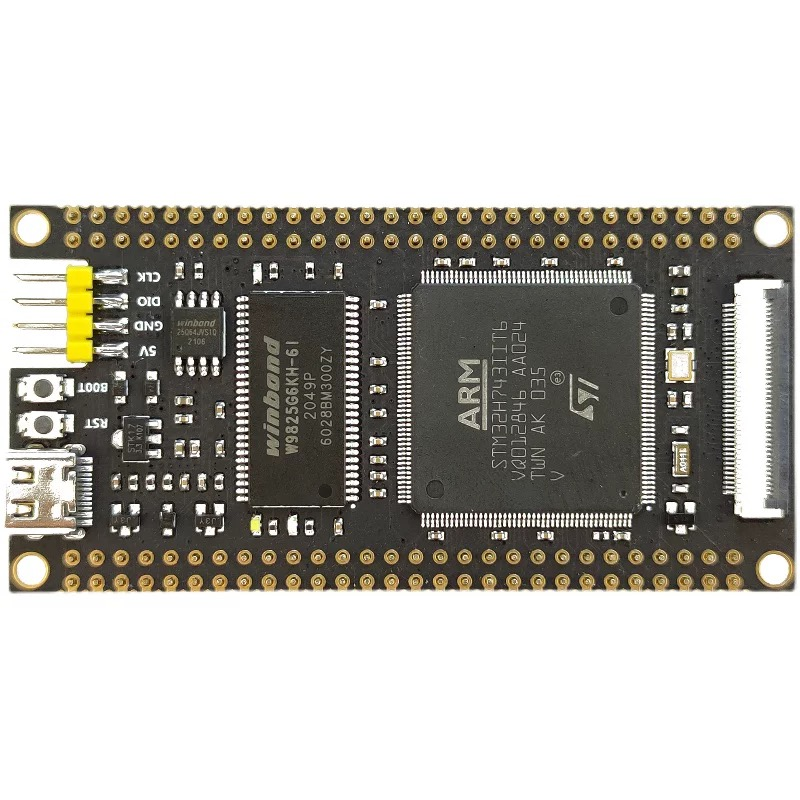
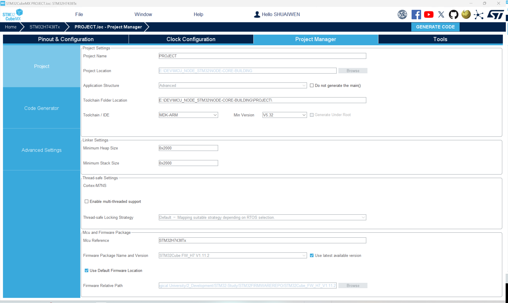

# 初始化设置

!!! note
    '初始化设置' 是设置主控系统的第一步，使得系统能够运行基本功能。 本节重点介绍主控板的基本设置。

## 硬件准备

为了编程主控板，我们需要三个组件：

- **主控板** - 嵌入 MCU 的开发板
- **USB-TTL 适配器** - 将主控板连接到计算机
- **调试器**（ST-LINK V2、J-LINK 等） - 用于编程主控板

### 组件 1 - 主控板 - FANKE743

{: width="500px" height="500px" }

-   :shopping_cart:{ .lg .middle } __产品链接__

    ---

    产品链接

    [:octicons-arrow-right-24: <a href="https://m.tb.cn/h.glFZRKv3mP2cLID?tk=G3YX3VNEVf9" target="_blank"> Purchase Link </a>](#)

### 组件 2 - USB-TTL 适配器

-   :shopping_cart:{ .lg .middle } __产品链接__

    ---

    产品链接

    [:octicons-arrow-right-24: <a href="[https://m.tb.cn/h.glFZRKv3mP2cLID?tk=G3YX3VNEVf9 ](https://www.waveshare.com/usb-to-ttl.htm)" target="_blank"> Purchase Link </a>](#)

### 组件 3 - 调试器

-   :shopping_cart:{ .lg .middle } __产品链接__

    ---

    产品链接

    [:octicons-arrow-right-24: <a href="https://item.taobao.com/item.htm?spm=a21n57.1.item.27.6054523cmH3JcG&priceTId=2100cfb417239664885743719e0be4&utparam=%7B%22aplus_abtest%22:%229e72697eebf441849f1700870339a8ad%22%7D&id=563709870959&ns=1&xxc=ad_ztc&skuId=4855986632645&pisk=f0QtthmAvJ2MWVqc51ZHoIBZO6FhkNCaIO5SoKvic9BdGp00_Fq2ktpd3dxM5d0vksBVntC4_I9fhtpcjk4l_182l82Yrzfaj-w8eOn61HNXNIibWyq31182l-hnlu4R_T3APFwvcWLBMIMXlhTXRB9eiIMfhdtIdQdylK6XlWKBNCHjhqg6RDO-prF9LfOtki9ODYeK070xkwdQQL1TzqAdRCd6e1_t0ml26hp51pelUvmvAs-AujuvC1sP3Q6sC8xNGMBp6EUnfU1dcTdF5zD9TGfCZp1-N41wWgQJ5GeEYFXORe_12jgf9FpwABKKBJp576_yRH47w6_FI17dijaXtTvC_NTYP7895dTpTZ2E5KICcNxwuAwkbssdpCL54FblyrcnELdmfWFK0m-6t3YMuVa08PTD9LV6fmo2mBRpEWFn0m-3DBpu1mmq0n3R." target="_blank"> Purchase Link </a>](#)

!!! info
    CMSIS-DAP, ST-LINK, J-LINK等调试器都可以用于编程主控板。任何一种调试器都可以用来对主控板进行编程。

## 硬件连接

将三个组件按照上图所示进行连接。然后将 USB-TTL 适配器连接到计算机的 USB 端口，将调试器连接到计算机的 USB 端口。

## 软件准备

### STM32CUBEMX

STM32CUBEMX 是一个图形化工具，允许非常轻松地配置 STM32 微控制器，并通过分步过程生成相应的初始化 C 代码。可以从 [官方网站](https://www.st.com/en/development-tools/stm32cubemx.html) 下载并安装 STM32CubeMX。

### KEIL MDK

KEIL MDK 是一个适用于广泛的 ARM Cortex-M 系列微控制器设备的完整软件开发环境。可以从 [官方网站](https://www.keil.com/demo/eval/arm.htm) 下载并安装 KEIL MDK。

## 软件设置

### 在 STM32CUBEMX 中创建新项目

#### 新建项目

打开 STM32CubeMX，点击“文件”选项卡，然后选择“新建项目”选项。

#### 选择 MCU 系列和型号

选择 MCU 系列和 MCU 型号。然后点击“开始项目”。

#### 启用内存保护单元

启用“内存保护单元”，并点击“YES”。

#### 项目信息和代码生成配置

首先按照上图所示设置项目信息和代码生成配置。然后点击“生成代码”。

### 系统配置

让我们回到 Pinout & Configuration（引脚配置）选项卡，并按照下图配置系统。

#### 系统核心 - SYS: 时间基准源

选择“SYS”选项卡，然后将“时间基准源”选择为“SysTick”。

#### 系统核心 - RCC: 高速时钟 (HSE) 和低速时钟 (LSE)

选择“RCC”选项卡，并按照上图配置“高速时钟 (HSE)”和“低速时钟 (LSE)”。两者均设置为“晶体/陶瓷谐振器”。通常来说，外部晶振比内部 RC 振荡器更精确。

#### 系统核心 - CORETEX_M7: 启用 I-Cache、D-Cache 和 MPU

选择“CORETEX_M7”选项卡，并按照上图启用“I-Cache”、“D-Cache”和“MPU”。某些高级功能需要启用 I-Cache、D-Cache 和 MPU，例如 X-CUBE-AI。

#### 定时器 - RTC: 启用 RTC

选择“RTC”选项卡，并按照上图启用“RTC”。RTC 是一个实时时钟，可以用于跟踪当前时间和日期。这里我们启用 RTC 以备将来的应用。

#### 跟踪和调试 - DEBUG: 启用串行线

选择“DEBUG”选项卡，并按照上图启用“串行线”。串行线是一种调试接口，允许调试器与 MCU 通信。

#### 时钟配置

按照上图配置时钟。时钟配置对 MCU 正常运行至关重要。

!!! note
    到目前为止，我们已经完成了MCU的基本配置，可以最后检查一下目前的配置然后点击“生成代码”按钮生成代码。我们会在接下来的章节中继续配置软件环境。
