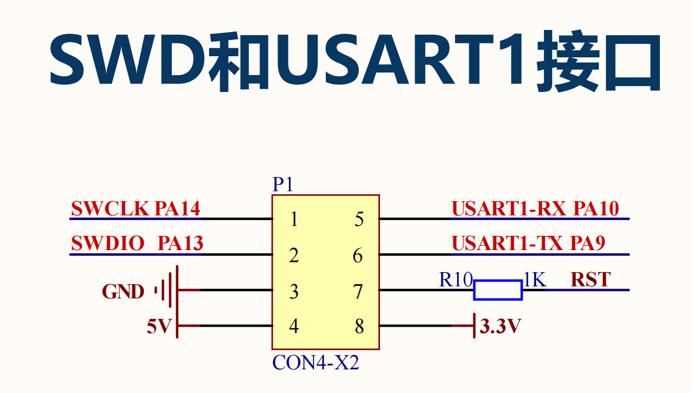

# USART

USART can be used for many different purposes, and for now, only USART1 is used for serial communication.

!!! alert
    This version is used for non-interactive version, as interruption and DMA features are enabled, kind of difficult to do interactive menu. For interactive version, please refer to the 'interactive' version.

## USART1 CIRCUIT


As can be seen from the circuit design, the RX and TX for USART1 are PA9 and PA10, respectively. However, the default choices are not, so we need to change them manually at the pin configuration at the right hand side of the screen.

## USART1 CONFIGURATION

### PARAMETER SETUP


Select 'Parameter Settings' to setup parameters for USART1. Let's keep the default settings for now.

### DMA SETUP

!!! info
    DMA stands for Direct Memory Access. It is a feature that allows peripherals to access memory without involving the CPU. This can greatly reduce the CPU load and improve the system performance.


Let's create two DMA channels for USART1. One for transmitting data and the other for receiving data.

### NVIC SETUP

!!! info
    NVIC stands for Nested Vectored Interrupt Controller. It is a feature that allows the MCU to prioritize interrupts and manage them efficiently.


Here, let's enable the USART1 global interrupt. Note that for DMA, the interrupts are by default enabled once you enable the DMA channels.

## GENERATE AND UPDATE CODE
Finally, let's generate the code to save the current progress and to make it ready for following programming steps. Click the 'Generate Code' button at the top right corner of the screen.

## PROGRAMMING IN KEIL

### INCORPORATE THE MODULE CODE

We have introduced how to transplant and incorporate the BSP code into the project, and that applies to each respective module. For transplantation:

1. Copy the module codes from the BSP project to the user project.
2. Add the module codes to the user project include path.
3. Add the module codes to the project items.
4. Include the header file of the module code in the user project.
5. Call the module function in the user project.

!!! tip
    Do remember to check the 'Use MicroLib' to enable the print out function in the 'Options for Target' -> 'Target' -> 'Code Generation' -> 'Use MicroLib'.

### CODE REVIEW - USART

Let's review the code for the USART module. 

#### **iusart.h**

```c
/**
 * @file iusart.h
 * @author SHUAIWEN CUI (shuaiwencui AT gmail DOT com)
 * @brief This is the header file for the iusart.c file
 * @version 1.0
 * @date 2024-06-24
 * 
 * @copyright Copyright (c) 2024
 * 
 */

#ifndef IUSART_H_
#define IUSART_H_

/**
 * ! INCLUDES
 */

#include "stm32h7xx_hal.h" // HAL library file declaration, replace it with the corresponding file according to the actual situation
#include <string.h> // Library for string processing
#include <stdarg.h>
#include <stdlib.h>
#include <stdbool.h>
#include <stdint.h>
#include <stdio.h>
//#include "iled.h"
// #include "../tim/tim.h"


/**
 * ! MACROS
 * ! Note that TX_BUF_SIZE and RX_BUF_SIZE are the caps for the TX_BUF and RX_BUF arrays, adjust them accordingly.
 * ! Note for receiving, if you use interrupt mode, the interrupt will only be triggered when the buffer RX_BUF is full, assuming you are using the HAL_UART_RxCpltCallback function.
 */


#define TX_MODE 2 // Define the transmission mode: 0 - blocking mode (not recommended), 1 - interrupt mode (* recommended), and 2 - DMA mode (** recommended) !!! note that mode 2 sometimes does not work, not sure about the reason.
#define RX_MODE 3 // Define the reception mode: 0 - blocking mode (not recommended), 1 - interrupt mode (recommended), and 2 - DMA mode (recommended); 3 - DMA IDLE mode (recommended) (only when IDLE_MODE is enabled)

//IDLE mode means non fixed length of data, the data is received until the idle line is detected
#if RX_MODE >= 3
#define IDLE_MODE 
#endif

#define TX_BUF_SIZE 512 // Define the size of the sending buffer
#define RX_BUF_SIZE 128 // Define the size of the receiving buffer. 
#define RX_IDLE_BUF_SIZE 512 // Define the size of the idle receiving buffer (IDEL Mode)

/**
 * ! VARIABLES
 * 
 */
extern UART_HandleTypeDef huart1;// Declare the HAL library structure of USART1
extern DMA_HandleTypeDef hdma_usart1_rx; // Declare the HAL library structure of DMA for USART1
extern char RX_BUF[RX_BUF_SIZE]; // Define the receiving buffer
extern char RX_IDLE_BUF[RX_IDLE_BUF_SIZE];


/**
 * ! FUNCTION PROTOTYPES
 * 
 */

void MCU_serial_init(void);
void MCU_send(uint8_t *pData, uint16_t size); // lower level function wrapped by MCU_printf
void MCU_printf(const char *format, ...);

#ifndef IDLE_MODE
void HAL_UART_RxCpltCallback(UART_HandleTypeDef  *huart); 
#else
void HAL_UARTEx_RxEventCallback(UART_HandleTypeDef *huart, uint16_t size);
#endif


#endif /* IUSART_H_ */

```

#### **iusart.c**

```c
/**
 * @file iusart.c
 * @author SHUAIWEN CUI (shuaiwencui@gmail.com)
 * @brief This is the source file for the iusart.c file
 * @version 1.0
 * @date 2024-06-24
 *
 * @copyright Copyright (c) 2024
 *
 */

#include "iusart.h"

/**
 * @name test part
 *
 */

char RX_BUF[RX_BUF_SIZE];           // Define the receiving buffer
char RX_IDLE_BUF[RX_IDLE_BUF_SIZE]; // Define the idle receiving buffer (IDEL Mode)

/**
 * @name MCU_serial_init
 * @brief This function is used to initialize the USART1, and the reception method is according to the reception mode RX_MODE defined in the iusart.h file. The normal mode is the blocking mode, not recommended as it will block the main loop and causes waste of CPU resources; the interrupt mode is recommended; and the DMA mode is the most recommended.
 *
 */
void MCU_serial_init(void)
{
    // Note the last element in the buffer can be "\n", as every time you send message from PC, a "\n" is appended to the end of your message.

    if (RX_MODE == 0)
    {
        HAL_UART_Receive(&huart1, (uint8_t *)&RX_BUF, RX_BUF_SIZE, HAL_MAX_DELAY); // Initial receive
        // memset(RX_BUF, 0, sizeof(RX_BUF));
    }
    else if (RX_MODE == 1)
    {
        HAL_UART_Receive_IT(&huart1, (uint8_t *)&RX_BUF, RX_BUF_SIZE); // Enable receive interrupt
        // memset(RX_BUF, 0, sizeof(RX_BUF));
    }
    else if (RX_MODE == 2)
    {
        HAL_UART_Receive_DMA(&huart1, (uint8_t *)&RX_BUF, RX_BUF_SIZE); // Enable receive interrupt
        // memset(RX_BUF, 0, sizeof(RX_BUF));
    }
    else if (RX_MODE == 3)
    {
        // Enable the idle mode DMA reception
        HAL_UARTEx_ReceiveToIdle_DMA(&huart1, (uint8_t *)&RX_IDLE_BUF, sizeof(RX_IDLE_BUF)); // Enable receive interrupt
        // memset(RX_IDLE_BUF, 0, sizeof(RX_IDLE_BUF));
        // __HAL_DMA_DISABLE_IT(&hdma_usart1_rx, DMA_IT_HT); // Disable the half-transfer interrupt
    }
}

/**
 * @name MCU_Send
 * @brief This function is used to send data through the USART1, and the transmission method is according to the transmission mode TX_MODE defined in the iusart.h file
 * @param pData: The pointer to the data to be sent
 * @param size: The size of the data to be sent
 * @retval None
 *
 */
void MCU_send(uint8_t *pData, uint16_t size)
{
    if (TX_MODE == 0) // blocking mode - not recommended
    {
        HAL_UART_Transmit(&huart1, pData, size, HAL_MAX_DELAY);
    }
    else if (TX_MODE == 1) // interrupt mode - recommended
    {
        HAL_UART_Transmit_IT(&huart1, pData, size);
    }
    else if (TX_MODE == 2) // DMA mode - recommended
    {
        HAL_UART_Transmit_DMA(&huart1, pData, size);
    }
}

/**
 * @name MCU_printf
 * @brief This function is used to send formatted data through the USART1, and the transmission method is according to the transmission mode TX_MODE defined in the iusart.h file
 * @param format: The pointer to the formatted string to be sent
 * @param ...: The arguments to be formatted
 * @retval None
 *
 */
void MCU_printf(const char *format, ...)
{
    char TX_BUF[TX_BUF_SIZE]; // Define the sending buffer
    va_list args;
    va_start(args, format);
    vsnprintf(TX_BUF, TX_BUF_SIZE, format, args);
    va_end(args);
    MCU_send((uint8_t *)TX_BUF, strlen(TX_BUF));
}

#ifndef IDLE_MODE
/**
 * @name HAL_UART_RxCpltCallback
 * @brief This function is the callback function for the USART1 receive interrupt, and the received data is stored in the RX_BUF array
 *
 */

void HAL_UART_RxCpltCallback(UART_HandleTypeDef *huart) // Serial port interrupt callback function
{
    if (huart == &huart1) // Determine the source of the interrupt (serial port 1: USB to serial port)
    {
        if (RX_MODE == 1)
        {
            MCU_send((uint8_t *)RX_BUF, strlen(RX_BUF));
            HAL_UART_Receive_IT(&huart1, (uint8_t *)&RX_BUF, RX_BUF_SIZE); // Enable receive interrupt
        }
        else if (RX_MODE == 2)
        {
            MCU_send((uint8_t *)RX_BUF, strlen(RX_BUF));
            HAL_UART_Receive_DMA(&huart1, (uint8_t *)&RX_BUF, RX_BUF_SIZE); // Enable receive interrupt
        }
    }
}

#else

/**
 * @name HAL_UARTEx_RxEventCallback
 * @brief This function is the callback function for the USART1 receive idle interrupt, and the received data is stored in the RX_BUF array
 * ! Note: this function has higher priority than HAL_UART_RxCpltCallback, if this function is defined, HAL_UART_RxCpltCallback will not be called
 *
 */
void HAL_UARTEx_RxEventCallback(UART_HandleTypeDef *huart, uint16_t size)
{
    if (huart == &huart1) // Determine the source of the interrupt (serial port 1: USB to serial port)
    {
        if (RX_MODE == 3)
        {
            MCU_send((uint8_t *)RX_IDLE_BUF, size);                                              //! the size here is provided by the passed parameter size
            HAL_UARTEx_ReceiveToIdle_DMA(&huart1, (uint8_t *)&RX_IDLE_BUF, sizeof(RX_IDLE_BUF)); // Enable receive interrupt
            // __HAL_DMA_DISABLE_IT(&hdma_usart1_rx, DMA_IT_HT);                                    // Disable the half-transfer interrupt
            //    memset(RX_IDLE_BUF, 0, sizeof(RX_IDLE_BUF));
        }
    }
}
#endif

```

### EXPLANATION OF THE CODE

!!! tip
    Sometimes the 'MCU_printf' is not working well, but 'printf' works well. So, we can use 'printf' instead of 'MCU_printf'.