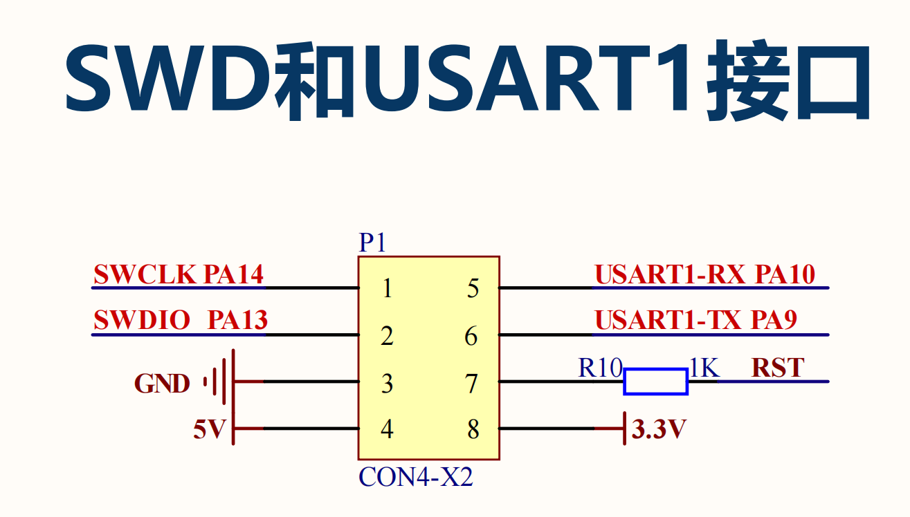
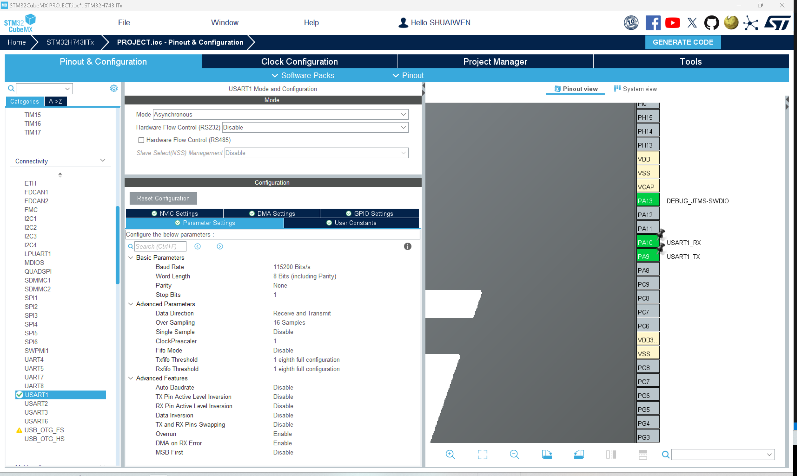
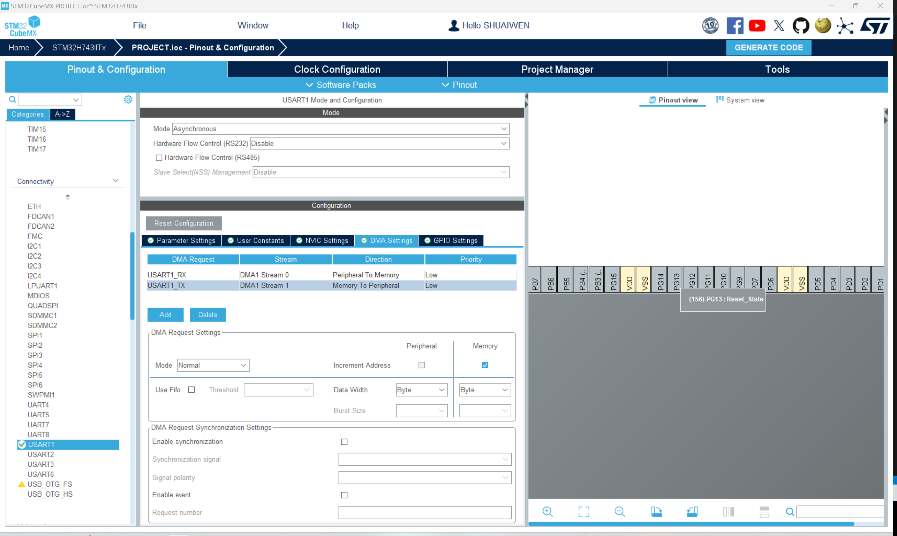
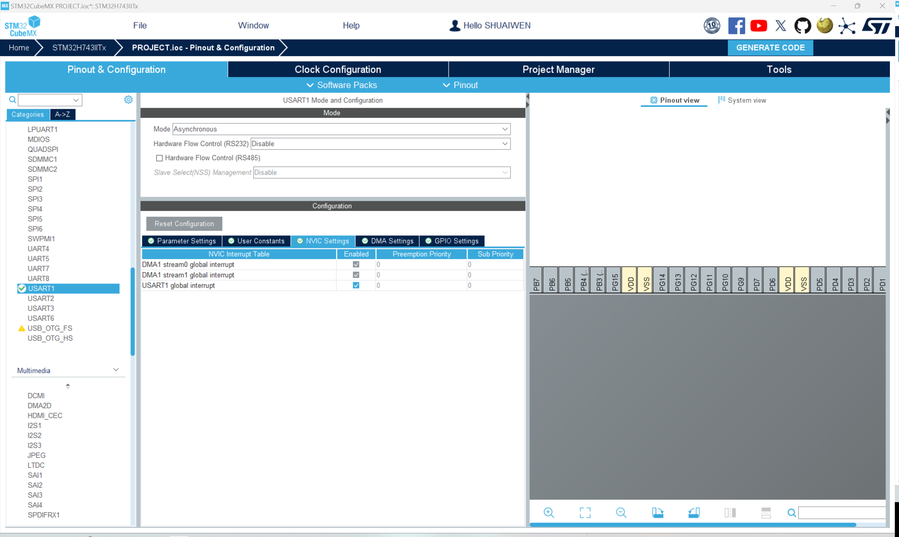

# 通用同步/异步收发器（USART）

USART可以用于多种不同的用途，目前我们只使用USART1进行串行通信。

## USART1电路

从电路设计可以看出，USART1的RX和TX分别是PA9和PA10。然而，默认选择的引脚并不是这两个，因此我们需要在屏幕右侧的引脚配置中手动更改它们。

## USART1配置

### 参数设置

选择“参数设置”以设置USART1的参数。我们暂时保持默认设置。

### DMA设置

!!! info
    DMA代表直接存储器访问（Direct Memory Access）。这是一个允许外设在不涉及CPU的情况下访问内存的功能。这样可以大大减少CPU负载并提高系统性能。

我们为USART1创建两个DMA通道，一个用于发送数据，另一个用于接收数据。

### NVIC设置

!!! info
    NVIC代表嵌套向量中断控制器（Nested Vectored Interrupt Controller）。这是一个允许MCU对中断进行优先级排序并高效管理的功能。

在这里，我们启用USART1的全局中断。请注意，对于DMA，一旦启用DMA通道，中断将默认启用。

最后，让我们生成代码以保存当前进度，并为后续编程步骤做好准备。单击屏幕右上角的“生成代码”按钮。

## 生成与更新代码
接下来，我们生成代码以保存当前进度，并使其准备好进行后续的编程步骤。点击屏幕右上角的“生成代码”按钮。