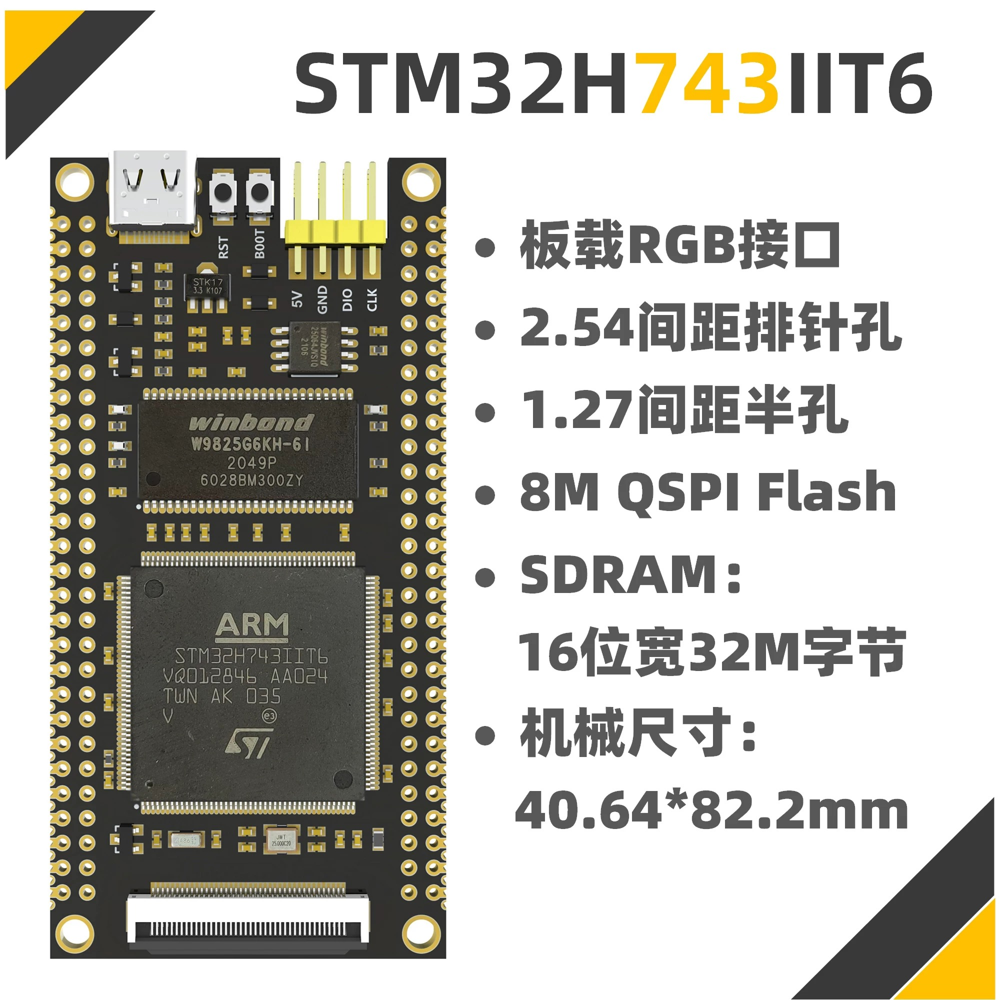
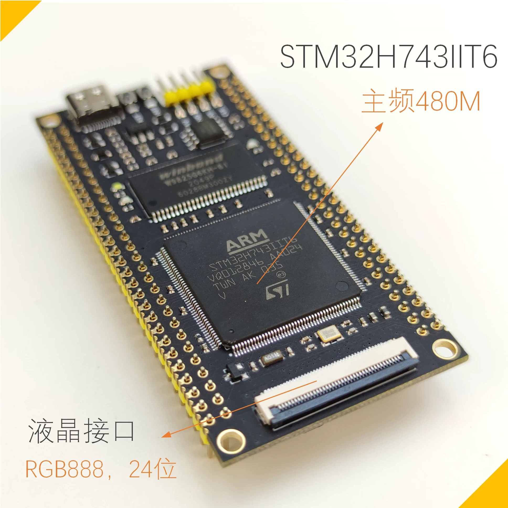
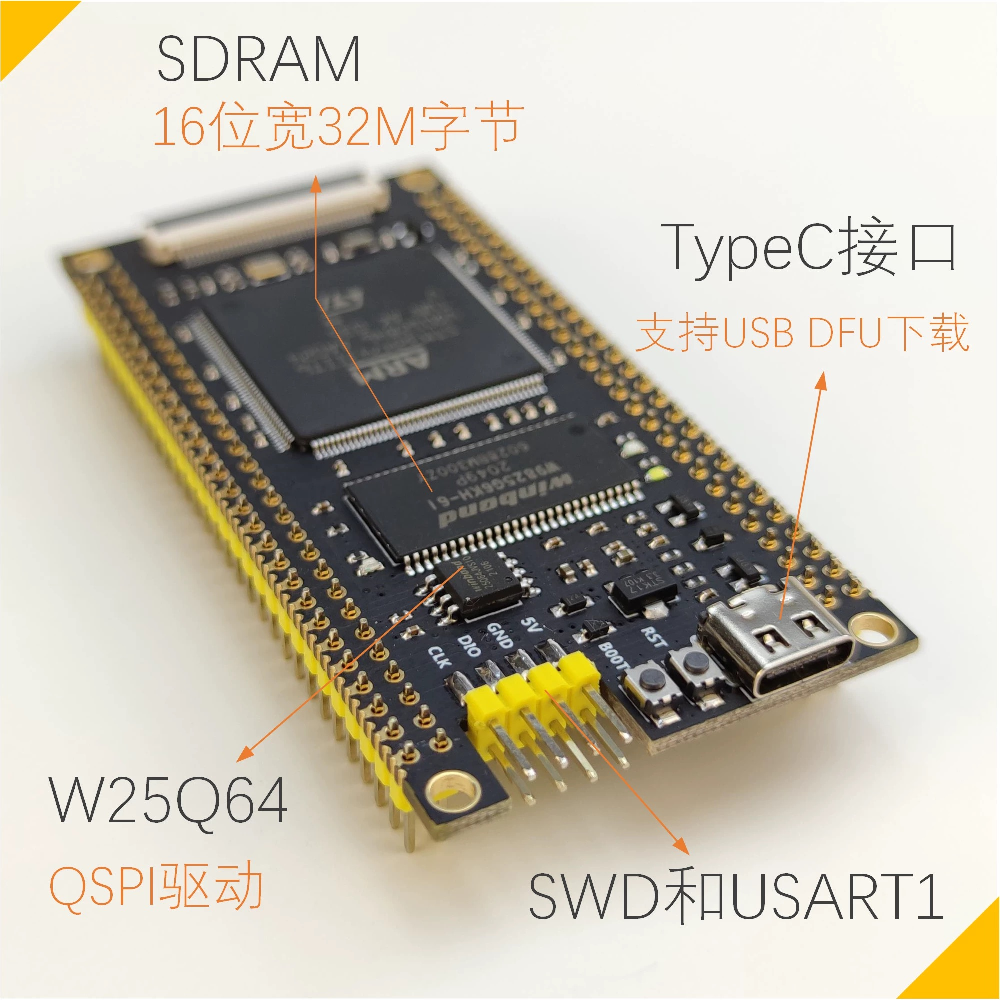
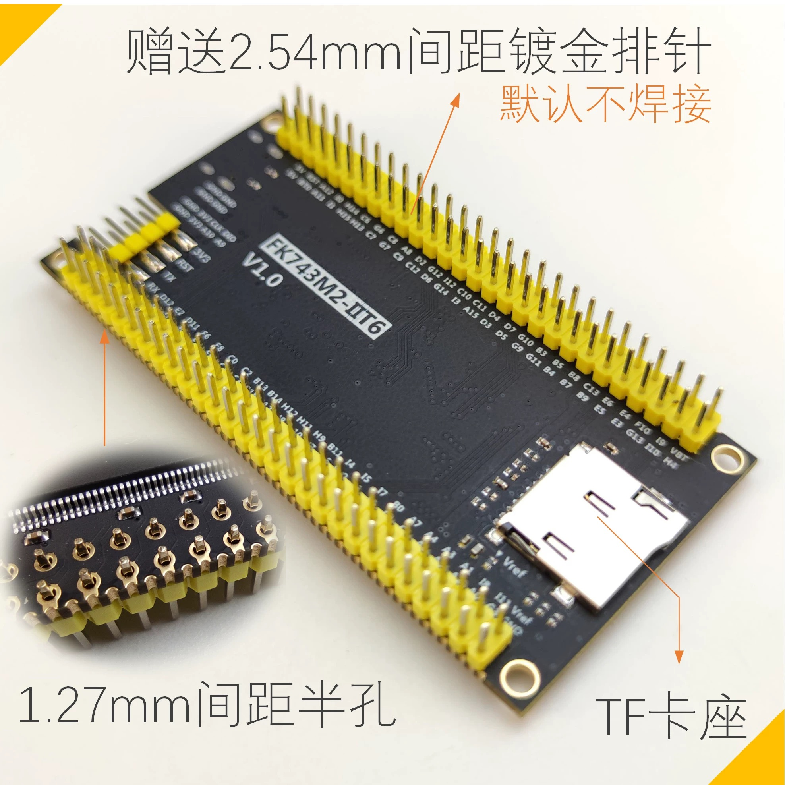
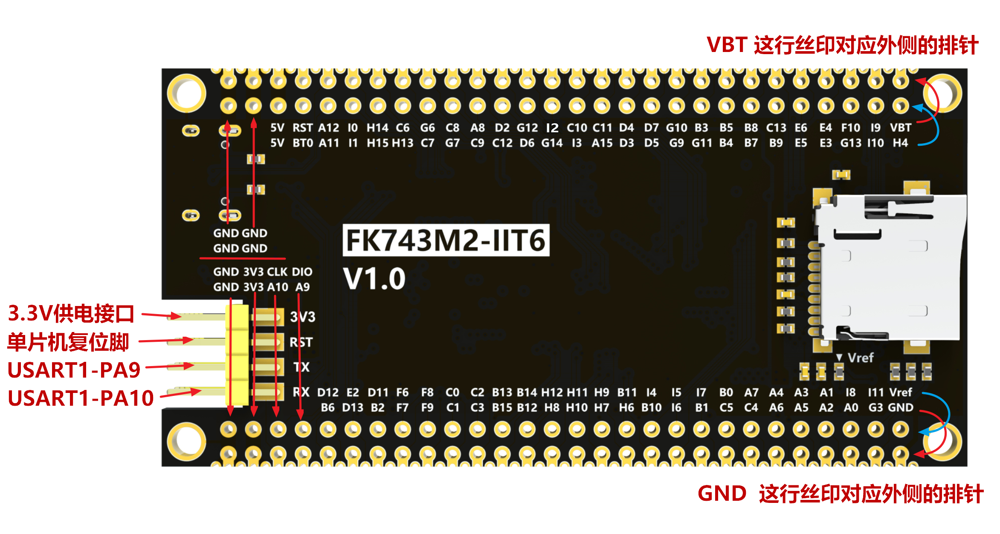

# MAIN CONTROL

## MAIN CONTROL OVERVIEW
{: width="500px" height="500px" }

-   :shopping_cart:{ .lg .middle } __product link on Taobao__

    ---

    Product link on Taobao

    [:octicons-arrow-right-24: <a href="https://m.tb.cn/h.glFZRKv3mP2cLID?tk=G3YX3VNEVf9 " target="_blank"> Purchase Link </a>](#)

## ONBOARD RESOURCES
- MAIN FREQUENCY: 480MHz
- RAM: 1MB (BUILT-IN)
- ROM: 2MB (BUILT-IN)
- SDRAM: 32MB (16BIT) WINBOND W9825G6KH-6I
- FLASH: 8MB (QSPI) WINBOND W25Q64
- TF CARD: 32GB (MAXIMUM) (BY TEST, LARGER CAPACITY IS SUPPORTED)
- LED: 1 PWR; 1 PROGRAMMABLE
- BUTTON: 1 RESET; 1 BOOT
- USB: TYPE-C
- PINS: 2.54MM PITCH, 2x2x28PINS

{: width="500px" height="500px" }

{: width="500px" height="500px" }

{: width="500px" height="500px" }

{: width="500px" height="500px" }

{: width="800px" height="800px" }

{: width="700px" height="700px" }

## MECHANICAL DIMENSIONS

<iframe src="http://www.cuishuaiwen.com:7500/DEV/FK-STM32H743/FK743-MECHANICAL-DESIGN.pdf" width="100%" height="600px"></iframe>

## CIRCUIT DIAGRAM

<iframe src="http://www.cuishuaiwen.com:7500/DEV/FK-STM32H743/FK743-LAYOUT.pdf" width="100%" height="600px"></iframe>

