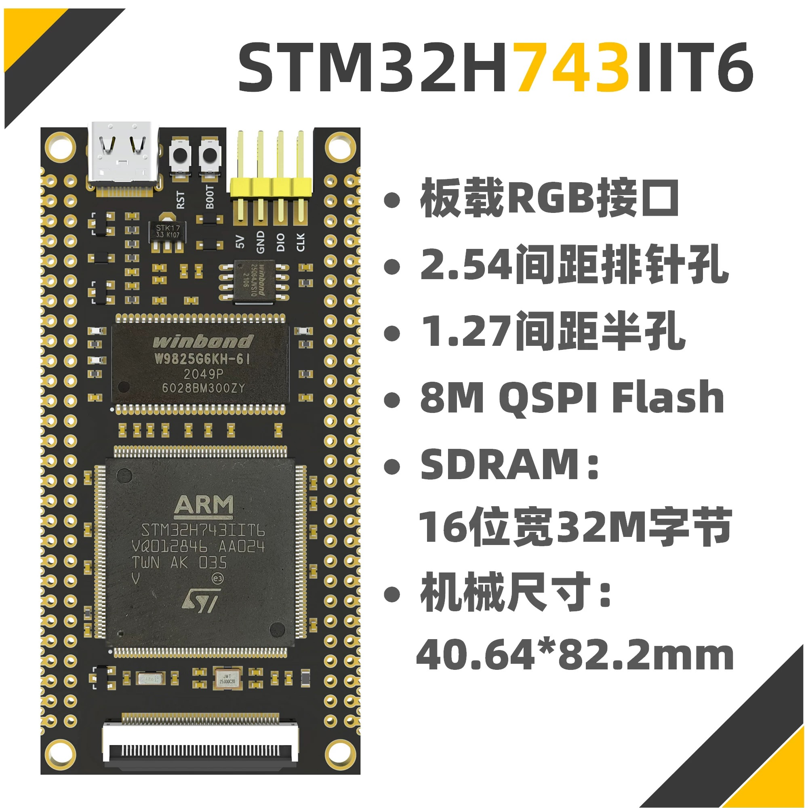
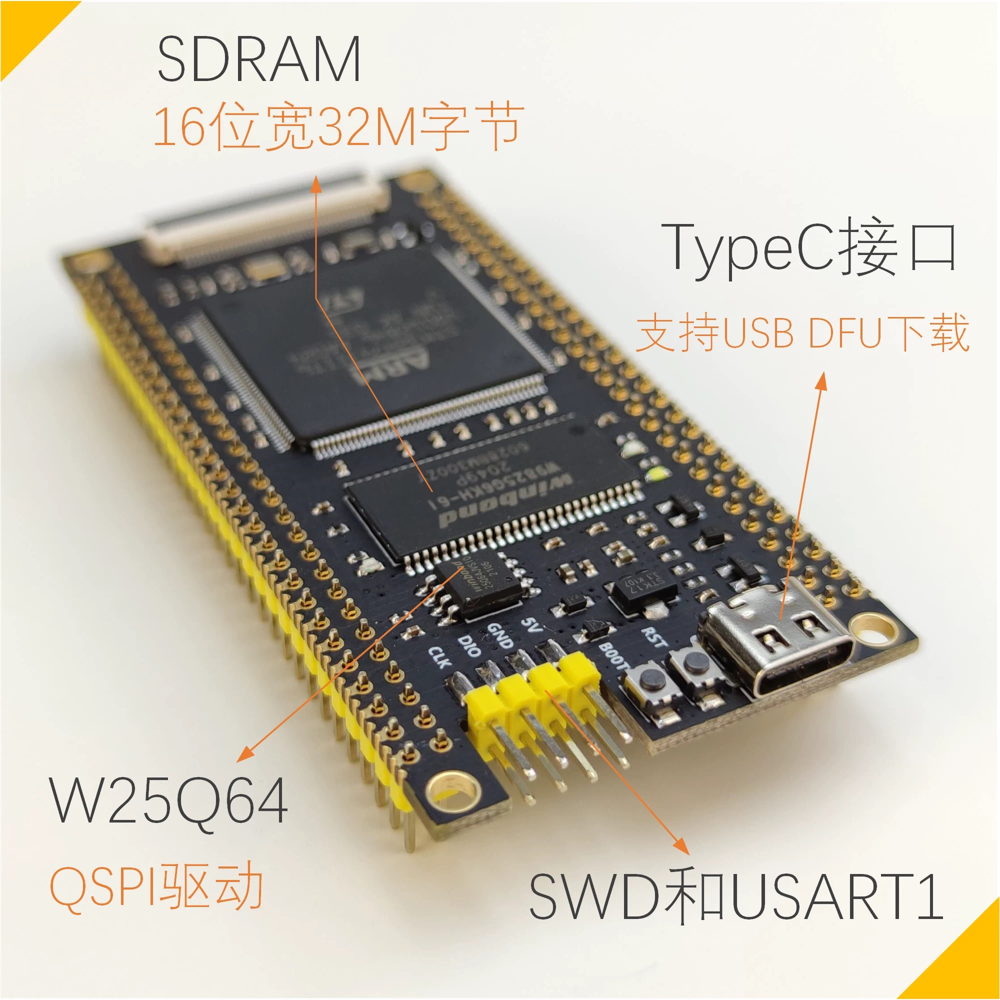

# 主控

## 主控概览
{: width="500px" height="500px" }

-   :shopping_cart:{ .lg .middle } __淘宝链接__

    ---

    商品淘宝链接

    [:octicons-arrow-right-24: <a href="https://m.tb.cn/h.glFZRKv3mP2cLID?tk=G3YX3VNEVf9 " target="_blank"> 购买链接 </a>](#)

## 板载资源
- 主频: 480MHz
- RAM: 1MB (内置)
- ROM: 2MB (内置)
- SDRAM: 32MB (16位) WINBOND W9825G6KH-6I
- FLASH: 8MB (QSPI) WINBOND W25Q64
- TF卡: 32GB (最大) (经测试, 支持更大容量)
- LED: 1 PWR; 1 可编程
- 按钮: 1 RESET; 1 BOOT
- USB: TYPE-C
- 引脚: 2.54mm 间距, 2x2x28引脚

{: width="500px" height="500px" }

{: width="500px" height="500px" }

{: width="500px" height="500px" }

{: width="500px" height="500px" }