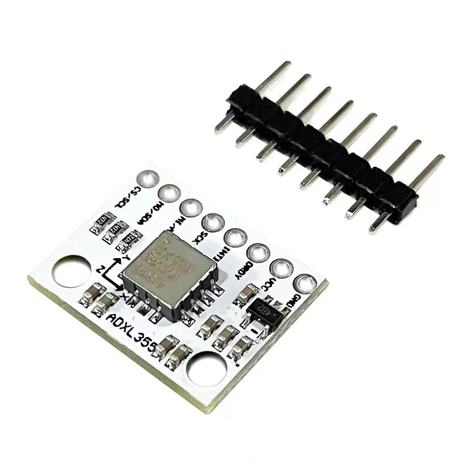
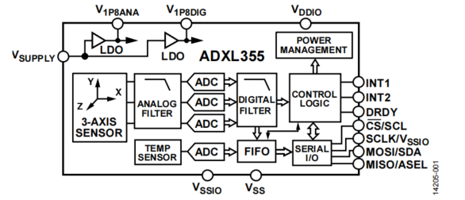

# ADXL355 Accelerometer

## INTRODUCTION TO ADXL355

The ADXL355 is a high-precision, low-noise, three-axis MEMS accelerometer from Analog Devices. It is designed for applications requiring high accuracy and low noise, such as seismic monitoring, tilt sensing, and vibration analysis. The ADXL355 offers excellent stability with low drift over time and temperature, making it suitable for long-term monitoring applications.

This accelerometer has a selectable measurement range of ±2g, ±4g, or ±8g and provides 20-bit output resolution. It features a low noise density of 25 µg/√Hz and operates with very low power consumption, typically around 200 µA in measurement mode. The ADXL355 communicates via an SPI or I²C interface and includes features like a digital temperature sensor, FIFO buffer, and configurable bandwidth. Its robust design ensures reliability in harsh environments, making it ideal for industrial and scientific applications.

{: width="70%"}
{: width="70%"}
{: width="100%"}

-   :shopping_cart:{ .lg .middle } __product link on Taobao__

    ---

    Product link on Taobao

    [:octicons-arrow-right-24: <a href="https://m.tb.cn/h.gOAa1c9dkkkeJvb?tk=AzO934Jjml0" target="_blank"> Purchase Link </a>](#)

## KEY PARAMETERS

| Parameter          | Value                        |
|--------------------|------------------------------|
| Operating Current  | 200 µA (measurement mode)    |
| Measurement Range  | ±2g, ±4g, ±8g                |
| Resolution         | 20-bit                       |
| Noise Density      | 25 µg/√Hz                    |
| Communication      | SPI, I²C                     |
| Supply Voltage     | 2.0V to 3.6V                 |
| Built-in Features  | Digital Temperature Sensor, FIFO Buffer |

## DEV REFERENCE

-   :material-file:{ .lg .middle } __SPI__

    ---

    [:octicons-arrow-right-24: <a href="https://blog.csdn.net/as480133937/article/details/105764119" target="_blank"> Portal </a>](#)

