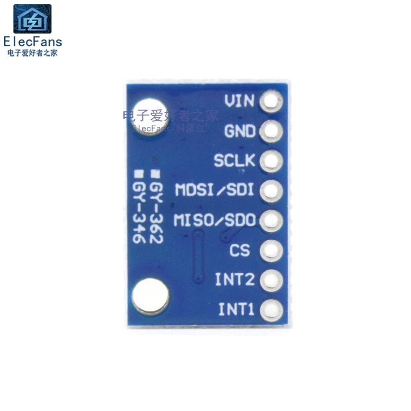
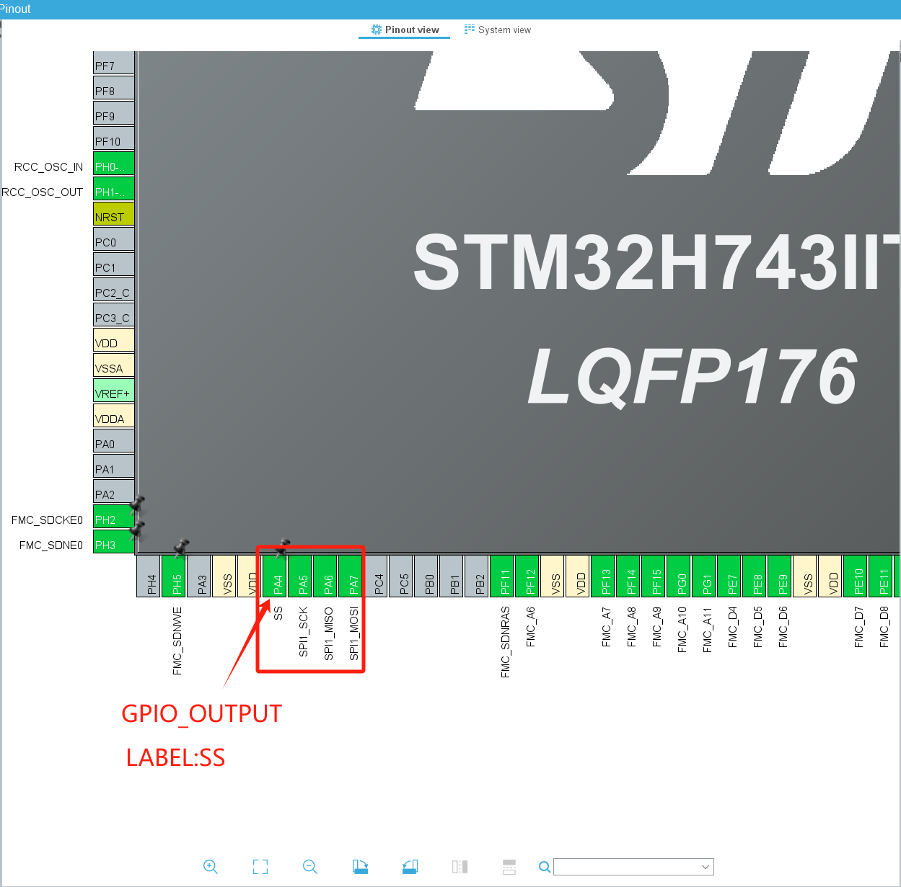
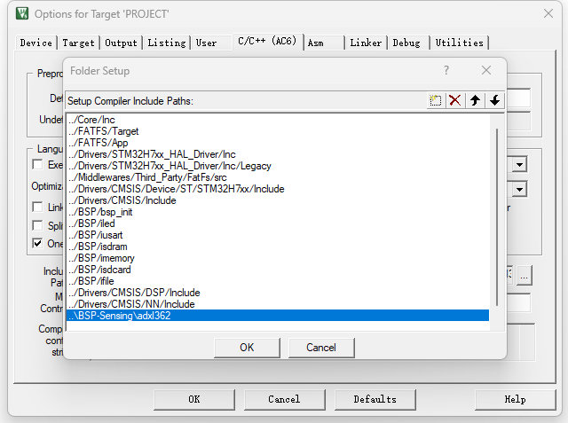
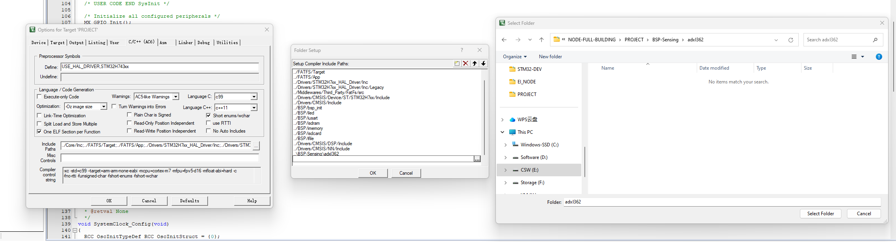
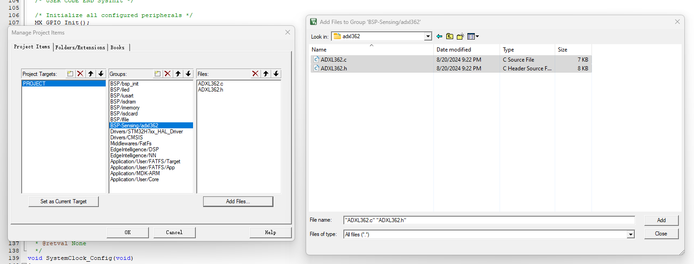

# ADXL362 Accelerometer

## INTRODUCTION TO ADXL362

The ADXL362 is an ultra-low-power, three-axis digital accelerometer from Analog Devices. It is designed for applications requiring minimal power consumption, such as wearable devices, portable electronics, and wireless sensor networks. The ADXL362 operates on as little as 1.8 µA in measurement mode and 270 nA in standby mode, making it highly energy-efficient.

The sensor offers a wide measurement range from ±2g to ±8g and provides high-resolution output with a 12-bit digital resolution. It communicates via a SPI interface, and includes features like a programmable activity/inactivity sensing, wake-up, and a built-in temperature sensor. The ADXL362 is also known for its noise performance, ensuring accurate and reliable motion detection in low-power applications.

{: width="70%"}
{: width="70%"}

-   :shopping_cart:{ .lg .middle } __product link on Taobao__

    ---

    Product link on Taobao

    [:octicons-arrow-right-24: <a href="https://m.tb.cn/h.gmUamYr0olYwEiw?tk=CKLS34JO9QL" target="_blank"> Purchase Link </a>](#)

## KEY PARAMETERS

| Parameter          | Value                      |
|--------------------|----------------------------|
| Operating Current  | 1.8 µA (measurement mode)  |
| Standby Current    | 270 nA                     |
| Measurement Range  | ±2g, ±4g, ±8g              |
| Resolution         | 12-bit                     |
| Communication      | SPI                        |
| Supply Voltage     | 1.6V to 3.5V               |
| Noise Performance  | 550 µg/√Hz (typical)       |
| Built-in Features  | Activity/Inactivity Detection, Temperature Sensor |

## DEV REFERENCE

-   :material-file:{ .lg .middle } __STM32 ADXL362__

    ---

    [:octicons-arrow-right-24: <a href="https://blog.csdn.net/qq_41777559/article/details/115492823?ops_request_misc=%257B%2522request%255Fid%2522%253A%2522172414869816800207094200%2522%252C%2522scm%2522%253A%252220140713.130102334..%2522%257D&request_id=172414869816800207094200&biz_id=0&utm_medium=distribute.pc_search_result.none-task-blog-2~all~sobaiduend~default-1-115492823-null-null.142^v100^pc_search_result_base5&utm_term=STM32HAL%E5%BA%93%E5%AE%9E%E7%8E%B0ADXL355%E5%8A%A0%E9%80%9F%E5%BA%A6%E4%BC%A0%E6%84%9F%E5%99%A8%E7%AE%80%E5%8D%95%E8%AE%B0%E6%AD%A5%E5%8A%9F%E8%83%BD%EF%BC%88SPI%EF%BC%89&spm=1018.2226.3001.4187" target="_blank"> Portal </a>](#)

## DEV PROCEDURES

