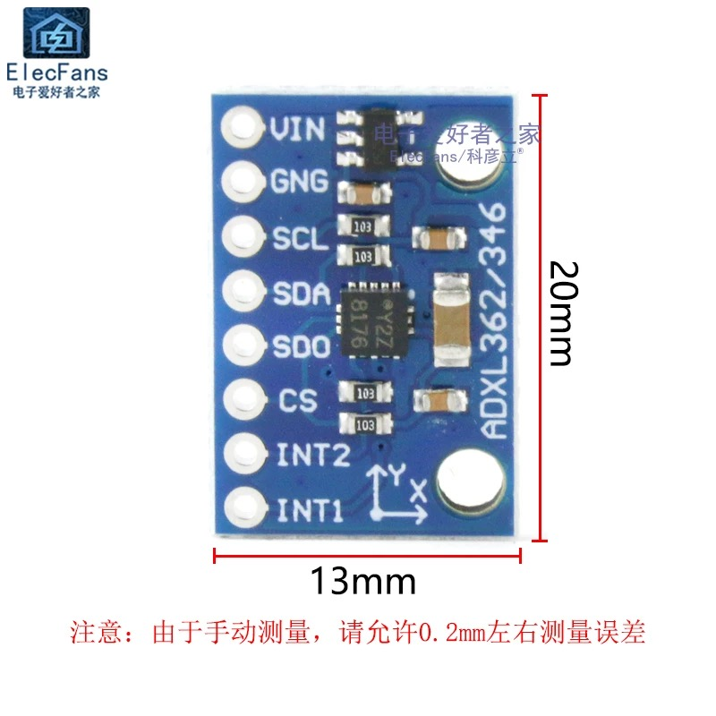
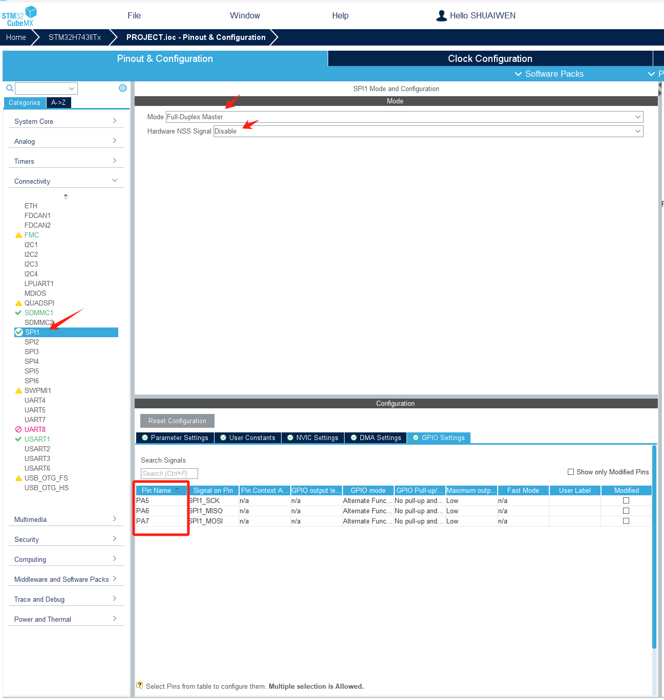
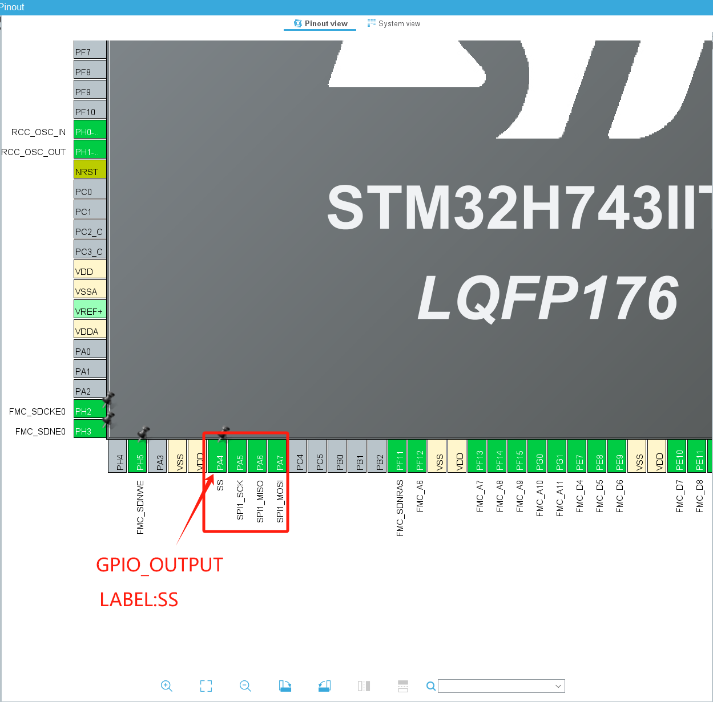
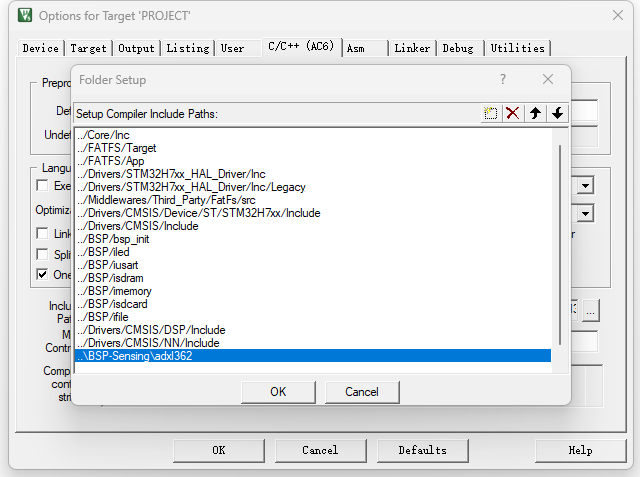
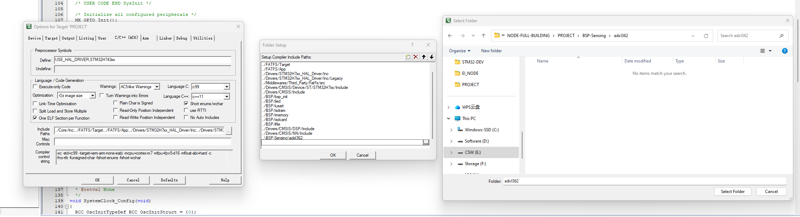
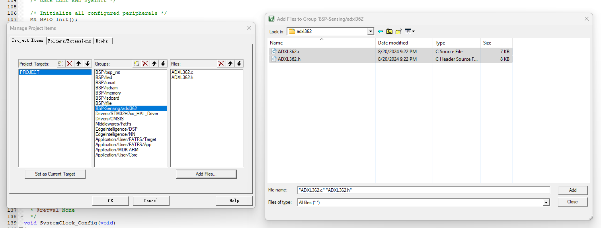

# ADXL362 加速度传感器

## ADXL362 简介

ADXL362 是来自Analog Devices的一款超低功耗三轴数字加速度计，专为需要极低功耗的应用而设计，例如可穿戴设备、便携式电子产品和无线传感网络。ADXL362 在测量模式下的工作电流仅为1.8 µA，待机模式下则仅为270 nA，因此非常节能。

该传感器提供了从±2g到±8g的宽测量范围，并且具有12位的高分辨率输出。它通过SPI接口进行通信，具备可编程的活动/非活动检测、唤醒功能，以及内置的温度传感器。ADXL362 还以其出色的噪声性能著称，能够在低功耗应用中提供精确可靠的运动检测。

{: width="70%"}
{: width="70%"}

-   :shopping_cart:{ .lg .middle } __product link on Taobao__

    ---

    Product link on Taobao

    [:octicons-arrow-right-24: <a href="https://m.tb.cn/h.gmUamYr0olYwEiw?tk=CKLS34JO9QL" target="_blank"> Purchase Link </a>](#)

## 关键参数

| 参数               | 值                         |
|--------------------|----------------------------|
| 工作电流           | 1.8 µA (测量模式)          |
| 待机电流           | 270 nA                     |
| 测量范围           | ±2g, ±4g, ±8g              |
| 分辨率             | 12位                       |
| 通信接口           | SPI                        |
| 电源电压范围       | 1.6V 至 3.5V               |
| 噪声性能           | 550 µg/√Hz (典型值)       |
| 内置功能           | 活动/非活动检测，温度传感器 |

## 开发参考

-   :material-file:{ .lg .middle } __STM32 ADXL362__

    ---

    [:octicons-arrow-right-24: <a href="https://blog.csdn.net/qq_41777559/article/details/115492823?ops_request_misc=%257B%2522request%255Fid%2522%253A%2522172414869816800207094200%2522%252C%2522scm%2522%253A%252220140713.130102334..%2522%257D&request_id=172414869816800207094200&biz_id=0&utm_medium=distribute.pc_search_result.none-task-blog-2~all~sobaiduend~default-1-115492823-null-null.142^v100^pc_search_result_base5&utm_term=STM32HAL%E5%BA%93%E5%AE%9E%E7%8E%B0ADXL355%E5%8A%A0%E9%80%9F%E5%BA%A6%E4%BC%A0%E6%84%9F%E5%99%A8%E7%AE%80%E5%8D%95%E8%AE%B0%E6%AD%A5%E5%8A%9F%E8%83%BD%EF%BC%88SPI%EF%BC%89&spm=1018.2226.3001.4187" target="_blank"> Portal </a>](#)

## 开发流程

