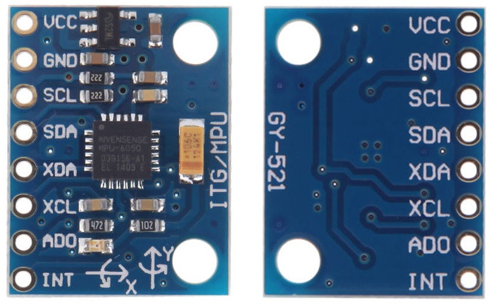
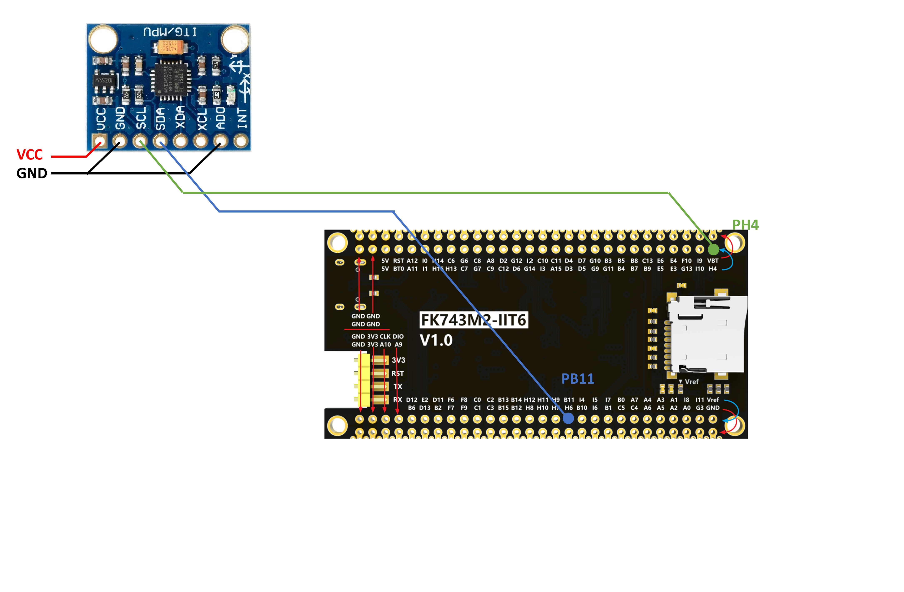
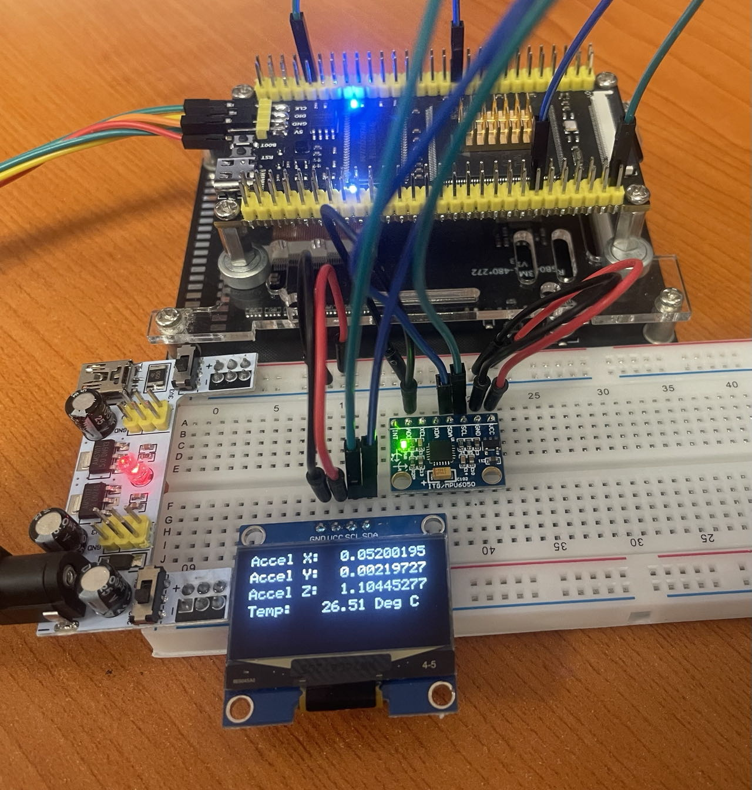

# MPU6050 惯性测量单元

## IMU介绍

IMU（惯性测量单元，Inertial Measurement Unit）是一种传感器设备，主要用于检测和测量物体的加速度和旋转运动。IMU的核心组成部分通常是三轴加速度计和三轴陀螺仪，有时也会集成磁力计以增强其功能。

加速度计：用来测量物体在三个正交轴（X、Y、Z）方向上的线性加速度，包括由于重力引起的加速度。这可以帮助确定设备是否处于静止状态，以及其运动的方向和速度。

陀螺仪：用来测量物体绕三个轴的角速度或旋转速率。这对于理解设备的姿态改变非常关键。

磁力计：虽然不是所有IMU都包含磁力计，但它可以用来测量磁场强度，帮助确定设备相对于地球磁场的方向，从而改善航位推算的准确性。

IMU广泛应用于各种领域，如汽车、航空、航海、消费电子设备（例如智能手机和平板电脑）、机器人技术以及运动捕捉系统等。它们能够提供关于设备动态状态的信息，在GPS信号不可用或受限的环境中尤其有用，比如室内导航或者短时间的信号丢失情况下，IMU可以继续提供相对准确的位置和姿态信息。

## MPU6050介绍

MPU6050 是一款 6 轴运动跟踪设备，它将 3 轴陀螺仪、3 轴加速度计和数字运动处理器（DMP）集成在一个小封装中。MPU6050 是许多项目和应用中常用的传感器。它广泛应用于无人机、机器人和其他运动感应应用中。



{: width="800px" height="800px" }

## 开发流程

<div class="grid cards" markdown>

-   :material-file:{ .lg .middle } __MPU6050 移植步骤__

    ---

    MPU6050 移植步骤

    [:octicons-arrow-right-24: <a href="https://blog.csdn.net/qq_34022877/article/details/130486840" target="_blank"> 传送门 </a>](#)

-   :simple-github:{ .lg .middle } __MPU6050 驱动__

    ---

    MPU6050 驱动

    [:octicons-arrow-right-24: <a href="https://github.com/leech001/MPU6050.git" target="_blank"> Portal </a>](#)

</div>



## 源码

### mpu6050.h

```c
/*
 * mpu6050.h
 *
 *  Created on: Nov 13, 2019
 *  Author: Bulanov Konstantin
 */

#ifndef _INC_GY521_H_
#define _INC_GY521_H_

#include <stdint.h>
#include "i2c.h"

// MPU6050 structure
typedef struct
{

    int16_t Accel_X_RAW;
    int16_t Accel_Y_RAW;
    int16_t Accel_Z_RAW;
    double Ax;
    double Ay;
    double Az;

    int16_t Gyro_X_RAW;
    int16_t Gyro_Y_RAW;
    int16_t Gyro_Z_RAW;
    double Gx;
    double Gy;
    double Gz;

    float Temperature;

    double KalmanAngleX;
    double KalmanAngleY;
} MPU6050_t;

// Kalman structure
typedef struct
{
    double Q_angle;
    double Q_bias;
    double R_measure;
    double angle;
    double bias;
    double P[2][2];
} Kalman_t;

// char array for acc_x, acc_y, acc_z
extern char acc_x_str[13];
extern char acc_y_str[13];
extern char acc_z_str[13];
extern char IMU_Temp[13];

// MPU6050
extern MPU6050_t MPU6050;

uint8_t MPU6050_Init(I2C_HandleTypeDef *I2Cx);

void MPU6050_Read_Accel(I2C_HandleTypeDef *I2Cx, MPU6050_t *DataStruct);

void MPU6050_Read_Gyro(I2C_HandleTypeDef *I2Cx, MPU6050_t *DataStruct);

void MPU6050_Read_Temp(I2C_HandleTypeDef *I2Cx, MPU6050_t *DataStruct);

void MPU6050_Read_All(I2C_HandleTypeDef *I2Cx, MPU6050_t *DataStruct);

double Kalman_getAngle(Kalman_t *Kalman, double newAngle, double newRate, double dt);

#endif /* _INC_GY521_H_ */

```

### mpu6050.c

```c
/*
 * mpu6050.c
 *
 *  Created on: Nov 13, 2019
 *  Author: Bulanov Konstantin
 *
 *  Contact information
 *  -------------------
 *
 * e-mail   :  leech001@gmail.com
 */

/*
 * |---------------------------------------------------------------------------------
 * | Copyright (C) Bulanov Konstantin,2021
 * |
 * | This program is free software: you can redistribute it and/or modify
 * | it under the terms of the GNU General Public License as published by
 * | the Free Software Foundation, either version 3 of the License, or
 * | any later version.
 * |
 * | This program is distributed in the hope that it will be useful,
 * | but WITHOUT ANY WARRANTY; without even the implied warranty of
 * | MERCHANTABILITY or FITNESS FOR A PARTICULAR PURPOSE.  See the
 * | GNU General Public License for more details.
 * |
 * | You should have received a copy of the GNU General Public License
 * | along with this program.  If not, see <http://www.gnu.org/licenses/>.
 * |
 * | Kalman filter algorithm used from https://github.com/TKJElectronics/KalmanFilter
 * |---------------------------------------------------------------------------------
 */

#include <math.h>
#include "mpu6050.h"

#define RAD_TO_DEG 57.295779513082320876798154814105

#define WHO_AM_I_REG 0x75
#define PWR_MGMT_1_REG 0x6B
#define SMPLRT_DIV_REG 0x19
#define ACCEL_CONFIG_REG 0x1C
#define ACCEL_XOUT_H_REG 0x3B
#define TEMP_OUT_H_REG 0x41
#define GYRO_CONFIG_REG 0x1B
#define GYRO_XOUT_H_REG 0x43

// char array for acc_x, acc_y, acc_z
char acc_x_str[13];
char acc_y_str[13];
char acc_z_str[13];
char IMU_Temp[13];

// MPU6050
MPU6050_t MPU6050;

// Setup MPU6050
#define MPU6050_ADDR 0xD0
const uint16_t i2c_timeout = 100;
const double Accel_Z_corrector = 14418.0;

uint32_t timer;

Kalman_t KalmanX = {
    .Q_angle = 0.001f,
    .Q_bias = 0.003f,
    .R_measure = 0.03f};

Kalman_t KalmanY = {
    .Q_angle = 0.001f,
    .Q_bias = 0.003f,
    .R_measure = 0.03f,
};

uint8_t MPU6050_Init(I2C_HandleTypeDef *I2Cx)
{
    uint8_t check;
    uint8_t Data;

    // check device ID WHO_AM_I

    HAL_I2C_Mem_Read(I2Cx, MPU6050_ADDR, WHO_AM_I_REG, 1, &check, 1, i2c_timeout);

    if (check == 104) // 0x68 will be returned by the sensor if everything goes well
    {
        // power management register 0X6B we should write all 0's to wake the sensor up
        Data = 0;
        HAL_I2C_Mem_Write(I2Cx, MPU6050_ADDR, PWR_MGMT_1_REG, 1, &Data, 1, i2c_timeout);

        // Set DATA RATE of 1KHz by writing SMPLRT_DIV register
        Data = 0x07;
        HAL_I2C_Mem_Write(I2Cx, MPU6050_ADDR, SMPLRT_DIV_REG, 1, &Data, 1, i2c_timeout);

        // Set accelerometer configuration in ACCEL_CONFIG Register
        // XA_ST=0,YA_ST=0,ZA_ST=0, FS_SEL=0 -> � 2g
        Data = 0x00;
        HAL_I2C_Mem_Write(I2Cx, MPU6050_ADDR, ACCEL_CONFIG_REG, 1, &Data, 1, i2c_timeout);

        // Set Gyroscopic configuration in GYRO_CONFIG Register
        // XG_ST=0,YG_ST=0,ZG_ST=0, FS_SEL=0 -> � 250 �/s
        Data = 0x00;
        HAL_I2C_Mem_Write(I2Cx, MPU6050_ADDR, GYRO_CONFIG_REG, 1, &Data, 1, i2c_timeout);
        return 0;
    }
    return 1;
}

void MPU6050_Read_Accel(I2C_HandleTypeDef *I2Cx, MPU6050_t *DataStruct)
{
    uint8_t Rec_Data[6];

    // Read 6 BYTES of data starting from ACCEL_XOUT_H register

    HAL_I2C_Mem_Read(I2Cx, MPU6050_ADDR, ACCEL_XOUT_H_REG, 1, Rec_Data, 6, i2c_timeout);

    DataStruct->Accel_X_RAW = (int16_t)(Rec_Data[0] << 8 | Rec_Data[1]);
    DataStruct->Accel_Y_RAW = (int16_t)(Rec_Data[2] << 8 | Rec_Data[3]);
    DataStruct->Accel_Z_RAW = (int16_t)(Rec_Data[4] << 8 | Rec_Data[5]);

    /*** convert the RAW values into acceleration in 'g'
         we have to divide according to the Full scale value set in FS_SEL
         I have configured FS_SEL = 0. So I am dividing by 16384.0
         for more details check ACCEL_CONFIG Register              ****/

    DataStruct->Ax = DataStruct->Accel_X_RAW / 16384.0;
    DataStruct->Ay = DataStruct->Accel_Y_RAW / 16384.0;
    DataStruct->Az = DataStruct->Accel_Z_RAW / Accel_Z_corrector;
}

void MPU6050_Read_Gyro(I2C_HandleTypeDef *I2Cx, MPU6050_t *DataStruct)
{
    uint8_t Rec_Data[6];

    // Read 6 BYTES of data starting from GYRO_XOUT_H register

    HAL_I2C_Mem_Read(I2Cx, MPU6050_ADDR, GYRO_XOUT_H_REG, 1, Rec_Data, 6, i2c_timeout);

    DataStruct->Gyro_X_RAW = (int16_t)(Rec_Data[0] << 8 | Rec_Data[1]);
    DataStruct->Gyro_Y_RAW = (int16_t)(Rec_Data[2] << 8 | Rec_Data[3]);
    DataStruct->Gyro_Z_RAW = (int16_t)(Rec_Data[4] << 8 | Rec_Data[5]);

    /*** convert the RAW values into dps (�/s)
         we have to divide according to the Full scale value set in FS_SEL
         I have configured FS_SEL = 0. So I am dividing by 131.0
         for more details check GYRO_CONFIG Register              ****/

    DataStruct->Gx = DataStruct->Gyro_X_RAW / 131.0;
    DataStruct->Gy = DataStruct->Gyro_Y_RAW / 131.0;
    DataStruct->Gz = DataStruct->Gyro_Z_RAW / 131.0;
}

void MPU6050_Read_Temp(I2C_HandleTypeDef *I2Cx, MPU6050_t *DataStruct)
{
    uint8_t Rec_Data[2];
    int16_t temp;

    // Read 2 BYTES of data starting from TEMP_OUT_H_REG register

    HAL_I2C_Mem_Read(I2Cx, MPU6050_ADDR, TEMP_OUT_H_REG, 1, Rec_Data, 2, i2c_timeout);

    temp = (int16_t)(Rec_Data[0] << 8 | Rec_Data[1]);
    DataStruct->Temperature = (float)((int16_t)temp / (float)340.0 + (float)36.53);
}

void MPU6050_Read_All(I2C_HandleTypeDef *I2Cx, MPU6050_t *DataStruct)
{
    uint8_t Rec_Data[14];
    int16_t temp;

    // Read 14 BYTES of data starting from ACCEL_XOUT_H register

    HAL_I2C_Mem_Read(I2Cx, MPU6050_ADDR, ACCEL_XOUT_H_REG, 1, Rec_Data, 14, i2c_timeout);

    DataStruct->Accel_X_RAW = (int16_t)(Rec_Data[0] << 8 | Rec_Data[1]);
    DataStruct->Accel_Y_RAW = (int16_t)(Rec_Data[2] << 8 | Rec_Data[3]);
    DataStruct->Accel_Z_RAW = (int16_t)(Rec_Data[4] << 8 | Rec_Data[5]);
    temp = (int16_t)(Rec_Data[6] << 8 | Rec_Data[7]);
    DataStruct->Gyro_X_RAW = (int16_t)(Rec_Data[8] << 8 | Rec_Data[9]);
    DataStruct->Gyro_Y_RAW = (int16_t)(Rec_Data[10] << 8 | Rec_Data[11]);
    DataStruct->Gyro_Z_RAW = (int16_t)(Rec_Data[12] << 8 | Rec_Data[13]);

    DataStruct->Ax = DataStruct->Accel_X_RAW / 16384.0;
    DataStruct->Ay = DataStruct->Accel_Y_RAW / 16384.0;
    DataStruct->Az = DataStruct->Accel_Z_RAW / Accel_Z_corrector;
    DataStruct->Temperature = (float)((int16_t)temp / (float)340.0 + (float)36.53);
    DataStruct->Gx = DataStruct->Gyro_X_RAW / 131.0;
    DataStruct->Gy = DataStruct->Gyro_Y_RAW / 131.0;
    DataStruct->Gz = DataStruct->Gyro_Z_RAW / 131.0;

    // Kalman angle solve
    double dt = (double)(HAL_GetTick() - timer) / 1000;
    timer = HAL_GetTick();
    double roll;
    double roll_sqrt = sqrt(
        DataStruct->Accel_X_RAW * DataStruct->Accel_X_RAW + DataStruct->Accel_Z_RAW * DataStruct->Accel_Z_RAW);
    if (roll_sqrt != 0.0)
    {
        roll = atan(DataStruct->Accel_Y_RAW / roll_sqrt) * RAD_TO_DEG;
    }
    else
    {
        roll = 0.0;
    }
    double pitch = atan2(-DataStruct->Accel_X_RAW, DataStruct->Accel_Z_RAW) * RAD_TO_DEG;
    if ((pitch < -90 && DataStruct->KalmanAngleY > 90) || (pitch > 90 && DataStruct->KalmanAngleY < -90))
    {
        KalmanY.angle = pitch;
        DataStruct->KalmanAngleY = pitch;
    }
    else
    {
        DataStruct->KalmanAngleY = Kalman_getAngle(&KalmanY, pitch, DataStruct->Gy, dt);
    }
    if (fabs(DataStruct->KalmanAngleY) > 90)
        DataStruct->Gx = -DataStruct->Gx;
    DataStruct->KalmanAngleX = Kalman_getAngle(&KalmanX, roll, DataStruct->Gx, dt);
}

double Kalman_getAngle(Kalman_t *Kalman, double newAngle, double newRate, double dt)
{
    double rate = newRate - Kalman->bias;
    Kalman->angle += dt * rate;

    Kalman->P[0][0] += dt * (dt * Kalman->P[1][1] - Kalman->P[0][1] - Kalman->P[1][0] + Kalman->Q_angle);
    Kalman->P[0][1] -= dt * Kalman->P[1][1];
    Kalman->P[1][0] -= dt * Kalman->P[1][1];
    Kalman->P[1][1] += Kalman->Q_bias * dt;

    double S = Kalman->P[0][0] + Kalman->R_measure;
    double K[2];
    K[0] = Kalman->P[0][0] / S;
    K[1] = Kalman->P[1][0] / S;

    double y = newAngle - Kalman->angle;
    Kalman->angle += K[0] * y;
    Kalman->bias += K[1] * y;

    double P00_temp = Kalman->P[0][0];
    double P01_temp = Kalman->P[0][1];

    Kalman->P[0][0] -= K[0] * P00_temp;
    Kalman->P[0][1] -= K[0] * P01_temp;
    Kalman->P[1][0] -= K[1] * P00_temp;
    Kalman->P[1][1] -= K[1] * P01_temp;

    return Kalman->angle;
};

```